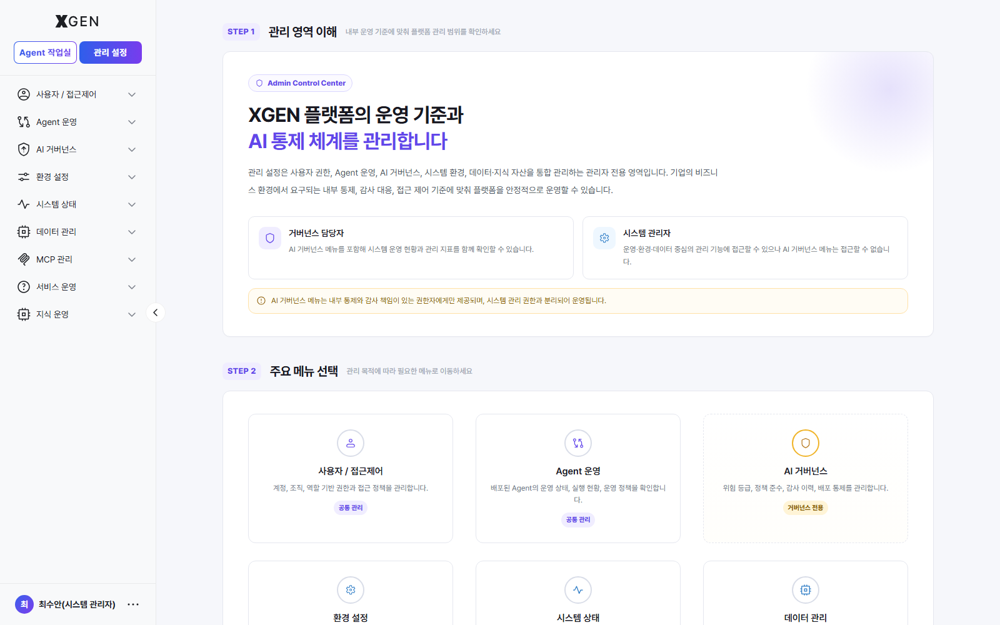

# 관리자 콘솔 개요

본 챕터는 시스템 관리자가 처음 솔루션에 접속한 뒤 알아야 할 기본 사항을 다룹니다. 세부 기능 운영은 이후 챕터에서 다룹니다.

## 접속

관리자 콘솔은 직접 URL로 진입하지 않습니다. 솔루션 좌상단의 2개 모드 전환 버튼(**Agent 작업실** / **관리 설정**) 중 **관리 설정(Admin Center)** 버튼을 클릭하면 관리자 영역으로 이동합니다.

1. 솔루션에 관리자 권한 계정으로 로그인
2. 화면 좌상단의 모드 전환 버튼(**Agent 작업실** / **관리 설정**) 중 **관리 설정** 클릭
3. **Admin Control Center** 안내 화면으로 진입 — 관리 영역의 책임 분담·주요 메뉴·운영 가이드를 3단계(STEP 1~3)로 안내

진입 후 우측 본문은 다음 3단계로 구성됩니다.

| 단계 | 내용 |
|---|---|
| STEP 1 — 관리 영역 이해 | "거버넌스 담당자" / "시스템 관리자" 두 역할의 책임 범위 안내. AI 거버넌스 영역은 별도 권한 체계로 제공되며 시스템 관리 권한과 분리됨을 명시 |
| STEP 2 — 주요 메뉴 선택 | 사이드바 9개 관리 영역(사용자 / 접근제어, Agent 운영, AI 거버넌스, 환경 설정, 시스템 상태, 데이터 관리, MCP 관리, 서비스 운영, 지식 운영)을 카드로 노출. 각 카드 클릭으로 해당 영역의 기본 화면으로 이동 |
| STEP 3 — 운영 가이드 | 첫 사용 시 점검, 일상 운영 절차, 시스템 보안 점검, AI 거버넌스 정책 운영 등 자주 참조하는 운영 가이드 링크 |

세부 메뉴 분류는 아래 [관리자 콘솔 구성](#관리자-콘솔-구성) 표를 참고하세요.

!!! note "SuperUser 권한 필요"
    관리 설정은 사용자 권한, Agent 운영, AI 거버넌스, 시스템 환경, 데이터·지식 자산을 통합 관리하는 **SuperUser 전용 영역**입니다.

    SuperUser 는 동일 권한 등급 위에서 다시 두 **역할(Role)** 로 분리되어 운영되며, 같은 SuperUser 라도 부여된 역할에 따라 사이드바에 노출되는 메뉴 범위가 달라집니다.

    | 역할 | 접근 범위 |
    |---|---|
    | **거버넌스 담당자** | AI 거버넌스 메뉴를 포함해 시스템 운영 현황과 관리 지표를 함께 확인할 수 있습니다. 내부 통제·감사 책임이 있는 권한자에게만 부여됩니다. |
    | **시스템 관리자** | 운영·환경·데이터 중심의 관리 기능에 접근할 수 있으나 AI 거버넌스 메뉴는 접근할 수 없습니다. |

    AI 거버넌스 메뉴는 내부 통제와 감사 책임이 있는 권한자에게만 제공되며, 시스템 관리 권한과 분리되어 운영됩니다. 이는 기업의 내부 통제·감사 대응·접근 제어 기준에 맞춰 플랫폼을 안정적으로 운영하기 위함입니다.

## 권한 등급 { #permission-tiers }

본 솔루션은 **2단계 권한 모델**을 사용합니다. 역할(Role) 정의·할당과 ABAC 권한(Permission) 부여 절차는 [역할/권한 관리](22-role-permission.md#permission-model) 챕터에서 다룹니다.

| 등급 | 영문 | 가능한 작업 |
|---|---|---|
| 일반 사용자 | Standard User | Agent 작업실 사용자 두 유형(**일반 사용자** / **Agent 개발자**) 을 포괄. 일반 사용자는 채팅·기술지원·대시보드만, Agent 개발자는 여기에 Agent 제작·도구 연동·지식관리 메뉴 권한이 추가 부여된 사용자 |
| 슈퍼유저 | SuperUser | 사용자/역할 관리, 시스템 설정, AI 거버넌스, 운영 모니터링, 권한 위임, 시스템 초기화 등 모든 관리 기능 |

신규 사용자는 기본적으로 **Standard User** 등급으로 생성됩니다. SuperUser 권한 부여는 기존 SuperUser 만 수행할 수 있으며, 시스템 전체에 SuperUser 를 1명 이상 유지하되 가능하면 별도 계정으로 분리해 일반 작업과 구분하는 것을 권장합니다.

## 관리자 콘솔 구성

관리 설정 사이드바는 **9개 그룹·36개 메뉴**로 구성됩니다 (사용자 권한에 따라 일부는 표시되지 않을 수 있음). 메뉴 라벨은 stg 라이브 화면 기준입니다. 각 메뉴별로 본 매뉴얼이 다루는 챕터를 아래와 같이 매핑합니다.

| 그룹 | 메뉴 | 본 매뉴얼 챕터 |
|---|---|---|
| 사용자 / 접근제어 | 사용자 관리 | [사용자 관리 · 사용자 목록·승인](21-user-management.md#user-list) |
| 사용자 / 접근제어 | 역할/권한 관리 | [역할/권한 관리 · 권한 모델 / 역할 정의](22-role-permission.md#permission-model) |
| 사용자 / 접근제어 | 로그인 관리 | [사용자 관리 · 로그인 관리](21-user-management.md) |
| Agent 운영 | Agent 관리 | [Agent 운영 · Agent 관리(배포 승인)](32-agent-operations.md#agent-mgmt-deploy-approval) |
| Agent 운영 | 채팅 모니터링 | [Agent 운영 · 채팅 모니터링](32-agent-operations.md#chat-monitoring) |
| Agent 운영 | 사용자 토큰 | [Agent 운영 · 사용자 토큰](32-agent-operations.md) |
| Agent 운영 | 노드 관리 | [노드 목록](32a-node-list.md) |
| Agent 운영 | 프롬프트 템플릿 | [Agent 운영 · 프롬프트 템플릿](32-agent-operations.md) |
| Agent 운영 | 사용자 피드백 | [Agent 운영 · 사용자 피드백](32-agent-operations.md#user-feedback) |
| Agent 운영 | 응답 품질 평가 | [Agent 운영 · 응답 품질 평가](32-agent-operations.md) |
| Agent 운영 | Agent 리텐션 분석 | [Agent 운영 · 리텐션 분석](32-agent-operations.md) |
| Agent 운영 | 업무기획 | [Agent 운영 · 업무기획](32-agent-operations.md#task-planning) |
| AI 거버넌스 | AI 위험도 평가 | [AI 거버넌스 · 위험도 평가 및 심사](29-governance-dashboard.md#risk-review) |
| AI 거버넌스 | 점검 이력 관리 | [AI 거버넌스 · 점검 이력 및 계획](29-governance-dashboard.md#inspection) |
| AI 거버넌스 | AI 서비스 변경 이력 | [AI 거버넌스 · AI 서비스 변경 이력](29-governance-dashboard.md#audit-tracking) |
| AI 거버넌스 | 통제 정책 관리 | [AI 거버넌스 · 통제 정책 관리](29-governance-dashboard.md#control-policy), [PII 보호 정책](25-pii-policy.md) |
| 환경 설정 | 전체 설정 | [전체설정 · 환경 설정 개요](#env-overview) |
| 환경 설정 | LLM | [LLM 설정](23-llm-settings.md) |
| 환경 설정 | 인프라 | [인프라 · 환경 설정 개요](#env-overview) |
| 환경 설정 | 검색 / 임베딩 | [임베딩·벡터 검색 설정](24-embedding-settings.md) |
| 환경 설정 | 오디오 | [오디오 · 환경 설정 개요](#env-overview) |
| 환경 설정 | 가드레일 | [가드레일 모델 설정](25b-guardrail-model.md) |
| 환경 설정 | 사이드바 | [사이드바 · 환경 설정 개요](#env-overview) |
| 시스템 상태 | 시스템 모니터링 | [시스템 모니터 · 시스템 모니터링](26-system-monitor.md) |
| 시스템 상태 | 시스템 조회 | [시스템 모니터 · 시스템 조회](26-system-monitor.md#system-query-log) |
| 시스템 상태 | 로그 조회 | [시스템 모니터 · 로그 조회](26-system-monitor.md#system-query-log) |
| 데이터 관리 | 데이터베이스 | [데이터 관리 · 데이터베이스](33-data-management.md) |
| 데이터 관리 | DB 연결 | [데이터 관리 · DB 연결](33-data-management.md) |
| 데이터 관리 | 배치 작업 | [데이터 관리 · 배치 작업](33-data-management.md) |
| 데이터 관리 | 데이터 감사 로그 | [감사 로그 · 데이터 감사 로그](27-audit-log.md) |
| MCP 관리 | MCP 라이브러리 | [MCP 라이브러리 · MCP 라이브러리](28-mcp-market.md) |
| MCP 관리 | MCP 운영/모니터링 | [MCP 라이브러리 · MCP 운영/모니터링](28-mcp-market.md#mcp-station) |
| 서비스 운영 | 공지 게시판 | [기술지원 응대 · 공지 게시판](31-tech-support-handling.md) |
| 서비스 운영 | 자주 묻는 질문 | [기술지원 응대 · 자주 묻는 질문](31-tech-support-handling.md) |
| 서비스 운영 | 1:1 관리자 문의 | [기술지원 응대 · 1:1 관리자 문의](31-tech-support-handling.md) |
| 지식 운영 | 컬렉션 관리 | [지식 운영 · 컬렉션 관리](34-knowledge-operations.md) |

### 환경 설정 개요 — 별도 챕터 미수록 메뉴 { #env-overview }

환경 설정 그룹의 **전체 설정 / 인프라 / 오디오 / 사이드바** 4개 메뉴는 본 매뉴얼에 별도 챕터가 작성되어 있지 않습니다. 각 화면은 *시스템 설치/도메인별 1회 설정* 성격이라 stg 화면에서 직접 조작하는 것이 가장 빠릅니다.

| 메뉴 | 화면 진입 | 화면 성격 |
|---|---|---|
| 전체 설정 | 관리 설정 → 환경 설정 → 전체 설정 (`admin?view=admin-system-config`) | 모든 시스템 구성 값을 *한 화면에서 통합 조회·편집* 하는 어드밴스드 뷰. 일반적인 운영은 *LLM / 검색·임베딩 / 가드레일* 등 **개별 메뉴** 를 사용하고, 본 화면은 *키-값 단위의 정밀 조회/편집* 용으로 사용합니다. (자세한 화면 구조는 아래 *전체 설정 화면 자세히* 참조) |
| 인프라 | 관리 설정 → 환경 설정 → 인프라 | API 서버·Agent 엔진·모델 서빙 등 *연결 엔드포인트* 와 인프라 설정. 시스템 설치 시점에 1회 구성. |
| 오디오 | 관리 설정 → 환경 설정 → 오디오 | STT/TTS 음성 모델 연동 설정. 음성 기능을 활성화한 환경에서만 의미. |
| 사이드바 | 관리 설정 → 환경 설정 → 사이드바 | 사이드바 메뉴의 노출 여부를 조직별로 토글하는 화면. 일부 메뉴를 사용자에게 숨기고 싶을 때 사용. |

별도 챕터 신설은 후속 작업으로 예정되어 있으며, 그 전까지는 위 표의 진입 경로를 따라 stg 화면에서 직접 확인·설정하세요.

#### 전체 설정 화면 자세히

*전체 설정*(`admin?view=admin-system-config`) 은 솔루션이 사용하는 **모든 환경 변수** 를 한 페이지에서 다루는 화면입니다. 페이지 머리글은 *"전체 설정 — 모든 시스템 구성 값을 확인하고 편집합니다."* 이며, 본문은 세 영역으로 구성됩니다.

1. **상단 stat 카드 3개** — 전체 설정 개수 / 현재 *설정됨* (기본값과 다른) 개수 / 기본값 그대로인 개수. 예: *전체 184 / 설정됨 57 / 기본값 127* (수치는 환경별로 다름).
2. **카테고리 탭** — 좌→우로 *전체 / 노드 / 워크플로우 / 애플리케이션 / 벡터 DB / OpenAI / Gemini / Anthropic / …* 등 영역별 탭과 각 카테고리의 설정 개수가 함께 표시됩니다. 카테고리는 환경에 따라 추가될 수 있으며 가로 스크롤로 모두 노출됩니다.
3. **설정 항목 카드** — 카테고리 안에서 키-값 단위 카드가 나열됩니다. 각 카드는 다음을 보여줍니다.
    - **키(KEY) + 경로** — 대문자 키(`IS_AVAILABLE_TTS`) 와 점 표기 경로(`tts.is_available_tts`)
    - **현재 값** / **기본값** — 현재 적용 값과 출고 기본값을 함께 표시. 두 값이 같으면 *기본값* 배지, 다르면 *설정됨* 배지가 카드 우상단에 노출됩니다.
    - **타입 배지** — `Bool` / `Json` / `Str` / `Int` 등 값 형식 표시.

!!! warning "변경 전 영향 범위 확인 필수"
    *전체 설정* 은 LLM / 임베딩 / TTS / 노드 / 워크플로우 등 **솔루션 동작에 직접 영향을 주는 키** 들을 함께 노출합니다. 같은 키를 *LLM / 검색·임베딩 / 가드레일* 등 개별 메뉴에서도 편집할 수 있으므로, 어떤 화면에서 변경했는지 일관되게 기록하세요. 잘못된 값은 진행 중인 채팅·실행에 즉시 영향을 줍니다 — 변경 전 [감사 로그](27-audit-log.md) 와 함께 검토를 권장합니다.

!!! info "메뉴 명칭 안내"
    화면상의 메뉴 이름은 솔루션 버전과 사용자 권한에 따라 일부 다를 수 있습니다. 본 매뉴얼은 {{product.name}} {{product.version}} 기준이며, 표에 굵게 표시된 메뉴가 본 매뉴얼이 다루는 핵심 항목입니다.

## 첫 사용 시 점검 체크리스트

신규 환경에 솔루션을 배포한 직후, 운영팀에서 우선적으로 확인해야 하는 항목입니다. 각 항목의 상세 설정 방법은 관련 챕터를 참고하세요.

### LLM 프로바이더 연결

운영 정책에 맞는 LLM 프로바이더를 선택하고 연결 정보를 등록합니다.

예시:

- OpenAI
- Anthropic
- 사내 vLLM
- 기타 사내 추론 서버

필요한 API Key, Endpoint, 모델 정보가 정상 등록되었는지 확인하세요.

### 임베딩 모델 및 벡터 DB 연결

지식 검색(RAG) 기능을 사용하려면 임베딩 모델과 벡터 DB 연결이 필요합니다.

예시:

- 임베딩 모델 등록
- Vector DB 연결 정보 설정
- 인덱스 생성 여부 확인

연결 오류가 없는지 사전 테스트를 권장합니다.

### PII 정책 검토

개인정보 및 민감정보 보호 정책을 확인합니다.

- 자동 마스킹 대상 항목 확인
- 민감정보 탐지 정책 검토
- 조직별 추가 정책 적용 여부 확인

금융권 또는 보안 요구 수준이 높은 환경에서는 추가 정규식 기반 탐지 정책 등록을 권장합니다.

### 역할(Role) 정의 및 사용자 권한 설정

조직 운영 정책에 맞는 역할(Role)을 정의하고 사용자에게 권한을 할당합니다.

예시:

- 일반 사용자
- 분석가
- 운영자
- Agent 개발자
- 관리자

최소 권한 원칙에 따라 필요한 권한만 부여하는 것을 권장합니다.

### 시스템 모니터링 임계치 설정

시스템 상태 모니터링을 위한 임계치를 설정합니다.

예시:

- CPU 사용률
- 메모리 사용률
- 디스크 사용량
- GPU 사용량

임계치 초과 시 알림이 정상 발송되는지 함께 확인하세요.

### 감사 로그 보존 정책 확인

감사 로그 및 실행 이력의 보존 기간이 내부 정책 및 관련 규정에 부합하는지 확인합니다.

예시:

- 사용자 활동 로그
- 실행 이력
- 관리자 변경 이력
- 보안 감사 로그

※ 금융권 환경에서는 일반적으로 장기 보관 정책(예: 5년 이상) 을 적용합니다.

## 운영 원칙

관리자 콘솔 사용 시 준수해야 하는 기본 운영 원칙입니다.

### 변경 전 영향 범위 확인

시스템 설정 변경 사항은 전체 사용자 환경에 즉시 영향을 줄 수 있습니다. 특히 LLM, 임베딩 모델, 벡터 DB 등의 설정 변경은 진행 중인 채팅, Agent 실행 결과, 지식 검색 품질에 영향을 줄 수 있으므로 사전 검토 후 적용해야 합니다.

### 감사 로그 기반 운영

모든 관리자 작업은 감사 로그(Audit Log) 에 기록됩니다. 설정 변경, 권한 수정, 배포 승인 등의 주요 작업 이력을 정기적으로 검토하는 것을 권장합니다.

### 최소 권한 원칙 준수

사용자에게는 업무 수행에 필요한 최소 범위의 권한만 부여해야 합니다. 임시 권한 상승이 필요한 경우 작업 완료 후 즉시 권한을 회수하는 것을 권장합니다.

### 변경 작업 전 백업 수행

컬렉션, Prompt, 정책, 시스템 설정 등을 일괄 변경하기 전에는 현재 상태를 Export 기능 등을 통해 백업해야 합니다. 운영 환경 변경 시에는 복구 가능한 상태를 유지하는 것을 권장합니다.

## 문의

관리자 기능 관련 문의는 **XGen 관리자**({{vars.support_email}}) 로 연락해 주세요.
