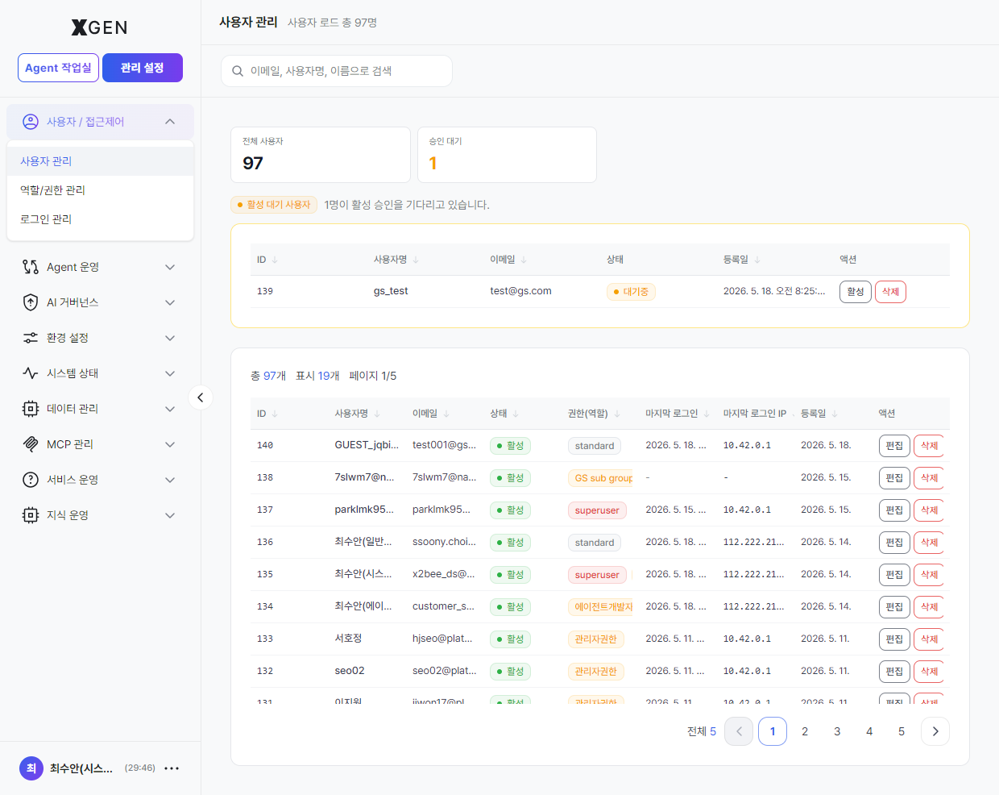
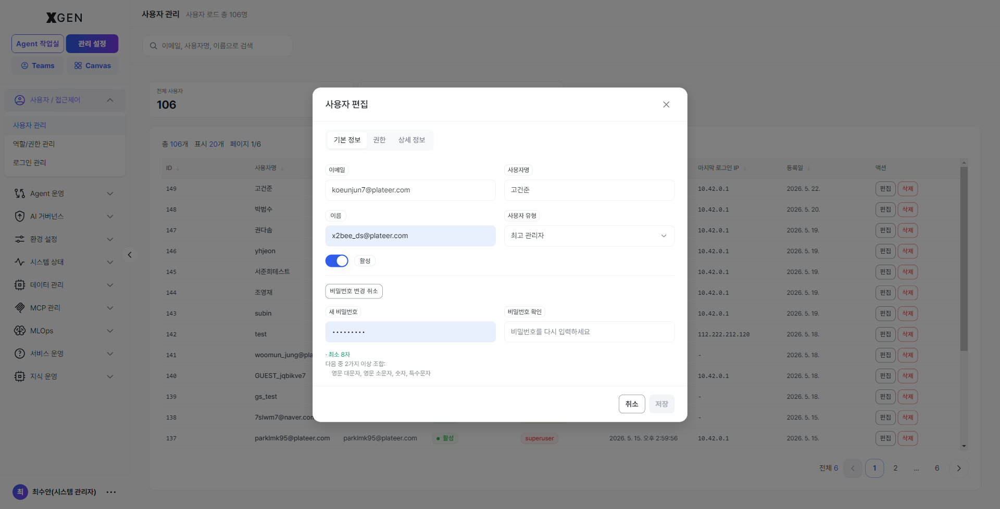
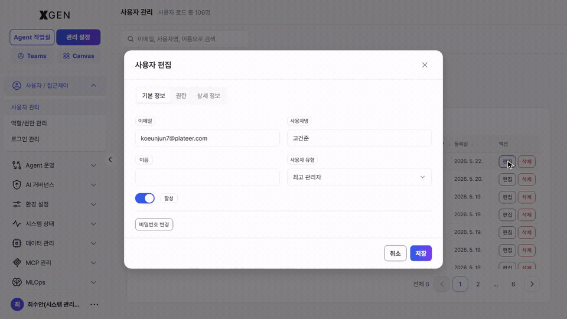

# User Management

This chapter covers procedures for **approving, modifying, and deactivating** system user accounts. **New users are added through the user-side self-signup flow → Pending-Approval queue → SuperUser approval.** *The "+ Add User" button (admin directly creating an account) is not exposed on the current stg build.*

## User List { #user-list }

Select **Admin → Users / Access Control → User Management** in the left sidebar.

The screen has four areas:

| Area | Contents |
|---|---|
| Top stats | **Total Users** count and **Pending Approval** count |
| Search box | Filter users by email, username, or display name |
| Pending Approval Users queue | New applicants from self-signup — handle each row with the **Activate / Delete** buttons |
| Full user table | Every account — each row has **Edit / Delete** action buttons |

Columns in the full user table (headers are clickable to toggle sort):

| Column | Description |
|---|---|
| ID | Internal system identifier |
| Username | Login ID (the English ID or display name the user entered during signup) |
| Email | Address for notifications and password reset |
| Status | Active / Inactive / Pending |
| Permission (Role) | `superuser` / `standard` tier classification plus assigned role labels (e.g., *System Administrator(DJ)*, *Agent Developer(DJ)*) |
| Last Login | Most recent access time |
| Last Login IP | Source IP |
| Registered | Signup or creation time |
| Actions | **Edit / Delete** buttons |

## Methods for Adding New Users { #user-add }

New user accounts can be added in two ways depending on your organization's operational policy:

- **Self-signup + administrator approval**
- **Single Sign-On (SSO) integration with corporate identity**

This section describes the user registration and approval procedure for the *self-signup* configuration.

### Adding a New User — Self-Signup + Administrator Approval

The new user submits a signup application on the public signup page, after which the account enters the **Pending Approval** state. A SuperUser — or an administrator with user-management permission — must then approve the account before the user can log in.

#### Step 1 — User Signup

The applicant signs up directly using the following steps.

1. On the login page (`https://<domain>/login`), select the **Sign up** link at the bottom.
2. On the signup page (`/signup`), fill in the following:
    - Email
    - Password
    - Display name
3. Submit the signup application.

After signup the account stays in the *Pending Approval* state and cannot log in until an administrator approves it.

#### Step 2 — Administrator Approval

The SuperUser or an administrator with user-management permission reviews pending signups and activates accounts from the *User Management* screen.

**Approval flow**

1. Open **Admin Center → Users / Access Control → User Management**.
2. Check the **Pending Approval** counter on the top statistic cards.
3. In the *Pending Approval Users* list, review the applicant's details.

    Visible fields:

    - ID
    - Username
    - Email
    - Status (Pending)
    - Registered date

4. After reviewing the applicant's information, take one of the following actions.

    - **Activate**
        - Click the **Activate** button
        - Account status changes to *Active*
        - The user can log in immediately
    - **Delete**
        - Click the **Delete** button
        - The signup application is removed
        - The user must re-submit the signup form to retry

#### Notes

- Whether self-signup is enabled depends on your organization's operational policy.
- In SSO environments, users may be authenticated automatically via the corporate identity provider without a separate signup form.
- Approval actions and account-state changes may be recorded in the Audit Log.

!!! note "SuperUser privileges required"
    Approving / rejecting pending accounts, changing permission tiers, and resetting passwords all require **SuperUser** — or an equivalent user-management permission. Standard Users do not see this screen at all.

## Password Reset

An administrator can directly reset another user's password.

1. Click **Edit** on the target user in the user list
2. Expand the **Change Password** section at the bottom of the modal
3. Enter a new password → **Save**

> **Recommended:** Deliver the new password through a separate channel and instruct the user to change it on first login.

## Deactivating a User

Use this when blocking a user temporarily without removing them from the system.

1. Click **Edit** on the target user
2. Change status to **Inactive**
3. **Save**

Inactive users cannot log in, but their agentflows, collections, and chat history are preserved as-is.

!!! warning "Delete vs. Deactivate"
    Prefer **Deactivate** whenever possible. **Delete** permanently removes user data and cannot be undone. For departures or transfers, deactivation is appropriate.

## Permission Tier Changes

There are two permission tiers. Toggle them through the **User Type** select in the user-edit modal (`Standard` ↔ `Superuser`).

| Direction | Required Privilege |
|---|---|
| Standard User → SuperUser (promote) | SuperUser |
| SuperUser → Standard User (demote) | SuperUser |

All permission tier changes are recorded in the audit log. If you are the last remaining SuperUser, demoting yourself will leave the system with no one able to access the Admin Center — confirm at least one other SuperUser exists before demoting.

## Operational Recommendations

- **Unify password policy** — Apply organizational password policy when adding users. Manage minimum length, complexity, and rotation period from system settings.
- **Clean up dormant accounts** — Review accounts whose last login is older than 90 days for deactivation each quarter.
- **Forbid shared accounts** — Multiple people using one account makes audit log tracking meaningless. Enforce one-person-one-account.

## Contact

For questions about user management, please contact the Xgen Solution Administrator.
