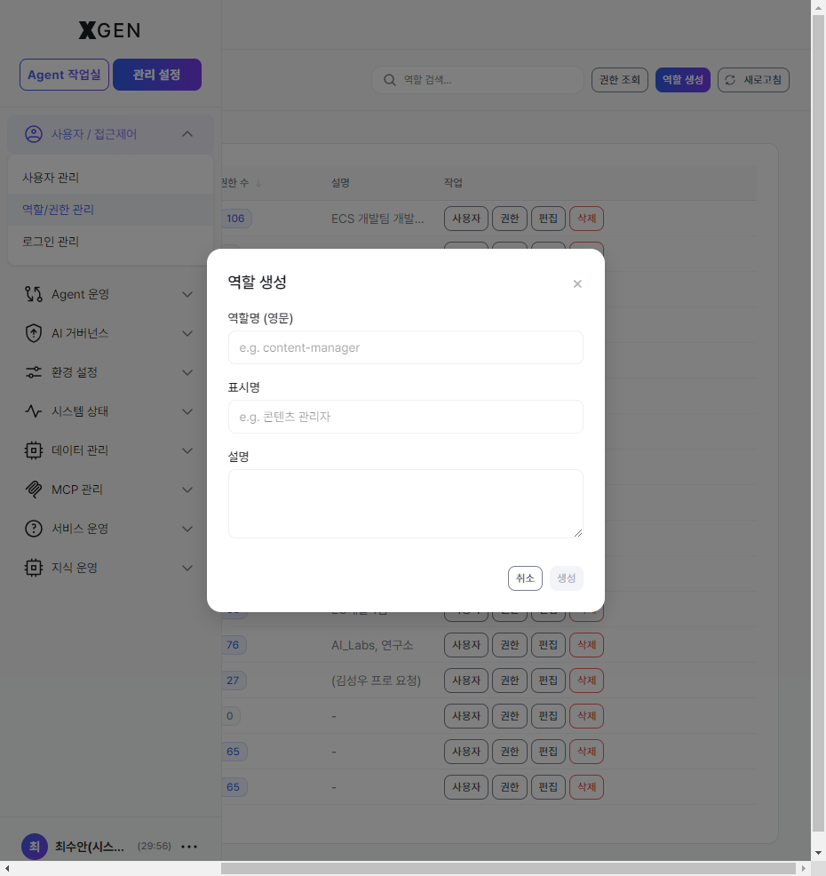
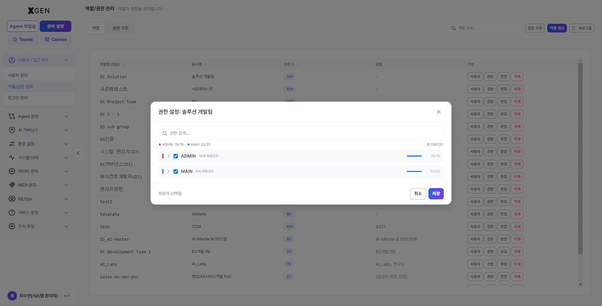
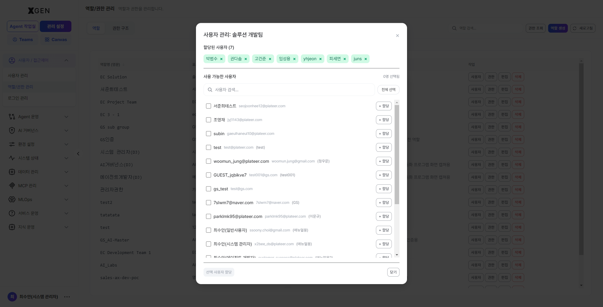
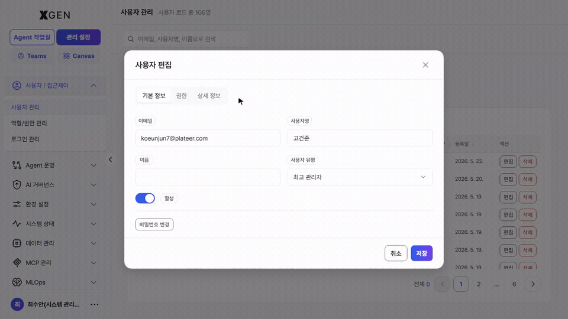
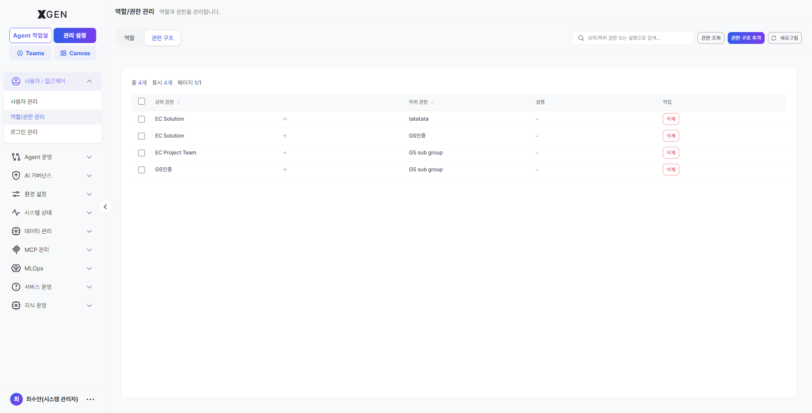
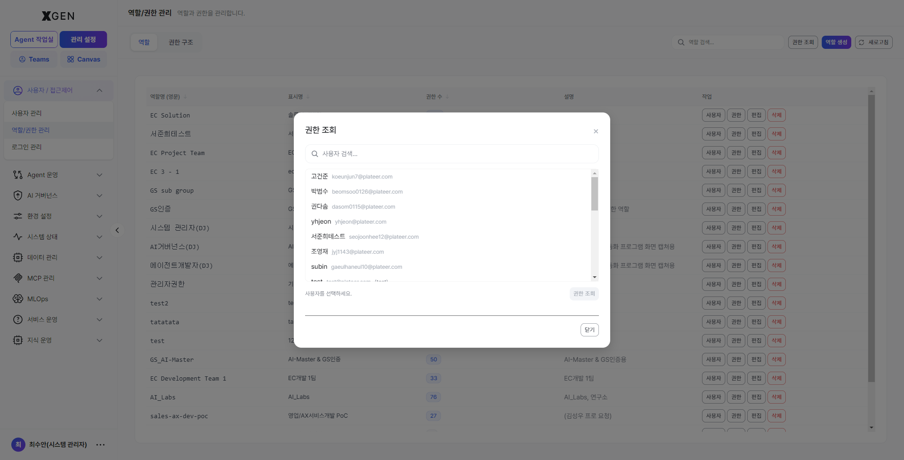

# Role / Permission Management

This chapter covers procedures for defining and assigning **roles** and **permissions**.

> **SuperUser** — an administrator account that can enter the top-left *Admin Center* mode. The sidebar menu scope (System Administrator, Governance Officer, etc.) varies by the **role** assigned. SuperUser is granted in [User Management](21-user-management.md) by setting **User Type** to `Superuser` in the user-edit modal.

## Permission Model — Two Layers { #permission-model }

XGEN's permission model has two layers — *Role / Permission*.

| Layer | Question it answers | Shape of the value | Defined by | Examples | Where it bites |
|---|---|---|---|---|---|
| **Role** | Which admin menus does this user see? | Multi-label array | Your organization | System Administrator, Governance Officer, Analyst, Operator | Menu scope shown in the sidebar |
| **Permission** | Can this user use each section / tab / button inside a screen? | ABAC key array | Permission catalog → mapped to a role or to a user | `admin.user:read`, `main.agentflow:manage` | Section / tab / button-level gates inside a screen |

Permissions are **bundled into roles** or **granted directly to individual users**. The recommended pattern is to bundle by role first, then reinforce only edge cases with direct grants.

### How Permissions Are Checked

The menus and buttons a user can see are controlled automatically by the system based on the user's permissions. The check proceeds in the order below.

**1. Check whether the user is an administrator (SuperUser)**

The system first checks whether the account is a SuperUser. SuperUser accounts have access to every administrative function by default.

Note that menu access for *System Administrators* and *Governance Officers* may be partially separated according to internal operational policy.

**2. Check the user's permissions**

If the user is not a SuperUser, the system determines accessible menus based on the permissions granted to that user.

Examples:

- Has *User Management* permission → User Management menu is shown
- Has *Agent Creation* permission → Agent Creation menu is shown
- Has *Knowledge Management* permission → Knowledge Management menu is shown

**3. Features without permission are hidden automatically**

Menus and buttons for which the user lacks the required permission are not shown. Users only see the features available to them; everything else is hidden silently.

### Three Ways to Grant Permissions { #grant-paths }

An administrator (SuperUser) can grant permissions to a user through the three paths below (multi-select and combinations allowed).

| # | How permissions are granted | Where to do it | Typical use |
|---|---|---|---|
| 1 | **Role + permissions bound to the role** | This chapter → *Role* tab → Create Role → *Permissions* button | An "Analyst" role bundling `main.knowledge:read` and similar |
| 2 | **Role-to-role inheritance (Supervision)** | This chapter → *Permission Hierarchy* tab → add a relation | "Team Lead ← Team Member" so the lead inherits all member permissions |
| 3 | **Direct grant to an individual user** | [User Management](21-user-management.md) → user edit → *Direct Permissions* | Temporarily granting or denying a single permission to one user |

## Role Tab { #role-list }

Select **Admin Center → Users / Access Control → Role / Permission Management** in the left sidebar (view ID `admin-role-management`). The *Role* tab opens by default.

### Top area — tabs, search, action buttons

| Area | Location | Behavior |
|---|---|---|
| Tab — **Role** | Top-left (current tab) | Lists registered roles |
| Tab — **Permission Hierarchy** | Second tab | Manage supervisor / target relationships between roles — [Permission Hierarchy tab](#supervision) |
| Search | Top-right input | `Search roles...` — filter by role name or display name instantly |
| Button — **Inspect Permissions** | Top-right (white) | Pick one user and expand their *composed* permissions — [Inspect Permissions modal](#permission-inspect) |
| Button — **Create Role** | Top-right (purple) | Open the create-role modal — [Creating a Role](#role-create) |
| Button — **Refresh** | Top-right (gray) | Reload the list immediately |

### Role table — columns and per-row action buttons

Column headers with a ↓ icon are clickable to toggle the sort direction.

| Column | Description |
|---|---|
| **Role name (English)** | System identifier — kebab-case recommended (e.g., `analyst`, `content-manager`). This becomes a DB key and is preserved permanently; avoid renaming after creation. |
| **Display name** | Korean or screen-facing name (e.g., *분석가*, *콘텐츠 관리자*) |
| **Permission count** | Number of permissions bound to this role — `0` means no permissions are bound yet |
| **Description** | One-line description (`-` if empty) |
| **Actions** | Four buttons per row — **Users** / **Permissions** / **Edit** / **Delete** (see below) |

Each action button opens a dedicated modal.

| Button | What it opens |
|---|---|
| **Users** | The assigned-users modal — currently assigned users appear as chips at the top (click × to remove), and the lower list lets you filter and **+ Add** more users in bulk — [Assigned Users modal](#assigned-users) |
| **Permissions** | The permission-checklist modal grouped under two scopes (ADMIN / MAIN) — [Permission Settings modal](#permission-modal) |
| **Edit** | Edit role name (English) / display name / description. Avoid renaming the role identifier after creation since it is a system key. |
| **Delete** | Red button. Attempts immediate deletion; **blocked with a warning** if any user is still assigned to this role. |

## Creating a Role { #role-create }

Role creation is a **two-step** process — register the role first, then click the *Permissions* button on the role row to grant the permission checklist.

### Step 1 — Register the role

1. Click **Create Role** at the top right of the role list
2. Fill in the modal:
    - **Role name (English)** — e.g., `content-manager` (must be unique)
    - **Display name** — e.g., `콘텐츠 관리자`
    - **Description** — (optional)
3. Once all required fields are filled, the **Create** button at the bottom right activates. Clicking it registers the role with 0 permissions.

### Step 2 — Grant permissions { #permission-modal }

To grant permissions, click the **Permissions** button on the role row. The *Permission Settings* modal opens, showing two scopes (ADMIN / MAIN) with permissions grouped by category.

Layout:

- **Header** — `Permission Settings: <display name>` so you can see which role you are editing.
- **Search input** — instant keyword filter.
- **Scope count badges** — e.g., `● ADMIN: 76/76`, `● MAIN: 33/33` (selected / total per scope) plus an overall sum (e.g., `Total 109/132`).
- **Checkbox tree** — expand each scope with the `▶` chevron and check individual permissions, or check the category checkbox to toggle *select all / clear all* within that category.
- **Selection footer** — bottom-left shows the live count (e.g., `109 selected`).
- **Buttons** — bottom-right **Cancel** / **Save**. Permissions are only applied to the role when you click *Save*.

After saving, the role list's *Permission count* column reflects the new total.

### Assigning users — after granting permissions { #assigned-users }

Once a role has permissions, use the **Users** button on its row to bulk-assign users.

Layout:

- **Top — *Assigned Users***: users currently holding this role appear as chips. Click × on a chip to revoke immediately.
- **Bottom — *Available Users***: filter via the search box, then click **+ Add** next to each user to move them up into the chip area. Multiple additions allowed.
- **Save / Close** — changes apply instantly; *Close* dismisses the modal.

### Assigning Multiple Roles to a User

The *Users* button on the Role screen is best for assigning the same role to many users in bulk.

When you need to grant *multiple* roles to a single user, set them via the *User Edit* modal on the [User Management](21-user-management.md) screen instead.

Example:

- *User Management > User Edit > Permissions* tab
- Multi-select roles and **Save**

This path is more efficient when you organize permissions around the user rather than around the role.

### Common scenarios { #scenarios }

**Case 1 — A new job function needs its own role** (example: "Compliance Officer")

1. *Role* tab → **Create Role**
2. Modal fields: role name `compliance-officer` / display name `컴플라이언스 담당` / description "AI usage risk review and routine audit-log inspection"
3. **Permissions** button on the row → check `admin.governance:*` + `admin.audit:read` + `admin.user:read` → save
4. **Users** button on the row → multi-select compliance team members → bulk assign

**Case 2 — Team-level permission bundle** (example: "EC Development Team")

1. On the *Role* tab, click **Permissions** on the existing *EC Development Team 1* row to inspect the bundle
2. When a new team member joins, click **Users** on the same row and add them — permissions follow automatically
3. When the team takes on a new responsibility, check the new permission via the **Permissions** button — it applies to the whole team instantly

**Case 3 — One-off temporary permission** (for a single user only)

- Do this in the user-edit modal in [User Management](21-user-management.md), under the *Direct Permissions* section — Grant or Deny
- Creating a *role* for a temporary permission affects other users too; *Direct Permissions* is safer for a single-user scope

## Permission Hierarchy Tab — Supervisor / Target { #supervision }

In complex organizations you can define supervisor / target relationships between roles so that *a supervisor role inherits its target role's permissions automatically*.

- **Supervisor Role**: holds the larger permission set
- **Target Role**: holds the smaller permission set

Example: if a "Team Lead" role supervises a "Team Member" role, the lead receives *team-member permissions + team-lead-specific permissions*. Any later change to team-member permissions propagates to the lead automatically.

### Screen layout

Click the *Permission Hierarchy* tab at the top. Existing relations are listed as table rows.

| Area | Description |
|---|---|
| Top counters | Left side shows `Total N`, `Showing N`, `Page 1/N` — total relations and current page |
| Search | `Search supervisor / target / description...` — filter rows instantly |
| Button — **Inspect Permissions** | Same modal as on the Role tab — see [Inspect Permissions modal](#permission-inspect) |
| Button — **Add Hierarchy** | Purple. Open the create-relation modal — *1 supervisor + N targets + optional description* |
| Button — **Refresh** | Reload the list immediately |

Table columns:

| Column | Description |
|---|---|
| Checkbox | Multi-select — reserved for future bulk operations such as bulk delete |
| **Supervisor** ↓ | The role with the larger permission set (English identifier) |
| **Target** ↓ | The role that inherits its permissions (English identifier). If one supervisor has multiple targets, each pair appears as a separate row. |
| **Description** | What the relation means (`-` if empty) |
| **Actions** | Row-end **Delete** (red outline) — removes this supervisor / target relation immediately |

### Workflow — adding a relation

1. Click **Add Hierarchy** at the top right of the *Permission Hierarchy* tab.
2. Fill in the modal:
    - **Supervisor** — pick the larger-permission role (dropdown).
    - **Target** — pick the role(s) being inherited (multi-select).
    - **Description** — optional.
3. Click **Save**. A new row appears in the list immediately.

Users assigned to the supervisor role hold the inherited permissions immediately — no re-login required (the sidebar refreshes on the next navigation).

### Workflow — removing a relation

Click the row-end **Delete** button to remove that supervisor / target relation. The *supervisor and target roles themselves* are not deleted; only the inheritance link is broken. From that moment, supervisor users no longer inherit the target's permissions.

## Inspect Permissions — Composed View for One User { #permission-inspect }

The **Inspect Permissions** button at the top right of either the *Role* or *Permission Hierarchy* tab shows the *final permissions a single user holds* after combining roles, supervision inheritance, and direct grants. It is essential when answering *"why isn't this menu visible?"* or *"are we accidentally exposing broad permissions?"*

Layout:

- **User search** — type part of an email, name, or username.
- Pick a user from the matching list.
- Click **Inspect Permissions** at the bottom to expand the composed permission view.

!!! info "If the Inspect Permissions button is missing"
    *Inspect Permissions* is exposed only to SuperUsers who hold `admin.permission:*`. Confirm whether this permission is in your role by clicking the **Permissions** button on your own row in the [role list](#role-list).

## Assigning Roles to Users { #user-assignment }

**Option A — From the role screen (one role → many users)**

1. Expand the **Assigned Users** section on the role detail screen
2. Click **+ Add User** → search and select users
3. **Save**

**Option B — From the user screen (one user → many roles)**

1. Open the **Roles** section in the user-edit modal
2. Select roles (multi-select allowed)
3. **Save**

## Revoking Permissions

| Action | Procedure |
|---|---|
| Remove a user from a role | Role detail → **Assigned Users** → click **× Remove** next to the user |
| Delete the role itself | Click **Delete** in the role list — blocked if any user is still assigned to this role |

!!! warning "Check before deleting a role"
    Confirm the **assigned user count** before deletion. If it is not zero, revoke the role from those users first.

## Operational Recommendations

**Role naming (creation)**

- [ ] English identifier (`name`) — *kebab-case* (e.g., `content-manager`). It becomes a DB key and is preserved permanently, so consistency matters.
- [ ] Display name (`display_name`) — align with your organization's job-title / department naming so user management and audits are intuitive.
- [ ] Description — keep it to one line. "What does this role do?" is decisive for handover and search.

**Granting permissions (role operations)**

- [ ] *Least-privilege principle* — start narrow, add as needed. Broad permissions (e.g., `*:*`) should only ever be granted to SuperUsers.
- [ ] *Group temporary permissions into a separate role* — collect volatile temporary permissions into a *temporary role* so that you can revoke them in one go. *Direct Permissions* on a user is for single-user cases only.
- [ ] *Direct Deny is for exceptions* — use only when a user must be blocked from a permission they would otherwise receive via a role. Frequent use makes permission flow untraceable.

**Periodic review (quarterly recommended)**

- [ ] Roles with 0 assigned users — decide whether they are intentional *containers* or cleanup leftovers; delete or annotate accordingly.
- [ ] Roles with 0 permissions — same review.
- [ ] Supervision graph — remove unnecessary inheritance relationships. If the depth exceeds 3, consider whether *direct permission grants* would be simpler.

## Common Issues { #troubleshooting }

| Symptom | Cause / what to check |
|---|---|
| "I have the permission but the sidebar menu doesn't appear" | Sidebar visibility is decided by *permission prefix matching*. Example: holding only `admin.user:read` shows the *User Management* sidebar but not *AI Governance*. |
| "The role is assigned but the menu doesn't open" | The user may need to *re-login or refresh the token*. Or it may be a menu that requires SuperUser privilege (e.g., the entire Admin Center mode) — change **User Type** to `Superuser` in [User Management](21-user-management.md). |
| "Role delete says 'X users are assigned and it cannot be deleted'" | This is the intended safety check. Click the **Users** button on the row, reduce the assigned count to 0, and try again. |
| "I want to temporarily turn off a permission for one user only" | Go to [User Management](21-user-management.md) → edit → *Direct Permissions* and set the permission to **Deny**. When *role → grant* and *direct → deny* both exist, deny wins. |
| "The Inspect Permissions button is not visible" | *Inspect Permissions* is exposed only to SuperUsers who hold `admin.permission:*`. Verify whether this permission is included in your role. |

## Contact

For role / permission inquiries, contact the Xgen Solution Administrator.
