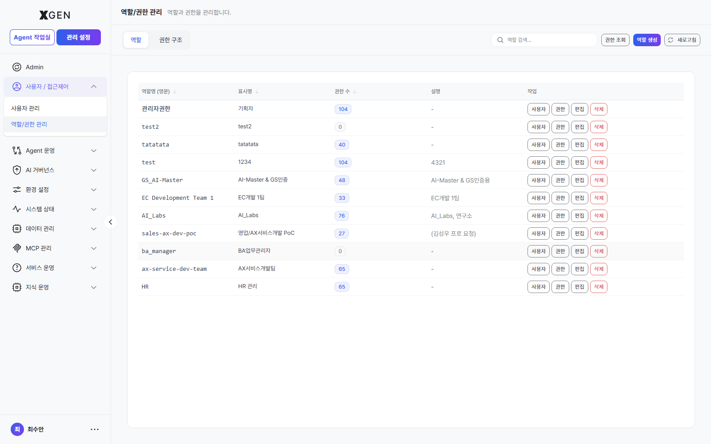

# Role / Permission Management

Beyond the system permission tiers (Standard / Administrator / Superuser), this chapter covers defining and assigning **roles** that match organizational job functions.

## Permission Tier vs. Role

| Distinction | Meaning | Example |
|---|---|---|
| Permission Tier | System-level privilege | Standard User / Administrator / Superuser |
| Role | Additional permission bundle scoped to organizational duties | Analyst / Operator / Compliance Officer |

Permission tiers are fixed three levels in the system. Roles are defined and operated freely by the organization.

## Role List

Select **Admin → Users / Access Control → Role / Permission Management** in the left sidebar.

Each role has the following attributes.

| Item | Description |
|---|---|
| Role Name | English identifier (e.g., `analyst`, `operator`) |
| Display Name | Localized name (e.g., "Analyst", "Operator") |
| Permissions | List of feature access permissions this role holds |
| Supervisor Role | (Optional) The parent role above this one |
| Assigned Users | Users currently holding this role |

## Creating a Role

1. Click the **+ Add Role** button at the top right of the role list
2. Enter:
    - Role name (English, unique)
    - Display name (localized)
    - Description (optional)
3. Check the desired permissions in the **Permissions** section
4. **Save**

!!! note "Add-role screen screenshot pending"
    A screenshot of the permissions-checklist screen opened by "+ Add Role" will be added in a future manual update.

## Permission Hierarchy (Supervisor / Target)

Complex organizations can define hierarchical relationships between roles.

- **Supervisor Role**: A role with the larger permission set
- **Target Role**: A role with the smaller permission set

Example: A "Team Lead" role contains all permissions of "Team Member" plus additional "Member Activity Monitoring." Users assigned to a supervisor role automatically inherit the target role's permissions.

## Assigning Roles to Users

**Method A — From the role screen (assign multiple users at once)**

1. In the role detail screen, expand the **Assigned Users** section
2. Click **+ Add User** → search and select users
3. **Save**

**Method B — From the user screen (assign multiple roles to one user)**

1. The **Roles** section in the user edit modal
2. Select roles (multi-select)
3. **Save**

## Revoking Permissions

| Action | Procedure |
|---|---|
| Remove a user from a role | Role detail → **Assigned Users** → click **× Remove** beside the user |
| Delete the role itself | **Delete** in the role list — blocked if users are still assigned |

!!! warning "Check Before Deleting a Role"
    Before deleting, check the **assigned-user count**. If non-zero, you must first revoke the role from those users.

## Operational Recommendations

- **Keep the role count small** (5–10). Too many roles inflate management overhead.
- **Match names to org structure** — Aligning role names with job titles or department names is intuitive.
- **Use a separate "temporary" role** — Volatile temporary permissions should not be granted directly to users; instead, group them in a "Temporary" role that can be revoked all at once.

## Contact

For questions about roles and permissions, please contact {{vars.support_email}}.
