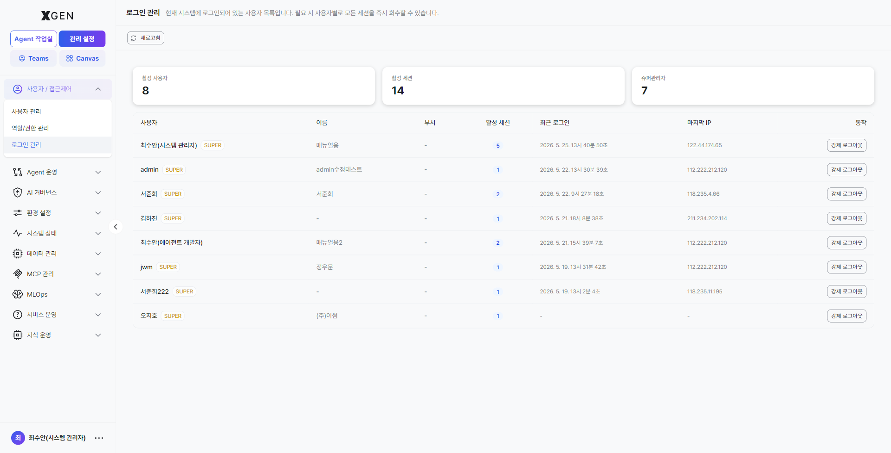
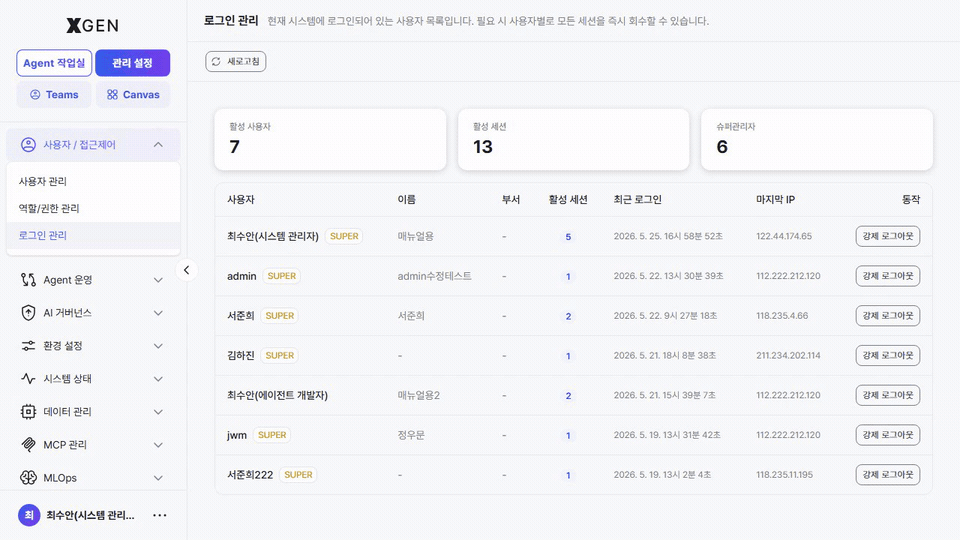

<!-- require_view_start: admin-active-sessions -->
# 로그인 관리

본 챕터는 *현재 시스템에 로그인되어 있는 사용자 세션* 을 실시간으로 확인하고 필요 시 즉시 회수하는 절차를 다룹니다. 좌측 메뉴 **관리 설정 → 사용자 / 접근제어 → 로그인 관리** (view ID `admin-active-sessions`) 를 선택해 진입합니다.

진입 직후 화면 상단에 *"현재 시스템에 로그인되어 있는 사용자 목록입니다. 필요 시 사용자별로 모든 세션을 즉시 회수할 수 있습니다."* 라는 안내가 표시됩니다.

## 화면 구성 { #overview }

| 영역 | 위치 | 설명 |
|---|---|---|
| 버튼 — **새로고침** | 상단 좌측 | 현재 활성 세션 목록을 다시 조회합니다. 강제 로그아웃 이후 상태를 확인할 때 사용할 수 있습니다. |
| 카드 — **활성 사용자** | 상단 영역 | 현재 1개 이상의 활성 세션을 가진 사용자 수를 표시합니다. |
| 카드 — **활성 세션** | 상단 영역 | 전체 활성 세션 수를 표시합니다. 동일 사용자가 여러 브라우저 또는 기기에서 로그인한 경우, 활성 세션 수는 활성 사용자 수보다 많을 수 있습니다. |
| 카드 — **슈퍼관리자** | 상단 영역 | 현재 로그인 중인 SuperUser 사용자 수를 표시합니다. 운영 및 관리 권한을 가진 계정의 접속 현황을 빠르게 확인할 수 있습니다. |
| 세션 테이블 | 화면 본문 | 사용자별 활성 세션 정보를 표시합니다. 확인 가능한 정보: 활성 세션 수 / 최근 로그인 시간 / 마지막 접속 IP / 강제 로그아웃 기능. |

## 세션 테이블 컬럼 { #table }

| 컬럼 | 설명 |
|---|---|
| **사용자** | 사용자 계정명입니다. SuperUser 계정인 경우 사용자명 우측에 `SUPER` 배지가 함께 표시됩니다. |
| **이름** | 사용자 표시 이름(Display Name)입니다. 등록되지 않은 경우 `-` 로 표시됩니다. |
| **부서** | 사용자 부서 정보입니다. 설정되지 않은 경우 `-` 로 표시됩니다. |
| **활성 세션** | 현재 해당 사용자가 유지 중인 활성 세션 수입니다. 숫자를 선택하면 브라우저, 기기 정보, 로그인 시각 등 세션별 상세 정보를 확인할 수 있습니다. |
| **최근 로그인** | 가장 최근 로그인 시각을 표시합니다. 예: `2026. 5. 25. 13시 36분 49초` |
| **마지막 IP** | 가장 최근 접속한 IP 주소를 표시합니다. 기록이 없는 경우 `-` 로 표시됩니다. |
| **동작** | 사용자 세션을 강제 종료하는 기능입니다. **강제 로그아웃** 버튼을 선택하면 해당 사용자의 *모든 활성 세션* 이 즉시 만료됩니다. |

## 강제 로그아웃 { #force-logout }

특정 사용자의 모든 세션을 즉시 만료시키려면 행 우측 **강제 로그아웃** 버튼을 클릭합니다.

**처리 시점**:

- 클릭 즉시 해당 사용자의 *모든* 활성 세션이 무효화됩니다 (탭·기기 무관).
- 해당 사용자의 다음 API 요청부터 인증 실패가 반환되며, 브라우저는 자동으로 로그인 화면으로 리다이렉트됩니다.
- 강제 로그아웃은 *세션만* 종료하며 *계정 자체* 는 활성 상태로 유지됩니다. 본인은 다시 로그인할 수 있습니다.

**활용 사례**:

- 사용자가 *공용 PC 에서 로그아웃을 잊은 채 자리를 비웠다* 는 신고가 접수된 경우.
- 비밀번호 재설정 직후 *기존 세션을 끊고 새 비밀번호로 재로그인* 시키고 싶을 때 ([사용자 관리 · 비밀번호 재설정](21-user-management.md#비밀번호-재설정) 참고).
- 의심스러운 IP 에서 로그인된 세션이 보일 때 — *마지막 IP* 컬럼으로 식별 후 즉시 회수.
- 인사 변동(퇴사·전배) 처리 직전 — 강제 로그아웃 후 [사용자 관리](21-user-management.md#사용자-비활성화) 에서 *비활성* 처리.

!!! warning "강제 로그아웃은 즉시 적용·되돌릴 수 없음"
    클릭 즉시 처리되며 별도 확인 단계가 없으므로 신중하게 사용하세요. 일시적 차단이 필요하면 *비활성* 처리가 더 안전합니다 — 비활성은 *로그인 자체* 를 차단해 다시 로그인하지도 못합니다.

## 운영 권장사항

- **장시간 미사용 세션 정기 점검** — *활성 세션* 수가 *활성 사용자* 수에 비해 비정상적으로 많으면 사용자가 로그아웃 없이 닫은 탭·기기가 누적된 신호입니다. 주기적으로 새로고침해 추적하세요.
- **SuperUser 세션 별도 추적** — *슈퍼관리자* 카드 수치는 *관리자급 권한자가 현재 몇 명 접속해 있는가* 를 보여 줍니다. 야간·휴일 시간대에 평소보다 많으면 즉시 *마지막 IP* 컬럼과 함께 확인합니다.
- **비밀번호 재설정 직후 동반 강제 로그아웃** — 비밀번호 재설정만으로는 *이미 발급된 세션* 이 자동 만료되지 않습니다. 보안 사고 대응 시에는 *재설정 + 강제 로그아웃* 을 함께 수행하세요.
- **퇴사·전배 처리 표준화** — 인사 변동 워크플로우에 *강제 로그아웃 → 사용자 비활성화 → (필요 시) 권한 회수* 순서를 표준 절차로 등록.

## 문의

세션 관리·강제 로그아웃 관련 문의는 Xgen 솔루션 관리자에게 문의해 주세요.

<!-- require_view_end -->
