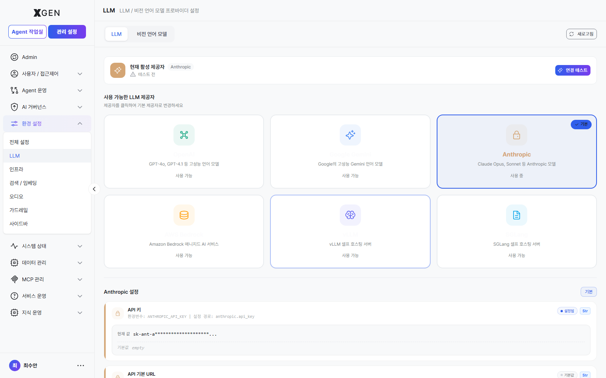

# LLM Settings

This chapter covers configuring the language model providers and parameters the solution will use.

## Supported Providers

| Provider | Korean | Type | Notes |
|---|---|---|---|
| OpenAI | OpenAI | Cloud | API key required |
| Anthropic | Anthropic | Cloud | Claude family, API key required |
| Google Gemini | Google Gemini | Cloud | API key required |
| AWS Bedrock | AWS Bedrock | Cloud | AWS credentials required |
| vLLM | vLLM | Self-hosted | Models deployed on internal GPU servers |
| SGLang | SGLang | Self-hosted | Models deployed on internal GPU servers |

!!! info "Recommended for Financial Sector"
    In segregated networks or data-egress-restricted environments, cloud providers may be unusable. Prioritize internal **vLLM** or **SGLang**.

## Registering a Provider

Select **Admin → Environment → LLM** in the left sidebar.

1. Click the **Connect** button on the provider card
2. Enter:
    - **API Key** (or token): The credential issued from the provider console
    - **Endpoint** (for self-hosted): in the form `https://vllm.internal.example.com`
    - **Default Model**: The default model for this provider
3. Click **Test Connection** → verify response
4. **Save**

!!! warning "API Key Security"
    Once saved, the API key is no longer displayed on screen. If lost, you must reissue it in the provider console. Changes may briefly fail in-flight calls — schedule during low-traffic hours.

## Setting the Default Provider

When multiple providers are registered, designate the system-wide default.

1. Select from the **Default Provider** dropdown at the top of LLM Settings
2. **Save**

Newly created agents and agentflows will use the default provider. Individual items can override with another provider.

## Model Parameters

| Parameter | Korean | Meaning | Suggested |
|---|---|---|---|
| Temperature | Temperature | Response randomness. 0 = deterministic; higher = more creative | Factual: 0.2 / Creative: 0.7 |
| Max Tokens | Max Tokens | Maximum tokens per response | General chat: 1000–2000 |
| Top P | Top P | Nucleus sampling — diversity control | 0.9–1.0 |
| Stream | 스트리밍 | Stream response in real time | true (better UX) |

!!! info "Where these parameters surface today"
    The per-model *Temperature / Max Tokens / Top P sliders* mentioned in earlier versions of this manual are not exposed on the current stg LLM settings (`admin?view=admin-setting-llm`) provider-detail page. Apply the recommended values above via the *Advanced Options* of the LLM node in your agentflow or at call time. The sliders screenshot will be added once the UI is in place.

## Operational Impact of Changes

!!! warning "Operational Impact"
    Changing the LLM provider or default model has the following effects:
    
    - **In-flight chats**: Started chats finish on the existing model; the new model applies from the next message.
    - **Deployed agentflows**: Use the new model immediately. Response quality, cost, and latency may shift.
    - **Evaluation results**: Past evaluations are model-specific. Re-evaluate with the new model.

Check the audit log for impact scope before changes, and prefer low-traffic hours.

## Operational Recommendations

- **Quarterly review** — Check whether providers have released new models, evaluate, and upgrade.
- **Cost monitoring** — Track monthly costs separately when using cloud providers. Sudden spikes may signal abnormal calls (loops, etc.).
- **Failover** — If possible, register a primary and a secondary provider for automatic fallback during outages.

## Contact

For questions about LLM settings, please contact **XGen Administrator**({{vars.support_email}}).
