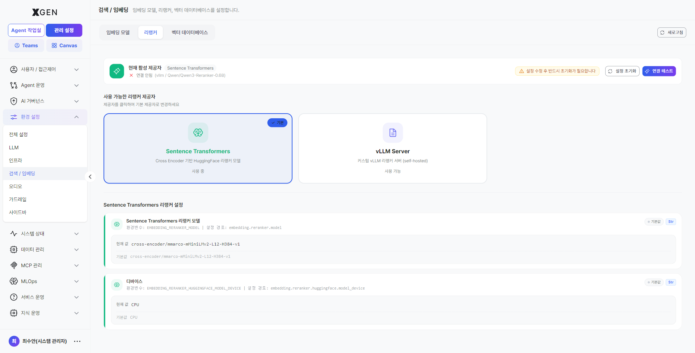
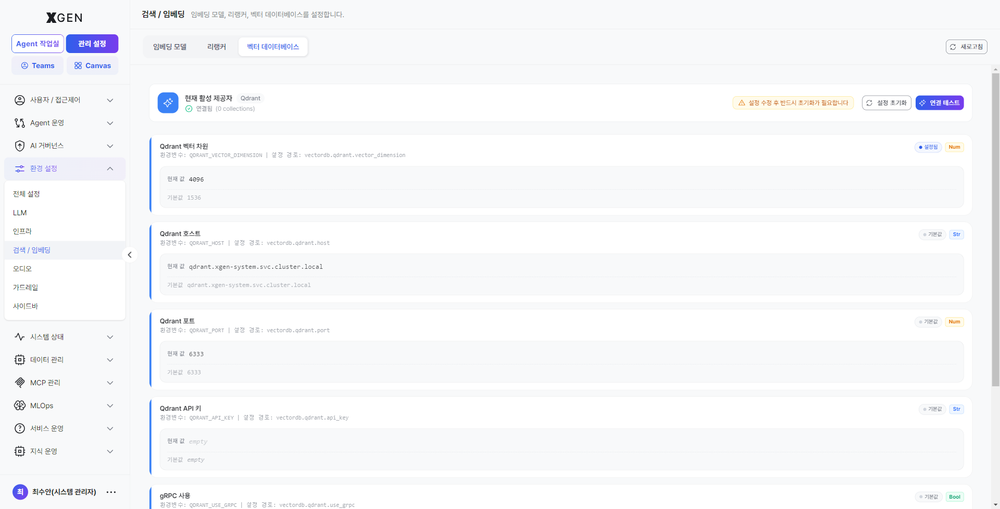

# Embedding & Vector Search Settings

This chapter covers the embedding model, reranker, and vector database settings — the core of knowledge search.

## Components

Knowledge search relies on three components working together.

| Component | Korean | Role |
|---|---|---|
| Embedding Model | 임베딩 모델 | Convert documents and queries into vectors |
| Vector Database | 벡터 데이터베이스 | Store vectors and perform similarity search |
| Reranker | 리랭커 | Re-rank initial retrieval results with finer precision |

## Registering an Embedding Model

Select **Admin → Environment → Search / Embedding** in the left sidebar, then switch to the **Embedding Model** tab.

1. Click **+ Add Model**
2. Enter:
    - Model name
    - Provider (OpenAI / vLLM, etc.)
    - Model identifier (e.g., `text-embedding-3-large`, internal model name)
    - **Dimension** — the vector dimensionality output by the model (e.g., 1536)
3. Click **Test Connection** → confirm an actual embedding call succeeds
4. **Save**

!!! warning "Re-embedding Required When Changing Dimension"
    If you switch to a model with a different dimension than an already-embedded collection, the existing vectors cannot be used. The whole collection must be **re-embedded** (consumes time and cost).

## Registering a Reranker

A reranker re-orders initial retrieval results (e.g., top 50) for higher accuracy. Effective for accuracy improvements but increases response latency.

1. **Reranker** tab → **+ Add Reranker**
2. Enter model name, provider, identifier
3. **Test Connection** → **Save**

The reranker is optional. Whether to use it and the threshold are configured per-collection or per-agentflow.

## Connecting a Vector Database

The default supported engine is **Qdrant**.

1. **Vector Database** tab → **Connection Settings**
2. Enter:
    - Host: e.g., `qdrant.internal.example.com`
    - Port: default `6333` (HTTP), `6334` (gRPC)
    - API key (if authentication is enabled)
3. **Test Connection** → **Save**

!!! note "Disk Monitoring"
    The vector database consumes disk quickly as collections grow. Periodically check disk usage in **System Monitor** and configure threshold alerts.

## Operational Checks

| Item | Frequency | Method |
|---|---|---|
| Vector DB disk usage | Weekly | System Monitor |
| Embedding call failure rate | Weekly | Audit log or LLM provider console |
| Reranker response time | Monthly | Chat response time stats |
| Similarity search quality | Quarterly | Sample query result review |

## Contact

For questions about embedding and vector search, please contact the Xgen Solution Administrator.
