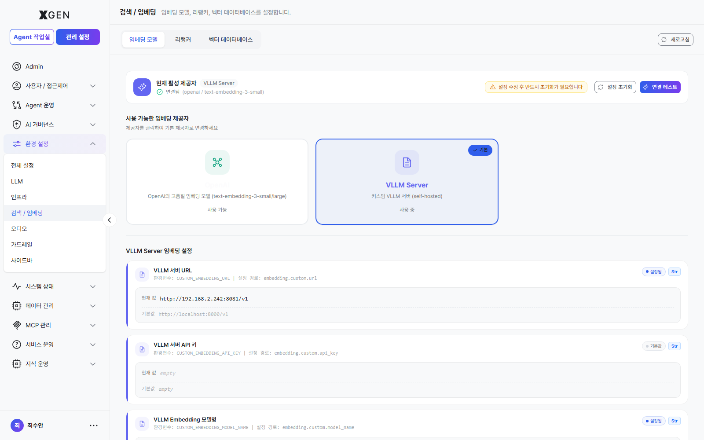

# 임베딩·벡터 검색 설정

본 챕터는 지식 검색의 핵심인 임베딩 모델·리랭커·벡터 데이터베이스 설정을 다룹니다.

## 구성 요소

지식 검색은 다음 3개 구성요소가 함께 동작합니다.

| 구성요소 | 영문 | 역할 |
|---|---|---|
| 임베딩 모델 | Embedding Model | 문서·질의를 벡터로 변환 |
| 벡터 데이터베이스 | Vector Database | 벡터를 저장하고 유사도 검색 |
| 리랭커 | Reranker | 1차 검색 결과의 순위를 정밀하게 재조정 |

## 임베딩 모델 등록

좌측 메뉴 **관리 설정 → 환경 설정 → 검색 / 임베딩**을 선택하고 **임베딩 모델** 탭으로 이동합니다.

1. **+ 모델 추가** 클릭
2. 다음 항목 입력
    - 모델명
    - 프로바이더 (OpenAI / vLLM 등)
    - 모델 식별자 (예: `text-embedding-3-large`, 사내 모델명)
    - **차원(Dimension)** — 모델이 출력하는 벡터의 차원 수 (예: 1536)
3. **연결 테스트** → 실제 임베딩 호출 성공 확인
4. **저장**

!!! warning "차원 변경 시 재임베딩 필요"
    이미 임베딩한 컬렉션의 차원과 다른 모델로 변경하면 기존 벡터를 사용할 수 없습니다. 컬렉션을 통째로 **재임베딩**해야 합니다 (시간·비용 발생).

## 리랭커 등록

리랭커는 1차 검색 결과(예: 상위 50개)의 순위를 더 정확하게 재조정합니다. 정확도 향상에 효과적이지만 응답 시간이 늘어납니다.

1. **리랭커** 탭 → **+ 리랭커 추가**
2. 모델명·프로바이더·식별자 입력
3. **연결 테스트** → **저장**

리랭커는 선택사항입니다. 사용 여부와 임계치는 개별 컬렉션 또는 에이전트플로우에서 설정합니다.

## 벡터 데이터베이스 연결

기본 지원 엔진은 **Qdrant** 입니다.

1. **벡터 데이터베이스** 탭 → **연결 설정**
2. 다음 항목 입력
    - 호스트: `qdrant.internal.example.com`
    - 포트: 기본 `6333` (HTTP), `6334` (gRPC)
    - API 키 (인증 활성화된 경우)
3. **연결 테스트** → **저장**

!!! info "현재 stg 빌드의 벡터 DB 탭은 조회 위주"
    벡터 데이터베이스 탭(`admin?view=admin-setting-embed` → *벡터 데이터베이스* 탭) 은 현재 stg 라이브 빌드에서 *연결 테스트* 버튼과 현재 연결된 엔진 표시 위주로 노출되며, 호스트·포트·API 키 입력 패널은 UI 에 노출되지 않습니다. Qdrant 등 벡터 DB 연결 설정은 인프라 측 환경 변수/설정 파일로 1회 구성됩니다. UI 입력 패널이 추가되면 캡처와 함께 본 절을 보강합니다.

!!! note "디스크 모니터링"
    벡터 데이터베이스는 컬렉션이 늘수록 디스크를 빠르게 소비합니다. **시스템 모니터**의 디스크 사용률을 주기적으로 확인하고, 임계치 알림을 설정하세요.

## 운영 점검

| 점검 항목 | 빈도 | 방법 |
|---|---|---|
| 벡터 DB 디스크 사용량 | 매주 | 시스템 모니터 |
| 임베딩 호출 실패율 | 매주 | 감사 로그 또는 LLM 프로바이더 콘솔 |
| 리랭커 응답 시간 | 매월 | 채팅 응답 시간 통계 |
| 유사도 검색 품질 | 분기 | 샘플 질의 결과 검토 |

## 문의

임베딩·벡터 검색 관련 문의는 Xgen 솔루션 관리자에게 문의해 주세요.
