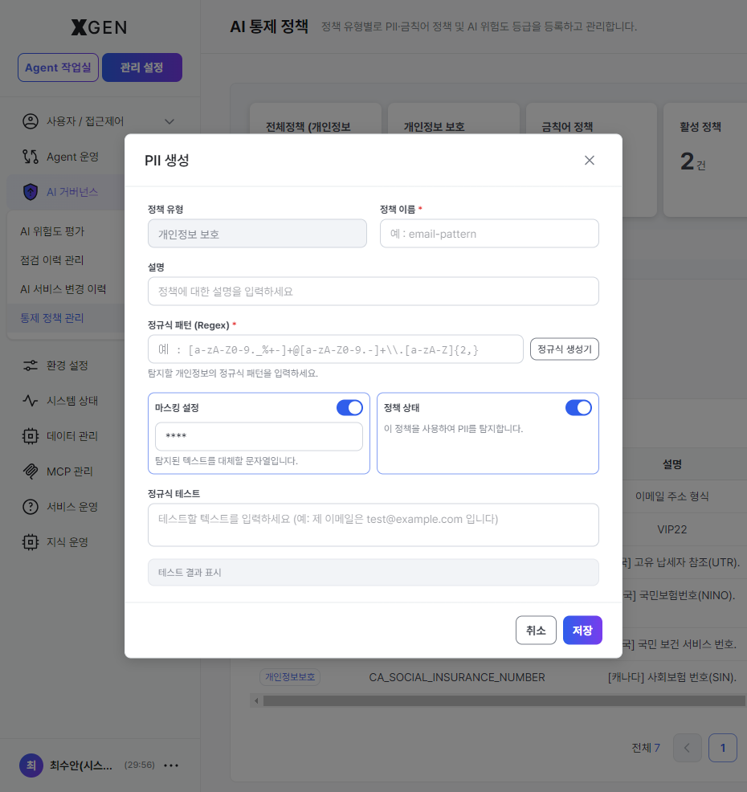
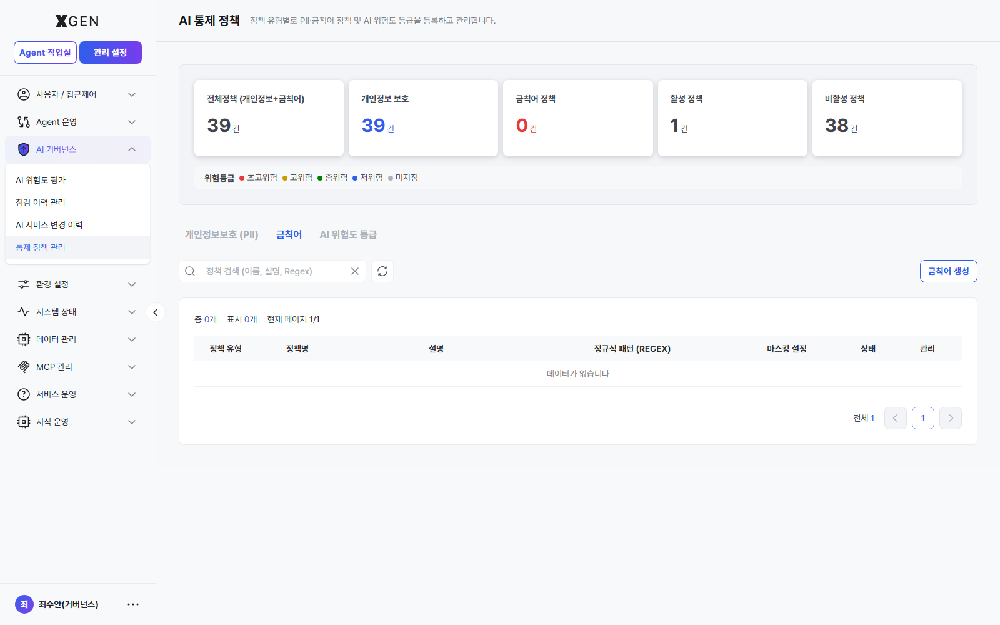
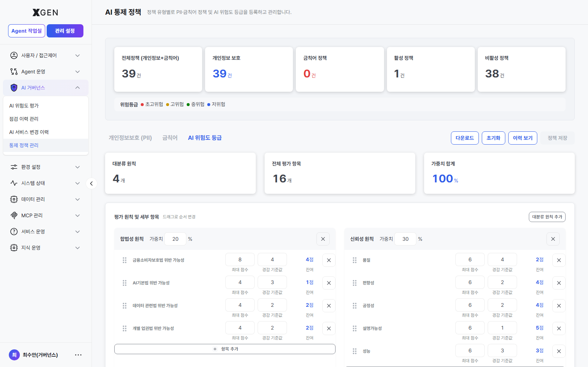

# PII 보호 정책

본 챕터는 솔루션이 처리하는 데이터에서 개인식별정보(PII)를 자동 탐지·마스킹하는 정책 운영 절차를 다룹니다. 금융권·공공·의료 등 규제 산업에서 핵심적인 챕터입니다.

> **이 챕터는 관리 설정 > AI 거버넌스 > 통제 정책 관리 화면("AI 통제 정책")의 *개인정보보호(PII) 탭* 을 중심으로 설명합니다.** 같은 화면의 *금칙어* / *AI 위험도 등급* 탭은 절 끝에서 간단히 다룹니다. 외부 Guard 모델(예: Qwen3Guard-Gen vLLM) 호출 설정은 별도 화면이며 [가드레일 모델 설정](25b-guardrail-model.md) 챕터를 참고하세요.

## PII와 보호의 필요성

**PII (Personally Identifiable Information)** 는 개인을 식별하는 데 사용될 수 있는 정보입니다.

| 분류 | 예시 |
|---|---|
| 직접 식별자 | 주민등록번호, 운전면허번호, 여권번호 |
| 간접 식별자 | 전화번호, 이메일, 생년월일, 주소 |
| 금융 정보 | 계좌번호, 카드번호 |
| 건강 정보 | 진료 기록, 처방전 |
| 인증 정보 | 비밀번호, API 키, 액세스 토큰 |

본 솔루션은 다음 시점에 PII 탐지·마스킹을 적용합니다.

| 시점 | 동작 |
|---|---|
| 문서 업로드 | 컬렉션 임베딩 시 PII 스캔 → 탐지된 항목 마스킹 또는 알림 |
| 채팅 입력 | 사용자 메시지에 PII 포함 시 알림 또는 차단 |
| AI 응답 | LLM 응답에 PII 포함 시 마스킹 |
| 감사 로그 | 로그 자체에 PII 마스킹 적용 |

## 화면 진입 및 구성

좌측 메뉴 **관리 설정 → AI 거버넌스 → 통제 정책 관리** 를 선택하면 **AI 통제 정책** 화면으로 진입합니다.

화면은 3개 영역으로 구성됩니다.

| 영역 | 표시 항목 |
|---|---|
| 상단 요약 카드 | **전체정책** (PII + 금칙어 합계) · **개인정보 보호** 건수 · **금칙어 정책** 건수 · **활성 정책** 건수 · **비활성 정책** 건수 |
| 위험 등급 범례 | 색상별 등급(초고위험·고위험·중위험·저위험·미지정). PII/금칙어 탭에서는 정책별 색상 칩으로, AI 위험도 등급 탭에서는 평가 결과 점수 구간으로 사용 |
| 탭 영역 | **개인정보보호 (PII)** / **금칙어** / **AI 위험도 등급** — 본 챕터는 PII 탭을 주로 다룸 |

## PII 탭 — 기본 정책 (시스템 제공)

설치 시점에 **39개의 기본 PII 정책**이 등록되어 있습니다. 대부분 비활성 상태로 출고되며 환경에 맞게 활성화·수정합니다. 다음은 일부 예시입니다.

| 정책명 | 영문 정식 명칭 | 정규식 패턴 (REGEX) | 마스킹 |
|---|---|---|---|
| VIP | VIP | `VIP` | 마스킹 적용 (`****`) |
| UK_UNIQUE_TAXPAYER_REFERENCE_NUMBER | UK Unique Taxpayer Reference Number | `\b\d{10}\b` | `****` |
| UK_NATIONAL_INSURANCE_NUMBER | UK National Insurance Number | `\b[A-CEGHJ-PR-TW-Z]{1}[A-CEGHJ-NPR-TW-Z]{1}[0-9]{6}[A-D]{1}\b` | `****` |
| UK_NATIONAL_HEALTH_SERVICE_NUMBER | UK National Health Service Number | `\b\d{3}\s?\d{3}\s?\d{4}\b` | `****` |
| CA_SOCIAL_INSURANCE_NUMBER | Canada Social Insurance Number | `\b\d{3}[- ]?\d{3}[- ]?\d{3}\b` | `****` |
| CA_HEALTH_NUMBER | Canada Health Number | `\b\d{10}\b` | `****` |

표는 한 페이지에 6건씩 노출되며 총 7페이지를 페이지네이션으로 탐색합니다. 표 상단의 **검색** 박스로 이름·설명·Regex 본문을 검색할 수 있고, **PII 생성** 버튼으로 사용자 정의 정책을 추가할 수 있습니다.

각 행 우측 **수정 / 삭제** 버튼으로 개별 정책을 편집·제거합니다. **상태** 열의 활성/비활성은 정책 단위 토글입니다.

## 사용자 정의 정책 추가

조직 특성에 맞는 추가 PII(예: 한국 주민등록번호, 사번 형식, 고객번호 CIF 등)가 있다면 정책을 추가합니다.

1. PII 탭 우상단 **PII 생성** 버튼
2. 다음 항목 입력
    - **정책 이름**: 한글/영문
    - **설명**: 무엇을 탐지하는 정책인지 한 줄 설명
    - **정규식 (Regex)**: 탐지 패턴 (예: 주민등록번호 `\d{6}-[1-4]\d{6}`, 사번 `EMP\d{6}`)
    - **마스킹 설정**: 어떻게 가릴지 (예: `******-*******`, `EMP******`)
    - **위험 등급**: 초고위험 / 고위험 / 중위험 / 저위험 / 미지정 중 선택 — 등급별 처리 흐름이 자동 적용
    - **활성화**: 즉시 적용 여부
3. **테스트** 영역에 샘플 텍스트 입력 → 정규식이 의도한 부분만 매칭하는지 확인
4. **저장**

!!! info "정규식 생성기·정규식 테스트 기능 내장"
    모달 안에 **정규식 생성기** 버튼과 **정규식 테스트** 영역이 내장되어 있어, 외부 도구 없이도 패턴을 작성·검증할 수 있습니다. *정규식 테스트* textarea 에 *"제 이메일은 test@example.com 입니다"* 같은 샘플을 입력하면 매칭 결과를 즉시 확인할 수 있습니다.

!!! info "정규식 작성 팁"
    - 너무 광범위한 패턴은 오탐(False Positive)이 많아집니다. `\d{10}` 보다 `010-?\d{4}-?\d{4}` 처럼 구체적으로 작성하세요.
    - 반대로 너무 좁으면 미탐(False Negative)이 발생. 다양한 형태(하이픈 유무, 공백 등)를 포함시키세요.
    - 정규식은 [regex101.com](https://regex101.com) 등에서 미리 검증한 뒤 등록하면 안전합니다.

## 금칙어 탭

PII 외에도 시스템에서 처리하면 안 되는 단어(예: 경쟁사 기밀 코드명, 미공개 상품명 등)는 **금칙어** 탭에서 별도로 관리합니다.

기본 상태는 빈 목록이며 우상단 **금칙어 생성** 버튼으로 등록합니다. 정책당 동일한 정규식 패턴·마스킹·위험 등급 옵션이 적용됩니다.

| 처리 방식 (마스킹 설정) | 동작 |
|---|---|
| 마스킹 | 단어를 `****`로 가림 |
| 차단 | 처리 자체를 중단하고 사용자에게 알림 |
| 알림만 | 처리는 진행하되 감사 로그에 기록 |

## AI 위험도 등급 탭

배포 단계의 에이전트·LLM 응답을 평가해 등급(초고위험~저위험) 으로 분류하는 **평가 원칙·가중치** 를 정의합니다.

| 영역 | 표시 항목 |
|---|---|
| 상단 요약 | **대분류 원칙** 개수 · **전체 평가 항목** 개수 · **가중치 합계** (반드시 100%) |
| 우상단 버튼 | **다운로드** (현재 정책 JSON) · **초기화** · **이력 보기** · **정책 저장** |
| 본문 | 대분류 원칙(합법성·신뢰성·…)별 카드. 카드 내부에서 평가 항목 추가, 최대 점수·경감 기준값·잔여 점수 조정 가능 |
| 항목 조작 | 항목 좌측 핸들로 드래그하여 순서 변경, **항목 추가** 버튼으로 신규 평가 항목 등록 |

정책 저장 후 [AI 거버넌스 - 위험도 평가 및 심사](29-governance-dashboard.md#risk-review) 에서 신규 에이전트가 자동 평가되며, 결과 등급에 따라 승인 대기 큐에 적재됩니다.

## 운영 권장사항 (금융권)

- **한국 PII 정규식 추가 필수** — 기본 39개는 대부분 국제 PII(UK/CA 등). 한국 환경에는 다음을 추가 권장
    - 주민등록번호 (`\d{6}-[1-4]\d{6}`)
    - 한국 전화번호 (`01[0-9]-?\d{3,4}-?\d{4}`)
    - 사번·직원번호 (조직 자체 형식)
    - 고객번호 (CIF, 계약번호)
- **감사 로그 PII 마스킹은 신중** — 규제 보고 시 원본 추적이 필요할 수 있음. 보존 기간이 끝난 뒤 일괄 마스킹 또는 삭제하는 방식 검토.
- **분기별 정책 검토** — 새로운 PII 형식·내부 코드가 추가될 수 있음. 분기 1회 정책 목록 점검.
- **테스트 환경에서 먼저** — 새 정규식은 운영 적용 전 스테이징에서 충분히 검증.
- **AI 위험도 등급 정책 저장 전 가중치 합계 100% 확인** — 합계가 100% 가 아니면 **정책 저장** 버튼이 비활성화됩니다.

## 관련 챕터

- [AI 거버넌스](29-governance-dashboard.md) — 위험도 평가·승인·감사 등 거버넌스 운영 전반
- [가드레일 모델 설정](25b-guardrail-model.md) — 외부 Guard 모델(Qwen3Guard 등) 호출 설정 (별도 화면)

## 문의

PII 정책 관련 문의는 Xgen 솔루션 관리자에게 문의해 주세요.
