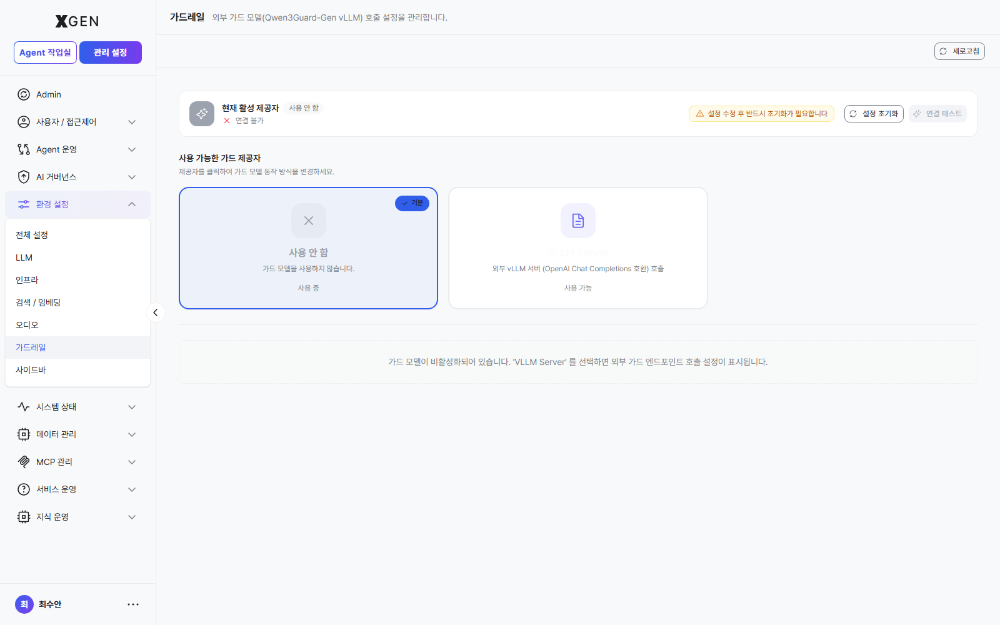

# PII 보호 정책

본 챕터는 솔루션이 처리하는 데이터에서 개인식별정보(PII)를 자동 탐지·마스킹하는 정책 운영 절차를 다룹니다. 금융권·공공·의료 등 규제 산업에서 핵심적인 챕터입니다.

## PII와 보호의 필요성

**PII (Personally Identifiable Information)** 는 개인을 식별하는 데 사용될 수 있는 정보입니다.

| 분류 | 예시 |
|---|---|
| 직접 식별자 | 주민등록번호, 운전면허번호, 여권번호 |
| 간접 식별자 | 전화번호, 이메일, 생년월일, 주소 |
| 금융 정보 | 계좌번호, 카드번호 |
| 건강 정보 | 진료 기록, 처방전 |
| 인증 정보 | 비밀번호, API 키, 액세스 토큰 |

본 솔루션은 다음 시점에 PII 탐지·마스킹을 적용합니다.

| 시점 | 동작 |
|---|---|
| 문서 업로드 | 컬렉션 임베딩 시 PII 스캔 → 탐지된 항목 마스킹 또는 알림 |
| 채팅 입력 | 사용자 메시지에 PII 포함 시 알림 또는 차단 |
| AI 응답 | LLM 응답에 PII 포함 시 마스킹 |
| 감사 로그 | 로그 자체에 PII 마스킹 적용 |

## 화면 진입

좌측 메뉴 **관리 설정 → AI 거버넌스 → 통제 정책 관리**를 선택합니다.

## 기본 정책 (시스템 제공)

설치 시점에 다음 기본 정책이 활성화되어 있습니다.

| 정책 | 영문 | 탐지 대상 (정규식 예) | 기본 마스킹 |
|---|---|---|---|
| 주민등록번호 | Resident Registration Number | `\d{6}-[1-4]\d{6}` | `******-*******` |
| 전화번호 | Phone Number | `01[0-9]-?\d{3,4}-?\d{4}` | `***-****-****` |
| 이메일 | Email | `[\w.+-]+@[\w-]+\.[\w.-]+` | `***@***.***` |
| 신용카드번호 | Credit Card | `\d{4}-?\d{4}-?\d{4}-?\d{4}` | `****-****-****-****` |
| 계좌번호 | Bank Account | `\d{3,6}-\d{2,6}-\d{6,8}` | `***-***-******` |

각 정책은 활성/비활성 토글로 제어 가능합니다.

## 사용자 정의 정책 추가

조직 특성에 맞는 추가 PII가 있다면 정책을 추가합니다.

1. 정책 목록 우상단 **+ 정책 추가** 버튼
2. 다음 항목 입력
    - **정책 이름**: 한글/영문
    - **카테고리**: PII / 금융 / 인증 / 기타
    - **정규식 (Regex)**: 탐지 패턴 (예: 사번 형식 `EMP\d{6}`)
    - **마스킹 패턴**: 어떻게 가릴지 (예: `EMP******`)
    - **활성화**: 즉시 적용 여부
3. **테스트** 영역에 샘플 텍스트 입력 → 정규식이 의도한 부분만 매칭하는지 확인
4. **저장**

!!! note "정책 추가 모달 캡처는 별도 갱신 예정"
    "+ 정책 추가" 클릭 시 노출되는 정규식 입력·테스트 모달의 캡처는 다음 회차에 보강 예정입니다.

!!! info "정규식 작성 팁"
    - 너무 광범위한 패턴은 오탐(False Positive)이 많아집니다. `\d{10}` 보다 `010-?\d{4}-?\d{4}` 처럼 구체적으로 작성하세요.
    - 반대로 너무 좁으면 미탐(False Negative)이 발생. 다양한 형태(하이픈 유무, 공백 등)를 포함시키세요.
    - 정규식은 [regex101.com](https://regex101.com) 등에서 미리 검증한 뒤 등록하면 안전합니다.

## 금칙어 설정

PII 외에도 시스템에서 처리하면 안 되는 단어(예: 경쟁사 기밀 코드명, 미공개 상품명 등)를 금칙어로 등록할 수 있습니다.

1. **금칙어** 탭 → **+ 금칙어 추가**
2. 단어 입력 (정확 일치 또는 부분 일치 선택)
3. 처리 방식 선택

| 처리 방식 | 동작 |
|---|---|
| 마스킹 | 단어를 `****`로 가림 |
| 차단 | 처리 자체를 중단하고 사용자에게 알림 |
| 알림만 | 처리는 진행하되 감사 로그에 기록 |

4. **저장**

## 정책 적용 범위

각 정책은 적용 범위를 세분화할 수 있습니다.

| 적용 영역 | 옵션 |
|---|---|
| 문서 업로드 | 적용 / 미적용 |
| 채팅 입력 | 적용 / 미적용 / 알림만 |
| AI 응답 | 적용 / 미적용 |
| 감사 로그 | 적용 / 미적용 |

!!! note "정책 적용 범위 설정 화면 캡처는 별도 갱신 예정"
    문서 업로드 / 채팅 입력 / AI 응답 / 감사 로그 등 영역별 적용 토글 화면 캡처는 다음 회차에 보강 예정입니다.

!!! warning "감사 로그 마스킹의 영향"
    감사 로그에 PII 마스킹을 적용하면 로그 자체로 사용자 활동을 정확히 추적하기 어려울 수 있습니다. 규제 요구사항과 균형을 맞추세요. 기본 권장: 감사 로그는 PII 마스킹 미적용 + 로그 접근 권한 자체를 강하게 제한.

## 위험 등급 분류

탐지된 PII에 위험 등급을 매겨 처리 우선순위를 정할 수 있습니다.

| 등급 | 영문 | 처리 |
|---|---|---|
| 낮음 | Low | 마스킹만 |
| 보통 | Medium | 마스킹 + 감사 로그 기록 |
| 높음 | High | 마스킹 + 사용자 알림 + 감사 로그 |
| 위험 | Critical | 처리 차단 + 보안팀 알림 |

각 정책에 위험 등급을 할당하면, 등급에 맞는 처리 흐름이 자동 적용됩니다.

## 운영 권장사항 (금융권)

- **추가 정규식 필수** — 기본 정책 외에 다음을 추가 권장
    - 사번·직원번호 (조직 자체 형식)
    - 고객번호 (CIF, 계약번호)
    - 통장 도장 이미지 OCR 텍스트
- **감사 로그 PII 마스킹은 신중** — 규제 보고 시 원본 추적이 필요할 수 있음. 보존 기간이 끝난 뒤 일괄 마스킹 또는 삭제하는 방식 검토.
- **분기별 정책 검토** — 새로운 PII 형식·내부 코드가 추가될 수 있음. 분기 1회 정책 목록 점검.
- **테스트 환경에서 먼저** — 새 정규식은 운영 적용 전 스테이징에서 충분히 검증.

## 문의

PII 정책 관련 문의는 {{vars.support_email}} 로 연락해 주세요.
