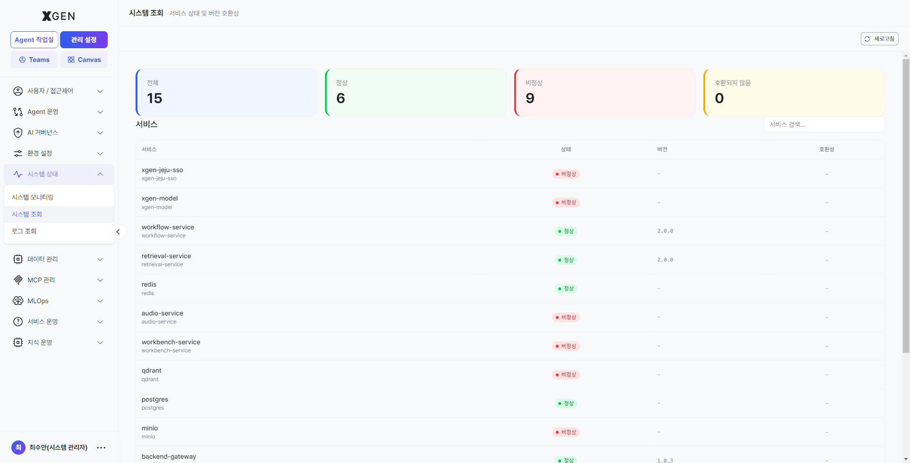
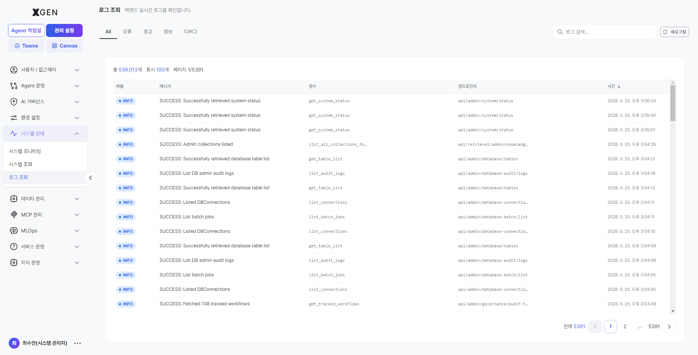
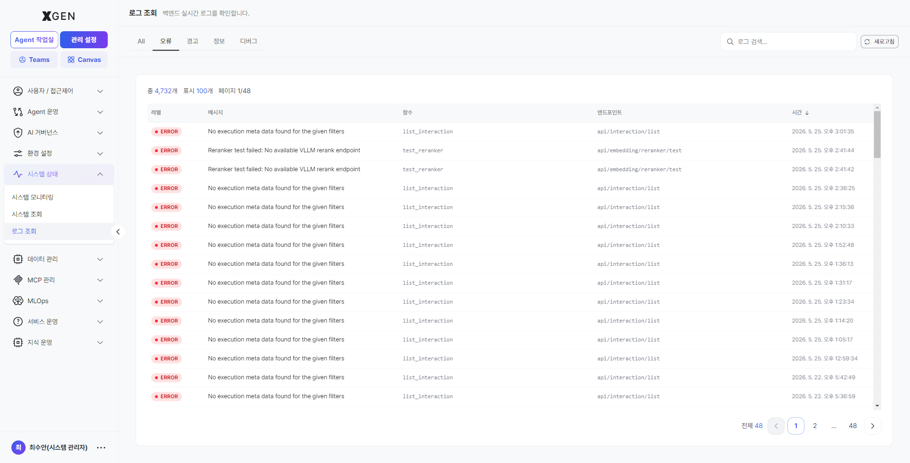

# 시스템 모니터

본 챕터에서는 솔루션 서버의 리소스 상태(CPU, 메모리, 디스크, 네트워크 등) 모니터링과 임계치 설정 방법을 설명합니다. (운영 환경 구성에 따라 Grafana 기반의 통합 모니터링 화면이 함께 제공될 수 있습니다.)

## 시스템 개요

좌측 메뉴 **관리 설정 → 시스템 상태 → 시스템 모니터링**을 선택합니다.

다음 정보가 실시간으로 표시됩니다.

| 메트릭 | 영문 | 표시 항목 |
|---|---|---|
| CPU | CPU | 코어별 사용률(%), 평균, 최대 |
| 메모리 | Memory | 사용/여유/총량 (GB), 사용률(%) |
| 디스크 | Disk | 파티션별 사용/여유/사용률 |
| 네트워크 | Network | 송신/수신 트래픽 (MB/s), 연결 상태 |
| 가동 시간 | Uptime | 시스템 부팅 후 경과 시간 |

상단의 **일시정지** / **재개** 버튼으로 화면 갱신을 제어할 수 있습니다 (서버 자체 모니터링은 계속됨).

## 사용률 등급

각 메트릭의 사용률은 4단계로 색상 구분됩니다.

| 등급 | 영문 | 표시 색 | 의미 |
|---|---|---|---|
| 낮음 | Low | 녹색 | 여유 있음 |
| 보통 | Medium | 노랑 | 정상 범위 |
| 높음 | High | 주황 | 주의 |
| 위험 | Critical | 빨강 | 즉시 조치 필요 |

기본 임계치는 다음과 같으며, 환경에 맞게 조정 가능합니다.

| 메트릭 | 보통 | 높음 | 위험 |
|---|---|---|---|
| CPU | 60% | 80% | 90% |
| 메모리 | 70% | 85% | 95% |
| 디스크 | 70% | 85% | 95% |

## 임계치 설정

1. 시스템 모니터 우상단 **설정 (⚙)** 버튼 클릭
2. 메트릭별 임계치 슬라이더 조정
3. **알림 채널** — 임계치 도달 시 어디로 알림 보낼지 선택 (이메일·웹훅 등)
4. **저장**

!!! info "현재 stg 빌드에 *임계치 설정 (⚙)* 버튼은 노출되지 않음"
    매뉴얼 이전 버전이 안내한 *설정(⚙) 버튼* 은 현재 stg 라이브 빌드의 시스템 모니터링 화면(`admin?view=admin-system-monitor`)에 노출되지 않습니다. 임계치 / 알림 채널 조정은 별도 시스템 설정 파일 또는 *환경 설정 → 인프라* 영역을 통해 운영팀이 1회 구성하는 것으로 추정되며, UI 노출이 추가되면 모달 캡처와 함께 본 절을 보강합니다.

!!! info "단발성 스파이크 무시"
    배치 작업이나 사용자 급증으로 인한 단발성 스파이크는 정상입니다. **위험** 단계 알림은 1시간 이상 지속될 때만 발송되도록 설정하면 노이즈를 줄일 수 있습니다.

## 리소스 기록

**리소스 기록** 탭에서 시계열 차트로 과거 추이를 확인할 수 있습니다.

| 기간 옵션 | 데이터 해상도 |
|---|---|
| 최근 1시간 | 1초 단위 |
| 최근 24시간 | 1분 단위 |
| 최근 7일 | 5분 단위 |
| 최근 30일 | 1시간 단위 |

급증 구간이 있으면 그 시점의 감사 로그와 함께 비교해 원인 추정에 사용합니다.

## 시스템 조회 { #system-query }

좌측 메뉴 **관리 설정 → 시스템 상태 → 시스템 조회** 를 선택하면 *서비스 상태 및 버전 호환성* 안내와 함께 솔루션이 의존하는 모든 백엔드 서비스의 헬스체크 결과가 한 화면에 노출됩니다.

### 화면 구성

| 영역 | 위치 | 설명 |
|---|---|---|
| **새로고침** 버튼 | 우상단 | 현재 시점 헬스체크를 즉시 재실행합니다. |
| 카드 — **전체** | 상단 회색 | 모니터링 대상 서비스 *총 개수*. |
| 카드 — **정상** | 상단 녹색 | 가장 최근 헬스체크에서 정상 응답한 서비스 수. |
| 카드 — **비정상** | 상단 빨강 | 응답이 없거나 오류 상태인 서비스 수 — *0이 아닐 경우 즉시 확인이 필요합니다*. |
| 카드 — **호환되지 않음** | 상단 노랑 | 솔루션이 요구하는 버전과 다른 응답을 한 서비스 수. |
| **서비스 검색** 입력칸 | 본문 우상단 | 서비스명으로 즉시 필터링합니다. |
| 서비스 테이블 | 본문 | 한 행 = 한 서비스. *서비스 / 상태 / 버전 / 호환성* 컬럼으로 구성. |

### 서비스 테이블 컬럼

| 컬럼 | 설명 |
|---|---|
| **서비스** | 솔루션이 의존하는 백엔드 컴포넌트명 (예: `workflow-service`, `retrieval-service`, `qdrant`, `postgres`, `redis`, `audio-service`, `xgen-model` 등). |
| **상태** | 가장 최근 헬스체크 결과. 녹색 *정상* / 빨강 *비정상* 배지로 표시. |
| **버전** | 응답한 서비스의 버전 문자열 (예: `2.0.0`). 미응답·미보고 시 `-` 표시. |
| **호환성** | 솔루션 요구 버전과의 호환 여부. 미보고 시 `-` 표시. |

### 활용 시나리오

- **장애 의심 시 1차 점검** — 사용자 신고(채팅 응답 없음·임베딩 오류 등) 가 들어오면 본 화면을 가장 먼저 열어 *비정상* 카드 숫자가 0이 아닌지 확인합니다.
- **배포 직후 확인** — 신규 배포 또는 인프라 작업 후 *모든 서비스가 정상* 으로 돌아왔는지 새로고침으로 확인.
- **버전 호환성 추적** — *호환되지 않음* 카드가 0이 아닌 경우, 어떤 서비스가 어떤 버전을 보고했는지 *버전* 컬럼으로 식별 후 인프라팀에 공유.

## 로그 조회 { #log-query }

좌측 메뉴 **관리 설정 → 시스템 상태 → 로그 조회** 를 선택합니다. 백엔드 서비스가 출력하는 *기술 로그* 를 레벨별로 검색·필터링할 수 있습니다.

### 화면 구성

| 영역 | 위치 | 설명 |
|---|---|---|
| 탭 — **전체** | 좌상단 (기본 탭) | 모든 레벨의 로그를 시간순으로 표시. |
| 탭 — **오류 (ERROR)** | 두 번째 | 시스템 오류·예외만 필터링. *장애 추적의 1차 진입점*. |
| 탭 — **경고 (WARN)** | 세 번째 | 잠재적 위험 신호 (성공했지만 비정상 상황) 만 표시. |
| 탭 — **정보 (INFO)** | 네 번째 | 정상 동작 흐름의 정보성 로그 (요청 처리 완료 등) 만 표시. |
| 탭 — **디버그 (DEBUG)** | 다섯 번째 | 개발·문제 분석용 상세 로그. 운영 환경에서는 평소 비활성, 진단 모드에서만 활용. |
| **로그 검색** 입력칸 | 우상단 | 메시지·서비스명 등으로 즉시 필터링. |
| **새로고침** 버튼 | 우상단 | 최신 로그 즉시 재조회. |

### 로그 테이블 컬럼

| 컬럼 | 설명 |
|---|---|
| **레벨** | `ERROR` / `WARN` / `INFO` / `DEBUG` 등 색상 배지로 표시. |
| **메시지** | 로그 본문 (예: `Successfully retrieved system status`, `No execution data found for the given filters`). |
| **출처** | 어떤 서비스/모듈에서 발생했는지 식별자 (예: `get_system_status`, `workflow_processor`). |
| **세부 정보** | 호출 경로·트레이스 컨텍스트 등 추가 메타데이터. |
| **시간** | 발생 시각 (초 단위까지). 컬럼 헤더 ↓ 클릭으로 정렬 방향 토글. |

### 탭별 활용 가이드

| 탭 | 평소 확인 빈도 | 주요 용도 |
|---|---|---|
| **전체** | 분석 시작 시점 | 시간대 흐름을 통째로 확인. *오류* 가 발생한 정확한 시각 주변을 함께 보고 싶을 때. |
| **오류** | 매일 1회 이상 | 새로운 ERROR 발생 시 *즉시* 원인 추적. 사용자 신고와 시간대를 대조. |
| **경고** | 주간 1회 | 누적되는 경고는 임박한 장애의 전조일 수 있음. 트렌드 검토. |
| **정보** | 필요 시 | 특정 요청의 정상 처리 흐름을 추적하거나, 예상한 호출이 발생했는지 검증. |
| **디버그** | 진단 모드에서만 | 운영 환경에서는 평소 노이즈가 크므로 비활성. 특정 이슈 재현 시점에만 일시 활성화. |

!!! info "감사 로그와의 차이"
    - **로그 조회**: 백엔드 컴포넌트의 *기술 로그* (스택트레이스, 처리 결과 메시지 등). 운영팀이 장애 원인 추적에 사용.
    - **감사 로그**: 누가 언제 무엇을 했는지(*사용자 행위*) 의 영구 보존 기록. 규정 대응·내부 감사용 — [감사 로그](27-audit-log.md) 챕터 참고.

### 운영 권장사항

- **장애 대응 표준 흐름** — *시스템 조회* 로 비정상 서비스 식별 → *로그 조회 → 오류 탭* 으로 같은 시간대 ERROR 확인 → 메시지·출처를 인프라팀에 전달.
- **DEBUG 는 임시로만** — 디버그 레벨이 켜져 있으면 디스크 사용량과 로그 검색 성능에 부담을 줍니다. 진단이 끝나면 즉시 평소 레벨로 돌립니다.
- **검색 키워드 표준화** — 자주 쓰는 키워드(서비스명·예외 클래스명) 를 팀 단위로 공유해 검색 결과를 빠르게 좁힙니다.

## 운영 권장사항

- **주간 검토** — 매주 1회 **리소스 기록** 30일 차트로 추세 검토. 디스크는 점진적으로 차오르므로 매주 확인이 필수입니다.
- **계획 정전 대비** — 가동 시간이 비정상적으로 짧으면 (예: 1일 미만) 비계획 재시작이 있었던 것입니다. 감사 로그에서 원인 확인.
- **임계치 정기 재조정** — 사용자 수가 늘면 평소 사용률이 올라갑니다. 분기별로 임계치 적정성 재검토.

## 문의

시스템 모니터 관련 문의는 Xgen 솔루션 관리자에게 문의해 주세요.
