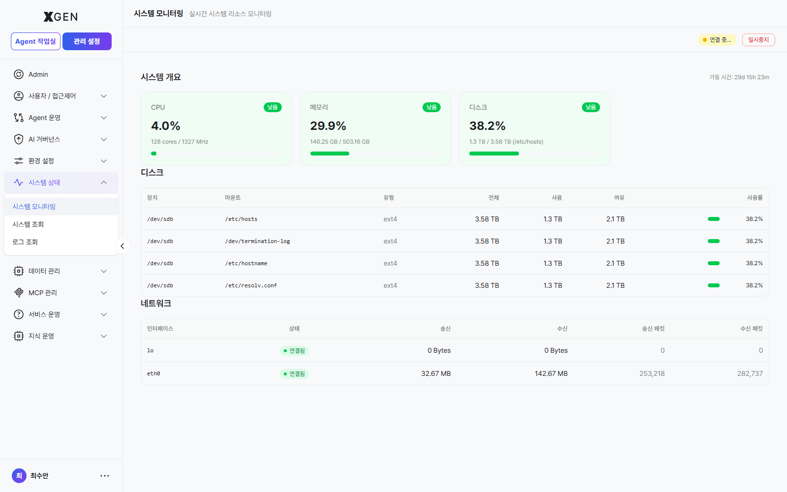

# 시스템 모니터

본 챕터는 솔루션 서버의 리소스(CPU·메모리·디스크·네트워크) 모니터링과 임계치 설정을 다룹니다.

## 시스템 개요

좌측 메뉴 **관리 설정 → 시스템 상태 → 시스템 모니터링**을 선택합니다.

다음 정보가 실시간으로 표시됩니다.

| 메트릭 | 영문 | 표시 항목 |
|---|---|---|
| CPU | CPU | 코어별 사용률(%), 평균, 최대 |
| 메모리 | Memory | 사용/여유/총량 (GB), 사용률(%) |
| 디스크 | Disk | 파티션별 사용/여유/사용률 |
| 네트워크 | Network | 송신/수신 트래픽 (MB/s), 연결 상태 |
| 가동 시간 | Uptime | 시스템 부팅 후 경과 시간 |

상단의 **일시정지** / **재개** 버튼으로 화면 갱신을 제어할 수 있습니다 (서버 자체 모니터링은 계속됨).

## 사용률 등급

각 메트릭의 사용률은 4단계로 색상 구분됩니다.

| 등급 | 영문 | 표시 색 | 의미 |
|---|---|---|---|
| 낮음 | Low | 녹색 | 여유 있음 |
| 보통 | Medium | 노랑 | 정상 범위 |
| 높음 | High | 주황 | 주의 |
| 위험 | Critical | 빨강 | 즉시 조치 필요 |

기본 임계치는 다음과 같으며, 환경에 맞게 조정 가능합니다.

| 메트릭 | 보통 | 높음 | 위험 |
|---|---|---|---|
| CPU | 60% | 80% | 90% |
| 메모리 | 70% | 85% | 95% |
| 디스크 | 70% | 85% | 95% |

## 임계치 설정

1. 시스템 모니터 우상단 **설정 (⚙)** 버튼 클릭
2. 메트릭별 임계치 슬라이더 조정
3. **알림 채널** — 임계치 도달 시 어디로 알림 보낼지 선택 (이메일·웹훅 등)
4. **저장**

!!! info "현재 stg 빌드에 *임계치 설정 (⚙)* 버튼은 노출되지 않음"
    매뉴얼 이전 버전이 안내한 *설정(⚙) 버튼* 은 현재 stg 라이브 빌드의 시스템 모니터링 화면(`admin?view=admin-system-monitor`)에 노출되지 않습니다. 임계치 / 알림 채널 조정은 별도 시스템 설정 파일 또는 *환경 설정 → 인프라* 영역을 통해 운영팀이 1회 구성하는 것으로 추정되며, UI 노출이 추가되면 모달 캡처와 함께 본 절을 보강합니다.

!!! info "단발성 스파이크 무시"
    배치 작업이나 사용자 급증으로 인한 단발성 스파이크는 정상입니다. **위험** 단계 알림은 1시간 이상 지속될 때만 발송되도록 설정하면 노이즈를 줄일 수 있습니다.

## 리소스 기록

**리소스 기록** 탭에서 시계열 차트로 과거 추이를 확인할 수 있습니다.

| 기간 옵션 | 데이터 해상도 |
|---|---|
| 최근 1시간 | 1초 단위 |
| 최근 24시간 | 1분 단위 |
| 최근 7일 | 5분 단위 |
| 최근 30일 | 1시간 단위 |

급증 구간이 있으면 그 시점의 감사 로그와 함께 비교해 원인 추정에 사용합니다.

## 시스템 조회·로그 조회 { #system-query-log }

**시스템 상태** 그룹에는 *시스템 모니터링* 외에 **시스템 조회** / **로그 조회** 두 메뉴가 더 있습니다. 둘 다 본 챕터에서 짧게만 다룹니다 — 화면이 *조회 전용* 이고 사용자 액션이 적기 때문입니다.

| 메뉴 | 화면 진입 | 용도 |
|---|---|---|
| **시스템 조회** | 관리 설정 → 시스템 상태 → 시스템 조회 | API 서버·Agent 엔진·모델 서빙 등 *연결 컴포넌트 상태* 를 한 화면에서 ping/health 결과로 표시. 장애 의심 시 1차 점검 진입점. |
| **로그 조회** | 관리 설정 → 시스템 상태 → 로그 조회 | 백엔드 서버 로그(stdout·error)를 검색·필터·다운로드. **사용자 활동·정책 변경 이력은 [감사 로그](27-audit-log.md) 챕터를 참고** — 본 화면은 *시스템 컴포넌트 자체 로그* 입니다. |

!!! info "감사 로그와의 차이"
    - **로그 조회**: 백엔드 컴포넌트의 *기술 로그* (스택트레이스, 에러 메시지 등). 운영팀이 장애 원인 추적에 사용.
    - **감사 로그**: 누가 언제 무엇을 했는지(*사용자 행위*) 의 영구 보존 기록. 규정 대응·내부 감사용. [감사 로그](27-audit-log.md) 챕터 참고.

## 운영 권장사항

- **주간 검토** — 매주 1회 **리소스 기록** 30일 차트로 추세 검토. 디스크는 점진적으로 차오르므로 매주 확인이 필수입니다.
- **계획 정전 대비** — 가동 시간이 비정상적으로 짧으면 (예: 1일 미만) 비계획 재시작이 있었던 것입니다. 감사 로그에서 원인 확인.
- **임계치 정기 재조정** — 사용자 수가 늘면 평소 사용률이 올라갑니다. 분기별로 임계치 적정성 재검토.

## 문의

시스템 모니터 관련 문의는 **XGen 관리자**({{vars.support_email}}) 로 연락해 주세요.
