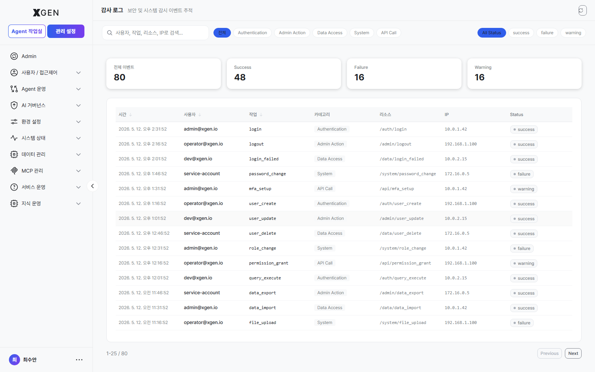

# Audit Log

This chapter covers the audit log — the retained record of user activity and system events. Periodic review is required in regulated industries such as finance.

## Recorded Events

| Category | Examples |
|---|---|
| Authentication | Login success/failure, password change, session expiry |
| User management | User add/delete/permission change, role assignment/revocation |
| System settings | LLM, embedding, policy changes |
| Content actions | Agentflow create/delete/deploy, collection upload |
| Operations | System start/stop, backup execution |

Each event includes:

- Timestamp (millisecond-precision ISO 8601)
- User (or `system`)
- Event type (e.g., `user.role_changed`)
- Target resource (e.g., `user:hong-gildong`)
- Before/after values (when applicable)
- IP address, User-Agent

## Viewing the Audit Log

Select **Admin → Security & Audit → Audit Log** in the left sidebar.

### Filters

| Filter | Options |
|---|---|
| Period | Last 1 hour / 24 hours / 7 days / 30 days / custom |
| User | Filter by specific username |
| Event type | Multi-select |
| Result | Success / failure |
| IP | Specific IP range |

The top search box supports partial-match text search — entering `hong`, for example, returns all events where the username or target contains "hong".

## Retention Period

Recommended retention by environment:

| Environment | Recommended Retention | Basis |
|---|---|---|
| General enterprise | 1–3 years | Internal policy |
| Financial sector | 5+ years | Electronic Financial Supervisory Regulation §17 |
| Public sector | 3–5 years | Information & Communications Network Act, Personal Information Protection Act |

Set the retention period under **Admin → Security & Audit → Security Settings**, in the Audit Log Retention item. The change itself is recorded in the audit log.

!!! warning "Caution When Shortening Retention"
    Shortening the retention period can auto-delete logs older than the new window. Always export a backup before reducing retention.

## Export

For regulatory reporting and external audits, the log can be exported to file.

1. Apply filters in the audit log screen
2. Click the **Export** button at the top right → choose format
    - CSV: for spreadsheet analysis
    - JSON: for machine processing
3. Store the downloaded file with **encryption** (may contain PII)

!!! info "The *Export* button is not present on the current stg build"
    The *Export* button at the top right mentioned in earlier versions of this manual is not exposed on the current stg Audit Log screen (`admin?view=admin-audit-logs`). For regulatory reporting needs, contact operations for a separate data-extraction process (API / SQL / script). Once the UI is added, we will refresh this section with format / scope selection modal screenshots.
    A screenshot of the format / range selection modal opened by "Export" will be added in a future manual update.

## Periodic Review Checklist

Recommended monthly review items.

- [ ] Anomalous login patterns (repeated failures, off-hours access)
- [ ] Permission tier changes — confirm they were intentional
- [ ] LLM and embedding settings changes — match the change reason
- [ ] Bulk agentflow deletions
- [ ] Data export frequency

## Operational Recommendations

- **SIEM integration** — Forward high-risk events (privilege escalation, mass deletion) to the security team's SIEM for real-time alerts.
- **Periodic backup** — Quarterly full backup of audit logs to external storage. Recoverable in case of system failure.
- **Restrict access** — Grant audit log read/export only to **SuperUser** accounts or the **Compliance Officer** role.

## Contact

For questions about the audit log, please contact **XGen Administrator**({{vars.support_email}}).
