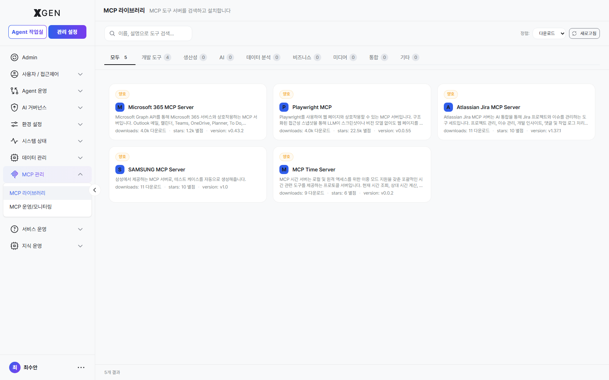
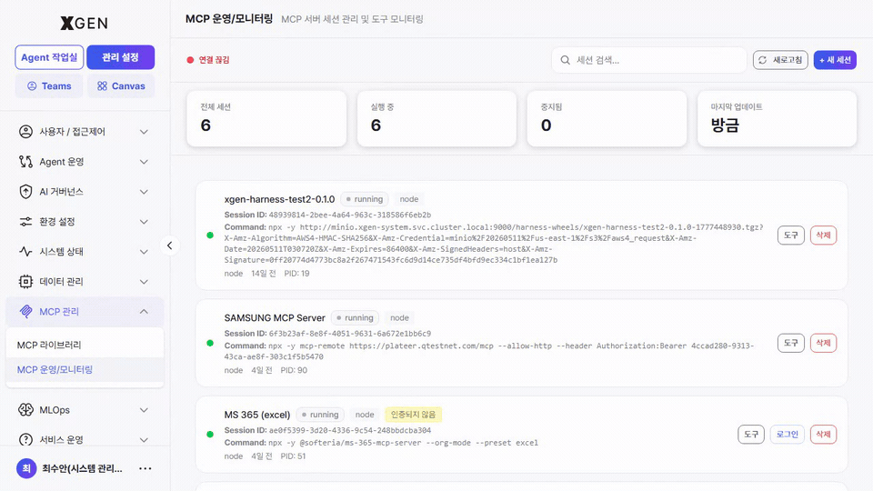

# MCP Library

This chapter covers registering and managing **MCP (Model Context Protocol) tool servers** that provide external tools for agents.

## What MCP Is

**MCP (Model Context Protocol)** is a standard protocol for connecting AI models with external tools. An MCP server is a "tool catalog" that the solution can register; tools registered by the server become usable as nodes within agentflows.

| Term | Korean | Description |
|---|---|---|
| MCP Server | MCP 서버 | An external process that bundles and provides tools |
| Tool | 도구 | A capability exposed by the MCP server (e.g., internal search, code execution) |
| Session | 세션 | A unit of connection to an MCP server. Per-user or system-wide |
| Environment Variables | 환경 변수 | Settings required to run the MCP server (API keys, endpoints, etc.) |

## Accessing the Screen

Select **Admin → MCP Management → MCP Library** in the left sidebar.

!!! info "Related Menu"
    The **MCP Management** section also contains **MCP Operations & Monitoring** for tracking call statistics and session state of registered servers.

## Registering an MCP Server

1. Click **+ Add MCP Server** at the top right
2. Enter:
    - **Name**: identifiable name (e.g., "Internal Search Tool")
    - **Server Configuration**: JSON or form input
        - Run command (e.g., `npx -y @company/mcp-search`)
        - Or remote endpoint (e.g., `https://mcp.internal.example.com`)
    - **Environment Variables**: key/value pairs (API keys, etc.)
    - **Description** (optional)
3. Click **Test Connection** → if the server responds, the **Features** list is auto-populated
4. **Save**

!!! warning "Environment Variable Security"
    Environment variables passed to the MCP server may include sensitive data such as API keys. The solution stores these encrypted, but be wary of plaintext exposure in screenshots, exports, and similar leaks.

## Server Card Information

Each MCP server card displays:

| Item | Description |
|---|---|
| Status | Connected / Disconnected / Error |
| Tool count | Number of tools provided by this server |
| Active sessions | Current connected sessions |
| Last call | Most recent tool invocation time |

Clicking the card opens a detail view with:

- **Features**: full list of tools (name, description, parameters)
- **Sessions**: active sessions and the users on them
- **Environment Variables**: registered variables (values masked)
- **Call statistics**: hourly invocation counts and error rate

## Granting Tool Access

Registering an MCP server does not automatically grant all users access.

1. MCP server detail → **Permissions** tab
2. Select the users or roles allowed to access
3. Permission types

| Permission | Meaning |
|---|---|
| Use | Can add as tool in an agentflow |
| Manage | Can edit or delete server settings |

4. **Save**

## MCP Operations & Monitoring (Station) { #mcp-station }

The second menu in **MCP Management** — **MCP Operations & Monitoring** (view ID `admin-mcp-station`) — is where you manage the *runtime state* and *session lifecycle* of registered MCP servers on a single screen. If *MCP Library* is the *catalog / registration* surface, this screen is the *operations* entry point.

| Area | What you see |
|---|---|
| Per-server status | Connected / Disconnected / Errored + last-call timestamp |
| Active sessions | Open sessions per user (account, start time, last activity) |
| Call statistics | Calls per time bucket, error rate, average response time |
| Controls | Terminate individual sessions / **Terminate All** / **Restart** server |

Where to enter: Admin → MCP Management → **MCP Operations & Monitoring**.

### Session Management

MCP servers usually run with per-user sessions. Abnormal sessions accumulate and consume resources, so clean them up periodically.

1. Open **MCP Operations & Monitoring** or the MCP server detail → **Sessions** tab.
2. Inspect the list for abnormal entries (errored, long idle).
3. Click individual **Terminate** or use **Terminate All** at the top right.

## Disabling / Restarting Servers

| Action | Procedure |
|---|---|
| Temporarily disable | Click **Disable** on the card — blocks new calls; existing sessions persist |
| Restart | **Restart** — terminates all sessions and starts a new server process |
| Permanently delete | **Delete** — removes the server registration. Agentflows using its tools will error |

!!! warning "Check Impact Before Deleting"
    Before deleting an MCP server, verify whether any agentflows depend on its tools. Deletion will cause those agentflows to error at execution time.

## Operational Recommendations

- **Least privilege** — Avoid granting MCP servers excessive permissions (e.g., write across the entire internal system); grant per-tool only what is needed.
- **Sandboxing** — Coordinate with infrastructure to run MCP servers that execute external code (e.g., code interpreters) in isolated containers.
- **Monitoring** — Watch error-rate trends weekly in the **MCP Operations & Monitoring** screen. Sudden spikes signal tool changes or external system outages.
- **Update cadence** — MCP servers are often external packages. Review for security patches quarterly.

## Contact

For questions about the MCP Library, please contact the Xgen Solution Administrator.
