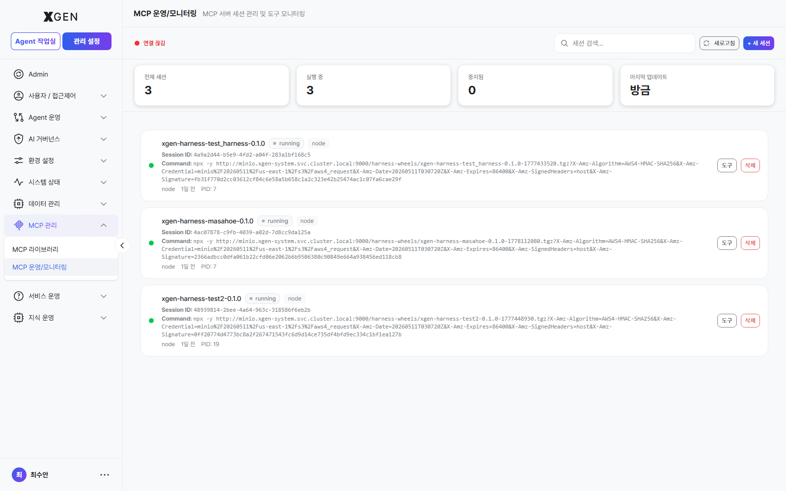

# MCP 라이브러리

본 챕터는 에이전트가 사용할 수 있는 외부 도구를 제공하는 **MCP(Model Context Protocol) 도구 서버** 의 등록·관리 절차를 다룹니다.

## MCP란

**MCP (Model Context Protocol)** 는 AI 모델과 외부 도구를 연결하는 표준 프로토콜입니다. MCP 서버는 일종의 "도구 카탈로그"를 제공하고, 솔루션은 MCP 서버에 등록된 도구를 에이전트플로우의 노드로 사용할 수 있습니다.

| 용어 | 영문 | 설명 |
|---|---|---|
| MCP 서버 | MCP Server | 여러 도구를 묶어 제공하는 외부 프로세스 |
| 도구 | Tool | MCP 서버가 노출하는 기능 (예: 사내 검색, 코드 실행) |
| 세션 | Session | MCP 서버와의 연결 단위. 사용자별 또는 시스템 전체 |
| 환경 변수 | Environment Variables | MCP 서버 실행에 필요한 설정값 (API 키, 엔드포인트 등) |

## 화면 진입

좌측 메뉴 **관리 설정 → MCP 관리 → MCP 라이브러리**를 선택합니다.

!!! info "관련 메뉴"
    **MCP 관리** 섹션에는 MCP 라이브러리 외에 **MCP 운영/모니터링** 메뉴도 있어 등록된 서버의 호출 통계와 세션 상태를 추적할 수 있습니다.

## MCP 서버 등록

1. 우상단 **+ MCP 서버 추가** 버튼 클릭
2. 다음 항목 입력
    - **이름**: 식별 가능한 이름 (예: "사내 검색 도구")
    - **서버 구성** (Server Configuration): JSON 형식 또는 폼 입력
        - 실행 명령 (예: `npx -y @company/mcp-search`)
        - 또는 원격 엔드포인트 (예: `https://mcp.internal.example.com`)
    - **환경 변수**: 키·값 쌍 (API 키 등)
    - **설명** (선택)
3. **연결 테스트** 클릭 → 서버가 응답하면 **기능(Features)** 목록이 자동 채워짐
4. **저장**

!!! note "MCP 서버 추가 모달 캡처는 별도 갱신 예정"
    "+ MCP 서버 추가" 클릭 시 노출되는 서버 구성·환경 변수·기능 목록 입력 모달의 캡처는 다음 회차에 보강 예정입니다.

!!! warning "환경 변수 보안"
    MCP 서버에 전달되는 환경 변수에는 API 키 등 민감 정보가 포함될 수 있습니다. 솔루션은 환경 변수를 암호화 저장하지만, 평문 노출이 가능한 외부 유출(스크린샷, 내보내기)에 주의하세요.

## 등록된 서버 정보

각 MCP 서버 카드는 다음을 표시합니다.

| 항목 | 설명 |
|---|---|
| 상태 | 연결됨 / 끊김 / 오류 |
| 도구 수 | 이 서버가 제공하는 도구 개수 |
| 활성 세션 | 현재 연결 중인 세션 수 |
| 마지막 호출 | 가장 최근 도구 호출 시각 |

서버 카드를 클릭하면 상세 화면이 열리고, 다음 정보를 확인할 수 있습니다.

- **기능(Features)**: 이 서버가 제공하는 도구 전체 목록 (이름·설명·파라미터)
- **세션(Sessions)**: 활성 세션 목록과 사용 사용자
- **환경 변수**: 등록된 변수 (값은 마스킹 표시)
- **호출 통계**: 시간대별 호출 횟수, 오류율

## 도구 권한 부여

MCP 서버 자체가 등록되어도 모든 사용자가 사용할 수 있는 것은 아닙니다.

1. MCP 서버 상세 → **권한** 탭
2. 접근 가능한 사용자/역할 선택
3. 권한 종류

| 권한 | 의미 |
|---|---|
| 사용 | 에이전트플로우에서 도구로 추가 가능 |
| 관리 | 서버 설정 편집·삭제 가능 |

4. **저장**

## 세션 관리

MCP 서버는 보통 사용자별 세션으로 동작합니다. 비정상 세션이 누적되면 리소스를 점유하므로 주기적으로 정리합니다.

1. **MCP 운영/모니터링** 메뉴 또는 MCP 서버 상세 → **세션** 탭
2. 세션 목록에서 비정상(오류 상태, 장시간 idle 등) 항목 확인
3. 개별 **종료** 또는 우상단 **모두 종료** 버튼

## 서버 끄기·다시 시작

| 작업 | 절차 |
|---|---|
| 일시 비활성화 | 서버 카드의 **비활성화** — 새 호출 차단, 기존 세션은 유지 |
| 재시작 | **재시작** — 모든 세션 종료 후 서버 프로세스 새로 시작 |
| 영구 삭제 | **삭제** — 서버 등록 자체 제거. 이 서버를 사용하던 에이전트플로우는 오류 |

!!! warning "삭제 전 영향 확인"
    MCP 서버 삭제 전, 이 서버의 도구를 사용하는 에이전트플로우가 있는지 확인하세요. 삭제하면 해당 에이전트플로우는 실행 시 오류가 납니다.

## 운영 권장사항

- **최소 권한 원칙** — MCP 서버에 과도한 권한(예: 사내 시스템 전체 쓰기 권한)을 부여하지 말고, 도구 단위로 필요한 만큼만 부여.
- **샌드박싱** — 외부 코드를 실행하는 MCP 서버(예: 코드 인터프리터)는 격리된 컨테이너에서 실행되도록 인프라팀과 협의.
- **모니터링** — **MCP 운영/모니터링** 화면에서 호출 통계의 오류율 추이를 매주 확인. 갑작스러운 증가는 도구 변경·외부 시스템 장애 신호.
- **업데이트 주기** — MCP 서버는 외부 패키지인 경우가 많으므로 보안 패치를 분기별로 검토.

## 문의

MCP 라이브러리 관련 문의는 {{vars.support_email}} 로 연락해 주세요.
