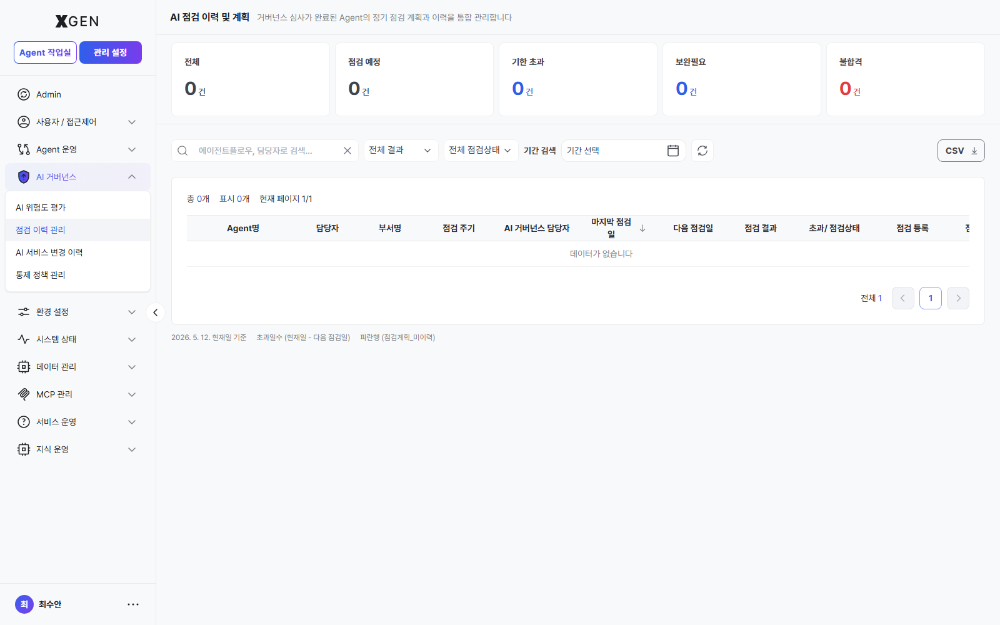
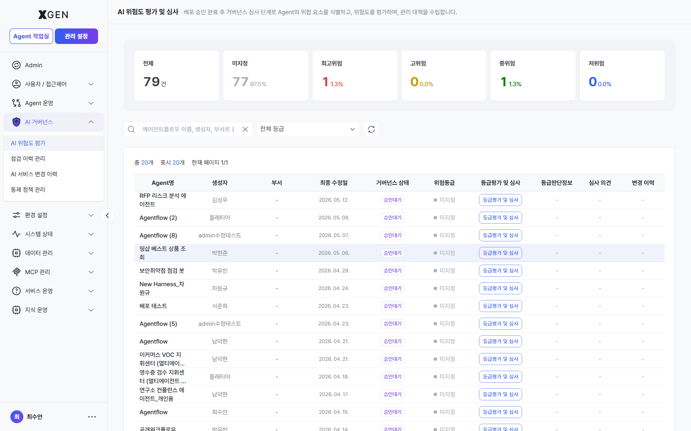
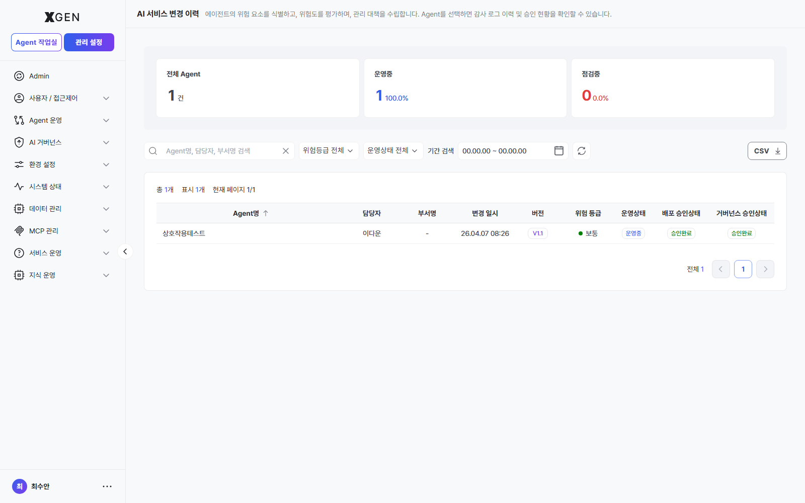
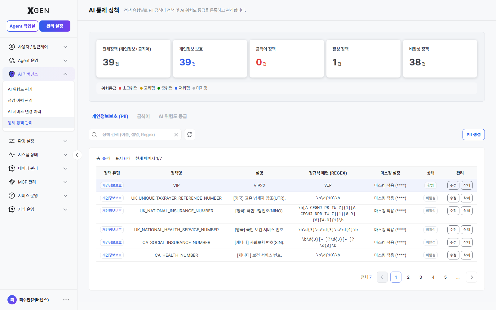

# AI Governance

This chapter covers the **Admin Center → AI Governance** menu and how to operate each screen. It is the area where the organization manages **risk assessment, inspection, audit, and control policies** for AI usage.

## Accessing the Screen

Enter **Admin Center** from the top-left mode switch, then expand the **AI Governance** section in the left sidebar. The page opens with the governance monitoring dashboard.

## Sidebar Layout

The left sidebar's **AI Governance** accordion contains **four items in a flat list**. The order and labels visible to a SuperUser with the right permissions are:

| # | Sidebar label | Page header (on entry) | Section in this chapter | In-page structure |
|---|---|---|---|---|
| 1 | **AI Risk Assessment** | AI Risk Assessment | [Risk Review](#risk-review) | Risk-category widget grid → items over the threshold open the *Agent Approval* view inside |
| 2 | **Inspection History** | AI Inspection History & Plan | [Inspection](#inspection) | Four tabs — Inspection History / Inspection Plan / Overdue / Inspection Register |
| 3 | **AI Service Change History** | (service / operation change history list) | [AI Service Change History](#audit-tracking) | Click an Agent name to open the detail view → **6 sub-tabs**: Execution Detail History / Data Access Info / Agent Change History / Policy Change History / Deployment Approval History / Governance Approval History |
| 4 | **Control Policy Management** | (3-tab policy management) | [Control Policy](#control-policy) | Three tabs — PII Protection / Forbidden Words / Risk Levels |

!!! info "Sidebar labels may differ from page headers"
    Clicking *Inspection History* in the sidebar opens a page whose header reads **AI Inspection History & Plan**. This chapter locates each menu by its **sidebar label**, and uses the page header only as a confirmation cue after entry.

    Internally the four items belong to backend permission categories (`gov-risk-review` / `gov-inspection` / `gov-service-history` / `gov-control-policy`), but **those category names are not shown as sidebar group labels** — all four sit flat inside a single *AI Governance* accordion.

## Risk Review { #risk-review }

Computes **per-category risk scores** for deployed agents; agents that exceed a threshold are routed to governance reviewers for explicit approval.

### Evaluation Categories

| Category | Description |
|---|---|
| PII Exposure | Failed or bypassed personal-information masking |
| Data Exfiltration | Bulk download or outbound email of sensitive data |
| Privilege Misuse | Abnormal privilege escalation |
| Abnormal Access | Off-hours or foreign-IP access |
| Policy Violation | Use of forbidden words or blocked tools |

Each category carries a **weight**, contributing to the overall risk score.

!!! info "Suggested Weights (Financial Sector Example)"
    - PII Exposure: 10 (highest priority)
    - Data Exfiltration: 9
    - Privilege Misuse: 8
    - Policy Violation: 6
    - Abnormal Access: 5

### Agent Approval { #agent-approval }

This menu is the **second of two approval stages** required before an agentflow can be served to end users. The **first stage — deployment approval — is performed by the System Administrator** on [Agent Operations → Agent Management](32-agent-operations.md#agent-mgmt-deploy-approval); only agents that pass that stage reach this queue.

!!! info "Where Governance Approval sits — stage 2 of dual approval"
    | Stage | Reviewer | Screen | Effect on data |
    |---|---|---|---|
    | 1. Deployment approval | System Administrator | [Agent Management](32-agent-operations.md#agent-mgmt-deploy-approval) | `is_accepted: true`, `is_deployed: true` |
    | **2. Governance approval *(this screen)*** | **Governance Officer** | AI Governance → Agentflow Approval | `is_governance_accepted: true` |
    | ✅ Servable | — | Visible to end users only after both stages pass | — |

    Agents rejected at stage 1 never appear in this queue. Because governance reviewers only see agents the System Administrator has already cleared for operational fitness, their review can focus on **risk category, PII impact, and policy compliance**.

#### Approval workflow

The procedure below moves through *sidebar entry → queue overview → row inspection → decision + comment* — all inside this one screen (`gov-agentflow-approval`).

1. **Open the screen** — In **Admin Center**, expand **AI Governance → Agentflow Approval** in the left sidebar. The header is followed by a **search field** and **four stat cards**.

2. **Read the queue** — Click any of the four stat cards to filter the table to that status.

    | Stat card | Variant | Meaning |
    |---|---|---|
    | All status | info | Total items currently in the queue |
    | Pending | warning | `is_governance_accepted` not set — **items to handle on this screen** |
    | Approved | success | `is_governance_accepted: true` — agent is live |
    | Rejected | error | A reviewer is recorded but `is_governance_accepted: false` — returned to author |

    The queue contains only agents the System Administrator has approved at stage 1 (plus items force-routed in by a risk-threshold breach from Risk Review). Anything rejected at stage 1 never reaches this screen, so reviewers can focus on **risk category, PII impact, and policy compliance**.

3. **Read the table columns** — Headers sort on click.

    | Column | Sortable | Description |
    |---|---|---|
    | Agentflow | ✓ | Name. Row click = detail modal |
    | Creator | ✓ | Author ID / display name |
    | Department | — | Author's department |
    | Governance status | ✓ | Pending / Approved / Rejected badge |
    | Reviewer | — | The Governance Officer who processed the row (`-` while pending) |
    | Last modified | ✓ | Request or processing timestamp |
    | Actions | — | **View detail** / **Approve** / **Reject** — the latter two appear only on pending rows |

4. **Inspect the detail modal** — Clicking a row opens the *Agentflow Detail* modal. Verify the following in one place:

    - **Basic info**: name, creator (`<name> (<dept>)`), version `v<n>`, node/edge counts (`<n> nodes / <m> edges`)
    - **Governance status badge** and reviewer (for already-processed rows)
    - **Review comment** (for already-processed rows)
    - **Node summary table**: `nodeName / Function ID / category / parameter count / I/O` — clicking a row expands the node detail panel (parameter dict and input list)

    For nodes that could expose PII (outbound calls, mail senders, etc.), expand the parameter list and confirm the use is intentional.

5. **Decide — Approve or Reject** — The footer buttons in the detail modal, or the right-side buttons on the row, open the *comment modal*.

    | Button | Comment required? | Backend call | Result |
    |---|---|---|---|
    | **Approve** | Optional (rationale or notes) | `POST /api/admin/governance/agentflow-approval/agentflows/<id>/review` with `{ is_governance_accepted: true, comment }` | Records `is_governance_accepted: true`, `governance_reviewed_by`, `governance_review_comment`. The agent goes live immediately |
    | **Reject** | **Required** (rejection reason) | Same endpoint, `{ is_governance_accepted: false, comment }` | Records `is_governance_accepted: false`. The author reads the comment, fixes the agent, and resubmits from stage 0 |

    When the *Submitting…* state clears, the stat cards and table refresh. If the same agent reappears as *Pending*, the author has resubmitted after a fix — repeat the workflow.

Every approve/reject action is recorded in the [audit log](27-audit-log.md) and in [AI Service Change History](#audit-tracking); the reviewer (`governance_reviewed_by`), comment (`governance_review_comment`), and timestamp are retained permanently.

## Inspection { #inspection }

Manages the **inspection schedule and history** for AI systems across the organization.

| Menu | Role |
|---|---|
| Inspection Monitoring | Card-style dashboard of in-progress and upcoming items |
| Plan | Register/adjust quarterly and annual inspection plans |
| Overdue | Track items past their due date and their owners |
| History | Results, actions, and evidence for completed inspections |

Inspection items are linked to risk-review results; completing an inspection re-computes the affected risk scores.

## AI Service Change History { #audit-tracking }

Records governance-policy changes and user operational actions.

| Menu | Role |
|---|---|
| Service Change History | Changes to governance policies, service configuration, and approval workflows |
| Operation History | Per-user / per-policy / per-agent action tracking (actor, approver, target, time) |

!!! note "vs. system audit log"
    The solution exposes *two distinct audit surfaces*. They differ by the **unit being tracked**.

    | View | Tracked unit | What it records | Location |
    |---|---|---|---|
    | **System Audit Log** | System / user | Login success/failure, password & session events, user / role / permission changes, system-setting changes (LLM, embedding, policy), content operations, system start/stop, backups | [Audit Log](27-audit-log.md) (Security & Audit group) |
    | **AI Service Change History** | Agent | The [Per-Agent detail — 6 tabs](#audit-tracking-detail) above — *Execution / Data Access / Agent Change / Policy Change / Deployment Approval / Governance Approval* | This screen (AI Governance group) |

    Rule of thumb: if the question is **"who did what when"** at the user/system level, use the System Audit Log. If it is **"how has this agent evolved"** at the agent level, use this screen.

### Per-Agent detail — 6 tabs { #audit-tracking-detail }

Clicking an **Agent name** in the list opens the agent's detail view. The screen shows an attachment panel and **6 tabs** at the top. On every tab you can review the stat cards and use filters, date-range search, and CSV export.

| # | Tab | Stat cards | Table columns | Filters |
|---|---|---|---|---|
| 1 | **Execution Detail History** | Total / Success / Failure | Execution ID · Timestamp · Version · Type · Executor · Duration · Status · Input · Output | Type · Status · Period |
| 2 | **Data Access Info** | Total accesses / Agent developer / Model developer | Access timestamp · Target DB / Collection · RBAC type · User · Department · Action | RBAC · Action · Period |
| 3 | **Agent Change History** | Total changes / Approved / Pending / Rejected | Change timestamp · Activity · Before · After · Changer · Department · Approval status | Approval status · Period |
| 4 | **Policy Change History** | Total changes / Auto-approved / Changer | Change timestamp · Policy type · Policy name · Version · Change type · Changer · Approval | Change type · Changer · Approval · Period |
| 5 | **Deployment Approval History** | Approved / Pending / Rejected | Execution ID · Timestamp · Version · Executor · Department · Approval status | Approval status · Period |
| 6 | **Governance Approval History** | Approved / On hold / Rejected | Execution ID · Timestamp · Version · Executor · Department · Governance reviewer · Approval status | Approval status · Period |

How to enter:

1. Click **AI Governance → AI Service Change History** in the left sidebar to open the list
2. Click the **Agent name** of a row to drill into the detail view
3. Choose one of the 6 tabs at the top to focus on a specific change category
4. Use the **CSV** button at the top right to export the current tab (use this as the source for compliance reports)

!!! info "Recommended use per tab"
    - **Deployment Approval / Governance Approval History** — Review the dual-approval workflow step by step. Use these tabs as primary evidence for finance and internal-audit responses.
    - **Policy Change / Agent Change History** — Trace responsibility for risk-policy and control-policy edits. The changer and approval status are recorded together, so incident root causes can be narrowed quickly.
    - **Data Access Info** — Use the RBAC-type breakdown to spot over-provisioned permissions.

## Control Policy { #control-policy }

Registers and manages the organization's **AI usage control policies**.

| Area | Content | Detail |
|---|---|---|
| PII Policy | Targets and rules for personal-information masking (RRN, phone, email, etc.) | [PII Policy](25-pii-policy.md) |
| Forbidden Words | Keywords/regex blocked in inputs and responses | (in PII Policy chapter) |
| Risk Policy | Risk-category weights and automatic-action thresholds | See [Risk Review](#risk-review) above |

Active-policy counts and violation trends also appear as widgets on the main governance monitoring dashboard.

## Operational Recommendations

- **Monthly review** — operations and security teams jointly review the governance dashboard and risk-review output, then act on outliers
- **Quarterly weight tuning** — reweight risk categories to reflect new external regulation and internal incidents
- **Documented approval process** — for agents over the risk threshold, document approvers, deadlines, and re-review cadence separately
- **Automated inspection planning** — register the quarterly inspection plan in the scheduler to avoid misses
- **Retention** — keep operation history for the regulatory retention period (typically 5+ years in financial sector)

## Contact

For AI Governance questions, contact {{vars.support_email}}.
