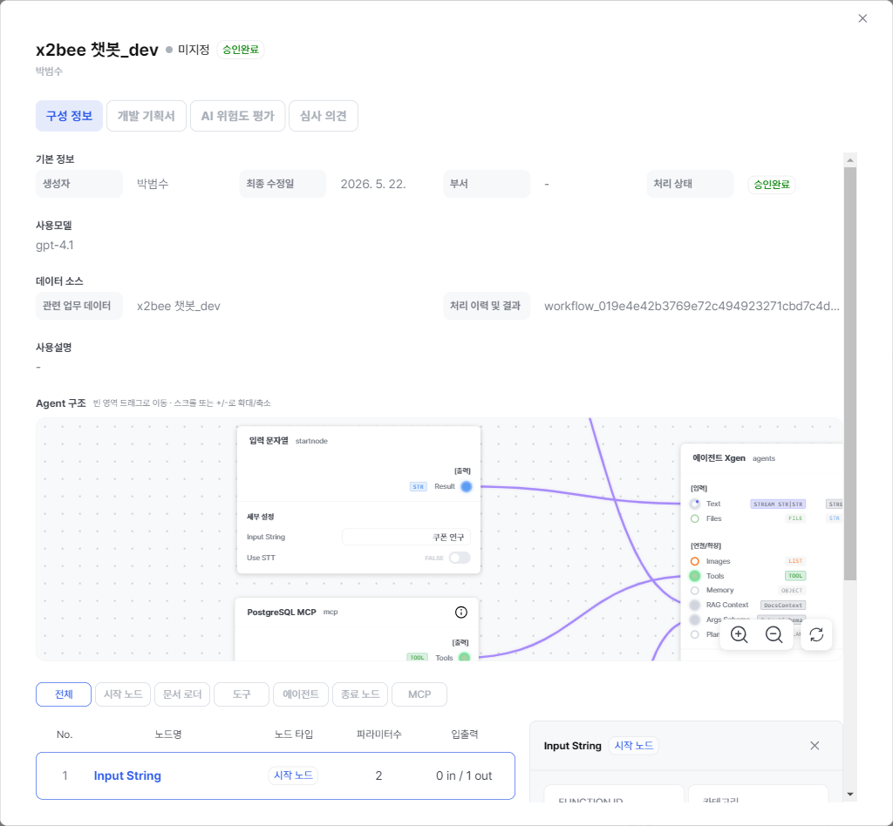
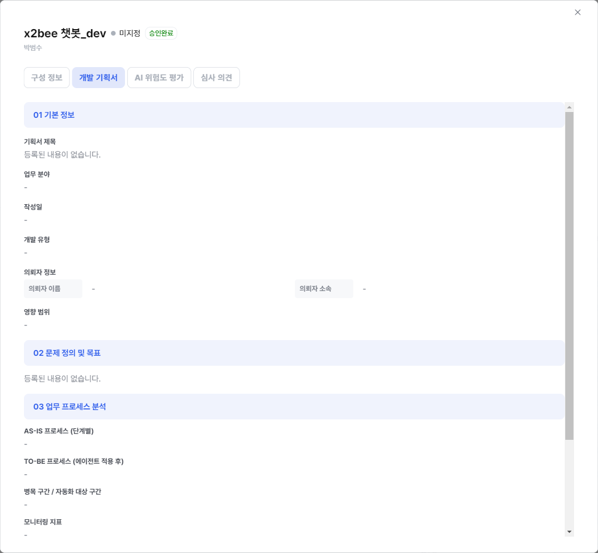
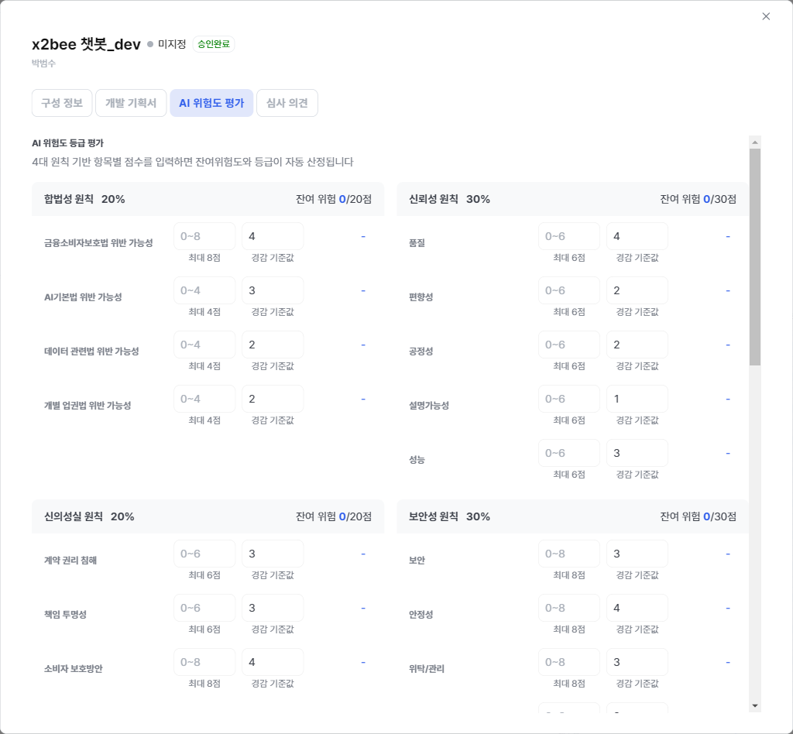
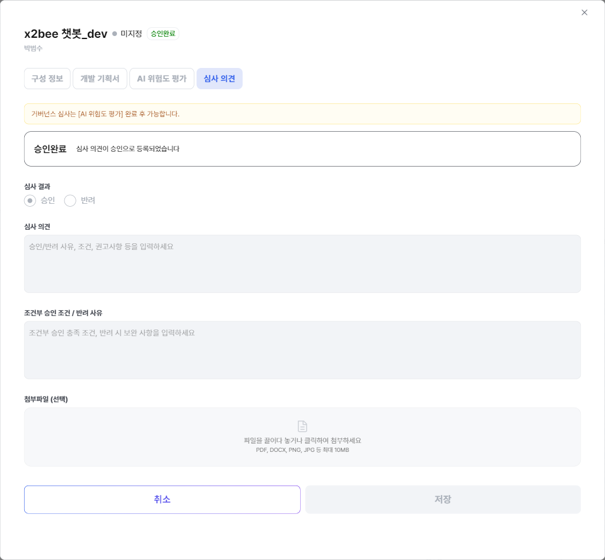

# AI 거버넌스

본 챕터는 **관리 설정 → AI 거버넌스** 메뉴의 구성과 각 화면의 운영 방법을 다룹니다. 조직의 AI 사용에 대한 **위험도 평가·점검·감사·통제 정책**을 통합 관리하는 영역입니다.

## 화면 진입

좌상단 **관리 설정** 모드 진입 후 좌측 사이드바 **AI 거버넌스** 섹션을 펼칩니다. 페이지를 열면 거버넌스 종합 모니터링 대시보드가 노출됩니다.

## 사이드바 구성

좌측 사이드바의 **AI 거버넌스** 영역에는 4개의 관리 메뉴가 아코디언 형태로 구성되어 있습니다. 해당 메뉴는 권한이 부여된 SuperUser 계정에만 표시되며, 노출 순서와 메뉴명은 다음과 같습니다.

| # | 사이드바 라벨 | 페이지 헤더(진입 시) | 본 챕터 절 | 화면 내부 구조 |
|---|---|---|---|---|
| 1 | **AI 위험도 평가** | AI 위험도 평가 | [위험도 평가 및 심사](#risk-review) | 위험 카테고리 위젯 그리드 → 임계치 초과 항목에서 *에이전트 승인* 화면으로 내부 이동 |
| 2 | **점검 이력 관리** | AI 점검 이력 및 계획 | [점검 이력 및 계획](#inspection) | 4개 탭 — 점검 이력 / 점검 계획 / 초과 점검 / 점검 이력 등록 |
| 3 | **AI 서비스 변경 이력** | (서비스·운영 변경 이력 목록) | [AI 서비스 변경 이력](#audit-tracking) | Agent 명 클릭 시 상세 화면 진입 → **6개 서브 탭**: 실행 상세 이력 / 데이터 접근정보 / Agent 변경 이력 / 정책 변경 이력 / 배포 승인 이력 / 거버넌스 승인 이력 |
| 4 | **통제 정책 관리** | (3-탭 정책 관리) | [통제 정책 관리](#control-policy) | 3개 탭 — PII 보호 / 금칙어 / 위험 등급 |

!!! info "사이드바 라벨이 페이지 헤더와 다를 수 있습니다"
    예를 들어 *점검 이력 관리* 사이드바를 클릭하면 화면 헤더에는 **AI 점검 이력 및 계획** 으로 표시됩니다. 본 챕터는 *사이드바 라벨* 을 기준으로 위치를 찾고, *페이지 헤더* 는 화면 진입 후 확인 기준으로 사용합니다.

    또한 솔루션 내부적으로 4개 아이템은 백엔드 권한 카테고리(`gov-risk-review` / `gov-inspection` / `gov-service-history` / `gov-control-policy`) 로 묶여 있지만, **그 카테고리 명은 사이드바 그룹 라벨로 노출되지 않습니다**. 모두 단일 *AI 거버넌스* 아코디언 안에 평면 나열됩니다.

## AI 위험도 평가 및 심사 { #risk-review }

배포된 에이전트의 **위험 카테고리별 점수**를 산정하고, 임계치를 넘는 에이전트에 대해 거버넌스 담당자의 승인을 받습니다.

!!! info "권장 가중치 (금융권 예시)"
    - PII 노출: 10 (최우선)
    - 데이터 외부 반출: 9
    - 권한 오용: 8
    - 정책 위반: 6
    - 비정상 접근: 5

### 에이전트 승인 { #agent-approval }

본 메뉴는 에이전트가 사용자에게 서비스되기 위한 **이중 승인 중 2단계(거버넌스 승인)** 를 처리하는 화면입니다. 1단계인 *배포 승인*은 [Agent 운영 → Agent 관리](32-agent-operations.md#agent-mgmt-deploy-approval) 에서 시스템 관리자가 먼저 처리하며, 이 단계를 통과한 에이전트만 본 큐에 노출됩니다.

!!! info "거버넌스 승인의 위치 — 이중 승인의 2단계"
    | 단계 | 담당 | 화면 | 통과 시 |
    |---|---|---|---|
    | 1. 배포 승인 | 시스템 관리자 | [Agent 관리](32-agent-operations.md#agent-mgmt-deploy-approval) | `is_accepted: true`, `is_deployed: true` |
    | **2. 거버넌스 승인 *(본 화면)*** | **거버넌스 담당자** | AI 거버넌스 → 에이전트플로우 승인 | `is_governance_accepted: true` |
    | ✅ 서비스 가능 | — | 두 단계 모두 통과해야 사용자 노출 | — |

    1단계가 거부된 에이전트는 본 화면 큐에 올라오지 않습니다. 즉 거버넌스 담당자는 *시스템 관리자가 한 번 운영 적합성을 인정한 에이전트* 만을 검토하므로, 검토 초점이 **위험 카테고리·PII 영향·정책 준수** 에 집중됩니다.

#### 승인 워크플로

에이전트 승인 작업은 아래 순서로 진행됩니다. 모든 검토 및 승인 작업은 동일 화면 내에서 처리할 수 있습니다.

**1. 화면 진입**

관리 설정 모드에서 아래 경로로 이동합니다.

- AI 거버넌스
- 에이전트 승인

화면 상단에는 검색창과 상태별 통계 카드가 표시됩니다.

**2. 승인 상태 확인**

상단의 대시보드 카드를 통해 현재 승인 상태를 빠르게 확인할 수 있습니다.

예시:

- 전체
- 대기
- 승인
- 반려

각 카드를 선택하면 해당 상태 기준으로 목록이 자동 필터링되며, 필요한 항목만 빠르게 조회할 수 있습니다.

검토 목록에는 시스템 관리자의 1차 배포 승인을 완료한 에이전트만 등록됩니다. 또한 위험도 평가 결과가 임계치를 초과한 항목은 자동으로 동일한 검토 목록에 포함될 수 있습니다.

3. **테이블 컬럼 읽기** — 본문 테이블은 다음 컬럼으로 구성되며, 헤더 클릭 시 정렬 토글됩니다.

    | 컬럼 | 정렬 | 설명 |
    |---|---|---|
    | 에이전트플로우 | ✓ | 이름. 카드 클릭 = 행 클릭 = 상세 모달 진입 |
    | 생성자 | ✓ | 작성자 사번/표시명 |
    | 부서 | — | 작성자 부서 |
    | 거버넌스 상태 | ✓ | 대기/승인/반려 배지 |
    | 심사자 | — | 처리한 거버넌스 담당자 (대기 시 `-`) |
    | 최근 수정 | ✓ | 요청 또는 처리 일시 |
    | 관리 | — | **상세** / **승인** / **반려** 버튼 — *대기* 행에만 후자 두 개 노출 |

**4. 상세 모달 — 검토 자료 확인**

목록에서 행을 클릭하거나 **등급평가 및 심사** 버튼을 누르면 *Agent 위험도 상세* 모달이 열립니다. 모달 상단에는 에이전트명·작성자·위험등급·처리 상태 배지가 표시되고, 본문은 검토 작업을 단계별로 안내하는 **4개 탭** 으로 구성됩니다. 좌→우 순서대로 따라가는 것이 권장 흐름입니다.

| # | 탭 | 역할 | 활성 조건 |
|---|---|---|---|
| 1 | **구성 정보** | 에이전트 식별·구조 파악 | 제한 없음 |
| 2 | **개발 기획서** | 작성자가 등록한 기획·목표·프로세스 확인 | 제한 없음 |
| 3 | **AI 위험도 평가** | 4대 원칙 기반 점수 입력 → 잔여 위험·등급 자동 산정 | 제한 없음 |
| 4 | **심사 의견** | 승인/반려 결정 및 의견 입력 | **AI 위험도 평가 완료 후** 활성 |

**탭 1 — 구성 정보**

검토 대상 에이전트의 **식별 정보와 구조** 를 한 화면에서 확인합니다.

- **기본 정보** — 생성자 / 최종 수정일 / 부서 / 처리 상태 배지
- **사용모델** — 백본 LLM (예: `gpt-4.1`)
- **데이터 소스** — 관련 업무 데이터 / 처리 이력 및 결과 (워크플로 ID)
- **사용설명** — 작성자가 등록한 용도 설명
- **Agent 구조** — 노드·엣지 캔버스 (빈 영역 드래그로 이동, 스크롤 또는 `+`/`-` 로 확대·축소)
- **노드 요약 테이블** — 노드명 / 노드 타입 / 파라미터 수 / 입출력 (I/O). 상단 필터 칩(전체 / 시작 노드 / 문서 로더 / 도구 / 에이전트 / 종료 노드 / MCP) 으로 좁히고, 행 선택 시 우측에 파라미터 상세 패널이 펼쳐집니다.

!!! tip "리스크 식별 시 우선 확인 대상"
    개인정보(PII) 또는 외부 전송 가능성이 있는 노드(외부 API 호출, 이메일 발송, 외부 시스템 연동, 파일 업로드) 를 노드 요약 테이블에서 먼저 살피고, 파라미터 입력값에 민감정보가 포함될 가능성을 확인합니다.

**탭 2 — 개발 기획서**

작성자(에이전트 개발자) 가 등록한 **개발 기획서 원본** 을 검토 화면 내에서 직접 확인합니다. 기획서는 다음 세 섹션 묶음으로 구성됩니다.

- **01 기본 정보** — 기획서 제목 / 업무 분야 / 작성일 / 개발 유형 / 의뢰자 정보 (이름·소속) / 영향 범위
- **02 문제 정의 및 목표**
- **03 업무 프로세스 분석** — AS-IS 프로세스 (단계별) / TO-BE 프로세스 (에이전트 적용 후) / 병목 구간·자동화 대상 구간 / 모니터링 지표

!!! note "등록 자료가 없는 경우"
    각 섹션 본문에 *"등록된 내용이 없습니다."* 가 표시되며, 평가 단계에서 작성자에게 보완 요청 사유로 활용할 수 있습니다.

**탭 3 — AI 위험도 평가**

거버넌스 담당자가 **4대 원칙 × 세부 항목** 에 점수를 입력하면 잔여 위험과 종합 등급이 자동 산정됩니다.

| 원칙 | 가중치 | 잔여 위험 만점 | 세부 항목 |
|---|---|---|---|
| **합법성 원칙** | 20% | 20점 | 금융소비자보호법 위반 가능성 / AI기본법 위반 가능성 / 데이터 관련법 위반 가능성 / 개별 업권법 위반 가능성 |
| **신뢰성 원칙** | 30% | 30점 | 품질 / 편향성 / 공정성 / 설명가능성 / 성능 |
| **신의성실 원칙** | 20% | 20점 | 계약 권리 침해 / 책임 투명성 / 소비자 보호방안 |
| **보안성 원칙** | 30% | 30점 | 보안 / 안정성 / 위탁/관리 |

각 항목은 *0~만점* 범위 입력값과 *경감 기준값* (금융위 AI 서비스 위험평가 가이드라인) 을 함께 표시합니다.

!!! info "산정 공식 — 모달 하단 안내문 그대로"
    - **잔여위험** = 위험 인식·측정 − 위험경감
    - **최종 종합점수** = 전체 잔여위험 합계
    - **등급 기준**: 0~24점 (저위험) / 25~49점 (중위험) / 50~74점 (고위험) / 75점~ (최고위험)

**탭 4 — 심사 의견**

위험도 평가 완료 후 활성화되며, 본 탭에서 **최종 승인/반려 결정** 을 기록합니다.

- **심사 결과** — 승인 / 반려 라디오 (둘 중 하나 필수)
- **심사 의견** — 승인/반려 사유, 조건, 권고사항 입력 (자유 텍스트)
- **조건부 승인 조건 / 반려 사유** — 조건부 승인 시 충족 조건, 반려 시 보완 사항
- **첨부파일** — PDF / DOCX / PNG / JPG 최대 10MB (선택)
- **저장** — 하단 *저장* 버튼으로 처리 완료. 이미 처리된 항목은 결과 배지와 의견이 상단에 함께 표시됩니다.

!!! warning "활성 조건"
    [AI 위험도 평가] 탭에서 점수 입력이 끝나기 전에는 *"거버넌스 심사는 [AI 위험도 평가] 완료 후 가능합니다"* 안내 배너가 표시되며 *저장* 버튼이 비활성화됩니다.

**5. 처리 후 동작**

*저장* 클릭 후 처리 중 표시가 사라지면 통계 카드와 목록이 자동으로 갱신됩니다. 같은 에이전트가 다시 *승인대기* 로 올라오면 작성자가 수정·재요청한 경우이며, 위 절차(2~4) 를 반복합니다.

승인·반려 모든 처리는 [AI 서비스 변경 이력](#audit-tracking) 에 기록되며, 심사자(`governance_reviewed_by`)·코멘트(`governance_review_comment`)·일시가 영구 보존됩니다.

## AI 점검 이력 및 계획 { #inspection }

전사 AI 시스템에 대한 **정기 점검 일정**과 과거 점검 결과를 통합 관리합니다.

| 메뉴 | 역할 |
|---|---|
| 점검 모니터링 | 진행 중·예정된 점검 항목을 카드형 대시보드로 한눈에 확인 |
| 점검 계획 | 분기·연간 점검 계획 등록·조정 |
| 미이행 이력 | 기한이 초과된 점검 항목과 책임자 추적 |
| 점검 이력 | 완료된 점검의 결과·조치·증빙 자료 |

점검 항목은 위험도 평가 결과와 연결되며, 점검 완료 시 위험 점수가 재조정됩니다.

## AI 서비스 변경 이력 { #audit-tracking }

거버넌스 정책 변경과 사용자 운영 행위를 **추적·기록**합니다.

| 메뉴 | 역할 |
|---|---|
| 서비스 변경 이력 | 거버넌스 정책·서비스 구성·승인 워크플로 변경 기록 |
| 운영 이력 | 사용자·정책·에이전트 단위의 액션 추적 (수행자, 처리자, 대상, 시각) |

!!! note "데이터 감사 로그와의 차이"
    솔루션 안에는 *서로 다른 두 종류* 의 감사 화면이 있습니다. **추적 대상의 단위** 가 다릅니다.

    | 구분 | 대상 단위 | 다루는 내용 | 위치 |
    |---|---|---|---|
    | **데이터 감사 로그** | DB 행 / 사용자 | 운영 DB 의 INSERT / UPDATE / DELETE / DDL — 누가·언제·어느 테이블·어떤 행을 변경했는가 | [데이터 관리 · 데이터 감사 로그](33-data-management.md#data-audit-log) (데이터 관리 그룹) |
    | **AI 서비스 변경 이력** | 에이전트 (Agent) | 위 [Agent 상세 이력 — 6개 탭](#audit-tracking-detail) — 에이전트 단위의 *실행 / 데이터 접근 / Agent 변경 / 정책 변경 / 배포 승인 / 거버넌스 승인* 6 영역 | 본 화면 (AI 거버넌스 그룹) |

    구분이 어려울 때: **"어떤 데이터가 변경되었는가"** 를 확인하려면 데이터 감사 로그를, **"이 에이전트는 어떻게 변해 왔는가"** 를 확인하려면 본 화면을 사용합니다.

### Agent 상세 이력 — 6개 탭 { #audit-tracking-detail }

목록에서 **Agent 명** 을 클릭하면 해당 에이전트의 상세 이력 화면으로 이동합니다. 상단에 첨부 파일 영역과 다음 **6개 탭** 이 표시됩니다. 각 탭에서 상단 stat 카드를 확인하고 필터·기간 검색·CSV 다운로드를 사용할 수 있습니다.

| # | 탭 | stat 카드 | 표 컬럼 | 필터 |
|---|---|---|---|---|
| 1 | **실행 상세 이력** | 총 실행 건수 / 성공 / 실패 | 실행 ID · 실행일시 · 버전 · 실행유형 · 실행자 · 소요시간 · 상태 · 입력 데이터 · 출력 데이터 | 실행유형 · 상태 · 기간 |
| 2 | **데이터 접근정보** | 총 접근 건수 / 에이전트개발자 / 모델개발자 | 접근일시 · 접근 DB / 컬렉션 · RBAC 유형 · 사용자 · 부서명 · 액션 | RBAC · 액션 · 기간 |
| 3 | **Agent 변경 이력** | 총 변경 건수 / 승인완료 / 승인대기 / 승인반려 | 변경 일시 · 활동 · 변경 전 · 변경 후 · 변경자 · 부서 · 승인 상태 | 승인상태 · 기간 |
| 4 | **정책 변경 이력** | 총 변경 건수 / 자동 승인 완료 / 변경자 | 변경일시 · 정책유형 · 정책명 · 버전 · 변경유형 · 변경자 · 승인여부 | 변경유형 · 변경자 · 승인여부 · 기간 |
| 5 | **배포 승인 이력** | 승인완료 / 승인대기 / 승인반려 | 실행 ID · 실행일시 · 버전 · 실행자 · 부서명 · 승인상태 | 승인상태 · 기간 |
| 6 | **거버넌스 승인 이력** | 승인완료 / 승인보류 / 승인반려 | 실행 ID · 실행일시 · 버전 · 실행자 · 부서명 · 거버넌스 담당자 · 승인상태 | 승인상태 · 기간 |

진입 절차:

1. 좌측 사이드바 **AI 거버넌스 → AI 서비스 변경 이력** 클릭 → 목록 진입
2. 목록 행의 **Agent 명** 을 클릭 → 상세 이력 화면으로 이동
3. 상단 6개 탭에서 추적할 변경 유형 선택
4. 우상단 **CSV** 버튼으로 현재 탭의 데이터 내보내기 (보고서 출처용)

!!! info "탭별 권장 활용"
    - **배포 승인 이력 / 거버넌스 승인 이력** — 이중 승인 워크플로의 단계별 처리 기록을 확인합니다. 회계·내부감사 응대 시 1차 근거로 사용합니다.
    - **정책 변경 이력 / Agent 변경 이력** — 위험도 평가·통제 정책 변경의 책임을 추적합니다. 변경자와 승인 여부가 함께 기록되므로 사고 발생 시 원인 시점을 좁힐 수 있습니다.
    - **데이터 접근정보** — RBAC 유형별 데이터 접근 빈도를 확인하고 권한 과부여를 식별합니다.

## AI 통제 정책 관리 { #control-policy }

조직이 운영하는 **AI 사용 통제 정책**을 등록·관리합니다.

| 영역 | 내용 | 상세 챕터 |
|---|---|---|
| PII 정책 | 개인정보 자동 마스킹 대상·규칙 (주민번호·전화·이메일 등) | [PII 보호 정책](25-pii-policy.md) |
| 금칙어 | 입력·응답에서 차단할 키워드·정규식 | (PII 정책 챕터 내 보강) |
| 위험도 정책 | 위험 카테고리 가중치 및 자동 조치 임계치 | 위 [위험도 평가](#risk-review) 절 참고 |

활성 정책 수, 위반 추이 그래프는 메인 거버넌스 모니터링 대시보드 위젯에도 표시됩니다.

## 운영 권장사항

- **월 1회 정기 검토** — 운영팀·보안팀이 거버넌스 모니터링 대시보드와 위험도 평가 결과를 검토하고 이상 항목을 처리
- **분기 가중치 재조정** — 외부 규제 변화·내부 사고 이력을 반영해 위험 카테고리 가중치 재설정
- **승인 절차 명문화** — 위험도 임계치 초과 에이전트의 승인자·기한·재심사 주기를 별도 문서로 관리
- **점검 계획 자동화** — 분기 점검 계획은 스케줄러에 등록해 누락 방지
- **감사 로그 보존** — 운영 이력은 규정상 보존 기간(금융권 통상 5년) 이상 유지

## 문의

AI 거버넌스 관련 문의는 Xgen 솔루션 관리자에게 문의해 주세요.
