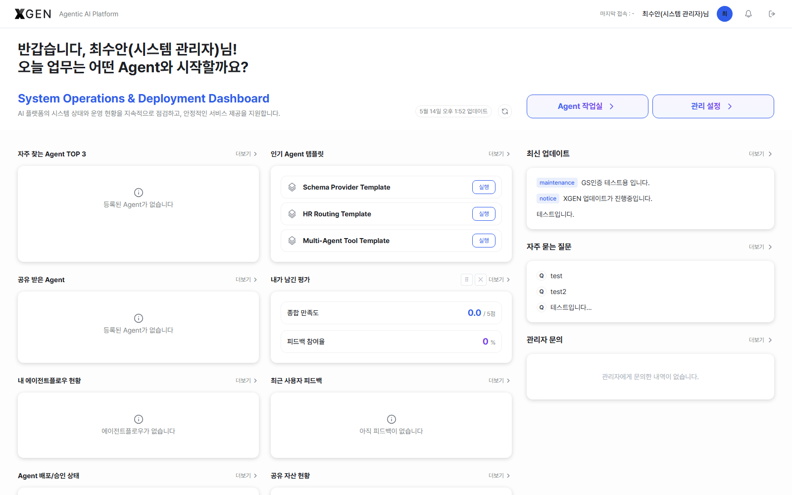
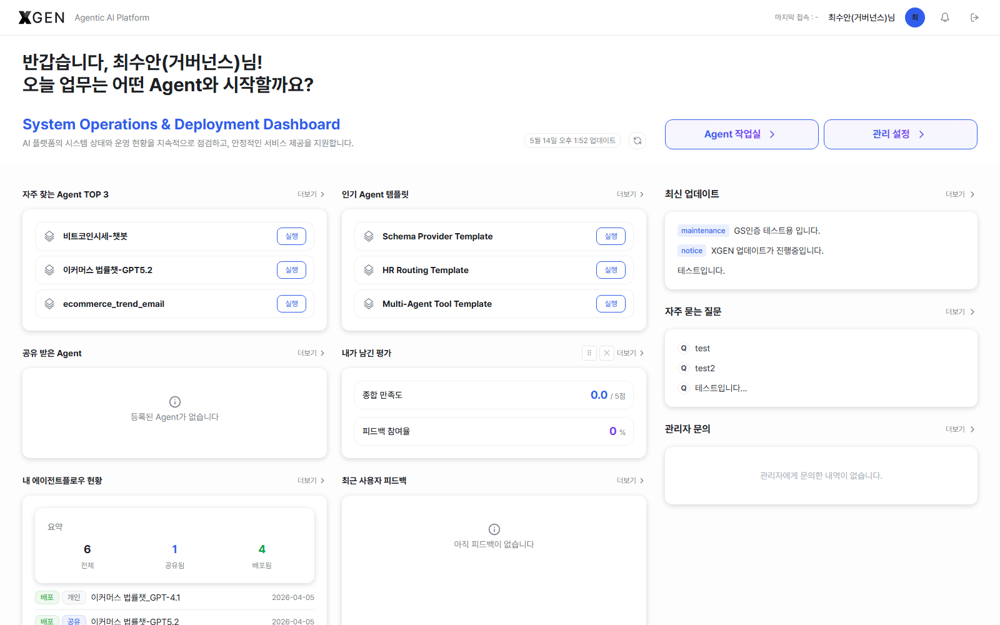

# Dashboard (Admin View)

The `/dashboard` screen you land on after login is shared by all users, but accounts with admin permissions see additional governance / operations widgets and have the **Admin Settings** quick-jump button enabled.

> Refer to [User Manual · Dashboard](../user/18-dashboard.md) first for layout fundamentals and widget customization. This chapter covers the **admin-only additions**, split into the **System Administrator view** and the **Governance Officer view**.

## Shared Across Both Admin Roles

### Admin Settings Button Enabled

The two quick-jump buttons at the top-right of the dashboard — **Agent Workspace** and **Admin Settings** — are simplified to those two only, and the **Admin Settings** button is enabled for any admin account.

| Button | Destination | Standard User / Agent Developer | Admin |
|---|---|---|---|
| Agent Workspace | `/main?view=agentflows` | Enabled | Enabled |
| Admin Settings | `/admin` | Disabled | **Enabled** (entry to all admin screens: users, roles, LLM, governance, etc.) |

> After entering `/admin`, use the left sidebar to navigate to AI Model Management, AI Governance, Users / Access Control, Environment, and other detailed areas.

### Welcome Message Subtitle

Both System Administrators and Governance Officers see the welcome subtitle **"System Operations & Deployment Dashboard"** with the helper text "Continuously monitors AI platform health and operational status, supporting reliable service delivery." (Standard Users and Agent Developers see "Agent 활용 Dashboard" instead — see [User Manual · Dashboard](../user/18-dashboard.md).)

### Right-Panel Interpretation Differs

The four items in the right fixed panel are the same as the user view, but **Recent Service Requests TOP 3** and **My Inquiries (1:1 Admin)** are interpreted as "items to handle" for admins.

## System Administrator View

The main screen for operators of solution infrastructure, users, authentication, and LLM connections.

### Operations Widgets

On top of the Standard User / Agent Developer widgets, **operations and deployment** widgets are added.

| Widget | Contents |
|---|---|
| Top 3 Frequent Agents / Popular Agent Templates / Shared With Me / My Feedback | (Shared) Agent-usage widgets |
| My Agentflow Status | Total / shared / deployed counts and recent items for your agentflows |
| Recent User Feedback | Recent feedback entries left by standard users |
| Agent Deployment / Approval Status | Per-stage counts of deployed and pending agents |
| Shared Assets | Tools, knowledge collections, etc. shared by you or the organization |

> Operations widgets require System Administrator permissions (`admin.system:*` family). When someone reports "I can't see the widget," check permission grants first.

### Operational Usage

1. **Daily system health check** — Once a day, inspect threshold-exceeding items in the widget directly below the welcome message. If alerts are missing, review [System Monitor](26-system-monitor.md) alert settings.
2. **Shortcut entries reduce friction** — Use the **Admin Settings** button to enter all admin screens (permission grants, LLM registration, etc.) in one step.
3. **Catch high-impact issues quickly** — Scan the right panel's **Latest Updates** (all-user notices) and **Recent Service Requests TOP 3** to surface user-impacting issues.
4. **Share a recommended widget layout** — When onboarding a new admin, recommend: in their account, **Reset** → arrange the recommended widget configuration → screenshot it into operations docs (widget settings are per-user; forced sync is not supported).

## Governance Officer View

The main screen for users responsible for **risk, control, and audit** of AI usage. Permissions are typically separated from the general system administrator, and governance-only widgets surface on the main screen.

### Governance-Only Widgets (requires `admin.governance:*`)

On top of the System Administrator operations widgets, the following governance-policy widgets are added.

| Widget | Contents |
|---|---|
| Risk Policy | Active status · grade ranges (critical/high/medium/low) · evaluation category and check-item counts |
| Forbidden-Word Policy | Total / enabled / disabled rule counts · top 5 rules |
| Agent Approval Queue | Agents waiting on governance review for exceeding the risk threshold |

These widgets only appear in the widget grid for accounts with `admin.governance:*`. Without the permission they are not even listed.

### Operational Usage

1. **Daily approval-queue triage** — Review new items in the main-screen **Agent Approval Queue** daily. Detailed review and approval happens in [AI Governance - Risk Review](29-governance-dashboard.md#ai-위험도-평가-및-심사).
2. **Verify policy reflection immediately after changes** — After editing a risk-grade or forbidden-word policy, confirm the dashboard **Risk Policy** / **Forbidden-Word Policy** widgets update instantly. If they do not, suspect a cache or permission-sync issue.
3. **Shortcut entries** — Click **Admin Settings** and pick **AI Governance** from the left sidebar to edit policies.

## Common Operational Issues

| Symptom | Cause / What to Check |
|---|---|
| Governance widgets are not visible | Confirm the account has `admin.governance:*` |
| **Risk Policy** widget shows "Inactive" | The policy itself is disabled. Use **AI Governance** to enable it |
| **Forbidden-Word Policy** widget shows 0 rules | New environment with no rules registered. Adding rules reflects automatically |
| Right-panel **Recent Service Requests** is empty | No user-side requests, or the admin lacks permissions for the relevant categories |
| New admin sees a different widget layout | Widget settings are per-user. Guide them to **Reset** to start from default |

## Related Chapters

- [User Manual · Dashboard](../user/18-dashboard.md) — layout fundamentals and widget customization (Standard User / Agent Developer views)
- [AI Governance](29-governance-dashboard.md) — risk review, inspection, audit, and control-policy menus
- [Roles & Permissions](22-role-permission.md) — how to grant permissions like `admin.governance:*`

## Inquiries

For dashboard permission / widget visibility questions, email <{{vars.support_email}}>.
