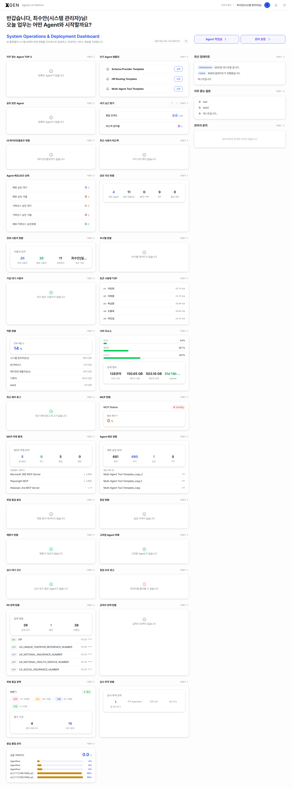
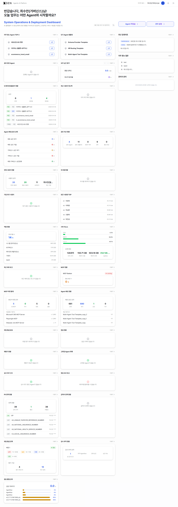

# 대시보드 (관리자 뷰)

로그인 직후 진입하는 `/dashboard` 화면은 모든 사용자에게 공통이지만, 관리자 권한이 있는 계정에는 거버넌스·운영 모니터링 위젯이 추가로 표시되고 **관리 설정** 단축 버튼이 활성화됩니다.

> 화면 구성·위젯 커스터마이징 기본 동작은 [사용자 매뉴얼 · 대시보드](../user/18-dashboard.md) 챕터를 먼저 확인해 주세요. 이 챕터는 그 위에 얹히는 **관리자 추가 사항**을 **시스템 관리자 뷰**와 **거버넌스 담당자 뷰** 두 역할로 나눠 다룹니다.

## 두 역할이 공통으로 갖는 관리자 추가 사항

### 관리 설정 버튼 활성화

대시보드 우상단 단축 버튼은 **Agent 작업실 / 관리 설정** 2개로 단순화되어 있으며, 관리자 권한 계정에서는 **관리 설정** 버튼이 활성화됩니다.

| 버튼 | 클릭 시 이동 | 일반 사용자 / Agent 개발자 | 관리자 |
|---|---|---|---|
| Agent 작업실 | `/main` → 자동으로 `?view=canvas-intro` (Agent 설계 인트로) | 일반 사용자는 본문이 비어 보일 수 있음 (권한 게이팅 — [사용자 매뉴얼 · 빠른 이동](../user/18-dashboard.md) 의 일반 사용자 경고 참고). Agent 개발자는 정상 인트로 노출 | 정상 인트로 노출 (Agent 제작 권한 보유) |
| 관리 설정 | `/admin` | 비활성 | **동작** (사용자·역할·권한·LLM·거버넌스 등 모든 관리 화면 진입) |

> `/admin` 진입 후 좌측 메뉴에서 AI 모델관리 · AI 거버넌스 · 사용자/접근제어 · 환경설정 등 세부 영역으로 이동합니다.

### 환영 메시지 부제목

시스템 관리자·거버넌스 담당자에게는 환영 메시지 부제목이 모두 **"System Operations & Deployment Dashboard"** 로 표시되며, 부제 아래에 "AI 플랫폼의 시스템 상태와 운영 현황을 지속적으로 점검하고, 안정적인 서비스 제공을 지원합니다." 안내 문구가 함께 노출됩니다. (일반 사용자·Agent 개발자는 "Agent 활용 Dashboard" 부제 — [사용자 매뉴얼 · 대시보드](../user/18-dashboard.md) 참고)

### 우측 패널 구성 및 관리자 화면 차이

우측 고정 패널은 일반 사용자 화면과 동일하게 아래 3개 영역으로 구성됩니다.

- 최신 업데이트
- 자주 묻는 질문(FAQ)
- 관리자 문의

다만 관리자 화면에서는 **관리자 문의** 패널의 의미가 일반 사용자와 다르게 동작합니다.

- 일반 사용자에게는 본인이 등록한 문의 이력을 조회하는 영역으로 사용되지만,
- 관리자에게는 사용자가 등록한 1:1 문의 중 응답이 필요한 항목을 확인하는 **운영 큐** 역할로 사용됩니다.

즉, 관리자는 해당 패널을 통해 처리 대기 문의를 빠르게 확인하고 바로 응대 화면으로 이동할 수 있습니다.

패널 구성 및 데이터 구조는 사용자 화면과 동일하며, 상세 항목 설명은 [사용자 매뉴얼 · 우측 고정 패널](../user/18-dashboard.md#right-panel) 챕터를 참고하세요.

## 시스템 관리자 뷰

솔루션 인프라·사용자·인증·LLM 연결을 **운영**하는 사용자의 메인 화면입니다.

### 운영 위젯

일반 사용자/Agent 개발자 위젯에 더해 **운영·배포 모니터링**용 위젯이 추가됩니다.

| 위젯 | 표시 내용 |
|---|---|
| 자주 찾는 Agent TOP 3 / 인기 Agent 템플릿 / 공유 받은 Agent / 내가 남긴 평가 | (공통) Agent 활용 위젯 |
| 내 에이전트플로우 현황 | 본인 소유 에이전트플로우의 전체·공유됨·배포됨 건수와 최근 항목 |
| 최근 사용자 피드백 | 일반 사용자가 남긴 평가 중 최근 항목 |
| Agent 배포/승인 상태 | 배포·승인 단계별 에이전트 건수 요약 |
| 공유 자산 현황 | 본인 또는 조직 차원에서 공유한 도구·지식 컬렉션 등 자산 |

> 운영 위젯은 시스템 관리자 권한(`admin.system:*` 류)이 있어야 위젯 목록에 노출됩니다. "왜 안 보이지?" 라는 문의가 들어오면 권한 부여 여부부터 확인하세요.

> 아래 이미지는 시스템 관리자 계정으로 본 `/dashboard` 의 **전체 스크롤** 화면입니다. 운영 위젯이 페이지 하단까지 길게 펼쳐지므로 전체 스크롤 캡처로 표시합니다.

### 운영 활용

1. **시스템 상태 일일 점검** — 매일 한 번 이상 환영 메시지 직하 위젯에서 임계치 초과 항목을 확인하고, 알림이 누락된 경우 [시스템 모니터](26-system-monitor.md) 알림 설정을 점검합니다.
2. **단축 진입으로 작업 빈도 단축** — 사용자 권한 부여·LLM 등록 등 모든 관리 화면 진입은 **관리 설정** 버튼으로 한 번에 처리합니다.
3. **사용자 영향 큰 이슈 빠른 인지** — 우측 패널의 **최신 업데이트**(전체 사용자 노출 공지)와 **관리자 문의** 패널의 신규 응대 대기 건수로 사용자 영향이 큰 사안을 점검합니다.
4. **위젯 그리드 표준안 공유** — 신규 관리자가 들어왔을 때 본인 계정에서 **초기화** → 권장 위젯 구성으로 재배치 → 화면 캡처를 운영 가이드 문서에 첨부하는 워크플로우를 권장합니다 (위젯 설정은 개인별로 저장되므로 강제 동기화는 불가).

## 거버넌스 담당자 뷰

AI 사용에 대한 **위험·통제·감사**를 책임지는 사용자의 메인 화면입니다. 일반 시스템 관리자와 권한이 분리된 상태에서, 거버넌스 전용 위젯이 메인에 노출됩니다.

### 거버넌스 전용 위젯 (권한 `admin.governance:*`)

시스템 관리자 뷰의 운영 위젯에 더해, 페이지 하단 영역에 다음 거버넌스 정책·평가 위젯이 추가로 노출됩니다.

| 위젯 | 표시 내용 |
|---|---|
| PII 정책 현황 | 등록된 PII 정책 전체 / 활성 / 비활성 개수와 상위 정책명 목록 (예: 39 / 1 / 38) |
| 금칙어 정책 | 등록된 금칙어 전체 / 활성 / 비활성 개수 |
| 위험 등급 | 위험 등급 정책 활성 여부와 등급(critical/high/medium/low) 범위 |
| 위험 평가 현황 | 평가 카테고리 수 / 체크 항목 수 (예: 대분류 4 / 항목 16) |
| 응답 품질 점수 | 운영 중인 에이전트의 응답 품질 평가 점수 분포 |

위 위젯들은 `admin.governance:*` 권한이 있을 때만 위젯 그리드에 나타납니다. 권한이 없으면 위젯 목록 자체에 노출되지 않습니다.

> 아래는 거버넌스 담당자 계정으로 본 `/dashboard` 의 **전체 스크롤** 이미지입니다. 위젯이 많아 한 뷰포트에 다 들어가지 않으므로 페이지를 전부 스크롤해 캡처한 결과입니다.

### 운영 활용

#### 승인 대기 Agent 점검

대시보드의 **승인 대기 Agent** 위젯을 통해 신규 등록 항목을 주기적으로 확인하는 것을 권장합니다.

상세 검토 및 승인 작업은 다음 메뉴에서 수행할 수 있습니다.

- AI 거버넌스
- [위험도 평가 및 심사](29-governance-dashboard.md#risk-review)

#### 정책 변경 후 반영 상태 확인

위험 등급 정책 또는 금칙어 정책을 수정한 경우, 대시보드 위젯의 정책 현황 정보가 정상 반영되는지 확인해야 합니다.

확인 항목:

- 위험 등급 정책 현황
- 금칙어 정책 현황

정책 변경 이후에도 수치 또는 상태가 갱신되지 않는 경우에는 캐시(Cache) 또는 권한 동기화 상태를 함께 점검하는 것을 권장합니다.

#### 정책 화면 빠른 이동

**관리 설정** 화면으로 이동한 뒤 좌측 사이드바의 **AI 거버넌스** 메뉴를 통해 정책 관리 화면으로 바로 진입할 수 있습니다.

## 관련 챕터

- [사용자 매뉴얼 · 대시보드](../user/18-dashboard.md) — 화면 구성과 위젯 커스터마이징 기본 (일반 사용자·Agent 개발자 뷰)
- [AI 거버넌스](29-governance-dashboard.md) — 위험도 평가·점검·감사·통제 정책 메뉴 상세
- [역할/권한 관리](22-role-permission.md) — `admin.governance:*` 등 권한 부여 방법

## 문의

대시보드 권한·위젯 노출 관련 문의는 Xgen 솔루션 관리자에게 문의해 주세요.
