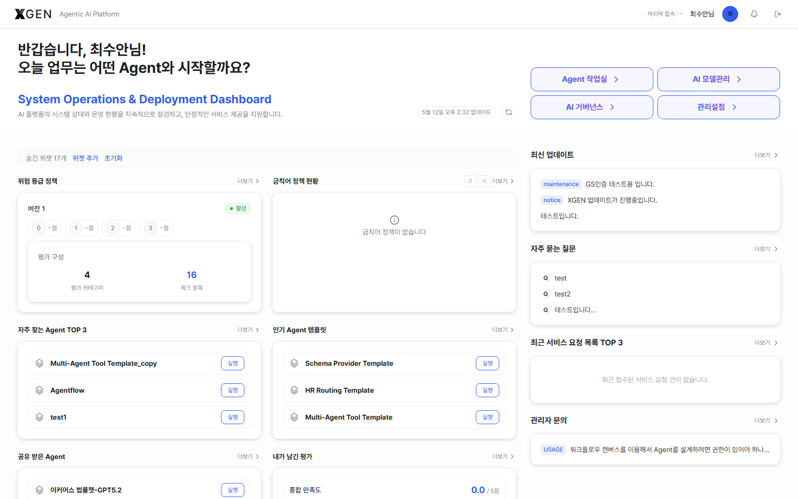

# 대시보드 (관리자 뷰)

로그인 직후 진입하는 `/dashboard` 화면은 모든 사용자에게 공통으로 노출되지만, 관리자 권한이 있는 계정에는 거버넌스·운영 모니터링 위젯이 추가로 표시되고 단축 버튼 4개가 모두 활성화됩니다.

> 일반 사용자 관점의 화면 구성·커스터마이징 동작은 [사용자 매뉴얼 · 대시보드](../user/18-dashboard.md) 챕터를 먼저 확인해 주세요. 이 챕터는 그 위에 얹히는 **관리자 추가 사항**과 **운영 활용 방안**을 다룹니다.

## 관리자에게 달라지는 부분

### 인사 카드 부제목

시스템 관리자(`system_admin` 역할)에게는 인사 카드 부제목이 **"System Operations & Deployment Dashboard"** 로 표시되며, 부제 아래에 "AI 플랫폼의 시스템 상태와 운영 현황을 지속적으로 점검하고, 안정적인 서비스 제공을 지원합니다." 안내 문구가 함께 노출됩니다.

### 단축 버튼 4개 모두 활성화

| 버튼 | 이동 위치 | 용도 |
|---|---|---|
| Agent 작업실 | `/main?view=agentflows` | 에이전트플로우 운영 (사용자와 동일) |
| AI 모델관리 | `/admin?view=admin-ml-model-control` | LLM·임베딩 모델 관리 |
| AI 거버넌스 | `/admin?view=admin-gov-risk-management` | 위험 등급·금칙어 정책 관리 |
| 관리설정 | `/admin?view=admin-role-management` | 사용자·역할·권한 |

### 관리자 전용 위젯 (권한 `admin.governance:*`)

| 위젯 | 표시 내용 |
|---|---|
| 위험 등급 정책 | 활성 여부 · 등급(critical/high/medium/low) 범위 · 평가 카테고리 수 · 체크 항목 수 |
| 금칙어 정책 현황 | 전체 규칙 수 · 활성/비활성 개수 · 상위 5개 규칙 |

위 두 위젯은 `admin.governance:*` 권한이 있을 때만 위젯 그리드에 나타납니다. 권한이 없으면 위젯 목록 자체에 노출되지 않습니다 — "왜 안 보이지?" 라는 문의가 들어오면 권한 부여 여부부터 확인하세요.

### 우측 패널의 의미 차이

우측 고정 패널 4개 항목은 사용자와 동일하나, **최근 서비스 요청 목록 TOP 3**·**내 문의(1:1 관리자 문의)** 두 패널은 관리자에게는 **응대 대상** 의미로 해석됩니다.

## 운영 활용

1. **정책 변경 직후 반영 상태 확인** — 위험 등급·금칙어 정책을 수정한 직후 대시보드의 **위험 등급 정책**·**금칙어 정책 현황** 위젯이 즉시 업데이트되는지 확인합니다. 수치가 안 바뀌면 캐시 또는 권한 동기화 이슈를 의심합니다.
2. **단축 진입으로 작업 빈도 단축** — 정책 편집은 **AI 거버넌스** 버튼, 사용자 권한 부여는 **관리설정** 버튼으로 바로 진입합니다. 매번 사이드바를 클릭해 들어가지 않아도 됩니다.
3. **사용자 영향 큰 이슈 빠른 인지** — 우측 패널의 **최신 업데이트**(전체 사용자 노출 공지)와 **최근 서비스 요청 목록 TOP 3**을 통해 사용자 영향이 큰 사안을 매일 한 번 이상 점검합니다.
4. **위젯 그리드 표준안 공유** — 신규 관리자가 들어왔을 때 본인 계정에서 **초기화** → 권장 위젯 구성으로 재배치 → 화면 캡처를 운영 가이드 문서에 첨부하는 워크플로우를 권장합니다 (위젯 설정은 개인별로 저장되므로 강제 동기화는 불가).
5. **권한별 위젯 검증** — 새 역할을 만든 직후 해당 역할로 로그인해 대시보드에 노출되는 위젯 목록을 직접 확인합니다 (역할/권한 부여 결과의 가시적 검증).

## 자주 발생하는 운영 이슈

| 증상 | 원인 / 점검 항목 |
|---|---|
| 거버넌스 위젯이 안 보임 | 본인 계정에 `admin.governance:*` 권한이 부여돼 있는지 확인 |
| **위험 등급 정책** 위젯이 "비활성" 으로 표시 | 정책 자체가 비활성 상태. **AI 거버넌스** 버튼으로 진입해 활성화 |
| **금칙어 정책 현황** 위젯에 규칙이 0개 | 신규 환경에 정책이 등록되지 않음. 정책 등록 후 자동 반영 |
| 우측 **최근 서비스 요청** 패널 비어 있음 | 사용자 측 요청이 없거나 본인이 해당 카테고리 응대 권한이 없는 경우 |
| 새 관리자가 위젯 구성을 다르게 본다 | 위젯 설정은 개인별 저장. **초기화**로 출고 상태부터 시작 안내 |

## 관련 챕터

- [사용자 매뉴얼 · 대시보드](../user/18-dashboard.md) — 화면 구성과 위젯 커스터마이징 기본
- [AI 거버넌스 대시보드](29-governance-dashboard.md) — 위험 등급·금칙어 정책 편집 화면 상세
- [역할/권한 관리](22-role-permission.md) — `admin.governance:*` 등 권한 부여 방법

## 문의

대시보드 권한·위젯 노출 관련 문의는 <{{vars.support_email}}> 로 연락해 주세요.
