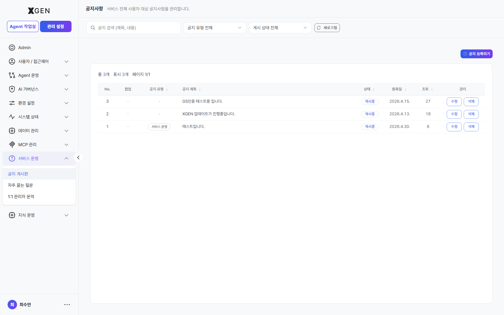
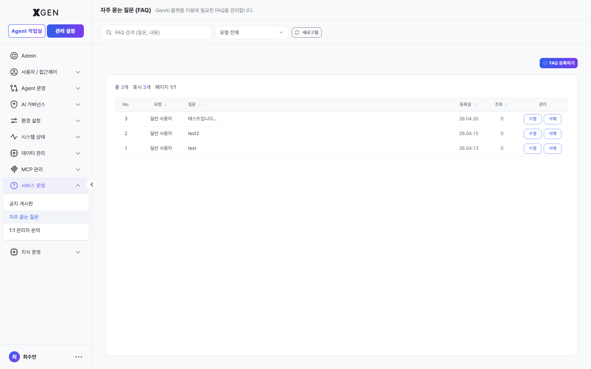
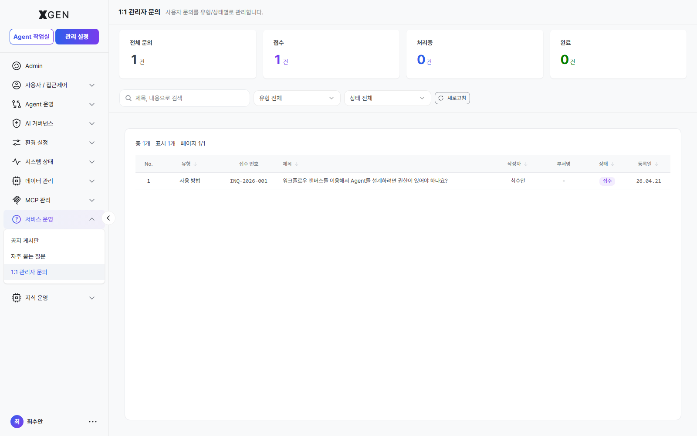

# 기술지원 응대

좌측 사이드바 하단의 **기술지원** 메뉴(공지 게시판 / 자주묻는 질문 / 1:1 관리자 문의)는 일반 사용자에게는 "묻는 창구"지만, 관리자에게는 **응대·게시 창구** 입니다. 이 챕터는 관리자가 이 세 영역을 운영하는 방법을 다룹니다.

> 화면 구성·필터·검색·CTA 같은 기본 사용법은 [사용자 매뉴얼 · 기술지원](../user/19-tech-support.md) 챕터를 참고해 주세요. 이 챕터는 그 위에서 **등록·응대·상태 전이** 등 관리자 권한이 있는 동작에 집중합니다.

## 공지 게시판 (게시)

시스템 공지를 사용자에게 등록·노출하는 영역입니다.

### 권한 및 동작

공지 등록, 수정, 삭제 기능은 `main.support-notice:manage` 이상의 권한이 필요합니다.

공지 분류(Category)는 사용자 화면의 필터와 직접 연결됩니다.

지원 분류 예시:

- 전체
- notice
- update
- maintenance
- event

분류가 잘못 지정된 경우 사용자가 원하는 공지를 찾지 못할 수 있으므로 주의해야 합니다.

고정(Pinned) 옵션을 활성화하면 해당 공지가 사용자 목록 최상단에 우선 노출됩니다.

신규 공지는 대시보드의 **최신 업데이트** 위젯에 자동 반영됩니다.

- 전체 사용자 대상 노출
- 최근 등록 기준 최대 3건 표시

### 공지 운영 권장 사항

#### 점검 공지 등록 시점

시스템 점검 공지는 점검 시작 최소 24시간 전에 등록하는 것을 권장합니다.

권장 작성 내용:

- 점검 시간
- 영향 범위
- 예상 영향 기능

권장 분류:

- `maintenance`

#### 사용자 영향도가 큰 변경은 고정 권장

다음과 같이 사용자 영향도가 높은 변경 사항은 고정 공지 사용을 권장합니다.

예시:

- 서비스 중단
- 세션 만료 정책 변경
- 접근 정책 변경
- 로그인 정책 변경

#### 후속 업데이트는 기존 공지 수정 권장

동일한 이슈 또는 점검에 대한 후속 안내는 새로운 공지를 반복 등록하기보다 기존 공지를 수정하여 운영하는 것을 권장합니다.

이를 통해 사용자 알림 피로도를 줄일 수 있습니다.

#### 분류(Category) 운영 기준 통일

공지 분류는 조직 내에서 동일한 기준으로 사용하는 것을 권장합니다.

예시:

- `update` → 제품/기능 업데이트
- `event` → 캠페인 및 이벤트성 안내
- `notice` → 일반 운영 공지

#### 제목과 요약은 사용자 관점으로 작성

공지 제목과 요약은 대시보드 위젯에서 가장 먼저 노출되는 정보입니다. 기능명 중심보다 사용자 영향 중심으로 작성하는 것을 권장합니다.

예시:

- 로그인 정책이 변경되었습니다
- Agent 실행 점검이 예정되어 있습니다
- 파일 업로드 기능이 개선되었습니다

## 자주묻는 질문 (게시)

반복적으로 접수되는 1:1 문의를 FAQ로 등록하여, 운영자의 응대 부담을 줄이고 사용자의 자가 해결(Self-service)을 지원하는 영역입니다.

### FAQ 등록 및 운영 권장 사항

#### 반복 문의는 FAQ로 전환

동일하거나 유사한 유형의 1:1 문의가 반복적으로 접수되는 경우 FAQ 등록을 권장합니다.

권장 기준:

- 동일 카테고리
- 유사 증상 또는 사용 문의
- 3건 이상 반복 접수

이를 통해 운영자의 응대 부담을 줄이고 사용자 자가 해결(Self-service)을 강화할 수 있습니다.

#### 답변은 절차 중심으로 작성

FAQ 답변은 사용자가 그대로 따라할 수 있도록 절차형으로 작성하는 것을 권장합니다.

예시:

- "좌측 사이드바에서 '관리 설정'을 선택합니다."
- "'문의하기' 버튼을 클릭한 뒤 내용을 입력합니다."

추상적인 설명보다 실제 사용 흐름 중심으로 작성하는 것이 효과적입니다.

#### 메뉴명 및 버튼명은 실제 UI 기준 사용

메뉴명, 버튼명, 입력 항목명은 실제 화면에 표시되는 문구와 동일하게 작성해야 합니다.

예시:

- "문의하기"
- "저장"
- "Agent 작업실"

UI 문구와 다르게 작성할 경우 사용자 혼란이 발생할 수 있습니다.

#### 신규 FAQ는 초기 공유 권장

신규 등록된 FAQ는 초기 조회수가 낮은 경우 사용자 노출 빈도가 낮을 수 있습니다.

필요한 경우 다음 채널을 통해 FAQ 링크를 함께 공유하는 것을 권장합니다.

- 사내 협업 채널
- 운영 공지
- 사용자 안내 메시지

#### 정기 점검 권장

FAQ 내용은 분기 또는 반기 단위로 정기 점검하는 것을 권장합니다.

점검 항목:

- 화면 캡처 최신 여부
- 메뉴 경로 변경 여부
- 정책 변경 반영 여부
- 사용 빈도 감소 여부

오래되었거나 사용 빈도가 낮은 FAQ는 보관 또는 정리하여 최신 상태를 유지하는 것이 좋습니다.

## 1:1 관리자 문의 (응대)

사용자가 등록한 문의를 접수하고 처리하는 운영 지원 영역입니다.

문의 상태 관리, 답변 작성, 처리 이력 확인 등을 수행할 수 있으며, 사용자와 운영자 간의 주요 지원 채널로 사용됩니다.

## 운영 지표 권장

운영 품질을 정기적으로 점검하려면 다음 지표를 주간/월간으로 추적할 것을 권장합니다.

- **1차 응답 시간** — PENDING → PROCESSING 평균 경과 시간
- **응답 완료 시간** — PENDING → ANSWERED 평균 경과 시간
- **카테고리별 유입량** — BUG/FEATURE 비중이 늘면 제품 품질·로드맵 신호
- **FAQ 승격률** — 신규 1:1 문의 중 기존 FAQ로 해결 가능했던 비율 (FAQ 보강 우선순위 신호)
- **공지 도달률** — 점검 공지 등록 후 사용자 측 영향 문의가 줄어드는지

## 관련 챕터

- [사용자 매뉴얼 · 기술지원](../user/19-tech-support.md) — 화면 구성·필터·CTA 등 기본 사용법
- [역할/권한 관리](22-role-permission.md) — `main.support-*:manage` 등 권한 부여 방법

## 문의

기술지원 응대 운영 정책 자체에 대한 문의는 Xgen 솔루션 관리자에게 문의해 주세요.
