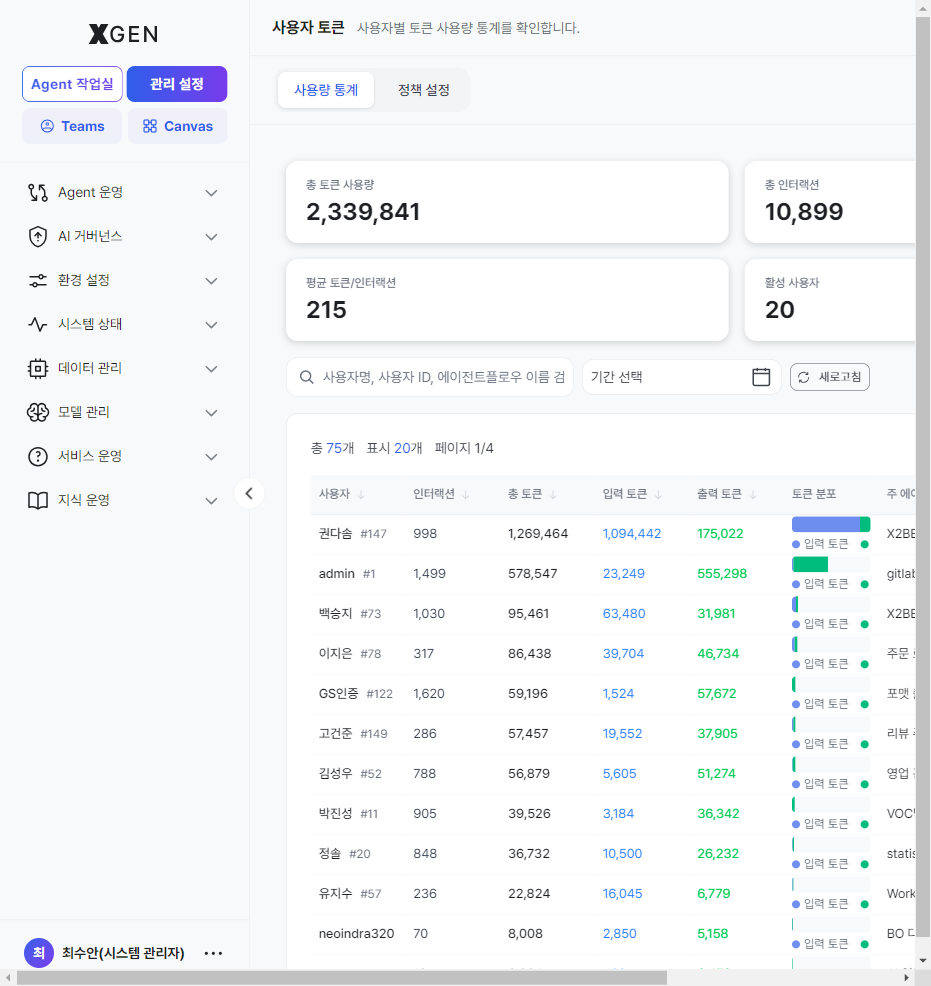
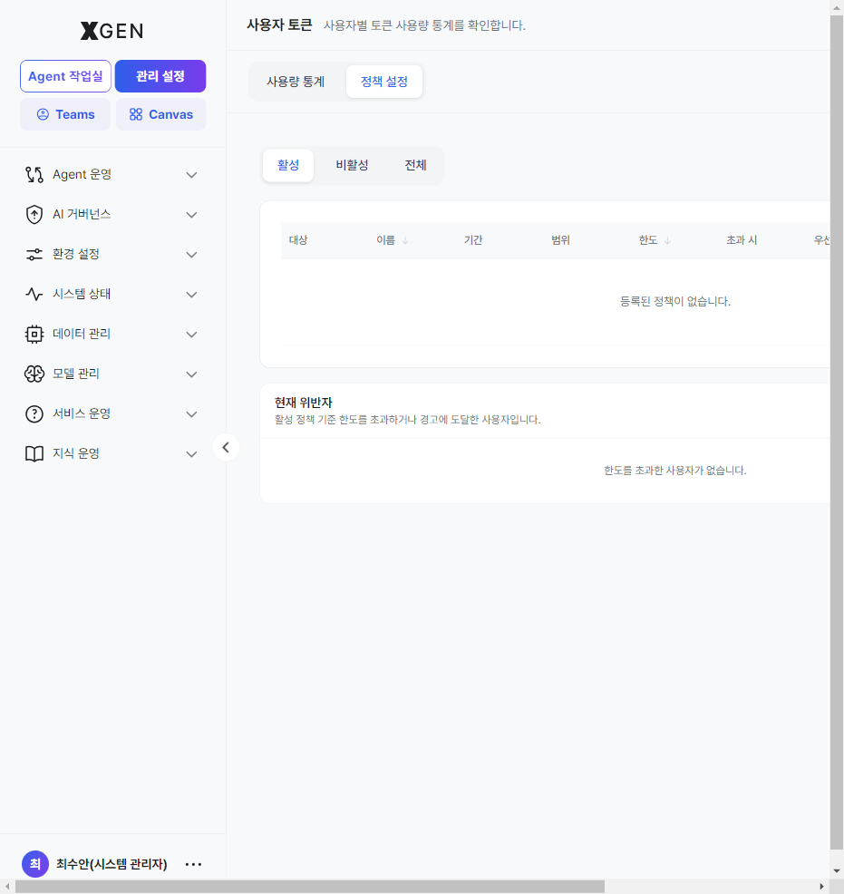
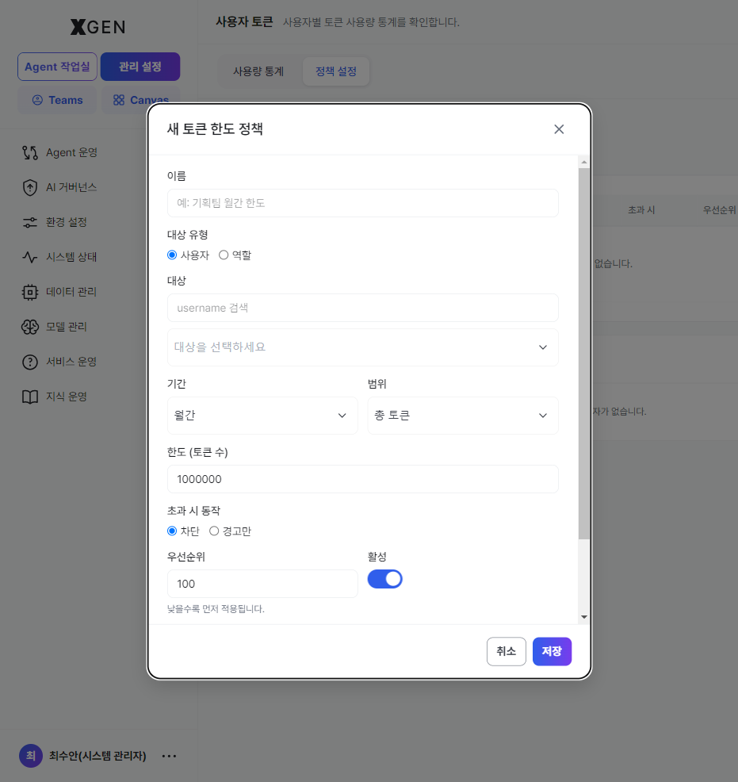

# Agent Operations

<!-- require_view_start: agent-ops-9-menus -->
This chapter covers the **administrative oversight** of all agents in the organization. The **Admin Center → Agent Operations** sidebar group exposes 9 menus covered here.
<!-- require_view_end -->
<!-- require_view_start: agent-ops-8-menus -->
This chapter covers the **administrative oversight** of all agents in the organization. The **Admin Center → Agent Operations** sidebar group exposes 8 menus covered here.
<!-- require_view_end -->

> For the *builder* perspective on creating and running agents, see the user-side [Creating an Agent](../user/12-agentflow-create.md) and [Agent Operations](../user/13-agentflow-operations.md) chapters. This chapter is the **admin-side** view of the organization's entire agent fleet.

## Accessing the Screen

<!-- require_view_start: agent-ops-9-menus -->
Expand **Admin Center → Agent Operations** in the left sidebar to reveal 9 submenus.
<!-- require_view_end -->
<!-- require_view_start: agent-ops-8-menus -->
Expand **Admin Center → Agent Operations** in the left sidebar to reveal 8 submenus.
<!-- require_view_end -->

 <!-- require_view: agent-ops-9-menus -->
 <!-- require_view: agent-ops-8-menus -->

## Menu Structure

| Menu | View ID | Purpose |
|---|---|---|
| **Agent Management** | `admin-agentflow-management` | Organization-wide agentflow card grid; filter by status / owner; search |
| **Chat Monitoring** | `admin-chat-monitoring` | Live and historical chat-session tracing — response and tool-call traces |
| **User Tokens** | `admin-user-token-dashboard` | Token-consumption dashboard by user / period, cost analysis | <!-- require_view: admin-user-token-dashboard -->
| **Node Management** | `admin-node-management` | Manage reusable nodes available across agentflows — see [Agent Node List](../user/12a-node-list.md) |
| **Prompt Templates** | `admin-prompt-store` | Organization-shared prompt templates and their version history |
| **User Feedback** | `admin-feedback-monitoring` | User-submitted star ratings / issue categories / comments (hallucination, policy violation, data error, response failure) |
| **Response Quality Evaluation** | `admin-agentflow-tester` | Auto-score agent responses against a test dataset |
| **Agent Retention Analysis** | `admin-agent-retention` | Time-series retention curves and active-user trends per agent | <!-- require_view: admin-agent-retention -->
| **Task Planning** | `admin-agent-dev-plan` | Register and triage proposed new agents, manage development priority | <!-- require_view: admin-agent-dev-plan -->

## Key Screens

<!-- require_view_start: gov-monitoring -->
### Agent Management — Deployment Approval (System Administrator, first approval) { #agent-mgmt-deploy-approval }

This screen is the System Administrator's surface for the **first** of two approval stages that gate whether an agent reaches end users. When an Agent Developer sends a **deployment request** from their workspace, it lands here for the System Administrator to approve or reject before it moves on to the governance reviewer.

!!! info "Dual approval — Deployment + Governance"
    A requested agentflow becomes a service for end users only after **both** of the following approvals pass.

    | Stage | Reviewer | Screen | Effect on data |
    |---|---|---|---|
    | 0. Deployment request | Agent Developer (workspace) | Agent Operations → "Request deployment" | `inquire_deploy: true` |
    | **1. Deployment approval** | **System Administrator** | This screen (Agent Management) | `is_accepted: true`, `is_deployed: true` |
    | **2. Governance approval** | **Governance Officer** | [AI Governance → Agentflow Approval](29-governance-dashboard.md#agent-approval) | `is_governance_accepted: true` |
    | ✅ Servable | — | Visible to end users only after stages 1 and 2 both pass | — |

    Stages 1 and 2 are **independent** — both must pass for the agent to appear in production. Items stuck at a single stage are surfaced on the dashboard *Agent deployment/approval status* widget under the **Deployment-pending / Governance-pending** counters.
<!-- require_view_end -->
<!-- require_view_start: no-governance -->
### Agent Management — Deployment Approval (System Administrator approval) { #agent-mgmt-deploy-approval }

This screen is the System Administrator's surface for approving organization-wide agentflows. When an Agent Developer sends a **deployment request** from their workspace, the System Administrator approves it here and the agent is deployed to production.

!!! info "Deployment approval — System Administrator approval"
    A requested agentflow becomes a service for end users only after it passes the **System Administrator's deployment approval**.

    | Stage | Reviewer | Screen | Effect on data |
    |---|---|---|---|
    | 0. Deployment request | Agent Developer (workspace) | Agent Operations → "Request deployment" | `inquire_deploy: true` |
    | **1. Deployment approval** | **System Administrator** | This screen (Agent Management) | `is_accepted: true`, `is_deployed: true` |
    | ✅ Servable | — | Visible to end users once deployment approval is complete | — |

    Once deployment approval is complete, the agent appears in production. Pending approvals are surfaced on the dashboard *Agent deployment/approval status* widget under the **Deployment-pending** counter.
<!-- require_view_end -->

#### Approving a deployment request

The procedure below moves you from *entering the card grid* → *identifying the pending card* → *handling the dropdown action* — all in this one screen.

1. **Enter the screen** — Switch to **Admin Center** mode via the top-left mode switch, then choose **Agent Operations → Agent Management** (view ID `admin-agentflow-management`) in the left sidebar. A card grid loads with **All / Active / Inactive** filter tabs and a search field at the top.

2. **Spot pending cards** — Look for cards carrying the **Deployment pending** (warning-tone) badge. Each card shows the author (`username`), department, last-modified date, and node count in its metadata. Narrow by typing an author name in the search box.

    | Badge color | Meaning |
    |---|---|
    | Gray (`secondary`) — Personal | Solo work — not a deploy request |
    | Yellow (`warning`) — **Deployment pending** | `inquire_deploy: true`. **Items to handle on this screen** |
    | Green (`success`) — Deployed | Already passed deployment approval; advancing through or past governance | <!-- require_view: gov-monitoring -->
    | Green (`success`) — Deployed | Deployment approved; live in production | <!-- require_view: no-governance -->
    | Gray — Not deployed | Never requested, or reverted after rejection |

3. **Inspect the detail** — Click a card to drop into the agent's detail view. Review the node layout, execution logs, and test outcomes. If you need more context before deciding, request it from the author. Use the **← Back** button at the top-left to return to the grid.

4. **Run the dropdown action** — Expand the **⋯** (More) menu on the right of the pending card. Two actions appear *only* while `inquire_deploy === true`:

    | Action | Backend call | Result |
    |---|---|---|
    | **Approve** | `updateAgentflowAdmin({ enable_deploy: true, inquire_deploy: false, is_accepted })` | Toast *"`<name>` deployment approved."* → card badge updates to *Deployed*. Automatically forwarded to the governance queue | <!-- require_view: gov-monitoring -->
    | **Approve** | `updateAgentflowAdmin({ enable_deploy: true, inquire_deploy: false, is_accepted })` | Toast *"`<name>` deployment approved."* → card badge updates to *Deployed*. Live in production | <!-- require_view: no-governance -->
    | **Reject** | `updateAgentflowAdmin({ enable_deploy: false, inquire_deploy: false, is_accepted })` | Toast *"`<name>` deployment rejected."* → card badge reverts to *Not deployed*. Convey the reason to the author through a separate channel |

5. **Verify the outcome** — The grid refreshes automatically after the action and the badge updates accordingly. If the same card reappears as *Deployment pending*, the author has resubmitted after a fix — repeat from step 2.

<!-- require_view_start: gov-monitoring -->
!!! warning "Approval here ≠ user visibility yet"
    **Approve** on this screen does **not** publish the agent to end users — it must still pass [AI Governance → Agentflow Approval](29-governance-dashboard.md#agent-approval). When you brief the author, say "deployment approved, governance review pending" so the two stages are not confused.
<!-- require_view_end -->

#### Kill switch while in service — Approval-status toggle

Open the card's **Settings** modal to reveal the **Approval Status** toggle. Switching it to *Disabled* immediately stops the agentflow from executing even after the deployment was approved — it is a *kill switch* for incidents in production. Combined with the **Deploy** toggle (public/private) in the same modal, you can stage a partial rollback rather than a hard removal.

#### Reading status badges

| Badge | Internal state | Meaning |
|---|---|---|
| Active | `has_startnode && has_endnode && node_count ≥ 3 && is_accepted !== false` | Runs normally |
| Inactive | Any of the above conditions failed | Node layout incomplete, or Approval Status is off |
| Deployment pending | `inquire_deploy: true` | First-stage approval pending — handled on this screen |
| Deployed | `is_deployed: true` | Deployment approval passed. Awaits governance approval before becoming visible to end users | <!-- require_view: gov-monitoring -->
| Deployed | `is_deployed: true` | Deployment approval passed. Live to users | <!-- require_view: no-governance -->
| Not deployed | `is_deployed: false && !inquire_deploy` | Never requested, or reverted after rejection |

### User Feedback { #user-feedback }

Top summary cards: total feedback count, average star rating, good-answer rate (no-issue ratio), hallucination count, policy violation count, data error count, response failure count. Use the CSV export from this screen as the source for governance reports. <!-- require_view: gov-monitoring -->
Top summary cards: total feedback count, average star rating, good-answer rate (no-issue ratio), hallucination count, policy violation count, data error count, response failure count. Use the CSV export from this screen as the source for operational quality reports. <!-- require_view: no-governance -->

### Chat Monitoring { #chat-monitoring }

A per-conversation trace view showing which nodes an agent traversed and the result of each tool call. The first stop when investigating or reproducing a response-quality issue.

<!-- require_view_start: admin-user-token-dashboard -->
### User Tokens { #user-token }

A screen for monitoring token consumption per user and for setting token-usage quota policies per user or per role. Select **Agent Operations → User Tokens** in the left sidebar (view ID `admin-user-token-dashboard`). Two tabs appear at the top of the screen — **Usage Statistics / Policy Settings**.

#### Usage Statistics { #user-token-usage }

A tab for reviewing each user's token consumption at a glance.

There are four summary cards at the top.

| Card | Meaning |
|---|---|
| **Total token usage** | Total tokens consumed by all users over the selected period |
| **Total interactions** | Total count of conversations / executions |
| **Avg tokens / interaction** | Average tokens consumed per interaction |
| **Active users** | Number of users who used tokens in the period |

Below the cards is a per-user detail table. Use **search** (username, ID, agentflow name), **date range**, and **refresh** at the top to scope the view.

| Column | Description |
|---|---|
| **User** | Username and internal ID (`#number`) |
| **Interactions** | Conversation / execution count for the user |
| **Total tokens** | Sum of input + output tokens |
| **Input / Output tokens** | Tokens for the prompt (input) / response (output) |
| **Token distribution** | A bar visualizing the input/output ratio |
| **Main agentflow** | The agentflow the user used the most |
| **Last activity** | Time of the last token usage |
| **Actions** | **View more** — opens a modal with that user's *per-agentflow usage* |

#### Policy Settings { #user-token-policy }

A tab for defining token-usage quotas per user or per role and specifying what happens when a quota is exceeded.

At the top are **Active / Inactive / All** filter tabs plus **Refresh** and **+ New Policy** buttons. The policy list table has these columns.

| Column | Description |
|---|---|
| **Target** | Who the policy applies to — a *user* or a *role*, and its name |
| **Name** | A name identifying the policy (e.g. *Standard-user agent usage limit*) |
| **Period** | Aggregation cycle — **Daily / Weekly / Monthly** |
| **Scope** | Token type the limit applies to — **Total / Input / Output / Tool** |
| **Limit** | The token cap for that period and scope |
| **On exceed** | Action when the limit is reached — **Block** (red) or **Warn only** (amber) |
| **Priority** | Order applied when multiple policies overlap — *lower value applies first* |
| **State** | Active / Inactive |
| **Actions** | **Edit** / **Deactivate** |

The **Current Violators** panel at the bottom lists users who, under the active policies, have exceeded a limit or reached a warning. Each entry shows which policy (user/role) was matched along with `used / limit`.

##### Creating a new policy

Click **+ New Policy** to open the *New Token Limit Policy* modal.

The input fields are:

1. **Name** — a name to identify the policy (e.g. *Planning team monthly limit*)
2. **Target type** — choose **User** or **Role**
3. **Target** — select the user (searchable) or role for the chosen type
4. **Period** — Daily / Weekly / Monthly
5. **Scope** — Total / Input / Output / Tool
6. **Limit (token count)** — the cap for that period and scope
7. **On-exceed action** — **Block** (blocks usage once the limit is reached) or **Warn only** (no block; only listed under violators)
8. **Priority** — lower value applies first
9. **Active** — a toggle to apply the policy immediately

Click **Save**, and the policy appears in the list right away.

!!! note "When a user limit and a role limit both exist — control is their *intersection*"
    When a user has both a **token policy assigned directly to them** and a **token policy assigned to a role they belong to**, both policies apply **simultaneously**. Usage is counted against *all* matching policies (user and role), and the user must satisfy **both limits** — so the *stricter (smaller) limit* becomes the effective cap.

    For example, if a user has a *user limit of 100,000 (daily)* and a *role limit of 200,000 (daily)*, the policy triggers the moment usage reaches **100,000 tokens** — the intersection of the two. When both limits are reached at once, the *on-exceed action* of the higher-**priority** policy (lower value first) is enforced, while the other policy still tracks the user in the violators list.
<!-- require_view_end -->

<!-- require_view_start: admin-agent-dev-plan -->
### Task Planning { #task-planning }

Register and rank candidate new agents the organization wants to build. Collects user requests, planner suggestions, and operational data in one place.

<!-- require_view_end -->

<!-- require_view_start: gs-cert-node-only -->
## Node Management { #node-management-screen }

A system administrator can browse and search the catalog of nodes available in agentflows from the **Admin Center → Agent Operations → Node Management** screen (view ID `admin-node-management`). The page header reads "Node Management — Manage and explore agentflow nodes." For the full node list and I/O specs, see the [Agent Node List](../user/12a-node-list.md) chapter.

| Area | Content |
|---|---|
| Top controls | **Table** / **Tree** view toggle; search box (partial match against category, function, node name, and tag) |
| Body | Node catalog rendered as a table or a tree depending on the selected view |

### Browse with the Tree View

1. Switch the top toggle to **Tree**
2. Expand a category in the tree on the left
3. Click an item — the right panel shows node details (I/O spec, tags, description)

### Browse with the Table View

1. Switch the top toggle to **Table**
2. Sort and filter columns to compare nodes side-by-side
3. Click a row — the right panel shows the same detail view

### Search

Typing in the top search box returns partial-match results instantly:

- **Category** — e.g., `Agent`, `Tool`
- **Function** — e.g., `search`, `invoke`
- **Node name** — e.g., `Document Loader`
- **Tag** — labels attached to nodes
<!-- require_view_end -->

## Operational Recommendations

<!-- require_view_start: gov-monitoring -->
### Monitor the dual-approval backlog

When the *Agent deployment/approval status* widget on the dashboard shows the **Deployment-pending** or **Governance-pending** counters drifting up, one of the two stages is the bottleneck. Both reviewers (System Administrator and Governance Officer) should sweep their queues at least weekly.

### Deployment approval and user exposure are separate stages

Approving the deployment on this screen does **not** make the agent visible to end users — that happens only after governance approval. Communicate this precisely to authors as "deployment approved, governance review pending."
<!-- require_view_end -->
<!-- require_view_start: no-governance -->
### Monitor deployment-approval backlog

When the *Agent deployment/approval status* widget on the dashboard shows the **Deployment-pending** counter drifting up, the approval stage is the bottleneck. The System Administrator should review the approval backlog periodically.
<!-- require_view_end -->

- **Weekly user-feedback review** — When hallucination / policy-violation counts exceed a threshold for the week, immediately suspend the offending agent for inspection.
- **Token-consumption alerts** — Watch the User Tokens dashboard for anomalous spikes (e.g., a user 10× their daily average) and share with the security team. <!-- require_view: admin-user-token-dashboard -->
- **Pin prompt-template versions** — Agents that are live in production should reference pinned template versions. Unannounced template edits affect every consumer.
- **Periodic quality runs** — Refresh the evaluation dataset quarterly and re-run Response Quality Evaluation to catch regressions.
- **Hide internal-only agents** — Toggle private flags so internal agents do not appear in user-side search; they remain visible from this admin screen.

## Related Chapters

- [Creating an Agent](../user/12-agentflow-create.md) — designer perspective
- [Agent Operations (user-side)](../user/13-agentflow-operations.md) — designer perspective on running and testing
- [AI Governance](29-governance-dashboard.md) — risk review and approval workflow for governance officers <!-- require_view: gov-monitoring -->

## Contact

For questions on Agent Operations screens, please contact the Xgen Solution Administrator.
