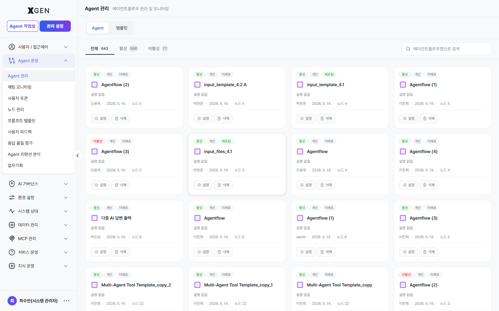
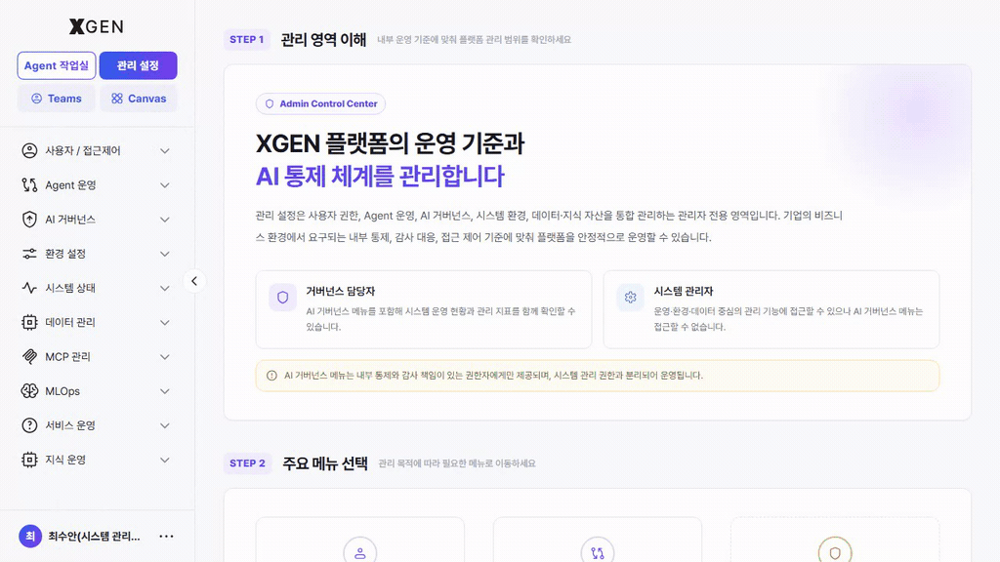
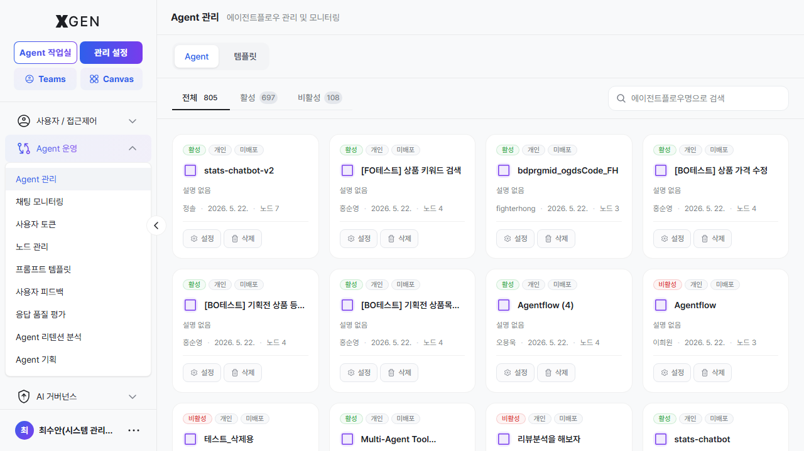
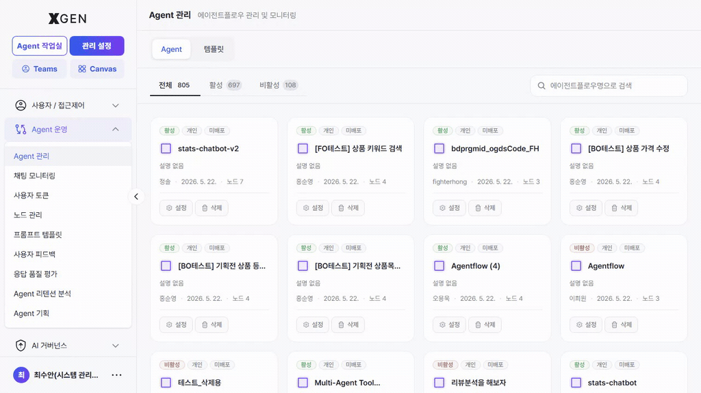
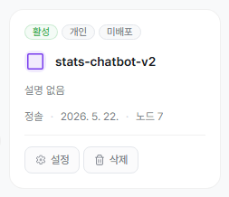
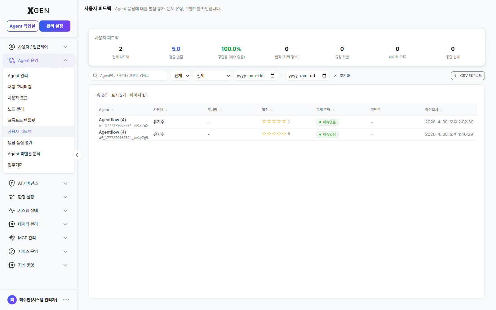
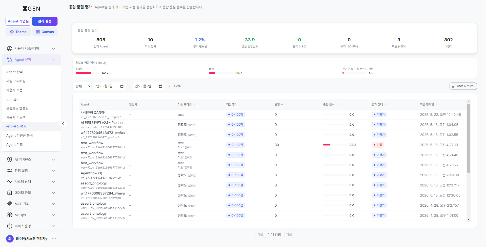

# Agent 운영

<!-- require_view_start: agent-ops-9-menus -->
본 챕터는 관리자가 조직 전체의 에이전트 자산을 **운영·감독·평가**하는 기능을 다룹니다. 좌측 사이드바 **관리 설정 → Agent 운영** 그룹 9개 메뉴가 본 챕터 범위입니다.
<!-- require_view_end -->
<!-- require_view_start: agent-ops-8-menus -->
본 챕터는 관리자가 조직 전체의 에이전트 자산을 **운영·감독·평가**하는 기능을 다룹니다. 좌측 사이드바 **관리 설정 → Agent 운영** 그룹 8개 메뉴가 본 챕터 범위입니다.
<!-- require_view_end -->

> 일반 사용자(또는 Agent 개발자) 관점의 에이전트 만들기·실행은 [사용자 매뉴얼](../user/) 의 [에이전트 만들기](../user/12-agentflow-create.md), [에이전트 운영](../user/13-agentflow-operations.md) 챕터를 참고하세요. 본 챕터는 **관리자 시야**에서 조직 전체 에이전트를 보는 화면입니다.

## 화면 진입

<!-- require_view_start: agent-ops-9-menus -->
좌측 메뉴 **관리 설정 → Agent 운영** 을 펼치면 9개의 하위 메뉴가 노출됩니다.
<!-- require_view_end -->
<!-- require_view_start: agent-ops-8-menus -->
좌측 메뉴 **관리 설정 → Agent 운영** 을 펼치면 8개의 하위 메뉴가 노출됩니다.
<!-- require_view_end -->

 <!-- require_view: agent-ops-9-menus -->
 <!-- require_view: agent-ops-8-menus -->

## 메뉴 구성

| 메뉴 | View ID | 용도 |
|---|---|---|
| **Agent 관리** | `admin-agentflow-management` | 조직 전체 에이전트플로우 카드 목록. 상태/소유자별 필터, 검색 |
| **채팅 모니터링** | `admin-chat-monitoring` | 실시간/이력 채팅 세션 추적, 응답·도구 호출 트레이스 확인 |
| **사용자 토큰** | `admin-user-token-dashboard` | 사용자·기간별 토큰 소비량 대시보드, 비용 분석 | <!-- require_view: admin-user-token-dashboard -->
| **노드 관리** | `admin-node-management` | 에이전트플로우에서 재사용되는 노드 라이브러리 관리 — 상세는 [노드 목록](32a-node-list.md) |
| **프롬프트 템플릿** | `admin-prompt-store` | 조직 공유 프롬프트 템플릿 등록·버전 관리 |
| **사용자 피드백** | `admin-feedback-monitoring` | 사용자가 남긴 응답 별점·문제 유형·코멘트 모음 (환각·규정 위반·데이터 오류·응답 실패 분류) |
| **응답 품질 평가** | `admin-agentflow-tester` | 테스트 데이터셋 기준 에이전트 응답 품질 자동 평가 |
| **Agent 리텐션 분석** | `admin-agent-retention` | 시간대별 에이전트 사용 유지율, 활성 사용자 추이 | <!-- require_view: admin-agent-retention -->
| **업무기획** | `admin-agent-dev-plan` | 신규 에이전트 기획안 등록·검토, 개발 우선순위 관리 | <!-- require_view: admin-agent-dev-plan -->

## 주요 화면

### Agent 관리 — 배포 승인 (시스템 관리자 1차 승인) { #agent-mgmt-deploy-approval }

조직 전체 에이전트플로우의 운영·승인 권한을 담당하는 화면입니다. Agent 개발자가 작업실에서 **배포 요청** 한 에이전트는 이 화면에서 시스템 관리자가 1차로 승인해야 다음 단계(거버넌스 심사)로 넘어갑니다.

!!! info "이중 승인 — 배포 승인 + 거버넌스 승인"
    배포 요청된 에이전트가 사용자에게 **서비스되려면 두 단계 승인을 모두 통과**해야 합니다.

    | 단계 | 담당 | 화면 | 통과 결과 |
    |---|---|---|---|
    | 0. 배포 요청 | Agent 개발자 (작업실) | 에이전트 운영 화면에서 "배포 요청" | `inquire_deploy: true` |
    | **1. 배포 승인** | **시스템 관리자** | 본 화면 (Agent 관리) | `is_accepted: true`, `is_deployed: true` |
    | **2. 거버넌스 승인** | **거버넌스 담당자** | [AI 거버넌스 → 에이전트플로우 승인](29-governance-dashboard.md#agent-approval) | `is_governance_accepted: true` | <!-- require_view: gov-monitoring -->
    | ✅ 서비스 가능 | — | 1·2 모두 통과한 시점부터 사용자에게 노출 | — |

    1·2 단계는 **독립적**이며 둘 다 통과해야만 운영 환경에 노출됩니다. 한쪽만 통과한 상태는 대시보드 **Agent 배포/승인 상태** 위젯의 *배포 승인 대기 / 거버넌스 승인 대기* 카운트에 집계되어 모니터링됩니다.

#### 배포 승인 절차

다음 절차는 *카드 그리드 화면 진입 → 대기 카드 식별 → dropdown 액션 처리* 순서입니다. 모든 단계가 본 화면 하나에서 끝납니다.

1. **화면 진입** — 좌상단 모드 전환에서 **관리 설정** 모드로 들어간 뒤, 좌측 사이드바에서 **Agent 운영 → Agent 관리** (view ID `admin-agentflow-management`) 를 선택합니다. 카드 그리드가 노출되며, 상단에는 **전체 / 활성 / 비활성** 필터 탭과 검색창이 있습니다.

    

2. **대기 카드 식별** — 카드 배지 영역에서 **배포 대기**(warning 톤) 배지가 붙은 카드를 찾습니다. 같은 카드에는 작성자(`username`)·부서·최근 수정일·노드 수가 metadata 로 함께 표시됩니다. 검색창에 작성자명을 넣어 좁힐 수 있습니다.

    | 배지 색 | 의미 |
    |---|---|
    | 회색(`secondary`) — 개인 | 본인만 보는 작업 — 배포 요청 아님 |
    | 노랑(`warning`) — **배포 대기** | `inquire_deploy: true`. **본 단계에서 처리 대상** |
    | 초록(`success`) — 배포됨 | 이미 배포 승인 통과, 거버넌스 단계로 진행 중 또는 통과 완료 |
    | 회색 — 미배포 | 미요청 또는 거부 후 복귀 |

    

3. **상세 확인** — 카드를 클릭하면 해당 에이전트 상세 영역으로 진입합니다. 노드 구성·실행 로그·테스트 결과 등을 본 다음, 결정에 필요한 정보가 부족하면 작성자에게 추가 자료를 요청합니다. 다시 목록으로 돌아오려면 좌상단 **← 뒤로** 버튼을 누릅니다.

    

4. **dropdown 액션 실행** — 대기 카드의 우측 **⋯**(더보기) 메뉴를 펼치면 `inquire_deploy === true` 일 때만 활성화되는 두 가지 항목이 노출됩니다.

    | 액션 | 백엔드 호출 | 결과 |
    |---|---|---|
    | **승인** | `updateAgentflowAdmin({ enable_deploy: true, inquire_deploy: false, is_accepted })` | 토스트 *"`<name>` 에이전트플로우 배포가 승인되었습니다."* → 카드 배지 *배포됨* 으로 갱신. 거버넌스 큐로 자동 진행 |
    | **거부** | `updateAgentflowAdmin({ enable_deploy: false, inquire_deploy: false, is_accepted })` | 토스트 *"`<name>` 에이전트플로우 배포가 거부되었습니다."* → 카드 배지 *미배포* 로 복귀. 작성자에게 별도 채널로 사유 통보 권장 |

    

5. **결과 확인** — 처리 완료 후 카드 그리드가 자동 새로고침되며 배지가 갱신됩니다. 같은 카드가 다시 *배포 대기* 로 올라오면 작성자가 수정 후 재요청한 경우이므로 2단계부터 반복합니다.

    

!!! warning "승인 완료 후에도 즉시 사용자에게 노출되지는 않습니다"
    본 화면에서 배포 승인을 완료하더라도, [AI 거버넌스 > 에이전트플로우 승인](29-governance-dashboard.md#agent-approval) 절차가 최종 완료되어야 서비스가 활성화됩니다. <!-- require_view: gov-monitoring -->

#### 운영 중 일시 비활성화 — 승인 상태 토글

에이전트플로우 설정 모달의 **승인 상태(Approval Status)** 토글을 사용하면 운영 중인 에이전트를 즉시 비활성화할 수 있습니다.

승인 상태를 **비활성(Disabled)** 으로 변경하면, 배포가 완료된 에이전트라도 사용자 실행이 차단됩니다.

해당 기능은 운영 중 장애, 정책 위반, 오동작 등의 문제가 발생했을 때 즉시 사용을 중단하기 위한 **운영 차단(Kill Switch)** 용도로 활용할 수 있습니다.

또한 동일 설정 화면의 **배포 상태(공개 / 비공개)** 설정과 함께 사용하여 단계적 롤백 또는 제한적 운영 제어가 가능합니다.

#### 상태 배지 해석

| 배지 | 내부 상태 | 의미 |
|---|---|---|
| 활성 (Active) | `has_startnode && has_endnode && node_count ≥ 3 && is_accepted !== false` | 실행 가능한 정상 에이전트 |
| 비활성 (Inactive) | 위 조건 중 하나라도 미충족 | 노드 구성 미완성이거나 승인 상태 토글이 꺼짐 |
| 배포 대기 | `inquire_deploy: true` | 1차 배포 승인 대기 — 본 화면에서 처리 |
| 배포됨 | `is_deployed: true` | 시스템 관리자 배포 승인 완료. 거버넌스 승인까지 통과해야 사용자 노출 |
| 미배포 | `is_deployed: false && !inquire_deploy` | 미요청 상태 또는 거부 후 복귀 상태 |

### 사용자 피드백 { #user-feedback }

상단 요약 카드: 전체 피드백 수, 평균 별점, 정답률(이슈 없음 비율), 환각(허위 정보) 건수, 규정 위반, 데이터 오류, 응답 실패. 거버넌스 보고서 작성 시 이 화면의 CSV 다운로드를 출처로 사용합니다.

### 채팅 모니터링 { #chat-monitoring }

대화 단위로 에이전트가 어떤 노드를 거쳤는지·도구 호출 결과는 무엇이었는지를 시각적으로 트레이스할 수 있는 화면. 응답 품질 이슈 조사·재현 시 우선 진입합니다.

<!-- require_view_start: admin-agent-dev-plan -->
### 업무기획 { #task-planning }

조직이 새로 만들 에이전트의 후보 목록을 등록·우선순위화하는 화면. 사용자 요청·기획자 제안·운영 데이터를 한 곳에서 모아 관리합니다.

<!-- require_view_end -->

## 운영 권장 사항

### 이중 승인 대기 현황 점검

대시보드의 **Agent 배포/승인 상태** 위젯에서 아래 항목의 대기 건수가 지속적으로 증가하는 경우 특정 승인 단계에 병목이 발생하고 있을 수 있습니다.

확인 항목:

- 배포 승인 대기
- 거버넌스 승인 대기

시스템 관리자와 거버넌스 담당자가 주기적으로 승인 현황을 점검하는 것을 권장합니다.

### 배포 승인과 사용자 노출은 별도 단계

시스템 관리자 단계에서 배포 승인이 완료되더라도, 거버넌스 심사가 완료되기 전까지는 사용자에게 노출되지 않습니다.

따라서 작성자에게는 현재 상태를 명확히 안내하는 것이 중요합니다.

예시:

- 배포 승인 완료
- 거버넌스 심사 대기 중

### 사용자 피드백 정기 검토

사용자 피드백은 주기적으로 검토하는 것을 권장합니다.

예시:

- 환각(Hallucination) 응답 증가
- 정책 위반 사례 발생
- 부정확한 답변 반복

특정 기간 동안 문제가 일정 기준 이상 반복되는 경우에는 해당 Agent를 일시 중지하고 원인 점검을 수행해야 합니다.

<!-- require_view_start: admin-user-token-dashboard -->
### 토큰 사용량 이상 징후 확인

사용자 토큰 사용량 대시보드를 통해 비정상적인 사용 패턴을 점검할 수 있습니다.

예시:

- 특정 사용자의 과도한 사용량 증가
- 단기간 반복 호출
- 자동화 오남용 의심 패턴

이상 징후 발견 시 운영팀 또는 보안 담당자와 함께 검토하는 것을 권장합니다.

<!-- require_view_end -->

### 프롬프트 템플릿 버전 관리

운영 중인 Agent가 참조하는 프롬프트 템플릿은 **버전 고정(Pin)** 방식 사용을 권장합니다.

버전 고정을 사용하지 않는 경우 템플릿 변경 시 기존 운영 Agent의 응답 결과가 영향을 받을 수 있습니다.

### 품질 평가 정기 수행 { #quality-eval }

응답 품질 평가는 정기적으로 수행하는 것을 권장합니다.

권장 항목:

- 테스트 데이터셋 최신화
- 분기 단위 품질 평가
- 회귀(Regression) 여부 확인

모델 또는 프롬프트 변경 이후에는 재평가를 함께 수행하는 것이 좋습니다.

평가 화면 진입 경로는 **관리 설정 → Agent 운영 → 응답 품질 평가** (view ID `admin-agentflow-tester`) 입니다. Agent 명·카테고리·테스트 수·평균 점수·등급·최종 평가·평가 일시 컬럼으로 구성되며, 상단의 stat 카드와 점수 분포 차트로 전체 운영 품질을 즉시 확인할 수 있습니다.

### 내부용 Agent 비공개 운영

사용자에게 공개되지 않아야 하는 내부 운영용 Agent는 **비공개** 설정을 사용하는 것을 권장합니다.

비공개 Agent는:

- 일반 사용자 검색 결과에 노출되지 않음
- 관리자 화면에서만 확인 가능
- 테스트 및 운영 점검 용도로 활용 가능

## 관련 챕터

- [에이전트 만들기](../user/12-agentflow-create.md) — 개발자 입장에서의 에이전트 설계
- [에이전트 운영](../user/13-agentflow-operations.md) — 개발자 입장의 운영·테스트·배포
- [AI 거버넌스](29-governance-dashboard.md) — 위험 평가·승인을 거버넌스 담당자가 운영하는 화면 <!-- require_view: gov-monitoring -->

## 문의

Agent 운영 화면 관련 문의는 Xgen 솔루션 관리자에게 문의해 주세요.
