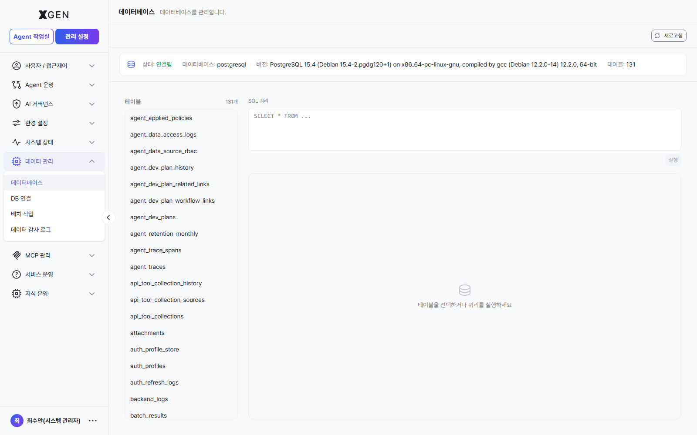

# 데이터 관리

본 챕터는 솔루션이 사용하는 운영 데이터베이스를 **직접 조회·일괄 작업·감사**하는 기능을 다룹니다. 좌측 사이드바 **관리 설정 → 데이터 관리** 그룹 4개 메뉴가 본 챕터 범위입니다.

!!! warning "관리자 권한 + DB 권한 분리 권장"
    데이터 관리 메뉴는 운영 DB(PostgreSQL) 에 직접 접근하므로 잘못 사용하면 데이터 손실 위험이 있습니다. 일반 관리자에게는 **조회 권한만** 부여하고, 변경 권한은 별도 운영 관리자에게만 부여하는 것을 권장합니다.

## 화면 진입

좌측 메뉴 **관리 설정 → 데이터 관리** 를 펼치면 4개의 하위 메뉴가 노출됩니다.

## 메뉴 구성

| 메뉴 | View ID | 용도 |
|---|---|---|
| **데이터베이스** | `admin-database` | 운영 DB 접속 정보 확인, 테이블 목록 탐색, SQL 쿼리 직접 실행 |
| **DB 연결** | `admin-db-connection` | 외부 DB 연결 프로파일 관리 (분석용 별도 DB·DW 등) |
| **배치 작업** | `admin-db-batch` | 정기·일회성 배치 작업 등록·실행·이력 |
| **데이터 감사 로그** | `admin-db-audit` | 데이터 변경(INSERT/UPDATE/DELETE)에 대한 감사 로그 |

## 주요 화면

### 데이터베이스

운영 DB(예: PostgreSQL 15.4) 의 상태와 테이블 목록(131개)을 한눈에 확인합니다. 우측 SQL 쿼리 입력창에서 `SELECT` 등 임시 쿼리를 실행할 수 있고, 좌측 테이블 이름을 클릭하면 자동으로 `SELECT * FROM <table>` 이 채워집니다.

- **상태 인디케이터**: 연결됨 / 연결 끊김 (헬스체크 결과)
- **DB 이름**: 실 데이터베이스명 (예: `postgresql`)
- **버전**: 정확한 DB 버전 문자열
- **테이블**: 전체 테이블 수

!!! danger "운영 DB 쿼리 주의"
    데이터베이스 화면의 SQL 입력창은 **운영 DB** 에 직접 실행됩니다. `UPDATE`/`DELETE`/`DROP` 류 명령은 가능한 회피하고, 변경이 필요하면 [배치 작업](#배치-작업) 으로 등록해 검토·승인 절차를 거치세요.

### DB 연결

분석용 DW(예: BigQuery, Snowflake) 또는 사내 별도 운영 DB 등 외부 DB 를 연결 프로파일로 등록합니다. 등록된 프로파일은 데이터 출처·도구 노드에서 참조됩니다.

### 배치 작업

ETL/지표 집계/로그 정리 등 정기 작업을 스케줄링·실행하고 결과를 모니터링합니다. 일회성 작업도 등록 가능.

### 데이터 감사 로그 { #data-audit-log }

운영 DB 데이터 변경(INSERT/UPDATE/DELETE/DDL) 에 대한 감사 로그. 누가·언제·어느 테이블·어떤 행을 변경했는지 추적합니다.

## 운영 권장사항

- **읽기 전용 권한이 기본** — 일반 관리자 계정은 `admin.data:read` 만 부여하고, 변경 권한 `admin.data:write` 는 DB 운영 책임자에게만.
- **장기 미사용 DB 연결 정리** — DB 연결 프로파일은 분기 1회 사용 여부 점검 후 미사용 항목 제거.
- **배치 작업 실패 알림** — 배치 작업의 실패 발생 시 알림을 받도록 시스템 모니터 임계치와 연계.
- **데이터 감사 로그 보존** — 금융권 통상 5년 이상. 보존 기간 만료 후 자동 삭제 또는 콜드 스토리지 이관 정책 수립.

## 관련 챕터

- [시스템 모니터](26-system-monitor.md) — DB 자체의 성능·디스크 사용량 모니터링

## 문의

데이터 관리 화면 관련 문의는 Xgen 솔루션 관리자에게 문의해 주세요.
