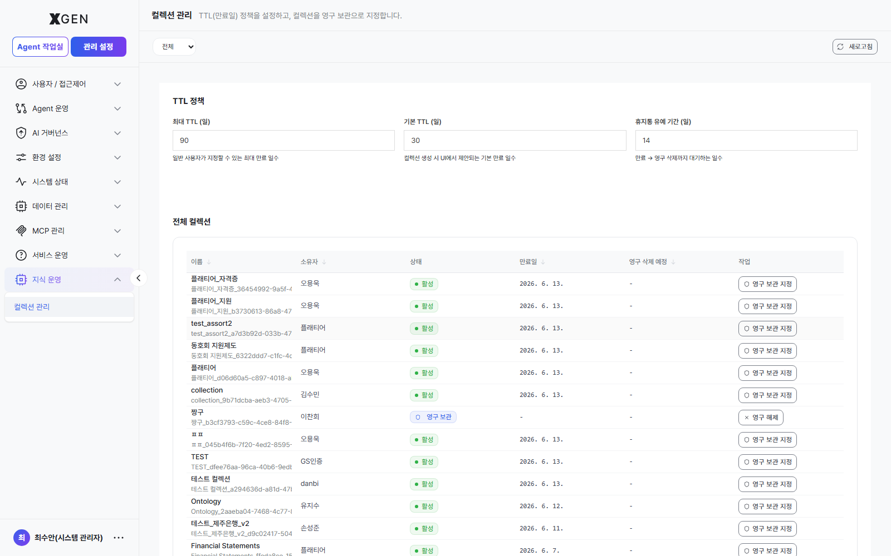

# Knowledge Operations

This chapter covers the screens under **Admin Center → Knowledge Operations** in the left sidebar. Here you manage organization-wide **retention policy (TTL)** for knowledge collections and review, on a per-user basis, the history of **documents uploaded and accessed**.

> For *creating* collections, uploading documents, and running embeddings, see the user-side [Knowledge Management](../user/15-knowledge.md) chapter. This chapter is the admin lens for fleet-wide **policy and audit history**.

## Sidebar Layout

The **Knowledge Operations** section contains three menus.

| Sidebar menu | Role | Section |
|---|---|---|
| Knowledge Collection Management | TTL retention policy + collection upload history | [Knowledge Collection Management](#collection) |
| File Storage Management | Upload history across all users' file storage | [File Storage Management](#file-storage) | <!-- require_view: admin-file-storage -->
| DB Collection Management | Access history across all users' DB links | [DB Collection Management](#db-collection) | <!-- require_view: admin-db-collection -->

## Knowledge Collection Management { #collection }

Select **Admin Center → Knowledge Operations → Knowledge Collection Management** in the left sidebar. The screen has two tabs at the top: **TTL Policy** and **Upload History**.

### TTL Policy Tab { #ttl-policy }

Applies to the entire organization.

| Field | Default | Meaning |
|---|---|---|
| Max TTL (days) | `90` | Cap on the expiry users can set when creating a collection |
| Default TTL (days) | `30` | Default value suggested in the create-collection UI |
| Trash grace period (days) | `14` | Window between expiry and permanent deletion (recoverable) |

Policy changes apply to **new** collections only; existing collections keep their original expiry. To re-apply, run a dedicated batch.

The collection table below lists every collection in the organization and lets you flag a collection as **Permanent**. Marking a collection Permanent removes it from TTL enforcement, so grant it only after explicit approval from the data owner.

### Upload History Tab { #upload-history }

The **Upload History** tab shows, per user, the history of documents uploaded to knowledge collections — who uploaded which file to which collection, and whether embedding succeeded.

Search by **file name · collection · user** at the top, and narrow by status filter (**All / Completed / Failed / Processing / Pending / Cancelled**). Use **Excel Download** to export the current view; the download options let you set status, search term, and start/end dates.

| Column | Content |
|---|---|
| User | Uploading user account |
| File name | Original uploaded file name |
| Collection | Target collection |
| Status | Completed / Failed / Processing / Pending / Cancelled |
| File size | Original file size |
| Chunks | Number of chunks generated |
| Elapsed | Time spent on embedding |
| Date | Upload timestamp |

Click a row to expand a **detail panel** with processing details not shown in the list.

| Detail field | Description |
|---|---|
| User account · Session ID | Uploader and session identifier |
| File type · Collection (internal name) | File type and internal collection name |
| Chunk size · overlap · chunking strategy | Document splitting settings |
| Chunks (total/processed) | Processed chunks out of total |
| Default metadata · force chunking · ontology graph | Processing options applied at upload |
| Storage encryption | Whether encryption at rest was applied |
| Retries | Number of processing retries |
| Duplicate upload | Whether it is the same file (identical files skip the actual upload) |
| Started · Completed · Directory | Processing window and storage path |

<!-- require_view_start: admin-file-storage -->
## File Storage Management { #file-storage }

Select **Admin Center → Knowledge Operations → File Storage Management** in the left sidebar. This screen shows **upload history across all users' file storage** — files placed in storage, viewed by user and folder, separate from collections.

Search by **storage · file name · folder** and separately by **user** at the top; a status filter (**All / Completed / Failed / Processing / Pending / Cancelled**) and **Excel Download** are supported.

| Column | Content |
|---|---|
| User | Uploading user account |
| File name | Original uploaded file name |
| Storage | Target storage |
| Folder path | Stored folder path |
| Status | Completed / Failed / Processing / Pending / Cancelled |
| File size | Original file size |
| Elapsed | Time spent processing |
| Date | Upload timestamp |

Click a row to expand the upload's detail panel.
<!-- require_view_end -->

<!-- require_view_start: admin-db-collection -->
## DB Collection Management { #db-collection }

Select **Admin Center → Knowledge Operations → DB Collection Management** in the left sidebar. This screen shows **access history across all users' DB collections (DB links)** — for audit purposes, which operations users performed against linked databases.

Search by **message · action · user** at the top; a status filter (**All / Success / Info / Warning / Error**) and **Excel Download** are supported.

| Column | Content |
|---|---|
| User | Accessing user account |
| Action | Type of operation performed |
| Endpoint | Endpoint accessed |
| Status | Success / Info / Warning / Error |
| Message | Result message |
| Date | Access timestamp |

Click a row to expand the access detail panel.

!!! note "Difference from agent-level data-access history"
    This screen reviews file and DB access history **by user**. To see **which data a specific agent accessed during execution**, use the **Data Access** tab in the agent detail of [AI Service Change History](29-governance-dashboard.md#audit-tracking-detail). Use this screen for the user perspective, the governance screen for the agent perspective.
<!-- require_view_end -->

## Operational Recommendations

- **Decide TTL once, review semi-annually** — Too short ⇒ repeated re-uploads (operational burden); too long ⇒ disk cost grows. Typically 30–90 days.
- **Trash grace ≥ 7 days** — Leaves room for users to recover after accidental expiry.
- **Approval required for Permanent** — Indiscriminate Permanent flagging undermines the TTL policy itself. Define an explicit request-and-review flow.
- **Use upload/access history for periodic audits** — Review upload and access history monthly to spot abnormal bulk uploads or users with repeated failures, exporting to Excel for reporting when needed.
- **Monitor failure status** — Repeated failures for a specific user or collection may indicate embedding-setting or file-format issues; check the processing options in the detail panel.
- **Orphaned collections** — Define a separate hand-over / hard-delete policy for collections whose owners have been deactivated.

## Related Chapters

- [Knowledge Management](../user/15-knowledge.md) — user perspective on creating collections and uploading documents
- [Embedding / Search Settings](24-embedding-settings.md) — embedding model and vector DB configuration that drives retrieval quality
- [AI Service Change History](29-governance-dashboard.md#audit-tracking) — agent-level data access and change history

## Contact

For questions on Knowledge Operations, please contact the Xgen Solution Administrator.
