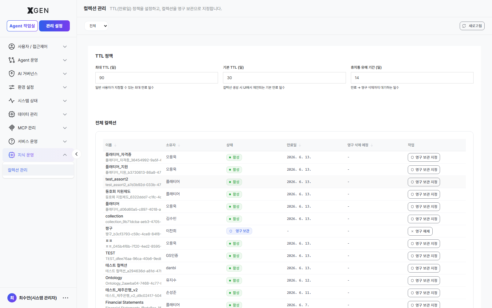

# 지식 운영

본 챕터는 조직 전체 **지식 컬렉션의 TTL·보존 정책**을 관리하는 화면을 다룹니다. 좌측 사이드바 **관리 설정 → 지식 운영 → 컬렉션 관리** 메뉴가 본 챕터 범위입니다.

> 컬렉션 자체의 생성·문서 업로드·임베딩 작업은 사용자 매뉴얼의 [지식 관리](../user/15-knowledge.md) 챕터를 참고하세요. 본 챕터는 관리자가 조직 전체 컬렉션을 **수명 정책 관점**에서 일괄 운영하는 화면입니다.

## 화면 진입

좌측 메뉴 **관리 설정 → 지식 운영 → 컬렉션 관리** 를 선택합니다.

## 화면 구성

### 상단 — TTL 정책

조직 전체 컬렉션에 일괄 적용되는 보존 정책을 설정합니다.

| 항목 | 기본값 | 설명 |
|---|---|---|
| 최대 TTL (일) | `90` | 일반 사용자가 지정할 수 있는 컬렉션 최대 만료 기간 |
| 기본 TTL (일) | `30` | 컬렉션 생성 시 UI에서 제안되는 기본 만료 기간 |
| 휴지통 유예 기간 (일) | `14` | 만료 → 영구 삭제까지의 대기 기간 (복구 가능 구간) |

설정 변경 후 신규 컬렉션부터 적용되며, 기존 컬렉션의 만료일은 변경되지 않습니다. 일괄 재적용이 필요하면 별도 배치를 통해 진행하세요.

### 하단 — 전체 컬렉션

조직 내 모든 컬렉션을 행 단위로 노출합니다.

| 열 | 표시 내용 |
|---|---|
| 이름 | 컬렉션 이름 (내부 ID 와 함께) |
| 소유자 | 컬렉션 생성자 (개인) 또는 공용 (조직) |
| 상태 | 활성 / 영구 보관 / 만료 / 영구 삭제 예정 |
| 만료일 | TTL 에 따른 자동 만료 일자 |
| 영구 삭제 예정 | 휴지통 유예 종료일 (영구 삭제 D-Day) |
| 작업 | **영구 보관 지정** / **영구 보관 예제** 토글 |

**영구 보관 지정** 토글을 켜면 해당 컬렉션은 TTL 정책의 영향을 받지 않고 무기한 유지됩니다. 정합성 위해 영구 보관은 책임자 승인 이후에만 부여하기를 권장합니다.

## 운영 권장사항

- **TTL 정책 한 번 정하고 반기 단위 검토** — 너무 짧으면 사용자가 자주 재업로드 (운영 부담↑), 너무 길면 디스크 비용 증가. 보통 30~90일.
- **휴지통 유예 ≥ 7일** — 사용자 실수로 만료된 컬렉션 복구 여지 확보.
- **영구 보관은 책임자 승인 후에만** — 무분별한 영구 보관은 TTL 정책 자체를 무력화. 신청·검토 흐름 권장.
- **만료 예정 알림** — 만료 D-7 일 시점에 컬렉션 소유자에게 알림이 가도록 시스템 설정 점검.
- **소유자 부재 컬렉션 처리** — 소유자가 비활성화된 컬렉션은 별도 인계 / 영구 삭제 정책을 정의.

## 관련 챕터

- [지식 관리](../user/15-knowledge.md) — 사용자 입장에서의 컬렉션 생성·문서 업로드
- [임베딩·벡터 검색 설정](24-embedding-settings.md) — 컬렉션의 검색 정확도에 영향을 주는 임베딩 모델·벡터 DB 구성

## 문의

지식 운영 화면 관련 문의는 **XGen 관리자**({{vars.support_email}}) 로 연락해 주세요.
