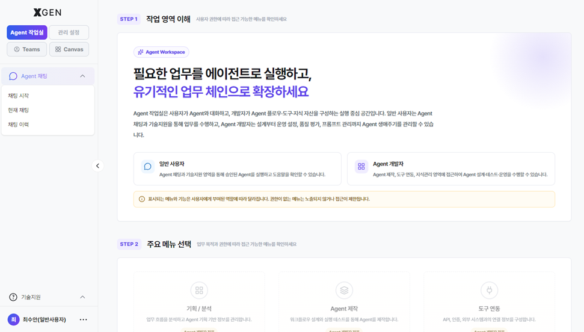

# 시작하기

본 챕터는 {{product.name}} 솔루션에 처음 접속하는 분을 위한 가이드입니다.

## 솔루션 접속

웹 브라우저에서 다음 주소로 접속합니다.

```
https://{{product.domain}}
```

회사에서 안내한 사번(또는 이메일)과 비밀번호로 로그인합니다. 로그인 절차는 [로그인](11-login.md) 챕터를 참고하세요.


## 화면 구성

로그인하면 다음과 같은 영역이 표시됩니다.

| 영역 | 설명 |
|---|---|
| 상단 헤더 | 로고, 검색, 알림, 사용자 프로필 |
| 좌측 사이드바 | 주요 기능 메뉴 (Agent 작업실, 도구 연동, 지식 관리 등) |
| 본문 | 선택한 기능의 작업 영역 |
| 우측 패널 (필요 시) | 도움말, 채팅 등의 보조 영역 |

## 사이드바 메뉴

사용자 모드(Agent 워크스페이스)의 좌측 사이드바는 다음 6개 섹션으로 구성됩니다.

| 섹션 | 주요 메뉴 | 본 매뉴얼 챕터 |
|---|---|---|
| 분석 / 기획 | 업무기획 | (별도 챕터 미수록) |
| Agent 채팅 | 채팅 시작, 현재 채팅, 채팅 이력 | [채팅 사용](14-chat.md) |
| Agent 제작 | Agent 제작 소개, Agent 설계, Agent 목록, Agent 운영 설정, Agent 품질 평가, Agent 프롬프트 | [에이전트 만들기](12-agentflow-create.md), [에이전트 운영](13-agentflow-operations.md), [프롬프트 관리](16-prompt.md) |
| 도구 연동 | API 도구, 인증 프로필 | [인증 프로필](17-auth-profile.md) |
| 지식관리 | 지식 컬렉션, 파일 저장소, DB 연동, 업로드 이력 | [지식 관리](15-knowledge.md) |
| 기술지원 (하단 고정) | 공지 게시판, 자주묻는 질문, 1:1 관리자 문의 | — |



!!! info "헤더의 2개 모드"
    솔루션 헤더에는 2개의 작업 영역이 노출됩니다.
    
    - **Agent 작업실** — 일반 사용자 및 Agent 개발자의 기본 작업 공간 (위 사이드바)
    - **관리 설정** — 시스템 관리자 및 거버넌스 담당자 전용 영역
    
    부여된 권한 등급과 역할에 따라 일부 영역은 표시되지 않을 수 있습니다.

## 첫 사용자 추천 학습 경로

처음이라면 다음 순서로 진행하세요.

1. [로그인](11-login.md) — 인증 절차 이해
2. [에이전트 만들기](12-agentflow-create.md) — 에이전트플로우 캔버스로 첫 에이전트 제작
3. [채팅 사용](14-chat.md) — 만든 에이전트와 대화
4. [지식 관리](15-knowledge.md) — 답변 품질을 위해 문서 컬렉션 추가

자주 묻는 질문은 사이드바 하단 **자주 묻는 질문** 메뉴에서 확인할 수 있습니다.

## 화면이 정상적으로 표시되지 않을 때

다음을 차례로 시도해 주세요.

1. 브라우저를 최신 버전(Chrome 또는 Edge 권장)으로 업데이트
2. 브라우저 캐시·쿠키 삭제 후 재접속
3. 시크릿 창(Incognito) 모드로 접속해 본인 환경 문제인지 확인
4. 그래도 안 되면 {{vars.support_email}} 로 화면 캡처와 함께 문의

## 문의

기술 지원 문의는 {{vars.support_email}} 로 연락해 주세요.
