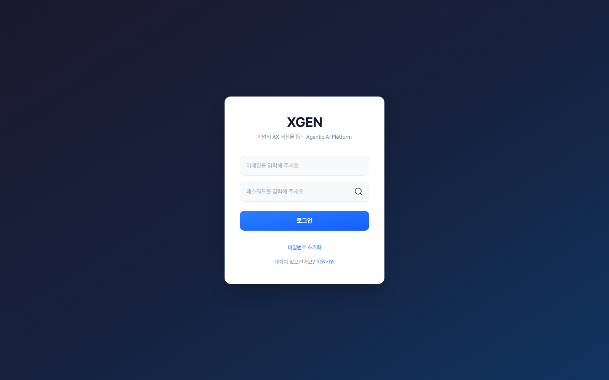

# Login

This chapter covers logging into the {{product.name}} solution and resolving common issues.

## Standard Login

1. Open {{product.domain}} in a browser
2. The login screen appears automatically
3. Enter your organization email and password
4. Click **Log In**

## SSO Environment

When the organization uses internal SSO, login is automatic without a separate login screen.

- Once logged into the corporate intranet, navigating to {{product.domain}} takes you directly to the solution
- If SSO is not working, see the [Troubleshooting](#troubleshooting) section below

(Detailed SSO configuration varies by customer environment; this standard manual covers the common case.)

## Forgotten Password

For standard login environments:

1. Click the **Forgot Password** link below the login form
2. Enter your registered email → request a reset link
3. Click the link in the email → set a new password
4. Log in with the new password

If the email does not arrive or the flow does not work, contact the Xgen Solution Administrator.

## Pending Approval

In environments with self-signup enabled, signup requests enter the **Pending Approval** state until an administrator approves them. Login is blocked during this period. Approvals are usually processed within one business day.

## Logout

Click the dedicated **Logout** icon (door-arrow) in the top-right header — it sits next to the user icon, so a single click signs you out.

!!! info "What clicking the user avatar does"
    Clicking the avatar (the initial-letter circle) at the top right does **not** open a dropdown menu — it navigates directly to **MyPage (`/mypage`)**. Profile and password changes happen inside MyPage, and logout is available as a separate **Logout** icon in the header for a one-click sign-out.

!!! note "Caution on Shared PCs"
    After using the solution on a shared PC or meeting-room PC, be sure to log out and close the browser. Confirm that password autosave is disabled.

## Security Guidelines

- Do not store passwords on sticky notes, messengers, or other unsecured locations.
- Change your password immediately upon receiving a suspicious-login notification.
- Do not log in as another user on the same PC — the audit log will record that user's activity under their account.

## Troubleshooting

| Symptom | Check |
|---|---|
| ID/password mismatch | Check case sensitivity and IME mode. Repeated failures may lock the account per your company's security policy |
| Password expired | Periodic password changes are required per your company's security policy. Follow the prompt |
| Screen freezes | Clear browser cache and retry |
| SSO auto-login fails | Verify intranet session is alive. Re-authenticate to intranet and retry |
| "Pending Approval" message | Awaiting administrator approval. If unchanged after 1 business day, contact support |

## Contact

For login-related questions, please contact the Xgen Solution Administrator.
