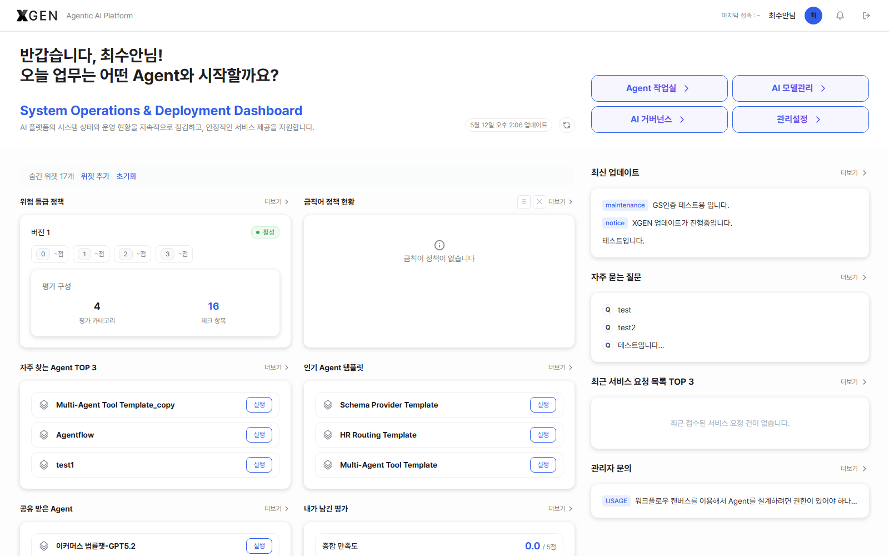

# Agent 작업실 개요

본 챕터는 일반 사용자 및 Agent 개발자가 솔루션에 처음 접속한 뒤 알아야 할 기본 사항을 다룹니다. 세부 기능 사용법은 이후 챕터에서 다룹니다.

## 접속

Agent 작업실은 로그인 직후 자동으로 진입하는 기본 작업 영역입니다. 좌상단의 2개 모드 전환 버튼(**Agent 작업실** / **관리 설정**) 중 **Agent 작업실** 버튼이 활성화된 상태로 표시됩니다.

1. 웹 브라우저에서 회사가 안내한 주소로 접속

    ```
    https://{{product.domain}}
    ```

2. 회사에서 사용하는 이메일과 비밀번호로 로그인 — 절차는 [로그인](10-login.md) 참조
3. 로그인 직후 [대시보드](18-dashboard.md)로 자동 진입하며, 좌상단 **Agent 작업실** 모드에서 작업



진입 후 화면은 다음 영역으로 구성됩니다.

| 영역 | 설명 |
|---|---|
| 상단 헤더 | 로고, 좌상단 2개 모드 전환 버튼(**Agent 작업실** / **관리 설정**), 검색, 알림, 사용자 프로필 |
| 좌측 사이드바 | 사용자 모드 주요 기능 메뉴 (6개 섹션, 아래 [Agent 작업실 구성](#agent-작업실-구성) 참조) |
| 본문 | 선택한 기능의 작업 영역 |
| 우측 패널 (필요 시) | 도움말·채팅 등 보조 영역 |

!!! info "좌상단 모드 전환 — Agent 작업실 vs 관리 설정"
    솔루션 좌상단에는 2개의 모드 전환 버튼이 노출됩니다.

    - **Agent 작업실** — 일반 사용자 및 Agent 개발자의 기본 작업 공간. 본 매뉴얼이 다루는 영역입니다.
    - **관리 설정** — 시스템 관리자 및 거버넌스 운영 담당자를 위한 전용 관리 영역입니다. 일반 사용자 및 Agent 개발자에게는 기본적으로 비노출 또는 비활성 상태로 제공되며, 역할 및 권한 정책에 따라 허용된 일부 메뉴만 접근할 수 있습니다. 해당 영역의 가이드는 [관리자 매뉴얼](../admin/index.md) 참조. <!-- require_view: gov-monitoring -->
    - **관리 설정** — 시스템 관리자를 위한 전용 관리 영역입니다. 일반 사용자 및 Agent 개발자에게는 기본적으로 비노출 또는 비활성 상태로 제공되며, 역할 및 권한 정책에 따라 허용된 일부 메뉴만 접근할 수 있습니다. 해당 영역의 가이드는 [관리자 매뉴얼](../admin/index.md) 참조. <!-- require_view: no-governance -->

    부여된 사용자 유형에 따라 일부 메뉴는 표시되지 않을 수 있습니다.

## 사용자 유형 { #user-types }

Agent 작업실은 다음 사용자 유형이 사용하며, 부여된 유형·역할에 따라 좌측 사이드바에 노출되는 메뉴 범위가 달라집니다.

| 유형 | 영문 | Agent 작업실에서 하는 일 |
|---|---|---|
| 일반 사용자 | Standard User | **Agent 채팅 / 기술지원 / 대시보드** 3개 영역 사용. 회사가 배포해둔 Agent와 채팅, 공지·FAQ 조회, 1:1 문의 |
| Agent 개발자 | Agent Developer | 위 + **Agent 제작 / 도구 연동 / 지식관리 / 분석·기획** 영역. 본인 Agent 설계·배포·운영 (권한 등급은 Standard User 동일, 별도 역할로 부여) | <!-- require_view: analysis-planning -->
| Agent 개발자 | Agent Developer | 위 + Agent 제작 / 도구 연동 / 지식관리 / 본인 Agent 설계·배포·운영 (권한 등급은 Standard User 동일, 별도 역할로 부여) | <!-- require_view: no-analysis-planning -->

!!! info "유형 vs 권한 등급"
    "사용자 유형" 은 Agent 작업실에서 무엇을 하는지 기준의 분류이고, **권한 등급** 은 Standard User / SuperUser 2단계입니다. Agent 개발자는 Standard User 에 부여되는 추가 메뉴 권한으로 운영됩니다. 권한 등급의 전체 정의는 [관리자 콘솔 개요 · 권한 등급](../admin/20-admin-overview.md#권한-등급) 참고.

일반 사용자에서 Agent 개발자로 역할을 상향하려면 시스템 관리자에게 요청해 권한을 부여받아야 합니다. 역할별 진입점과 작업 흐름은 [업무 가이드](../tasks/index.md)에 정리되어 있습니다.

## Agent 작업실 구성

사용자 모드(Agent 작업실)의 좌측 사이드바는 5개 섹션으로 구성됩니다 (사용자 권한에 따라 일부는 표시되지 않을 수 있음). 각 메뉴별로 본 매뉴얼이 다루는 챕터를 아래와 같이 매핑합니다.

| 섹션 | 메뉴 | 권한 | 본 매뉴얼 챕터 |
|---|---|---|---|
| Agent 제작 | Agent 기획 | Agent 개발자 | [Agent 기획](11a-task-planning.md) |
| Agent 제작 | Agent 설계 | Agent 개발자 | [에이전트 만들기 · Agent 작업실 진입](12-agentflow-create.md#agent-작업실-진입) |
| Agent 제작 | Agent 목록 | Agent 개발자 | [에이전트 운영](13-agentflow-operations.md) |
| Agent 제작 | Agent 운영 설정 | Agent 개발자 | [에이전트 운영 · 스케줄 자동 실행](13-agentflow-operations.md#scheduler) |
| Agent 제작 | Agent 품질 평가 | Agent 개발자 | [Agent 품질 평가](13a-agent-quality-evaluation.md) |
| Agent 제작 | Agent 프롬프트 | Agent 개발자 | [프롬프트 관리](16-prompt.md) |
| 도구 연동 | API 도구 | Agent 개발자 | [API 도구](17a-api-tools.md) |
| 도구 연동 | 인증 프로필 | Agent 개발자 | [인증 프로필](17-auth-profile.md) |
| 지식관리 | 지식 컬렉션 | Agent 개발자 | [지식 관리 · 컬렉션 목록](15-knowledge.md#knowledge-collection) |
| 지식관리 | 파일 저장소 | Agent 개발자 | [지식 관리 · 파일 저장소](15-knowledge.md#storage) |
| 지식관리 | DB 연동 | Agent 개발자 | [지식 관리 · DB 연동](15-knowledge.md#database) |
| 지식관리 | 업로드 이력 | Agent 개발자 | [지식 관리 · 업로드 이력](15-knowledge.md#upload-history) | <!-- require_view: upload-history -->
| Agent 채팅 | 채팅 시작 | 일반 사용자 | [채팅 사용 · 채팅 시작](14-chat.md#new-chat) |
| Agent 채팅 | 현재 채팅 | 일반 사용자 | [채팅 사용 · 현재 채팅](14-chat.md#current-chat) |
| Agent 채팅 | 채팅 이력 | 일반 사용자 | [채팅 사용 · 채팅 이력](14-chat.md#chat-history) |
| 기술지원 (하단 고정) | 공지 게시판 | 일반 사용자 | [기술지원 · 공지 게시판](19-tech-support.md#notices) |
| 기술지원 (하단 고정) | 자주묻는 질문 | 일반 사용자 | [기술지원 · 자주묻는 질문](19-tech-support.md#faq) |
| 기술지원 (하단 고정) | 1:1 관리자 문의 | 일반 사용자 | [기술지원 · 1:1 관리자 문의](19-tech-support.md#qna) |


!!! info "메뉴 명칭 안내"
    화면상의 메뉴 이름은 솔루션 버전과 사용자 권한에 따라 일부 다를 수 있습니다. 본 매뉴얼은 {{product.name}} {{product.version}} 기준입니다. 메뉴가 보이지 않는다면 부여된 권한이 해당 메뉴에 대해 활성화되지 않은 상태일 수 있으니, 시스템 관리자에게 문의하세요.

대시보드는 사이드바에 별도 항목이 없으며, 로그인 직후 자동 진입하거나 좌상단 **XGEN** 로고를 클릭해 이동합니다. 역할별 위젯 구성은 [대시보드](18-dashboard.md) 챕터에서 다룹니다.

## 첫 사용 시 점검 체크리스트

처음 솔루션을 사용할 때 확인하면 좋은 항목입니다. 각 항목의 자세한 절차는 해당 챕터를 참고하세요.

- [ ] **로그인 확인** — 계정으로 정상 로그인되는지 확인합니다. 로그인할 수 없는 경우 시스템 관리자에게 계정 활성화를 요청하세요.
- [ ] **부여된 권한 확인** — 좌측 사이드바에 노출되는 메뉴를 통해 본인의 권한 유형(일반 사용자 / Agent 개발자 등)을 확인합니다. 자세한 권한 기준은 [권한 등급](#권한-등급) 표를 참고하세요.
- [ ] **대시보드 확인** — 로그인 후 표시되는 [대시보드](18-dashboard.md)에서 본인 역할에 맞는 위젯(자주 사용하는 Agent, 공유받은 Agent, 내가 만든 Agent 등) 이 정상적으로 노출되는지 확인합니다.
- [ ] **공지 및 FAQ 확인** — 좌측 사이드바 하단의 [기술지원](19-tech-support.md) 메뉴에서 최신 공지사항 및 자주 묻는 질문(FAQ) 을 확인합니다.
- [ ] **첫 채팅 실행** — Agent 채팅 영역에서 배포된 Agent 와 [첫 대화](14-chat.md) 를 진행해 기본 동작 여부를 확인합니다.

## 운영 원칙

Agent 작업실 사용 시 준수해야 하는 기본 운영 원칙입니다.

1. **공유 Agent** — Agent 는 운영 정책에 따라 검토 및 관리될 수 있습니다. 답변 내용이 부정확하거나 추가 확인이 필요한 경우, 답변 하단의 별 아이콘을 통해 피드백을 남겨주세요.
2. **본인 작업 보안** — 채팅 내용, Prompt, 지식 자산은 사용자 계정에 귀속되며, 계정 활동 이력과 함께 관리됩니다. 보안을 위해 계정 및 비밀번호를 타인과 공유하지 마세요.
3. **민감정보 입력 주의** — 채팅창에 개인정보(주민등록번호, 계좌번호 등) 또는 회사 기밀 정보를 입력하기 전, 반드시 사내 정보보호 정책을 확인해 주세요. PII 자동 마스킹 기능이 적용될 수 있으나, 민감정보 입력 여부와 정책 준수에 대한 책임은 사용자에게 있습니다.
4. **이슈는 1:1 문의로** — 화면 오류, 기능 제한, 데이터 이상 등의 문제가 발생한 경우, [1:1 관리자 문의](19-tech-support.md)를 통해 접수해 주세요. 접수된 내용은 시스템 관리자가 확인 후 순차적으로 안내드립니다.

## 화면이 정상적으로 표시되지 않을 때

다음을 차례로 시도해 주세요.

1. 브라우저를 최신 버전(Chrome 또는 Edge 권장)으로 업데이트
2. 브라우저 캐시·쿠키 삭제 후 재접속
3. 시크릿 창(Incognito) 모드로 접속해 본인 환경 문제인지 확인
4. 그래도 안 되면 Xgen 솔루션 관리자에게 화면 캡처와 함께 문의

## 문의

기술 지원 문의는 Xgen 솔루션 관리자에게 문의해 주세요.
