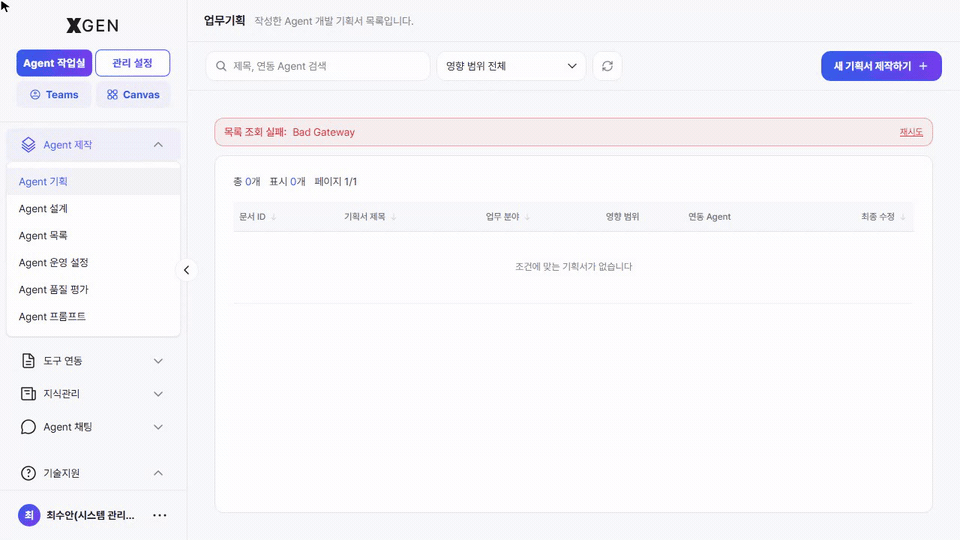

# Agent Planning

This chapter covers the screen where users record **idea-stage proposals** for new agents — "we should automate this task" before building anything. The **Agent Creation → Agent Planning** menu (top of the Agent Creation section) in the left sidebar is in scope.

> This screen is the step **before building an agent**. For the canvas-based build process, see [Creating an Agent](12-agentflow-create.md). For running and operating an agent, see [Agent Operations](13-agentflow-operations.md).

## Accessing the Screen and Creating a New Plan

Select **Agent Creation → Agent Planning** in the left sidebar; the list of existing **Agent Development Plans** is shown. Click **+ New Plan** at the top right of the list to open the *Agent Development Plan* authoring modal.

## List Layout

| Region | Content |
|---|---|
| Top | Screen title "업무기획 (Task Planning)" with the description "List of agent development plans you have written." |
| Search / filters | Search by title or linked agent; **Impact scope** filter (All / Org-wide / My team / Self) |
| Top right | **+ New Plan** — open the new-plan authoring modal |
| Body table | Document ID · Plan title · Work area · Impact scope · Linked agent · Last modified |

## Authoring Modal — 5 Steps

The new plan is authored as a stepped modal. The top of the modal shows 5 step indicators; the top-right buttons are **Cancel / Save Draft / Submit**.

| Step | Fields |
|---|---|
| **01 Basic Info** | Plan title, Work area, Date, Related workflow, Related plans, Development type (In-house / Outsourced) |
| **02 Problem Definition** | Current state of the target task and the problem to solve |
| **03 Process Analysis** | I/O definition, step-by-step processing, external system integration |
| **04 Expected Impact** | Quantitative/qualitative outcomes, KPIs, before/after changes |
| **05 Attachments** | Reference materials (specs, sample data, etc.) |

**Save Draft** lets you close mid-write and resume later. **Submit** finalizes all steps and registers the plan in the list.

### Basic Info — Field Detail

| Field | Description |
|---|---|
| Plan title | A one-liner stating what the agent automates (e.g., "Weekly Sales-KPI Auto-aggregation Agent") |
| Work area | Sales / Sales Planning / Strategy / Customer Service / Compliance / Risk / Credit, etc. |
| Impact scope | **Org-wide** / **My team** / **Self** — drives collaboration and approval routing |
| Related workflow | An existing agentflow this plan extends (optional) |
| Related plans | Other related plans — helps with impact analysis and collaboration |
| Development type | **In-house** (you build it in the canvas) / **Outsourced** (request from the dev team) |

## Recommended Flow

1. **Write the plan first** — Putting the idea in writing before opening the canvas speeds up node design.
2. **Tag related workflows and plans** — If similar items exist, link them to avoid duplicate work or to reference them.
3. **Pick the right impact scope** — "Org-wide" raises governance-review priority. For personal use, keep it on "Self".
4. **Save draft between steps** — If completing all 5 steps in one sitting feels heavy, use *Save Draft* and resume later.

## Common Issues

- **"목록 조회 실패: Bad Gateway"** — Transient backend error. Retry from the right; contact [Technical Support](19-tech-support.md) if it persists.
- **New Plan button disabled** — Insufficient permission. Agent Developer privileges are required.
- **Document ID is blank** — May not display momentarily after save; refresh and it should appear.

## Related Chapters

- [Creating an Agent](12-agentflow-create.md) — Plan → canvas step (actual node assembly)
- [Agent Operations](13-agentflow-operations.md) — Running, deploying, and sharing the built agent
- [AI Governance](../admin/29-governance-dashboard.md) — Risk assessment and approval flow for "Org-wide" plans (Governance Officer screen)

## Contact

For Agent Planning screen questions, please contact **XGen Administrator**({{vars.support_email}}).
