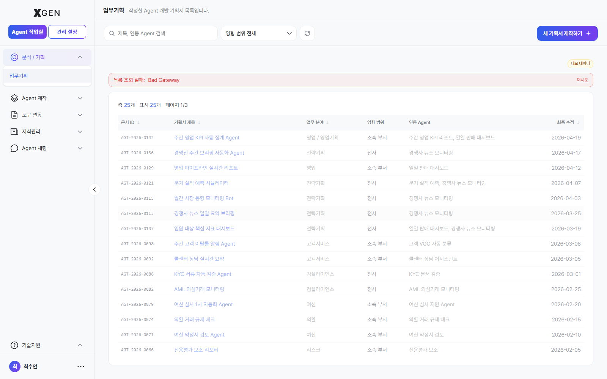

# Task Planning

This chapter covers the screen where users record **idea-stage proposals** for new agents — "we should automate this task" before building anything. The **Analytics / Planning → Task Planning** menu in the left sidebar is in scope.

> This screen is the step **before building an agent**. For the canvas-based build process, see [Creating an Agent](12-agentflow-create.md). For running and operating an agent, see [Agent Operations](13-agentflow-operations.md).

## Accessing the Screen

Select **Analytics / Planning → Task Planning** in the left sidebar.

## Layout

| Region | Content |
|---|---|
| Top | Screen title "업무기획 (Task Planning)" with the description "List of agent development proposals you have written." |
| Search / filters | Search by title or linked agent; **Impact scope** filter (All / Org-wide / My team / Self) |
| Top right | **New Proposal** — create a new proposal |
| Body table | Analysis ID · Proposal title · Work area · Impact scope · Linked agent · Last modified |

## Registering a Proposal

Start a new proposal with the **New Proposal** button at the top right.

| Field | Description |
|---|---|
| Title | A one-liner stating what the agent automates (e.g., "Weekly Sales-KPI Auto-aggregation Agent") |
| Work area | Sales / Sales Planning / Strategy / Customer Service / Compliance / Risk / Credit, etc. |
| Impact scope | **Org-wide** / **My team** / **Self** — drives collaboration and approval routing |
| Linked agent | An existing agent this proposal extends (optional) |
| Body | Markdown description: background, requirements, expected I/O, KPIs |

After saving, a row is added to the table with an Analysis ID and becomes searchable by your colleagues.

## Recommended Flow

1. **Write the proposal first** — Putting the idea in writing before opening the canvas speeds up node design.
2. **Tag related agents** — If a similar agent already exists, link it under **Linked agent** to avoid duplicate work or to reference it.
3. **Pick the right impact scope** — "Org-wide" raises governance-review priority. For personal use, keep it on "Self".

## Common Issues

- **"목록 조회 실패: Bad Gateway"** — Transient backend error. Refresh from the top right; contact [Technical Support](19-tech-support.md) if it persists.
- **New Proposal button disabled** — Insufficient permission. Agent Developer privileges are required.
- **Analysis ID is blank** — May not display momentarily after save; refresh and it should appear.

## Related Chapters

- [Creating an Agent](12-agentflow-create.md) — proposal → canvas step (assemble nodes)
- [Agent Operations](13-agentflow-operations.md) — running, deploying, and sharing an agent
- [AI Governance](../admin/29-governance-dashboard.md) — risk review and approval workflow for "Org-wide" proposals (governance-officer view)

## Contact

For questions on the Task Planning screen, please contact {{vars.support_email}}.
