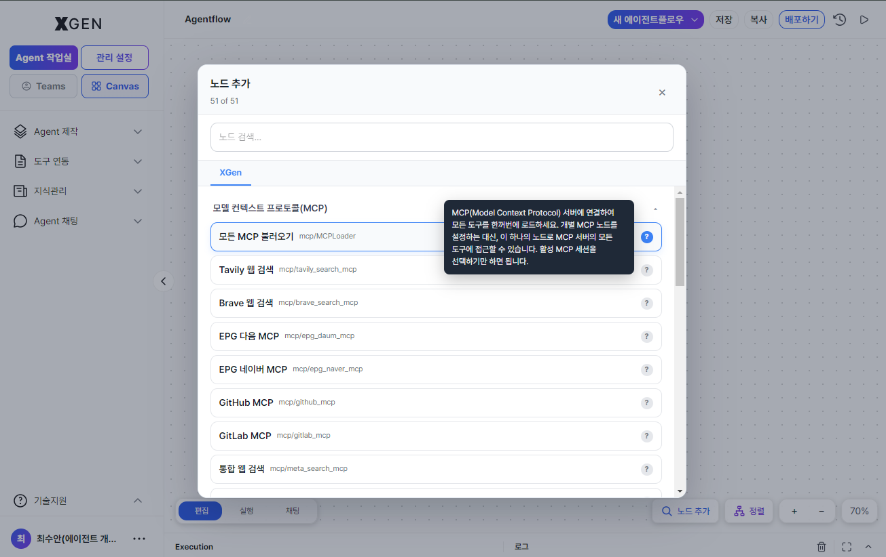
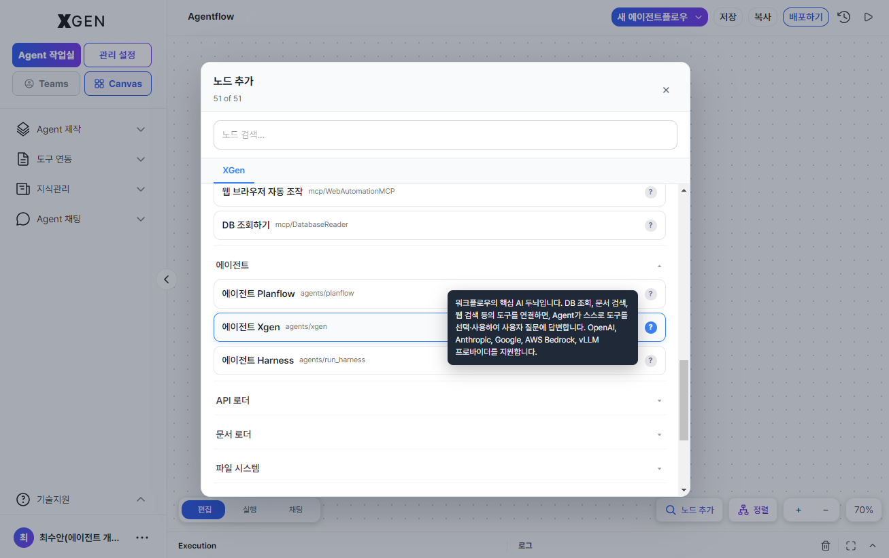

# Creating an Agent

This chapter covers building an **Agentflow** — the core deliverable of the solution.

## What Is an Agentflow

An agentflow is an AI workflow composed by visually connecting multiple **nodes**. The entire execution path — from the start node, through intermediate steps (LLM calls, tool execution, conditional branching, etc.), to the final response — is represented in a single diagram.

| Term | Description |
|---|---|
| Agentflow | The entire flow composed of nodes (the unit of deployment) |
| Node | A single step in the flow (LLM, tool, branch, etc.) |
| Canvas | The area for visually editing nodes |

See [Glossary](../common/01-glossary.md) for full terminology.

## Entering Agent Workspace { #agent-작업실-진입 }

!!! note "Agent-build permission required"
    The steps in this section assume an account with the **Agent Developer** role (or a comparable permission). Standard User accounts do not see the **Agent Creation** area in the left sidebar, and even when reached via the dashboard or [Agent Workspace shortcut](18-dashboard.md), the related screens may not appear or access may be restricted.

Select **Agent Creation → Agent Design** in the left sidebar. From the canvas intro screen you can pick **Start from blank canvas / Start with chat / Continue** as the entry mode.

## Creating a New Agentflow

1. Click the **+ New Agentflow** button at the top right
2. Enter:
    - **Name**: an identifiable name (Korean or English)
    - **Description** (optional): one-line summary of what it does
3. Create — an empty canvas opens; clicking **Start Agent** automatically places the **XGEN Agent** node.

## Adding Nodes

Clicking the **Node Search** button at the bottom right of the canvas opens the list of available nodes, grouped by category.

| Category | Example Nodes |
|---|---|
| LLM | Model invocation, response generation |
| Knowledge Retrieval | Collection search, citation insertion |
| Tools | External APIs, MCP tools |
| Branching | Conditional, loop |
| I/O | Receive input, return output |

> The full node catalog (categories, tags, detailed specs, etc.) is available in the [Admin Center > Node List](../admin/32a-node-list.md) chapter. Node registration and management features are also provided in the same chapter.

To add:

1. Expand a node category in the sidebar
2. **Drag and drop** a node card onto the canvas
3. The node is placed on the canvas

!!! info "Drag motion"
    Drag a node card from the left palette and drop it onto the canvas.

    

## Connecting Nodes

Drag from a node's output port (right side) to the next node's input port (left side).

- Valid connections show as arrowed lines
- Invalid connections (type mismatch) appear gray and warn at execution time

## Configuring Nodes

Clicking a node opens the detail panel on the right. Configure:

| Item | Description |
|---|---|
| Model (LLM node) | Which LLM model to use (chosen from admin-registered models) |
| Prompt | System Prompt, User Prompt |
| Collection (search node) | Target collection for retrieval |
| Tool (tool node) | The external API or MCP tool to invoke |
| Variables | Variable names passed between nodes |

!!! info "Node detail panel"
    Clicking an individual node opens a detail panel on the right. Field composition differs per node type (LLM / Tool / Search / Branch, etc.). Representative examples:

    

    

External APIs and MCP tools referenced by Tool nodes are registered and managed on a separate screen.

## AI-Generated Agentflow

If creating a complex flow from scratch is hard, ask AI to draft it.

1. Click **Auto-Generate** at the top of the canvas
2. Describe the desired flow in natural language (e.g., "a chatbot that searches internal policy documents")
3. The AI proposes a node configuration → review and adjust

## Auto Layout

If the canvas becomes cluttered, click **Auto Layout** at the top to neatly arrange the nodes.

## Saving

Click **Save** at the top right of the canvas to persist changes. Each save creates a new version.

## Next Steps

For executing, deploying, and sharing the agent (agentflow) you've built, see [Agent Operations](13-agentflow-operations.md).

## Contact

For questions about creating agentflows, please contact {{vars.support_email}}.
