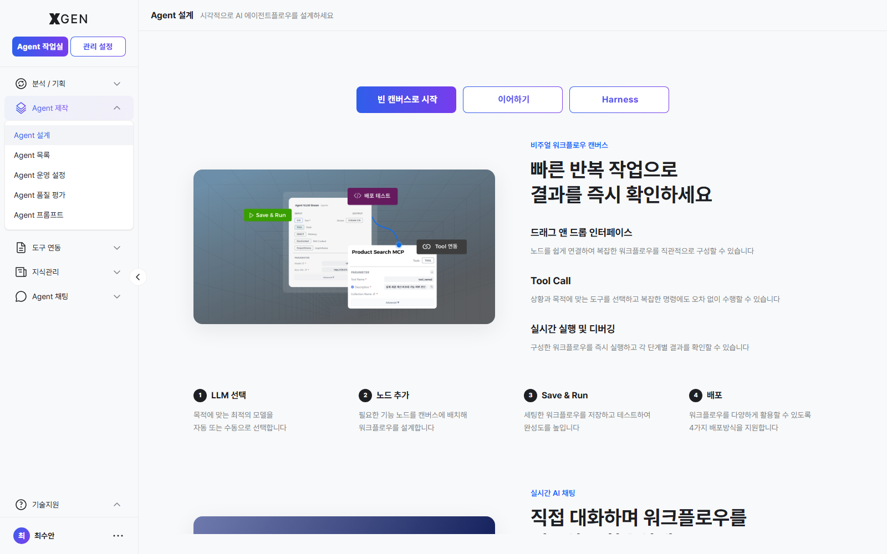
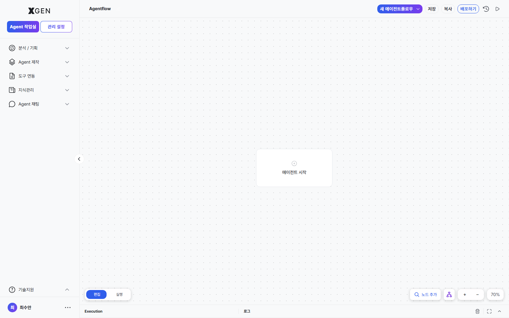
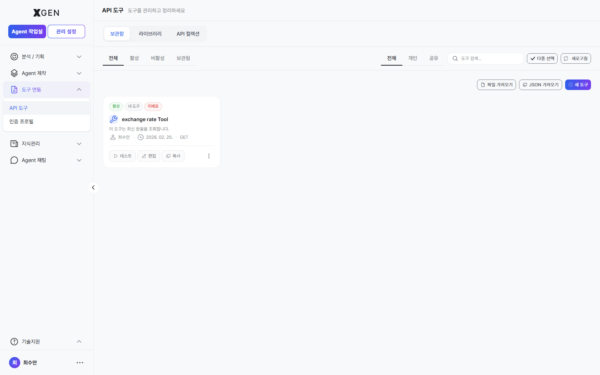

# 에이전트 만들기

본 챕터는 솔루션의 핵심 산출물인 **에이전트플로우(Agentflow)** 를 만드는 절차를 다룹니다.

## 에이전트플로우란

에이전트플로우는 여러 노드(Node)를 시각적으로 연결하여 구성한 AI 작업 흐름입니다. 시작 노드부터 중간 처리 단계(LLM 호출, 도구 실행, 조건 분기 등), 최종 응답 생성까지의 전체 실행 과정이 하나의 다이어그램 형태로 표현됩니다.

| 용어 | 설명 |
|---|---|
| 에이전트플로우 (Agentflow) | 노드들로 구성된 전체 흐름 (배포의 단위) |
| 노드 (Node) | 흐름 안의 한 단계 (LLM, 도구, 분기 등) |
| 캔버스 (Canvas) | 노드를 시각적으로 편집하는 영역 |

자세한 용어는 [용어 정의](../common/01-glossary.md)를 참고하세요.

## Agent 작업실 진입 { #agent-작업실-진입 }

!!! note "Agent 제작 권한 필요"
    본 절차는 **Agent 개발자** 역할(또는 이에 준하는 권한)이 부여된 계정을 기준으로 설명합니다. 일반 사용자(Standard User) 계정에는 좌측 사이드바의 **Agent 제작** 영역이 노출되지 않으며, 대시보드 또는 [Agent 작업실 바로가기](18-dashboard.md) 를 통해 접근하더라도 관련 화면은 표시되지 않거나 접근이 제한될 수 있습니다.

좌측 사이드바에서 **Agent 제작 → Agent 설계** 메뉴를 선택합니다. 캔버스 인트로 화면에서 **빈 캔버스로 시작 / 채팅으로 시작 / 이어하기** 중 진입 방식을 고를 수 있습니다.

## 신규 에이전트플로우 생성

1. 우상단 **+ 새 에이전트플로우** 버튼 클릭
2. 다음 항목 입력
    - **이름**: 식별 가능한 한글/영문 이름
    - **설명** (선택): 어떤 일을 하는지 한 줄 요약
3. 생성하기 — 빈 캔버스가 열리며, **에이전트 시작** 버튼을 클릭하면 **XGEN Agent** 노드가 자동으로 배치됩니다.

## 노드 추가

캔버스 우측 하단의 **노드 검색** 버튼을 클릭하면, 사용 가능한 노드 목록이 카테고리별로 표시됩니다.

| 카테고리 | 예시 노드 |
|---|---|
| LLM | 모델 호출, 응답 생성 |
| 지식 검색 | 컬렉션 검색, 인용 추가 |
| 도구 | 외부 API, MCP 도구 |
| 분기 | 조건 분기, 반복 |
| 입출력 | 입력 받기, 결과 반환 |

> 사용 가능한 전체 노드 카탈로그(카테고리·태그·상세 스펙) 는 [관리 설정 · 노드 목록](../admin/32a-node-list.md) 챕터에서 확인합니다. 관리자가 노드를 등록·관리하는 화면도 같은 챕터에서 다룹니다.

추가 절차:

1. 사이드바에서 노드 카테고리 펼치기
2. 노드 카드를 캔버스로 **드래그 앤 드롭**
3. 캔버스에 노드가 배치됨

!!! info "드래그 동작"
    캔버스 좌측 노드 팔레트에서 노드 카드를 드래그해 캔버스에 배치하는 흐름입니다.

    

## 노드 연결

각 노드의 출력 포트(우측)와 다음 노드의 입력 포트(좌측)를 마우스로 드래그해 연결합니다.

- 정상 연결 시 화살표 선이 표시됨
- 잘못된 연결(데이터 타입 불일치)은 회색으로 표시되며 실행 시 경고

## 노드 설정

노드를 클릭하면 우측 상세 패널이 열립니다. 여기서 다음 항목을 설정합니다.

| 항목 | 설명 |
|---|---|
| 모델 (LLM 노드) | 사용할 LLM 모델 (관리자 등록 모델 중 선택) |
| 프롬프트 | System Prompt, User Prompt |
| 컬렉션 (검색 노드) | 검색 대상 컬렉션 |
| 도구 (도구 노드) | 호출할 외부 API 또는 MCP 도구 |
| 변수 | 노드 간 전달되는 변수명 |

!!! info "노드 상세 패널 캡처는 다음 회차"
    개별 노드를 클릭했을 때 우측에 펼쳐지는 상세 설정 패널은 노드 타입(LLM / 도구 / 검색 / 분기 등) 마다 필드가 달라 대표 예시 1~2개를 다음 회차에 보강합니다.

도구 노드에서 사용하는 외부 API/MCP 도구의 등록·관리는 별도 화면에서 이루어집니다.

## 자동 에이전트플로우 생성

복잡한 흐름을 처음부터 만들기 어렵다면 AI에게 초안을 맡길 수 있습니다.

1. 캔버스 상단 **자동 생성** 버튼 클릭
2. 만들고 싶은 흐름을 자연어로 설명 (예: "사내 규정 문서를 검색해 답변하는 챗봇")
3. AI가 노드 구성을 제안 → 검토 후 적용·수정

## 자동 정렬

노드가 어지럽게 배치되면 캔버스 상단 **자동 정렬** 버튼으로 가지런히 정리할 수 있습니다.

## 저장

캔버스 우상단 **저장** 버튼 클릭 → 변경사항이 보존됩니다. 저장 시점이 새 버전으로 기록됩니다.

## 다음 단계

만든 에이전트(에이전트플로우)를 실행·배포·공유하는 방법은 [에이전트 운영](13-agentflow-operations.md) 챕터를 참고하세요.

## 문의

에이전트 만들기 관련 문의는 {{vars.support_email}} 로 연락해 주세요.
