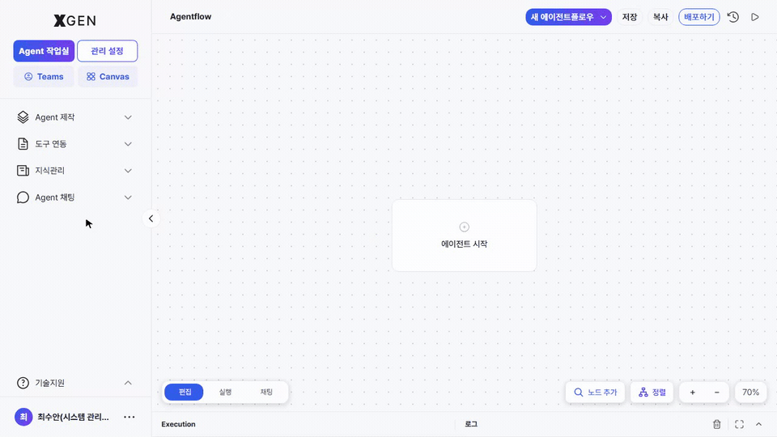
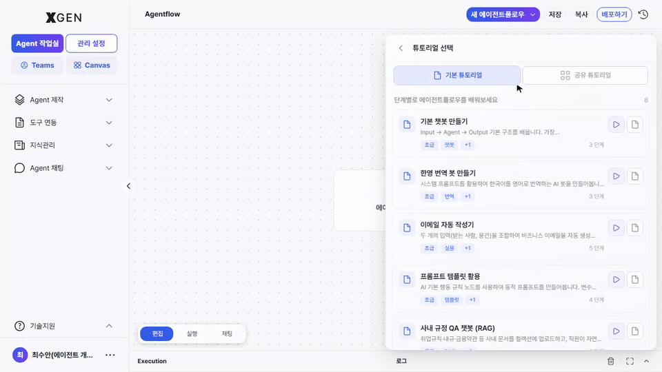

# 에이전트 만들기

본 챕터는 솔루션의 핵심 산출물인 **에이전트플로우(Agentflow)** 를 만드는 절차를 다룹니다.

## 에이전트플로우란

에이전트플로우는 여러 노드(Node)를 시각적으로 연결하여 구성한 AI 작업 흐름입니다. 시작 노드부터 중간 처리 단계(LLM 호출, 도구 실행, 조건 분기 등), 최종 응답 생성까지의 전체 실행 과정이 하나의 다이어그램 형태로 표현됩니다.

| 용어 | 설명 |
|---|---|
| 에이전트플로우 (Agentflow) | 노드들로 구성된 전체 흐름 (배포의 단위) |
| 노드 (Node) | 흐름 안의 한 단계 (LLM, 도구, 분기 등) |
| 캔버스 (Canvas) | 노드를 시각적으로 편집하는 영역 |

자세한 용어는 [용어 정의](../common/01-glossary.md)를 참고하세요.

## Agent 작업실 진입 { #agent-작업실-진입 }

!!! note "Agent 제작 권한 필요"
    본 절차는 **Agent 개발자** 역할(또는 이에 준하는 권한)이 부여된 계정을 기준으로 설명합니다. 일반 사용자(Standard User) 계정에는 좌측 사이드바의 **Agent 제작** 영역이 노출되지 않으며, 대시보드 또는 [Agent 작업실 바로가기](18-dashboard.md) 를 통해 접근하더라도 관련 화면은 표시되지 않거나 접근이 제한될 수 있습니다.

좌측 사이드바에서 **Agent 제작 → Agent 설계** 메뉴를 선택합니다. 캔버스 인트로 화면에서 **빈 캔버스로 시작 / 채팅으로 시작 / 이어하기** 중 진입 방식을 고를 수 있습니다.

## 신규 에이전트플로우 생성

1. 우상단 **+ 새 에이전트플로우** 버튼 클릭
2. 다음 항목 입력
    - **이름**: 식별 가능한 한글/영문 이름
    - **설명** (선택): 어떤 일을 하는지 한 줄 요약
3. 생성하기 — 빈 캔버스가 열리며, **에이전트 시작** 버튼을 클릭하면 **에이전트 XGEN** 노드가 자동으로 배치됩니다.

## 노드 추가

캔버스 우측 하단의 **노드 검색** 버튼을 클릭하면, 사용 가능한 노드 목록이 카테고리별로 표시됩니다.

| 카테고리 | 예시 노드 |
|---|---|
| LLM | 모델 호출, 응답 생성 |
| 지식 검색 | 컬렉션 검색, 인용 추가 |
| 도구 | 외부 API, MCP 도구 |
| 분기 | 조건 분기, 반복 |
| 입출력 | 입력 받기, 결과 반환 |

> 사용 가능한 전체 노드 카탈로그(카테고리, 태그, 상세 스펙 등) 는 [관리 설정 > 노드 목록](../admin/32a-node-list.md) 챕터에서 확인할 수 있습니다. 노드 등록 및 관리 기능 또한 동일한 챕터에서 제공합니다.

추가 절차:

1. 사이드바에서 노드 카테고리 펼치기
2. 노드 카드를 캔버스로 **드래그 앤 드롭**
3. 캔버스에 노드가 배치됨

!!! info "드래그 동작"
    캔버스 좌측 노드 팔레트에서 노드 카드를 드래그해 캔버스에 배치하는 흐름입니다.

    

## 노드 연결

각 노드의 출력 포트(우측)와 다음 노드의 입력 포트(좌측)를 마우스로 드래그해 연결합니다.

- 정상 연결 시 화살표 선이 표시됨
- 잘못된 연결(데이터 타입 불일치)은 회색으로 표시되며 실행 시 경고

## 노드 설정

노드를 클릭하면 우측 상세 패널이 열립니다. 여기서 다음 항목을 설정합니다.

| 항목 | 설명 |
|---|---|
| 모델 (LLM 노드) | 사용할 LLM 모델 (관리자 등록 모델 중 선택) |
| 프롬프트 | System Prompt, User Prompt |
| 컬렉션 (검색 노드) | 검색 대상 컬렉션 |
| 도구 (도구 노드) | 호출할 외부 API 또는 MCP 도구 |
| 변수 | 노드 간 전달되는 변수명 |

!!! info "노드 상세 패널 캡처"
    개별 노드를 클릭하면 우측에 상세 설정 패널이 펼쳐집니다. 노드 타입(LLM / 도구 / 검색 / 분기 등) 마다 필드 구성이 다르며, 대표 예시 두 가지가 번갈아 표시됩니다.

    

도구 노드에서 사용하는 외부 API/MCP 도구의 등록·관리는 별도 화면에서 이루어집니다. 좌측 사이드바 **Agent 제작 → 도구 연동** 아래 두 화면을 사용합니다.

### 도구 연동 · API 도구

**Agent 제작 → 도구 연동 → API 도구** 화면에서 도구를 등록합니다. 목록 상단 우측 **+ 새 도구** 버튼을 누르면 등록 폼이 열리며, *쉬운 모드* 와 *개발자 모드* 중 선택해 API 엔드포인트를 정의할 수 있습니다.

### 도구 연동 · 인증 프로필

API 도구가 호출할 외부 시스템의 인증 정보(Bearer Token, OAuth 등) 는 **Agent 제작 → 도구 연동 → 인증 프로필** 에서 별도로 관리합니다. 목록 우측 **+ 새 프로필** 버튼을 누르면 *인증 프로필 생성* 폼이 열리고, 기본 정보(서비스 ID, 이름, 인증 유형, TTL) 와 인증 API · 추출/주입 규칙을 탭별로 입력합니다.

## 튜토리얼

처음 사용하거나 새로운 패턴을 빠르게 익히고 싶을 때, 캔버스 상단 헤더의 **▶ Tutorial** 버튼을 눌러 *튜토리얼 선택* 패널을 엽니다. 패널은 두 개의 탭으로 구성됩니다.

### 기본 튜토리얼

솔루션에 사전 등록된 시나리오 모음으로, 별도 설정 없이 바로 시작할 수 있습니다. 대표 예시:

- **기본 챗봇 만들기** — 가장 단순한 챗봇 구성
- **한영 번역 봇 만들기** — 한국어·영어 양방향 번역
- **이메일 자동 작성기** — 이메일 초안 생성
- **프롬프트 템플릿 활용** — 프롬프트 템플릿 패턴
- **사내 규정 QA 챗봇 (RAG)** — 사내 문서 기반 질의응답
- **다국어 응대 봇** — 사용자 언어 자동 인식 응답
- **일일 금융뉴스 브리핑 메일러** — 뉴스 요약 메일링
- **경제뉴스 분석 + AI 자체 검증 (멀티에이전트)** — 자기 평가가 포함된 뉴스 분석

각 카드에는 단계 수와 태그가 표시되며, 두 가지 방식으로 진행할 수 있습니다.

| 버튼 | 동작 |
|---|---|
| **▶** (가상 커서) | 가상 커서가 노드 추가·연결·저장을 자동으로 시연하며 한 단계씩 진행 |
| **📄** (단계별 가이드) | 직접 캔버스를 조작하면서 단계별 힌트를 따라가는 가이드 모드 |

### 템플릿 튜토리얼

본인이 **에이전트플로우 라이브러리** 에서 *가상튜토리얼 등록* 으로 명시적으로 추가한 항목만 노출됩니다. 자주 쓰는 사내 템플릿을 가상튜토리얼로 묶어두면, 다음에 같은 패턴을 만들 때 단계별로 재생할 수 있습니다.

등록 방법:

1. 좌측 사이드바에서 **Agent 작업실 → 라이브러리** 로 이동
2. 가상튜토리얼로 만들 에이전트플로우 카드에서 **가상튜토리얼 등록** 클릭
3. 캔버스로 돌아와 **Tutorial → 템플릿 튜토리얼** 탭에서 확인

해제는 같은 카드의 **가상튜토리얼 등록해제** 버튼으로 가능합니다.

!!! note "노드가 없는 에이전트플로우는 등록 불가"
    노드 0개의 빈 에이전트플로우는 시연할 단계가 없어 가상튜토리얼로 등록되지 않습니다.

## 자동 정렬

노드가 복잡하게 배치된 경우, 캔버스 우측 하단의 **자동 정렬** 기능을 통해 구조를 정돈할 수 있습니다.

## 저장

캔버스 우상단 **저장** 버튼 클릭 → 변경사항이 보존됩니다. 저장 시점이 새 버전으로 기록됩니다.

## 다음 단계

만든 에이전트(에이전트플로우)를 실행·배포·공유하는 방법은 [에이전트 운영](13-agentflow-operations.md) 챕터를 참고하세요.

## 문의

에이전트 만들기 관련 문의는 Xgen 솔루션 관리자에게 문의해 주세요.
