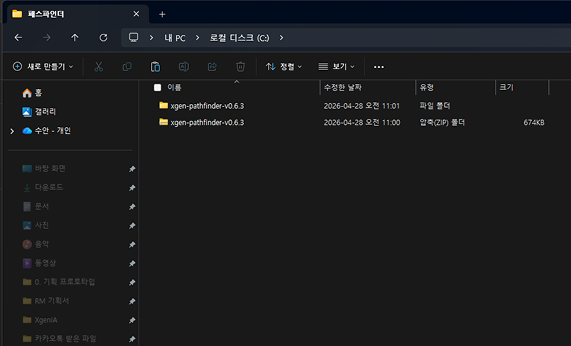
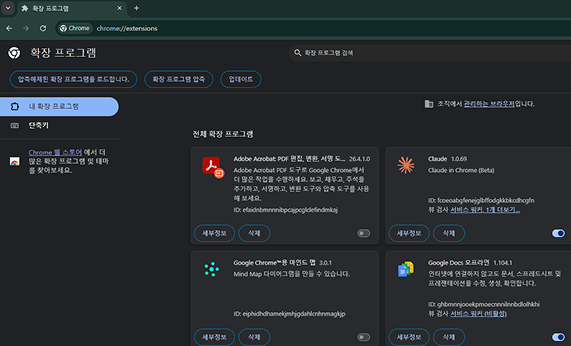
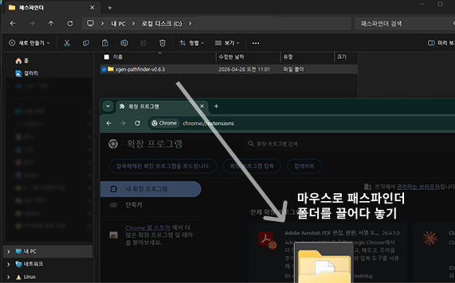
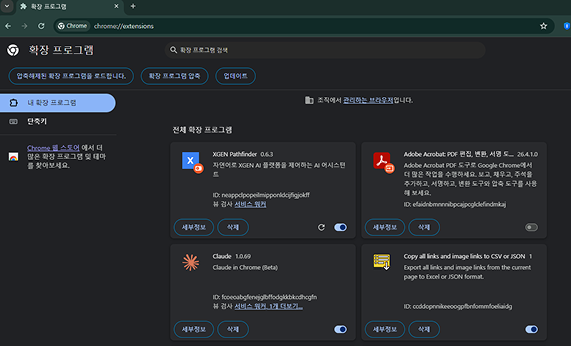
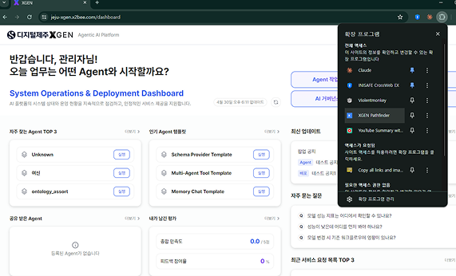
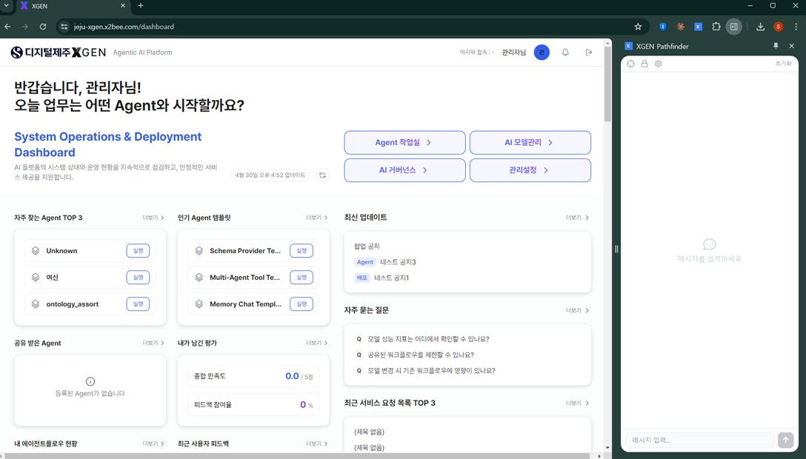
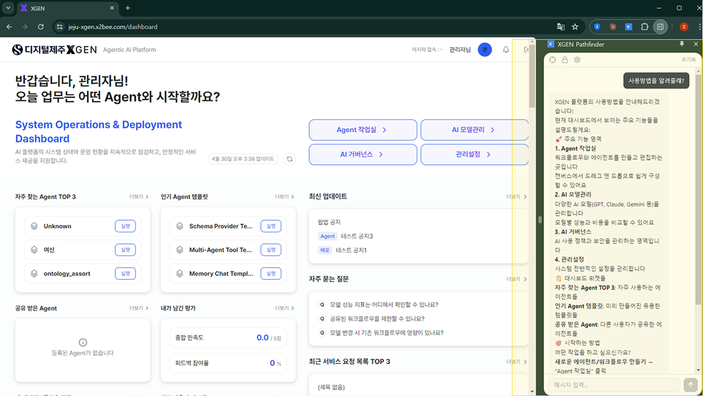
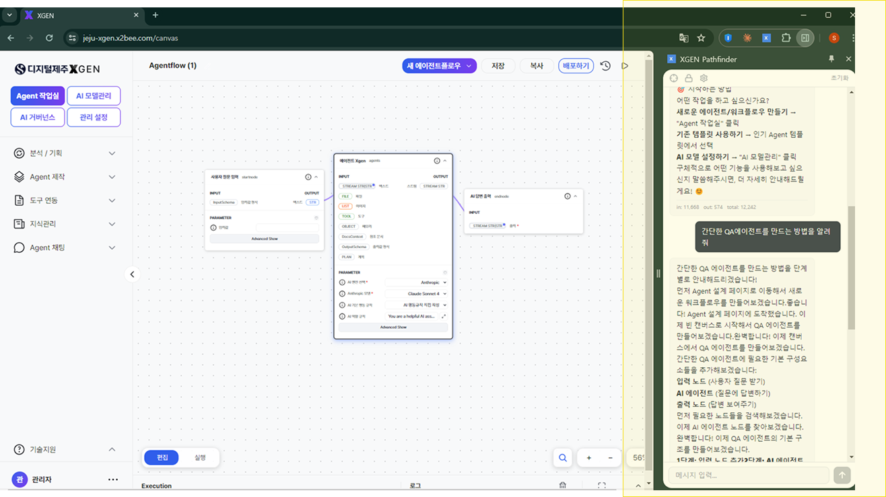

# 패스파인더 사용하기

본 챕터는 크롬 브라우저 확장 프로그램 **패스파인더(XGEN Pathfinder)** 의 설치·연동·사용 방법을 다룹니다. 패스파인더는 **XGEN 캔버스에서 AI 에이전트 워크플로우를 만드는 것을 도와주는 어시스턴트** 입니다. 대화만으로 필요한 노드를 찾아 캔버스에 구성해 주고, 외부 서비스를 도구로 연동하며, 화면 조작과 실시간 안내까지 제공합니다.

!!! note "에이전트 제작을 돕는 보조 도구"
    패스파인더는 XGEN 화면 안의 메뉴가 아니라, 크롬 브라우저에 별도로 설치하는 **확장 프로그램** 입니다. 설치 후 XGEN 에 로그인한 상태에서 동작하며, [에이전트 만들기](12-agentflow-create.md) 작업을 더 빠르게 진행하도록 보조합니다.

## 패스파인더로 할 수 있는 일

패스파인더는 다음과 같은 작업을 도와줍니다.

**🎨 워크플로우 제작**

- **대화로 에이전트 만들기** — "구글 뉴스 검색 에이전트 만들어줘" 처럼 말씀하시면 필요한 노드를 찾아 캔버스에 구성해 드립니다.
- **노드 추가·연결·삭제** — 캔버스에 노드를 배치하고 연결해 워크플로우를 완성합니다.
- **파라미터 설정** — 각 노드의 설정값을 조정합니다.

**🔧 도구 연동**

- **외부 서비스 연결** — 웹사이트에서 사용하는 기능을 XGEN 도구로 등록합니다.
- **API 자동 감지** — 외부 사이트에서 버튼 클릭 등의 동작을 분석해 도구로 만듭니다.

**🖱️ 페이지 조작**

- **메뉴 이동** — 원하는 페이지로 안내해 드립니다.
- **버튼 클릭·입력** — UI 조작을 대신 수행해 드립니다.

**💡 실시간 지원**

- **작업 맥락 기반 추천** — 현재 진행 중인 작업에 맞는 도움을 드립니다.
- **질문 답변** — XGEN 사용법이나 워크플로우 설계에 대해 안내해 드립니다.

## 1. 패스파인더 플러그인 다운로드 및 준비

목적 — 패스파인더 플러그인을 설치하기 위한 파일을 준비합니다.

1. 제공된 **패스파인더 압축 파일(.zip)** 을 다운로드합니다.
2. 압축 파일을 반드시 **폴더 형태로** 압축 해제합니다.



!!! warning "압축 해제 주의"
    - 압축(.zip) 상태 그대로는 설치할 수 없습니다 — 반드시 폴더로 풀어야 합니다.
    - 압축을 해제한 폴더 안에 **`manifest.json`** 파일이 있어야 정상적으로 설치됩니다.

## 2. 크롬 확장 프로그램에 추가

목적 — 패스파인더를 브라우저에 추가하여 XGEN 과 연동합니다.

1. 크롬 주소창에 다음을 입력해 확장 프로그램 관리 화면을 엽니다.

    ```
    chrome://extensions/
    ```

    

2. 화면 우측 상단의 **개발자 모드** 를 켭니다.
3. **압축 해제된 확장 프로그램을 로드** 버튼을 클릭합니다.

    

4. 1단계에서 압축을 해제한 **폴더** 를 선택합니다.

    

설치가 완료되면 확장 프로그램 목록에 **"XGEN Pathfinder"** 가 표시됩니다. 목록에 나타나면 정상적으로 설치된 것입니다.



!!! warning "자주 발생하는 오류"
    - **폴더가 아닌 zip 파일을 선택** 하면 설치에 실패합니다 — 1단계에서 폴더로 해제했는지 확인하세요.
    - **개발자 모드가 꺼져 있으면** *압축 해제된 확장 프로그램을 로드* 버튼이 보이지 않습니다.

## 3. 패스파인더 실행 및 XGEN 연동

목적 — 확장 프로그램을 통해 XGEN 플랫폼과 연결합니다.

1. 크롬 우측 상단의 **확장 프로그램 아이콘**(퍼즐 모양) 을 클릭합니다.
2. 목록에서 **XGEN Pathfinder** 를 선택합니다.
3. XGEN 화면으로 이동하면 자동으로 연동이 확인됩니다.



정상 동작 기준

- 화면 우측에 **사이드 패널** 또는 팝업 UI 가 활성화됩니다.
- **"Agent 생성/추천"** 관련 기능이 표시됩니다.

## 4. 패스파인더 사용 방법

목적 — 업무를 자동화하는 AI 에이전트를 빠르게 생성합니다.

패스파인더에게 만들고 싶은 업무를 대화로 전달하면, 필요한 노드를 찾아 캔버스에 워크플로우(Flow) 로 구성해 줍니다. 생성된 에이전트는 캔버스에서 노드와 연결선으로 시각적으로 표현됩니다.

사용 절차

1. **"어떤 Agent를 만들까요?"** 질문에 원하는 업무를 입력합니다.
2. 추천된 **템플릿** 을 선택한 뒤 생성을 진행합니다.

아래 동영상은 패스파인더로 업무를 입력하고 API를 만들어 에이전트를 생성하기까지의 전체 흐름을 보여줍니다.

<video controls muted playsinline preload="metadata" width="100%" style="max-width: 960px; border-radius: 8px;">
  <source src="images/pathfinder-09-usage.mp4" type="video/mp4">
  브라우저가 동영상 재생을 지원하지 않는 경우 <a href="images/pathfinder-09-usage.mp4">동영상을 내려받아</a> 확인해 주세요.
</video>





> 생성된 에이전트의 상세 편집·노드 구성은 [에이전트 만들기](12-agentflow-create.md) 챕터를 참고하세요.

## 5. 문제 해결 가이드

| 증상 | 점검 / 조치 |
|---|---|
| 확장 프로그램이 보이지 않을 때 | 크롬을 재시작하거나, 확장 프로그램을 **고정(pin)** 했는지 확인합니다. |
| XGEN 과 연동이 안 될 때 | XGEN **로그인 상태** 를 확인하고 페이지를 **새로고침** 합니다. |
| 에이전트 생성이 안 될 때 | 계정 **권한 설정** 또는 **네트워크 상태** 를 확인합니다. |

## 운영 권장사항

- 패스파인더는 에이전트 제작을 *보조* 하는 도구입니다. 생성 후에는 [에이전트 만들기](12-agentflow-create.md) · [에이전트 노드목록](12a-node-list.md) 을 참고해 흐름을 점검·보강하는 것을 권장합니다.
- 확장 프로그램은 설치한 브라우저에서만 동작합니다. 다른 PC·브라우저에서 사용하려면 같은 절차로 다시 설치해야 합니다.

## 문의

패스파인더 관련 문의는 Xgen 솔루션 관리자에게 문의해 주세요.
