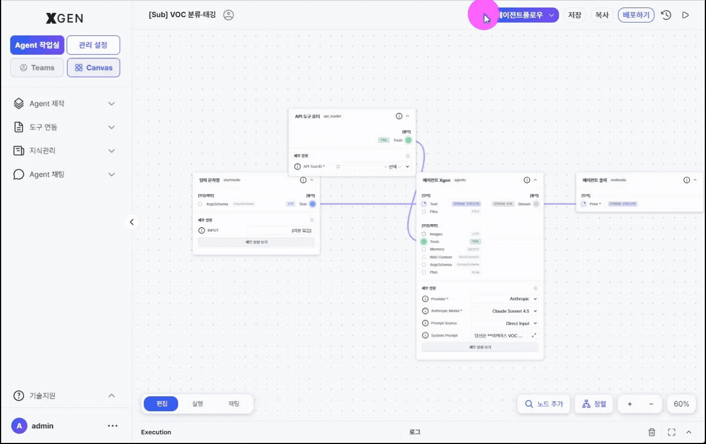

# Agent Operations

This chapter covers executing, deploying, sharing, and version-managing your agentflows.

## Execution and Debugging { #testing }

### Running Immediately from the Canvas

1. Click **Run** at the bottom-left of the canvas
2. Provide test input in the input modal
3. Execution results and logs appear in the bottom panel of the canvas

### Reading Execution Results

Each execution includes:

| Item | Korean | Description |
|---|---|---|
| Execution Order | 실행 순서 | Which nodes ran in what order |
| Tool Call | 도구 호출 | Arguments and responses for external tool invocations |
| Tool Result | 도구 결과 | Data returned by the tool |
| Citations | 인용 | Documents/assets the AI response referenced |
| Logs | 로그 | Step-by-step detailed logs |

When problems occur, expand the logs to find which node got stuck and what input it received.

## Deployment { #deployment }

This section walks through the **full path from request to live service**. The Agent Developer's own action ends with **submitting a deployment request**; the agent reaches end users only after two managerial approvals pass.

### Submit a deployment request — Agent Developer step { #request-deployment }

Open the **Deploy Info** modal from your agent's card action menu and flip the *Deploy* toggle on — that single action registers the request with the system.

1. In the left sidebar, go to **Agent Creation → Agent List** (`main-agentflow-management`).
2. On your own agent's card, expand the **⋯** (More) menu on the right and pick **Deploy Info**. If you are still editing on the canvas, save first, then come back through this path (the modal warns: *"Save the agentflow before deploying."*).
3. The **Deploy Settings** modal opens. The four tabs at the top (**Webpage / API / cURL / Embed**) determine how the agent will be exposed.

    | Mode | Description |
    |---|---|
    | Webpage | Chat interface accessible via browser |
    | API | REST API endpoint |
    | cURL | Auto-generated cURL command |
    | Embed | Snippet for embedding into external pages (popup or full-page) |

4. Flip the **Deploy toggle** (*Private ↔ Deploying*) at the top of the modal to ON. This toggle is the **single trigger that submits the deployment request**. For shared deployments you must select an **Agent Development Plan** before turning the toggle on — otherwise the modal returns the error *"Shared deployment requires an Agent Development Plan."*
5. As soon as the toggle is on, the card badge changes to **Deployment Pending** (`inquire_deploy: true`) — your request is now in the System Administrator's queue. There is nothing more to do on your side unless you choose to cancel by toggling it back off.

!!! info "Modal screenshot deferred"
    A screenshot of the modal showing the Deploy toggle, mode tabs (Webpage/API/cURL/Embed), and the Agent Development Plan picker will be added in a future manual update.

### What happens next — System Administrator + Governance Officer dual approval { #dual-approval-flow }

Flipping the Deploy toggle does **not** immediately publish the agent. It goes live only after the following two stages both pass.

| Stage | Reviewer | Where | Result |
|---|---|---|---|
| 0. Deploy request | **You (Agent Developer)** | Agent List → card dropdown → Deploy Info → Deploy toggle ON | Card badge *"Deployment Pending"* (`inquire_deploy: true`) |
| 1. Deployment approval | **System Administrator** | Admin Center → Agent Operations → Agent Management | Card badge *"Deployed"* (`is_accepted: true`, `is_deployed: true`) — full procedure in [Admin Manual · Agent Management — Deployment Approval](../admin/32-agent-operations.md#agent-mgmt-deploy-approval) |
| 2. Governance approval | **Governance Officer** | Admin Center → AI Governance → Agentflow Approval | `is_governance_accepted: true` — full procedure in [Admin Manual · Agent Approval](../admin/29-governance-dashboard.md#agent-approval) |
| ✅ Servable | — | Visible to end users only after stages 1 and 2 both pass | — |

Track progress on the [Dashboard · Agent deployment/approval status](18-dashboard.md) widget — the five counters map directly onto the stages above.

| Counter | What it means for your agent |
|---|---|
| Deployment pending | Awaiting System Administrator review |
| Deployment rejected | System Administrator rejected — card reverts to *"Not deployed"*; check the reason and resubmit after fixing |
| Governance pending | Cleared stage 1; awaiting Governance Officer review |
| Governance rejected | Governance Officer rejected — read the comment (`governance_review_comment`) and resubmit from stage 0 |
| Both approvals completed | Both passed; the agent is live for end users |

!!! warning "How to read rejection reasons"
    - **System Administrator rejection**: rejection notes are typically delivered out-of-band (chat, email). Confirm your team's operational channel in advance.
    - **Governance rejection**: re-open the **Deploy Info** modal, or — with the appropriate permission — read the *review comment* (`governance_review_comment`) directly on the governance review screen.

## Deployment Status

| Status | Korean | Meaning |
|---|---|---|
| Draft | 초안 | Saved but not deployed |
| Active | 활성 | Deployed and live |
| Inactive | 비활성 | Deployment paused (by admin or owner) |
| Archived | 보관됨 | No longer used |

Status is visible at a glance in the agentflow list.

## Sharing

Grant other users access to your agentflow.

1. Click the **Share** button on the target agentflow in the list
2. Search and select users
3. Choose permission

| Permission | Allowed Actions |
|---|---|
| Read | View, run |
| Read/Write | View, run, edit |

4. **Save**

## Version Management

Each save automatically creates a version. To roll back:

1. **Version History** menu on the target agentflow
2. Click **Restore This Version** on the desired version
3. Confirm in the dialog → **Restore**

!!! info "Version-history modal screenshot deferred"
    A screenshot of the version history modal with the "Restore this version" buttons will be added in a future manual update.

!!! warning "Restore Creates a New Version"
    Restoring does not overwrite — it creates a **new version** containing the content of the chosen one. Previous versions are preserved.

## Scheduled Automatic Runs { #scheduler }

For agentflows that should run on a schedule:

1. Agentflow detail → **Scheduler** tab
2. **+ Add Schedule**
3. Choose frequency

| Frequency | Korean | Description |
|---|---|---|
| Daily | 매일 | Once per day |
| Weekly | 매주 | A specific day each week |
| Monthly | 매월 | A specific date each month |
| Cron | Cron | Complex patterns (e.g., weekdays at 9 AM) |

4. Configure start time / timezone / input
5. **Save**

To pause: click **Pause** on the schedule card. To resume: click **Resume**.

## Operational Recommendations

- **Test thoroughly before deploying** — Run 5–10 times with varied inputs on the canvas to confirm stability
- **Monitor the first 24 hours after deployment** — Check execution logs frequently to catch anomalies early
- **Save explicit versions at meaningful moments** — Saving before/after major changes makes rollback easier

## Contact

For questions about agent operations, please contact {{vars.support_email}}.
