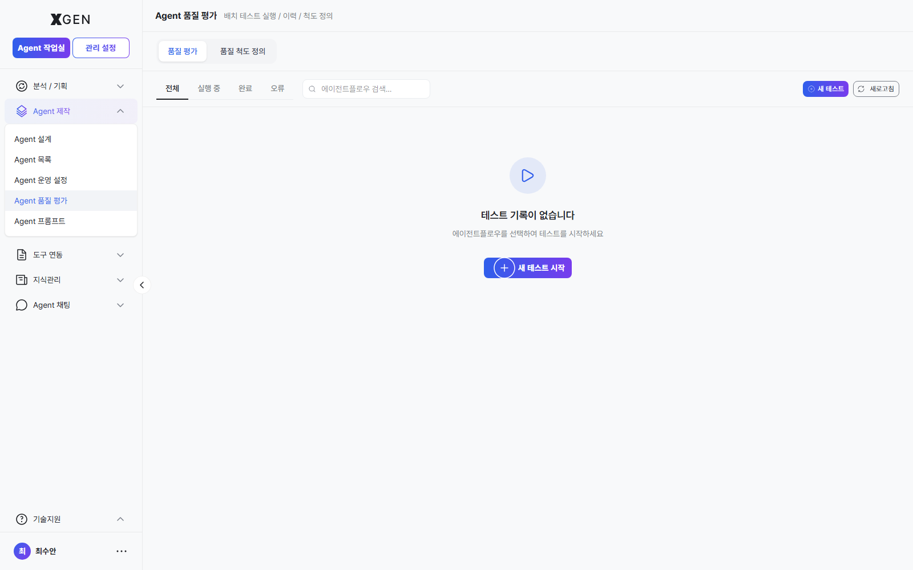
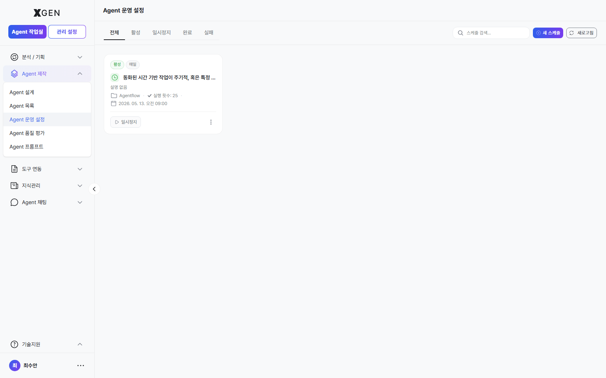

# 에이전트 운영

본 챕터는 만든 에이전트플로우를 실행·배포·공유·버전 관리하는 절차를 다룹니다.

## 실행과 디버깅 { #testing }

### 캔버스에서 즉시 실행

1. 캔버스 상단 **실행** 버튼 클릭
2. 입력값 모달에서 테스트 입력 제공
3. 우측 또는 하단 패널에 실행 결과·로그 표시

### 실행 결과 보기

각 실행은 다음 정보를 포함합니다.

| 항목 | 영문 | 설명 |
|---|---|---|
| 실행 순서 | Execution Order | 어떤 노드가 어느 순서로 실행됐는지 |
| 도구 호출 | Tool Call | 외부 도구 호출 인자와 응답 |
| 도구 결과 | Tool Result | 도구가 반환한 데이터 |
| 인용 | Citations | AI 응답이 참고한 문서·자료 |
| 로그 | Logs | 단계별 상세 로그 |

문제 발생 시 로그를 펼쳐 어느 노드에서 막혔는지, 어떤 입력을 받았는지 확인합니다.

## 배포 { #deployment }

본 절은 에이전트가 **실제로 사용자에게 서비스되기까지 거치는 전체 흐름** 을 다룹니다. Agent 개발자가 직접 수행하는 단계는 **배포 요청** 까지이며, 이후 두 단계 관리 승인을 거쳐야 운영 환경에 노출됩니다.

### 배포 요청 보내기 — Agent 개발자 단계 { #request-deployment }

검증이 끝난 에이전트는 카드 액션 메뉴에서 **배포 정보** 모달을 열어 *배포 토글* 을 켜는 방식으로 시스템에 배포 요청을 등록합니다.

1. 좌측 사이드바 **Agent 제작 → Agent 목록**(`main-agentflow-management`)으로 이동.
2. 본인이 작성한 에이전트 카드의 우측 **⋯**(더보기) 메뉴를 펼치고 **배포 정보** 항목을 선택. 캔버스에서 작성 중이라면 먼저 저장한 뒤 같은 경로로 이동합니다 (모달 안내: "배포하려면 먼저 에이전트플로우를 저장해야 합니다").
3. **배포 설정** 모달이 열리면 상단의 4개 탭(**웹페이지 / API / cURL / 임베드**) 중 노출 방식을 확인합니다. 모드별 의미는 아래 표와 같습니다.

    | 모드 | 설명 |
    |---|---|
    | 웹페이지 | 사용자가 브라우저로 접속하는 채팅 인터페이스 |
    | API | REST API 엔드포인트로 호출 |
    | cURL | API 호출용 cURL 명령어 자동 생성 |
    | 임베드 | 외부 웹페이지에 삽입하는 코드 (팝업/전체페이지 모드) |

4. 모달 상단의 **배포 토글**(*비공개 ↔ 배포 중*)을 ON 으로 전환합니다. 이 토글이 **배포 요청을 보내는 단일 트리거** 입니다. 공유 배포 시에는 토글이 켜지기 전에 **Agent 개발 기획서** 를 먼저 선택해야 하며, 미선택 상태로 토글을 켜면 *"공유 배포에는 Agent 개발 기획서 선택이 필요합니다."* 오류가 노출됩니다.
5. 토글 ON 직후 카드 배지가 **배포 대기**(`inquire_deploy: true`) 로 바뀝니다 — 시스템 관리자 큐로 전송된 상태이며, 이 시점부터는 *본인이 모달을 다시 열어도 토글을 끄지 않는 한* 추가 조작 없이 결과를 기다립니다.

!!! info "모달 캡처는 다음 회차"
    배포 토글, 모드 탭(웹페이지/API/cURL/임베드), Agent 개발 기획서 선택기를 보여주는 모달 캡처는 본인 소유 에이전트가 있는 계정으로 다음 회차 캡처 예정입니다. 본 절은 동작 설명을 stg 화면 흐름에 맞춰 정확히 기술하므로 캡처 부재가 절차 이해에 영향을 주지 않습니다.

### 이후 흐름 — 시스템 관리자 + 거버넌스 담당자의 이중 승인 { #dual-approval-flow }

배포 토글을 켠 *순간* 부터 사용자 검색·실행에 노출되는 것이 아니라, 다음 두 단계 모두를 통과해야 서비스 활성화됩니다.

| 단계 | 담당 | 위치 | 결과 |
|---|---|---|---|
| 0. 배포 요청 | **본인 (Agent 개발자)** | Agent 목록 → 카드 dropdown → 배포 정보 → 배포 토글 ON | 카드 배지 *"배포 대기"* (`inquire_deploy: true`) |
| 1. 배포 승인 | **시스템 관리자** | 관리 설정 → Agent 운영 → Agent 관리 | 카드 배지 *"배포됨"* (`is_accepted: true`, `is_deployed: true`) — 자세한 절차는 [관리자 매뉴얼 · Agent 관리 — 배포 승인](../admin/32-agent-operations.md#agent-mgmt-deploy-approval) |
| 2. 거버넌스 승인 | **거버넌스 담당자** | 관리 설정 → AI 거버넌스 → 에이전트플로우 승인 | `is_governance_accepted: true` — 자세한 절차는 [관리자 매뉴얼 · 에이전트 승인](../admin/29-governance-dashboard.md#agent-approval) |
| ✅ 서비스 가능 | — | 1·2 완료된 시점부터 사용자 검색·실행에 노출 | — |

진행 상황은 [대시보드 · Agent 배포/승인 상태](18-dashboard.md) 위젯의 5개 카운터로 직접 추적할 수 있습니다.

| 위젯 카운터 | 본인 에이전트가 이 상태일 때 의미 |
|---|---|
| 배포 승인 대기 | 시스템 관리자 검토 대기 중 |
| 배포 승인 거절 | 시스템 관리자가 거부 — 카드 배지 *"미배포"* 로 복귀, 사유 확인 후 보완 재요청 |
| 거버넌스 승인 대기 | 시스템 관리자 승인 통과, 거버넌스 담당자 검토 대기 중 |
| 거버넌스 승인 거절 | 거버넌스 담당자가 반려 — 모달 코멘트의 반려 사유를 확인 후 0단계부터 재요청 |
| 배포·거버넌스 승인완료 | 양쪽 통과, 서비스 활성화됨 |

!!! warning "거부·반려 사유 확인 경로"
    - **시스템 관리자 거부**: 작성자에게 별도 채널(메신저·메일)로 통보되는 게 일반적입니다. 사내 운영 정책에 따라 달라지므로 사전에 확인해 두세요.
    - **거버넌스 반려**: 카드의 **배포 정보** 를 다시 열거나 거버넌스 화면 상세에서 *심사 코멘트*(`governance_review_comment`) 를 직접 조회할 수 있습니다 (해당 권한 한정).

## 배포 상태

| 상태 | 영문 | 의미 |
|---|---|---|
| 초안 | Draft | 저장됐으나 배포되지 않음 |
| 활성 | Active | 배포되어 운영 중 |
| 비활성 | Inactive | 배포 중단 (관리자 또는 작성자가 일시 정지) |
| 보관됨 | Archived | 더 이상 사용하지 않음 |

상태는 에이전트플로우 목록에서 한눈에 확인 가능합니다.

## 공유

다른 사용자에게 에이전트플로우 접근권을 부여합니다.

1. 에이전트플로우 목록에서 대상의 **공유** 버튼 클릭
2. 사용자 검색·선택
3. 권한 선택

| 권한 | 가능한 작업 |
|---|---|
| 읽기 | 보기, 실행 |
| 읽기/쓰기 | 보기, 실행, 편집 |

4. **저장**

## 버전 관리

저장할 때마다 자동으로 버전이 기록됩니다. 이전 버전으로 되돌리려면:

1. 에이전트플로우 목록에서 대상의 **버전 기록** 메뉴
2. 원하는 버전의 **이 버전으로 되돌리기** 클릭
3. 확인 모달에서 **되돌리기** 클릭

!!! info "버전 기록 모달 캡처는 다음 회차"
    버전 목록과 "이 버전으로 되돌리기" 버튼이 노출되는 모달 캡처는 본인 소유 에이전트가 여러 버전 누적된 계정에서 다음 회차에 캡처 예정입니다.

!!! warning "되돌리기는 새 버전을 만듭니다"
    이전 버전으로 되돌려도 그 버전이 덮어쓰는 게 아니라, 그 내용을 가진 **새 버전**이 생성됩니다. 이전 버전들은 그대로 보존됩니다.

## 스케줄 자동 실행 { #scheduler }

정기적으로 자동 실행해야 하는 에이전트플로우는 스케줄을 설정합니다.

1. 에이전트플로우 상세 → **스케줄러** 탭
2. **+ 스케줄 추가**
3. 주기 선택

| 주기 | 영문 | 설명 |
|---|---|---|
| 매일 | Daily | 매일 한 번 |
| 매주 | Weekly | 매주 특정 요일 |
| 매월 | Monthly | 매달 특정 날짜 |
| Cron | Cron | 복잡한 패턴 (예: 평일 오전 9시) |

4. 시작 시간 / 시간대 / 입력값 설정
5. **저장**

스케줄 일시정지: 스케줄 카드의 **일시정지** 버튼. 다시 시작은 **재개**.

## 운영 권장사항

- **배포 전 충분히 테스트** — 캔버스에서 다양한 입력으로 5~10번 실행해 응답 안정성 확인
- **배포 후 첫 24시간 모니터링** — 실행 로그를 자주 확인하여 비정상 패턴 조기 발견
- **버전은 의미 있는 시점에 명시 저장** — 큰 변경 전후로 명시적으로 저장하면 되돌리기 쉬움

## 문의

에이전트 운영 관련 문의는 {{vars.support_email}} 로 연락해 주세요.
