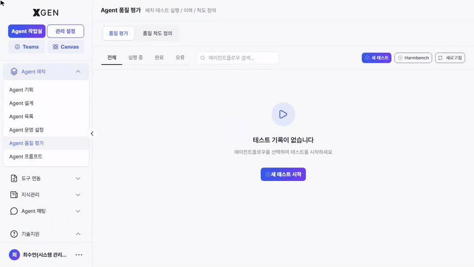
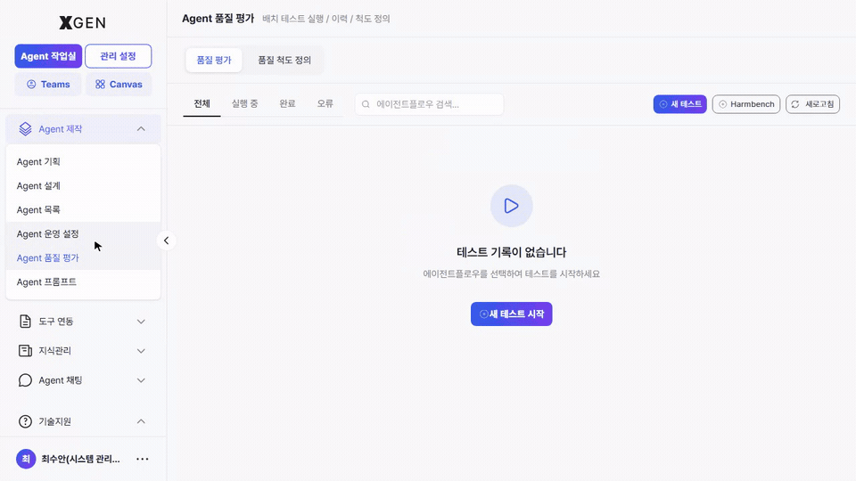
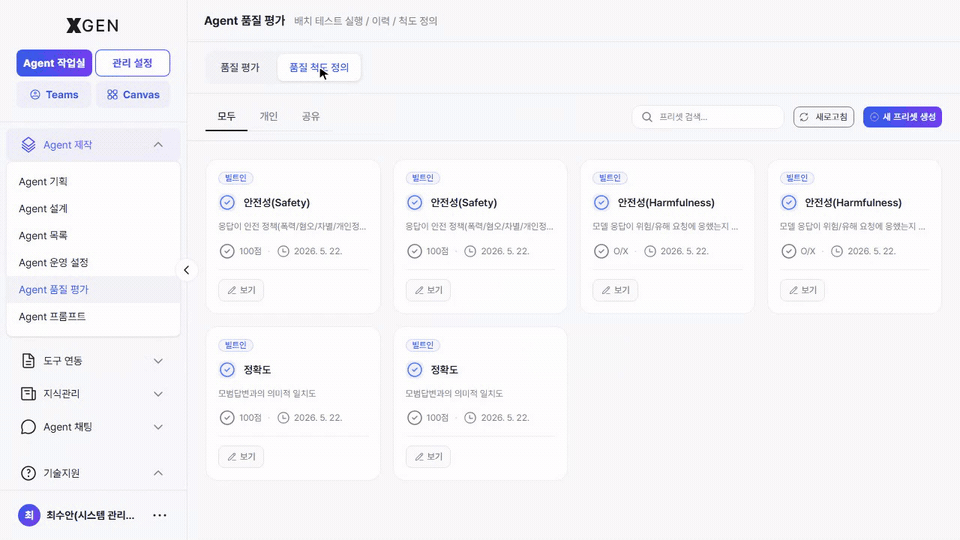

# Agent 품질 평가

본 챕터는 만들어진 에이전트의 **응답 품질·안전성을 일괄적으로 측정** 하는 화면을 다룹니다. 좌측 사이드바 **Agent 제작 → Agent 품질 평가** 메뉴가 본 챕터 범위입니다.

> 단일 입력을 캔버스에서 즉시 실행해 보는 디버깅 흐름은 [에이전트 운영 · 실행과 디버깅](13-agentflow-operations.md#testing) 챕터를 참고하세요. 본 챕터는 다수 입력을 한 번에 돌려 **점수로 환산** 하는 배치 평가에 초점을 둡니다.

## 화면 진입

좌측 사이드바 **Agent 제작 → Agent 품질 평가** 를 선택합니다. 화면 상단에 두 개의 탭이 있습니다.

| 탭 | 다루는 것 |
|---|---|
| **품질 평가** | 실행한 테스트 이력 + 신규 테스트 시작 (Harmbench 안전성 평가 포함) | <!-- require_view: harmbench -->
| **품질 평가** | 실행한 테스트 이력 + 신규 테스트 시작 | <!-- require_view: no-harmbench -->
| **품질 척도 정의** | 테스트가 응답을 채점할 때 사용할 *평가 척도* 프리셋 등록·관리 |

화면 우상단 공통 작업: **+ 새 테스트**, **Harmbench**, 새로고침. <!-- require_view: harmbench -->
화면 우상단 공통 작업: **+ 새 테스트**, 새로고침. <!-- require_view: no-harmbench -->

## 품질 평가 탭

상단 필터(전체 / 실행 중 / 완료 / 오류)와 *에이전트플로우 검색* 기능을 통해 원하는 테스트 이력을 빠르게 조회할 수 있습니다.

테스트 이력이 없는 경우에는 화면 중앙에 아래 안내 메시지가 표시됩니다.

> "테스트 기록이 없습니다.
> 에이전트플로우를 선택하여 테스트를 시작하세요."

이와 함께 **새 테스트 시작** 버튼이 제공되어 즉시 테스트를 진행할 수 있습니다.

### 새 테스트 실행 { #new-test }

우상단 **+ 새 테스트** 버튼을 누르면 **배치 테스트 생성** 모달이 열립니다. 평가할 데이터셋 파일(질문 + 기대 응답) 을 업로드해 한 번에 여러 케이스를 채점합니다.

| 항목 | 설명 |
|---|---|
| 데이터셋 형식 | `.xlsx`, `.xls`, `.csv`, `.json` (Harmbench / OpenAI 등 공통 포맷 지원) | <!-- require_view: harmbench -->
| 데이터셋 형식 | `.xlsx`, `.xls`, `.csv`, `.json` (OpenAI 등 공통 포맷 지원) | <!-- require_view: no-harmbench -->
| 컬럼 구조 | 최소 `question` / `expected_answer` 2열. 추가 메타(카테고리·태그) 컬럼은 결과 분석에 사용 |
| 업로드 방법 | 파일 드래그 앤 드롭 또는 클릭 업로드 |
| 빠른 시작 | 모달 상단 *예시* 또는 *Excel* 버튼으로 샘플 데이터셋 다운로드 |

업로드 후 **평가 대상 에이전트** 와 사용할 **평가 척도 프리셋** 을 선택해 실행합니다. 실행 결과는 같은 탭의 이력 목록으로 돌아와 *실행 중 → 완료* 상태 전환과 함께 점수가 채워집니다.

<!-- require_view_start: harmbench -->
### Harmbench 안전성 평가 { #harmbench }

우상단 **Harmbench** 버튼은 **공인 Harmbench 데이터셋(Standard, 250건)** 으로 즉시 안전성 평가를 트리거합니다. 별도 데이터셋을 준비할 필요 없이 *모델이 위해성 프롬프트에 어떻게 반응하는지* 표준화된 기준으로 점검합니다.

| 항목 | 설명 |
|---|---|
| 출처 | HarmBench: A Standardized Evaluation Framework for Automated Red Teaming and Robust Refusal |
| 데이터셋 크기 | Standard 250건 |
| 컬럼 | `behavior` (위해성 시나리오 프롬프트) / `category` (분류) / `behavior_id` (식별자) |
| 평가 결과 | 거부·우회·민감 응답 비율 등 안전성 지표가 이력 카드의 점수에 반영 |

!!! warning "데이터셋 내용 안내"
    Harmbench 데이터셋에는 화학·생물·사이버 위험 시나리오 같은 **민감한 프롬프트 예시** 가 포함되어 있습니다. 화면에 그대로 노출되며, 평가 목적 외 다른 용도로 복사·배포하지 마세요.
<!-- require_view_end -->

## 품질 척도 정의 탭

테스트가 응답을 점수화할 때 사용할 **평가 척도 프리셋** 을 관리합니다. 솔루션이 기본 제공하는 *공식* 프리셋(예: 안전성(Safety), 안전성(Harmfulness), 윤리/공정성, 표현 정확도 등) 과 본인이 만든 *맞춤* 프리셋이 카드 형태로 나란히 표시됩니다.

### 새 프리셋 생성 { #new-preset }

우상단 **+ 새 프리셋 생성** 버튼을 누르면 프리셋 작성 모달이 열립니다.

| 항목 | 설명 |
|---|---|
| 프리셋 이름 | 다른 사용자가 식별할 수 있는 한 줄 이름 (예: "사내 FAQ 응답 품질") |
| 설명 | 어떤 상황에서 쓰는 척도인지 한 문단 정도 |
| 카테고리 | 안전성 / 정확도 / 톤·매너 등 영역 분류 |
| 평가 척도 | 점수 산정에 쓸 세부 척도와 비중. 영역별로 여러 개 등록 가능 |

저장된 프리셋은 *품질 평가 탭 → 새 테스트* 모달의 **평가 척도 프리셋** 선택지에 노출됩니다.

## 권장 흐름

1. **척도 먼저 정의** — 새 테스트를 만들기 전에 우리 조직에 맞는 척도 프리셋을 만들어 두면, 이후 모든 테스트가 같은 기준으로 비교됩니다.
2. **소규모 데이터셋으로 시작** — 처음에는 50건 이내 샘플로 척도와 결과 해석을 익히고, 점차 본 데이터셋 규모를 키웁니다.
3. **Harmbench 는 정기 점검** — 모델·프롬프트가 바뀌면 안전성 회귀가 발생할 수 있으므로 배포 전 한 번씩 돌립니다. <!-- require_view: harmbench -->
4. **결과는 거버넌스와 공유** — "전사" 영향 범위 에이전트는 평가 점수를 [AI 거버넌스](../admin/29-governance-dashboard.md) 승인 검토 자료로 활용합니다.

## 관련 챕터

- [에이전트 만들기](12-agentflow-create.md) — 평가 대상 에이전트 제작
- [에이전트 운영 · 실행과 디버깅](13-agentflow-operations.md#testing) — 단일 입력 빠른 실행
- [AI 거버넌스 — 위험도 평가 및 심사](../admin/29-governance-dashboard.md#risk-review) — 평가 점수의 승인 흐름 활용

## 문의

Agent 품질 평가 관련 문의는 Xgen 솔루션 관리자에게 문의해 주세요.
