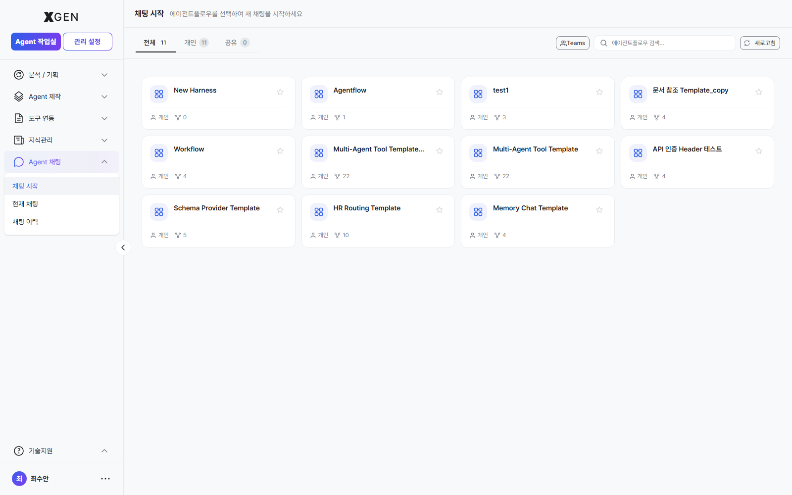
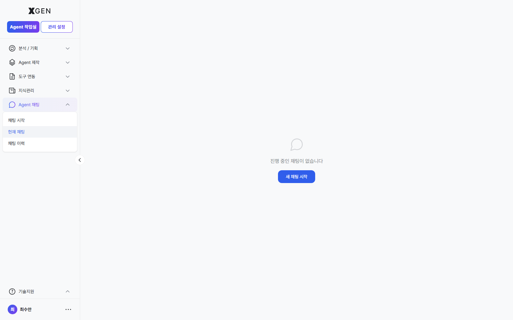
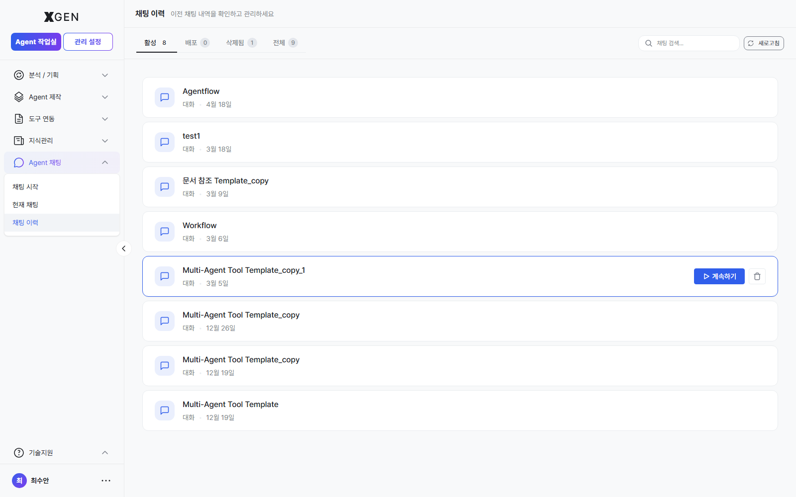

# Using Chat

This chapter covers the chat interface for conversing with agents.

## Starting Chat { #new-chat }

Select **Agent Chat** in the left sidebar.

## New Chat

1. Click **+ New Chat** at the top left of the chat screen
2. (If applicable) select the agentflow to use
3. Type your message in the input box → Enter or click **Send**

Each chat session appears in the left list.

## Exchanging Messages

| Display | Meaning |
|---|---|
| User message | Right-aligned (usually blue background) |
| Agent response | Left-aligned (usually gray background) |
| Tool call | Shown as a separate box within the response (external API, search, etc.) |
| Citations | Source links at the bottom of the response |

## Citations

When the agent references a knowledge collection in its answer, sources appear at the bottom of the response.

- Click a citation → view the original (separate panel or new window)
- Use citations to evaluate answer trustworthiness

## Tool Call Results

When the agent invokes an external tool or database, the call's arguments and return values are shown within the response.

!!! info "Why Tool Calls Are Visible"
    Showing tool calls lets users verify what data the AI used and how. Inspect this area when a response seems suspicious.

## Chat History { #chat-history }

The **Chat History** menu in the left sidebar lets you browse past sessions in chronological order. Clicking a session restores that conversation in full.

## Current Chat / New Chat { #current-chat }

| Menu | Behavior |
|---|---|
| Current Chat | An ongoing session (selected from the left list) |
| New Chat | Starts a fresh session. Prior conversation context is not carried over |

When a conversation grows long or shifts topic, starting a **New Chat** typically yields better responses.

<!-- require_view_start: chat-export -->
## Exporting Conversations

Top-right menu (⋯) → **Export** options:

| Format | Use |
|---|---|
| Text | Notes, sharing |
| Markdown | Pasting into reports or wikis |
| PDF | Printing, archival |

<!-- require_view_end -->

## Security Notice

!!! warning "Caution When Entering Sensitive Information"
    Chat content is retained by the system for audit logs, embedding, and other purposes. Do **not** enter the following in chat:

    - Passwords, API keys
    - National ID numbers and other PII
    - Confidential company information (per data classification policy)

## Contact

For chat-related questions, please contact the Xgen Solution Administrator.
