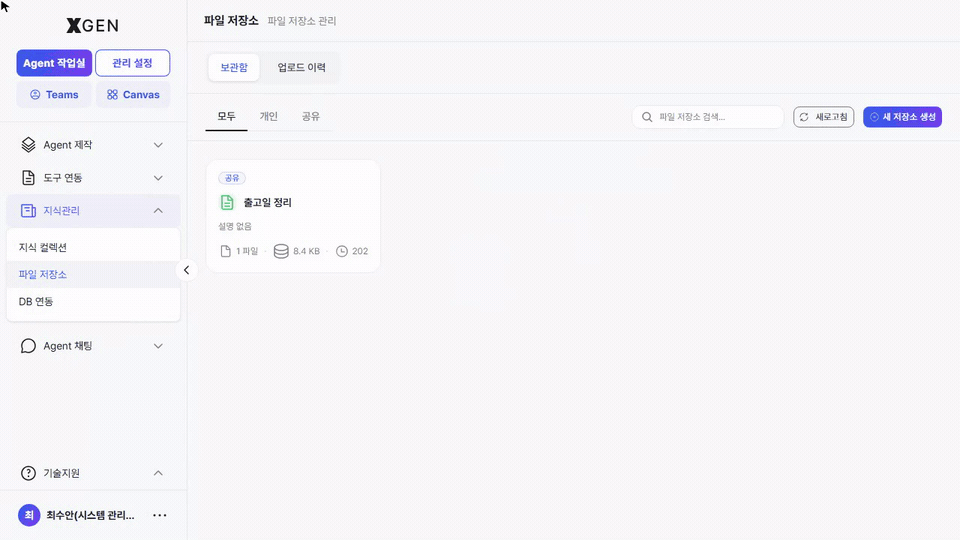
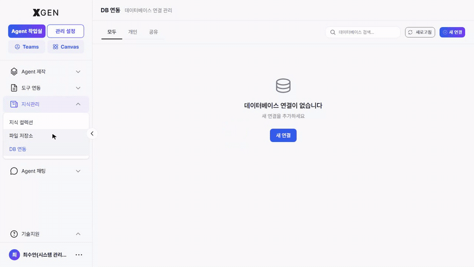

---
require_view:
  - knowledge-collection
  - knowledge-storage
  - knowledge-database
---
# Knowledge Management

This chapter covers building and operating collections of knowledge assets that agents can reference.

## What Is a Collection

A **collection** is a knowledge storage unit grouping related documents. The retrieval node in an agentflow searches at the collection level.

| Term | Description |
|---|---|
| Collection | A group of documents |
| Document | An individual asset within a collection (PDF, Word, text, etc.) |
| Chunk | A small text segment a document is split into for embedding |
| Embedding | A search-ready vector derived from a chunk |

See the [Glossary](../common/01-glossary.md) for full terminology.

## Collection List { #knowledge-collection }

Select **Knowledge Management → Knowledge Collections** in the left sidebar.

| Tab | Shows |
|---|---|
| Storage | Collections you created |
| Shared | Collections others shared with you |
| All | All collections you can access |

## Creating a Collection

1. Click **+ New Collection** at the top right
2. Enter:
    - **Name**: identifiable name (Korean or English)
    - **Description** (optional): one-line summary
    - **Encryption** (optional): set a password if enabling password protection
    - **Expiration date** (optional): auto-delete date. Leave empty for permanent retention
3. **Create**

!!! info "Button label"
    The actual solution button label is **"새 컬렉션 생성" / "Create New Collection"**.

## Document Upload

1. Collection detail → **Upload** button
2. Select files (PDF, DOCX, TXT, MD, etc.) — multi-select supported
3. Configure embedding options (defaults recommended)

| Option | Korean | Meaning | Default |
|---|---|---|---|
| Chunk Size | 청크 크기 | Max characters per chunk | 1000 |
| Chunk Overlap | 청크 오버랩 | Overlap between adjacent chunks | 200 |
| Ontology | 온톨로지 | Auto-extract concepts and relationships | Enabled |
| PII Scan | PII 스캔 | Auto-detect and mask PII | Enabled |

4. **Start Upload** → progress bar appears

!!! info "Processing Time After Upload"
    Large documents take time to embed. Track progress in the **Upload History** tab. You can continue other work during processing.

## Upload History { #upload-history }

Check status and results of uploaded documents.

| Status | Meaning |
|---|---|
| Queued | In the processing queue |
| Processing | Chunking and embedding underway |
| Completed | Searchable |
| Failed | Error occurred (check logs) |

## Sharing a Collection

Grant other users access:

1. Collection detail → **Share** button
2. Search and select users
3. Choose permission (Read / Read·Write)
4. **Save**

## File Storage { #storage }

Besides uploaded files, **File Storage** (system file resources) can serve as a source for collections. From **Knowledge Management → File Storage** in the left sidebar, click **+ New Storage** at the top right to open the creation modal and enter the storage name, description, and encryption toggle.

| Field | Description |
|---|---|
| Storage name | A one-liner identifiable to others |
| Description | A paragraph about what this storage holds |
| Encryption | Whether to protect the storage with a password |

## DB Integration { #database }

**DB Integration** (tables / views from external databases) is also available as a source. From **Knowledge Management → DB Integration** in the left sidebar, click **+ New Connection** at the top right to open the database connection registration modal.

| Field | Description |
|---|---|
| Connection name | A one-liner identifiable to others |
| Description | A paragraph about which database this is and its purpose |
| Custom password | An optional access password specific to this connection |
| Database type | PostgreSQL, MySQL, etc. — pick from the dropdown |

Table- and column-level documentation (descriptions, sample values, policies) is managed on a separate *DB Documentation* screen and is only reachable once at least one DB connection has been registered.

## Operational Recommendations

- **Separate collections by purpose** — Different audience or classification criteria warrant separate collections. Cramming too much into one degrades retrieval quality.
- **Periodic cleanup** — Remove or set expirations on outdated and duplicate documents.
- **Verify PII policy** — For documents containing personal information, confirm that PII Scan is enabled.

## Contact

For knowledge management questions, please contact the Xgen Solution Administrator.
