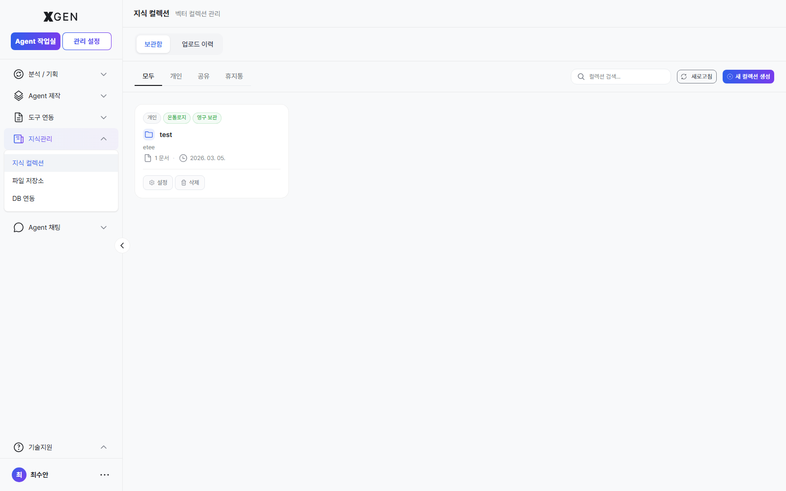
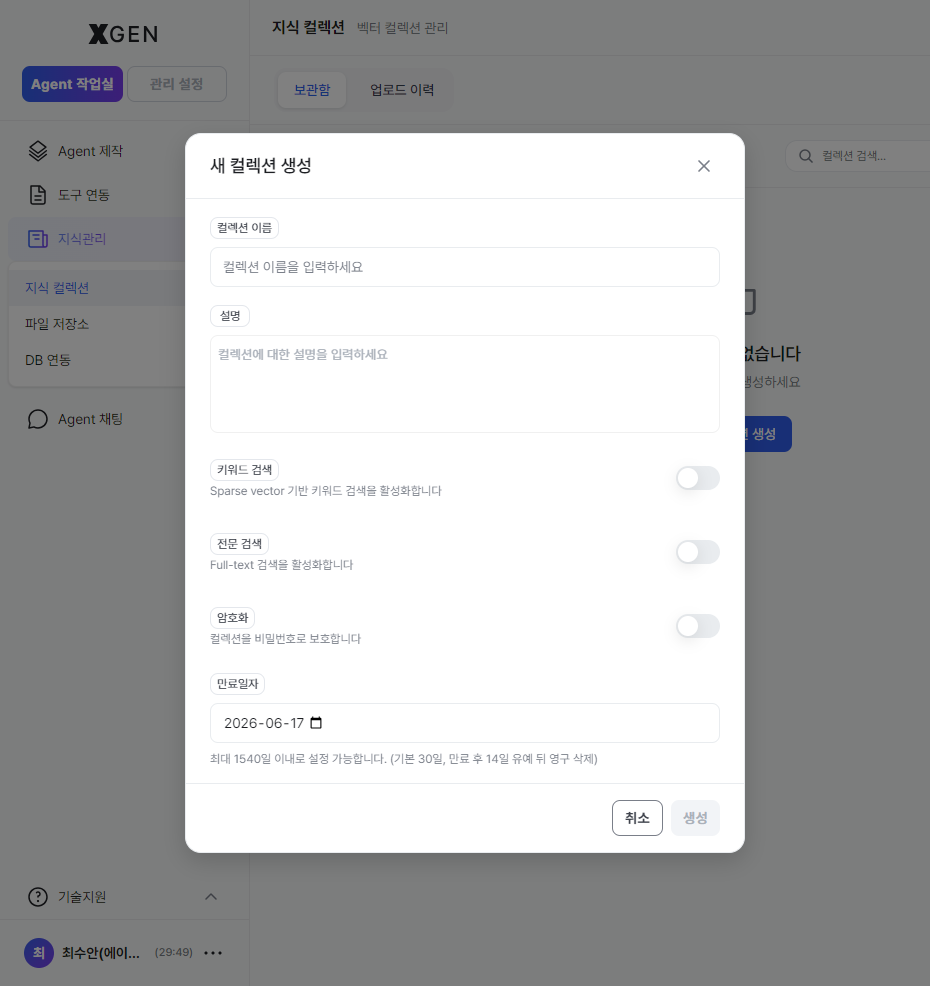
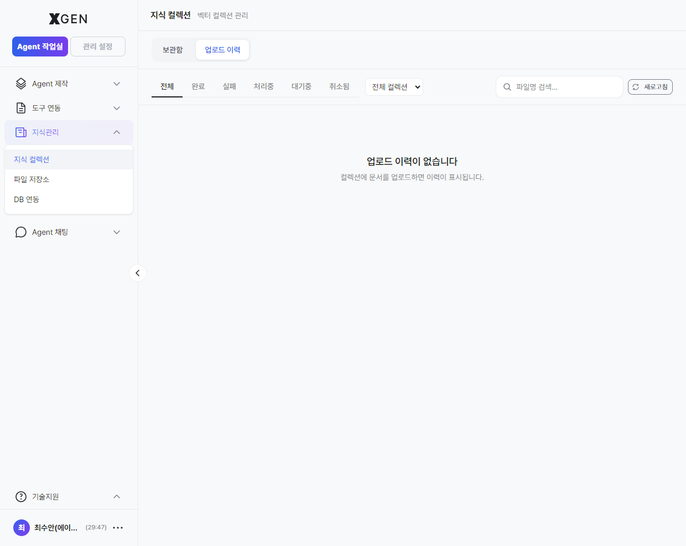
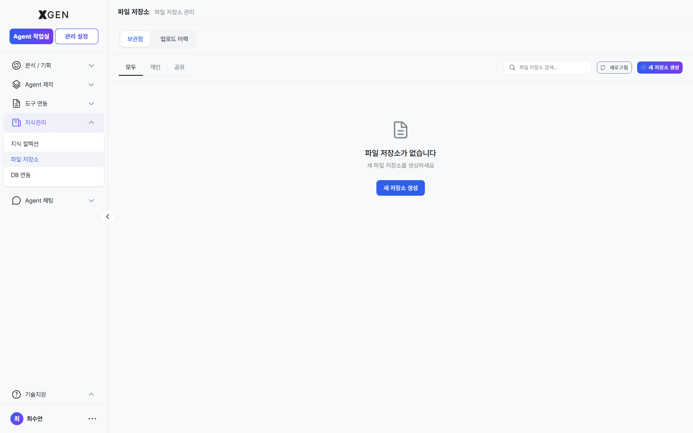
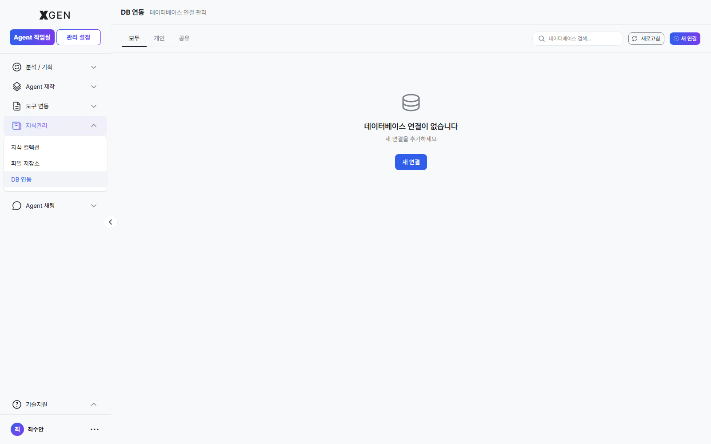

# 지식 관리

본 챕터는 에이전트가 참조할 수 있는 지식 자료를 컬렉션으로 만들고 운영하는 절차를 다룹니다.

## 컬렉션이란

**컬렉션(Collection)** 은 관련된 문서들을 묶은 지식 저장 단위입니다. 에이전트플로우의 검색 노드는 컬렉션 단위로 검색합니다.

| 용어 | 설명 |
|---|---|
| 컬렉션 | 문서 그룹 |
| 문서 | 컬렉션 안의 개별 자료 (PDF, 워드, 텍스트 등) |
| 청크 | 임베딩 처리를 위해 문서를 잘게 자른 텍스트 조각 |
| 임베딩 | 청크를 검색용 벡터로 변환한 결과 |

자세한 용어는 [용어 정의](../common/01-glossary.md)를 참고하세요.

## 컬렉션 목록

좌측 사이드바에서 **지식관리 → 지식 컬렉션** 메뉴를 선택합니다.

| 탭 | 표시 항목 |
|---|---|
| 보관함 | 본인이 만든 컬렉션 |
| 공유 | 다른 사용자가 공유한 컬렉션 |
| 전체 | 접근 가능한 모든 컬렉션 |

## 컬렉션 생성

1. 우상단 **+ 새 컬렉션 생성** 버튼 클릭
2. 다음 항목 입력
    - **이름**: 식별 가능한 한글/영문 이름
    - **설명** (선택): 무슨 자료인지 한 줄 요약
    - **암호화** (선택): 비밀번호 보호 활성화 시 비밀번호 설정
    - **만료일자** (선택): 자동 삭제 날짜. 영구 보관 시 비움
3. **생성**

!!! info "버튼 라벨 안내"
    실제 stg 화면의 버튼 라벨은 **"새 컬렉션 생성"** 입니다.

## 문서 업로드

1. 컬렉션 상세 화면 → **업로드** 버튼
2. 파일 선택 (PDF, DOCX, TXT, MD 등) — 다중 선택 가능
3. 임베딩 옵션 설정 (기본값 사용 권장)

| 옵션 | 영문 | 의미 | 기본값 |
|---|---|---|---|
| 청크 크기 | Chunk Size | 한 청크의 최대 문자 수 | 1000 |
| 청크 오버랩 | Chunk Overlap | 청크 간 겹치는 부분 | 200 |
| 온톨로지 | Ontology | 개념·관계 자동 추출 | 사용 |
| PII 스캔 | PII Scan | 개인정보 자동 탐지·마스킹 | 사용 |

4. **업로드 시작** → 진행률 표시

!!! info "업로드 후 처리 시간"
    문서가 큰 경우 임베딩 처리에 시간이 걸립니다. 진행률은 **업로드 이력** 탭에서 확인 가능. 처리 완료 전에도 다른 작업은 가능합니다.

## 업로드 이력

업로드한 문서의 처리 상태와 결과를 확인합니다.

| 상태 | 의미 |
|---|---|
| 대기 | 처리 큐에 들어감 |
| 처리 중 | 청크 분할·임베딩 진행 중 |
| 완료 | 검색 가능 |
| 실패 | 오류 발생 (로그 확인 필요) |

## 컬렉션 공유

다른 사용자에게 접근권 부여:

1. 컬렉션 상세 → **공유** 버튼
2. 사용자 검색·선택
3. 권한 선택 (읽기 / 읽기·쓰기)
4. **저장**

## 파일 저장소와 DB 연동

컬렉션 자료는 업로드한 파일 외에도 **파일 저장소**(시스템 파일 자원)와 **DB 연동**(외부 데이터베이스의 테이블·뷰)에서 가져올 수 있습니다.

DB 연동 시 각 테이블·컬럼에 대한 문서화(설명·예시·정책)는 별도 화면에서 관리합니다. *DB 문서화* 화면은 등록된 DB 연결이 있을 때만 진입 가능하며, stg 라이브에 현재 등록된 연결이 없어 캡처는 다음 회차에 데이터 있는 환경에서 보강합니다.

## 운영 권장사항

- **컬렉션 분리 원칙** — 대상 사용자·분류 기준이 다르면 컬렉션을 분리. 한 컬렉션에 너무 많이 넣으면 검색 정확도가 떨어집니다.
- **정기 청소** — 오래된·중복된 문서는 삭제 또는 만료일 설정.
- **PII 정책 확인** — 개인정보 포함 문서는 PII 스캔이 활성화돼 있는지 반드시 확인.

## 문의

지식 관리 관련 문의는 {{vars.support_email}} 로 연락해 주세요.
