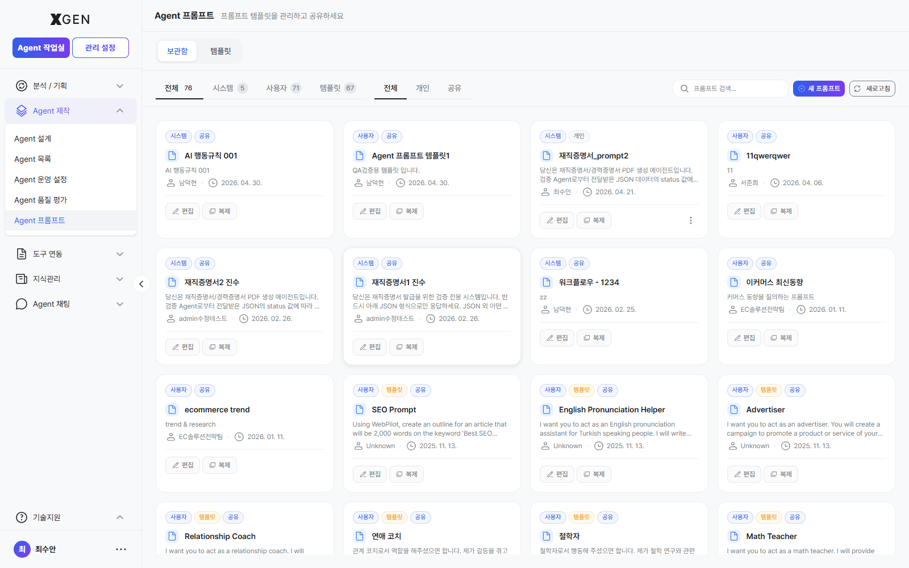
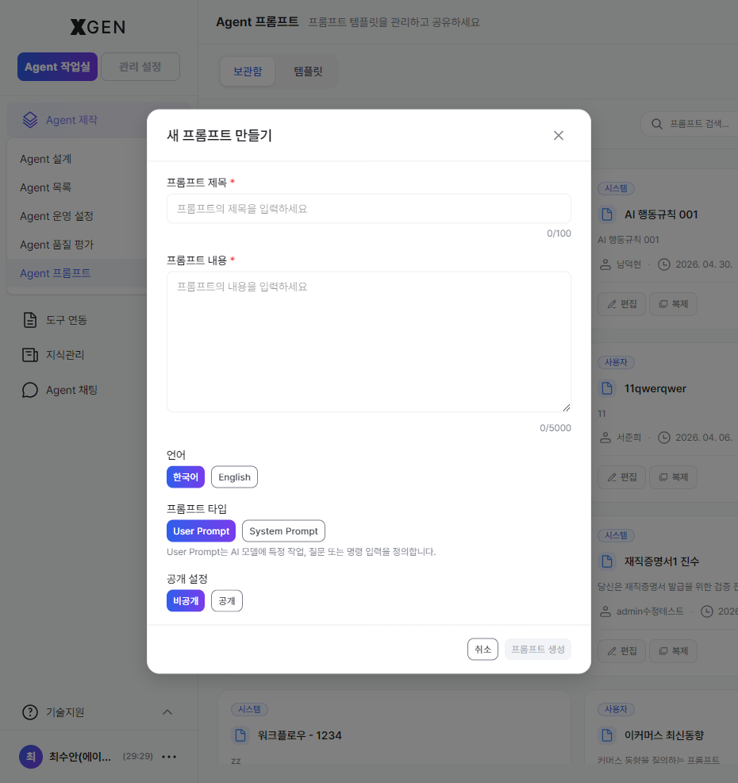

# Prompt Management

This chapter covers writing and managing the prompts that drive an agent's response quality.

## Two Kinds of Prompts

| Type | Korean | Role |
|---|---|---|
| System Prompt | System Prompt | Defines the AI's role, tone, and response format. Hidden from end users |
| User Prompt | User Prompt | The question or request from the user (or a template thereof) |

System prompts shape an agent's "personality"; user prompts are the input for each conversation.

## Prompt Library

Select **Agent Creation → Agent Prompt** in the left sidebar.



Tabs:

| Tab | Description |
|---|---|
| Storage | Prompts you created |
| Shared | Prompts others shared with you |
| Store | Team/org-wide shared library |

## Creating a New Prompt

1. Click **+ New Prompt** at the top right
2. Enter:
    - **Name**
    - **Type**: System Prompt / User Prompt
    - **Content**: actual prompt text
    - **Variables** (optional): placeholders in the form `{{name}}` for dynamic insertion
    - **Tags** (optional): for classification
3. **Save**



!!! info "Button label"
    The actual solution button label is **"새 프롬프트" / "New Prompt"** (without the `+` prefix that earlier versions of this manual mentioned).

### Example with Variables

```
You are an expert in {{role}}.
Answer {{question}} in a {{style}} tone.
```

`{{role}}`, `{{question}}`, and `{{style}}` are replaced with actual values at use time.

## Uploading to the Store

To share your prompt with the team:

1. Prompt detail → **Upload to Store**
2. Choose visibility (Company / Department / Specific group)
3. **Upload**

## Using a Template

Quickly start from a vetted prompt in the library:

1. Search in the **Store** tab
2. Click **Duplicate** on the prompt card → copies into your storage
3. Edit as needed

## Writing Tips

- **Write clearly and concretely** — Instead of abstract directions like "Answer well", pair them with concrete conditions such as "Explain in three sentences or fewer, in a way that's easy for a user to understand."
- **Specify the output format** — Naming the desired response shape (JSON, table, numbered list, etc.) yields more consistent results.
- **State the constraints, too** — To reduce speculative answers or unnecessary output, pair the request with prohibited conditions. Example: "Do not guess; if you're unsure, reply that the answer needs to be verified."
- **Include examples** — Providing one or two examples close to the desired answer shape improves response quality and consistency.

## Operational Recommendations

- **Version control** — Duplicate before major changes as a backup
- **A/B testing** — Run two versions on the same input and compare
- **No sensitive content** — Do not embed passwords, API keys, or customer information directly in prompts; isolate via variables

## Contact

For prompt-related questions, please contact the Xgen Solution Administrator.
