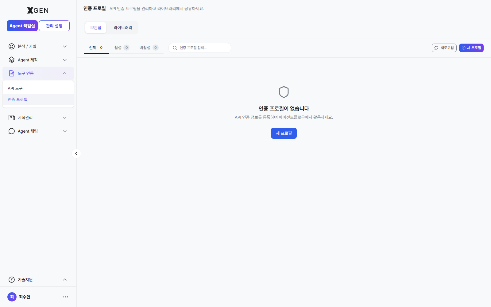
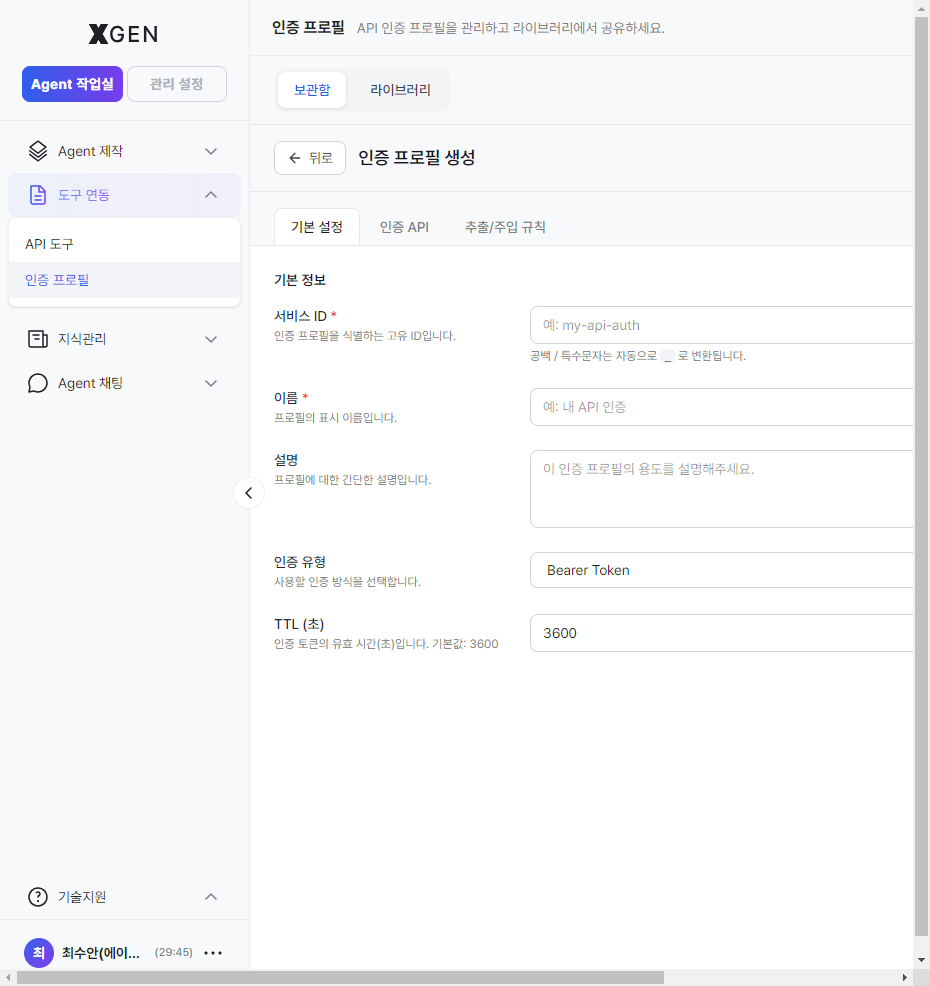

# Authentication Profile

This chapter covers the **Authentication Profile** — a unit for managing credentials needed for integrations with external APIs and systems.

## What Is an Authentication Profile

When an agentflow accesses external systems (internal databases, external APIs, Git repositories, etc.), it needs credentials such as API keys or access tokens. An authentication profile groups these credentials into a single managed unit.

| Item | Description |
|---|---|
| Individual credentials | API keys, tokens, username/password |
| Profile | A bundle of the above credentials |

Because nodes reference profiles instead of embedding keys directly, changing a key once updates every agentflow that references the profile.

## Profile List

Select **Tool Integration → Authentication Profiles** in the left sidebar.

Each profile has the following:

| Column | Description |
|---|---|
| Name | Profile identifier |
| Type | API Key / OAuth / Basic Auth, etc. |
| Visibility | Private (you only) / Shared |
| Last Used | Most recent invocation time |

## Creating a New Profile

1. Click **+ New Authentication Profile** at the top right
2. Enter:
    - **Name**: identifiable label (e.g., "Internal ERP API")
    - **Type**: API Key / OAuth / Basic Auth
    - **Credentials**: fields vary by type
3. Click **Test Profile** → verify a real call succeeds
4. **Save**

!!! info "Button label"
    The actual stg button label is **"새 프로필" / "New Profile"** (earlier versions of this manual referenced *"+ New Authentication Profile"*).

## Profile Types

| Type | Required Fields | Used For |
|---|---|---|
| API Key | A single API key | Most external APIs |
| Basic Auth | Username, password | Legacy HTTP basic authentication |
| OAuth 2.0 | Client ID, Client Secret, token URL | OAuth-based services |
| Bearer Token | Access token | Token-based APIs |

## Using a Profile in an Agentflow

When adding a tool node (external API, DB node, etc.) on the canvas:

1. Use the **Authentication Profile** dropdown in the node detail panel
2. Choose from registered profiles
3. Save

The node then uses the selected profile's credentials automatically.

## Sharing a Profile

If others need to use the same credentials, share the profile:

1. Profile detail → **Share** button
2. Select users/roles + permission (Read / Read·Write)
3. **Save**

!!! warning "Security When Sharing"
    Sharing a profile grants others the ability to make external calls with those credentials. Choose recipients carefully, and avoid sharing high-privilege credentials (e.g., root API keys) when possible.

## Rotating a Key

When the external system issues a new key:

1. Profile detail → **Edit**
2. Enter the new credential
3. **Test Profile** → **Save**

The change immediately applies to every agentflow that references this profile.

## Operational Recommendations

- **Naming convention** — Recommended format: `environment-system-purpose` (e.g., `prod-erp-readonly`)
- **Track expirations** — OAuth tokens expire; refresh periodically or set auto-refresh
- **Key rotation** — Rotate quarterly to minimize exposure risk. Brief downtime may occur at change time

## Contact

For questions about authentication profiles, please contact the Xgen Solution Administrator.
