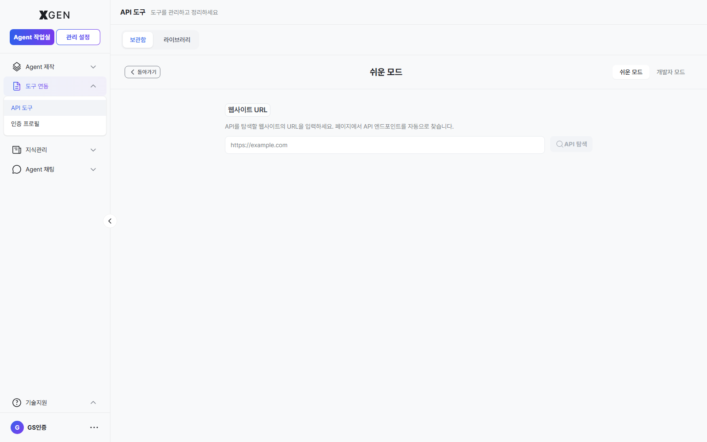

# API 도구

본 챕터는 에이전트가 호출할 수 있는 **외부 API 도구**를 등록·관리하는 화면을 다룹니다. 좌측 사이드바 **도구 연동 → API 도구** 메뉴가 본 챕터 범위입니다.

> API 호출에 필요한 자격증명(키·토큰) 자체는 [인증 프로필](17-auth-profile.md) 에서 별도로 관리합니다. 본 챕터의 도구 등록 시 그 인증 프로필을 참조합니다.

## 화면 진입

좌측 사이드바 **도구 연동 → API 도구** 를 선택합니다.

## 화면 구성

| 영역 | 내용 |
|---|---|
| 상단 탭 | **보관함** (내가 등록한 도구) / **라이브러리** (조직 공유 도구) |
| 상단 탭 | **API 컬렉션** (관련 도구를 묶은 컬렉션) | <!-- require_view: api-tool-collection -->
| 상태 필터 | 전체 / 활성 / 비활성 / 보관됨 |
| 소스 필터 | 전체 / 개인 / 공유 |
| 우상단 작업 | **새 도구** 등록 · **JSON 가져오기** (OpenAPI/Postman 스펙) · **파일 가져오기** · **다중 선택** |
| 도구 카드 | 활성/비활성 상태 칩, 내 도구/공유 칩, 배포 상태, 도구명, 설명, 소유자, 최종 수정일, HTTP 메서드. 카드 하단: **테스트** · **편집** · **복사** · 메뉴 |

## 새 도구 등록

1. 우상단 **새 도구** 버튼을 클릭하면 도구 등록 모달이 열립니다. 모달 우상단의 **모드 전환 토글** 로 **쉬운 모드(Easy Mode)** 와 **개발자 모드(Developer Mode)** 중 작성 방식을 선택합니다. 기본 진입은 *쉬운 모드* 이며, 아래 단계는 **개발자 모드** 기준의 폼 입력 절차입니다 — 빠른 자동 탐색이 필요하면 [쉬운 모드](#new-tool-easy-mode) 절을 참고하세요.
2. 다음 항목 입력
    - **이름**: 한 줄 식별자 (예: `exchange rate Tool`)
    - **설명**: 도구가 무엇을 하는지 (예: "이 도구는 최신 환율을 조회합니다.")
    - **HTTP 메서드**: GET / POST / PUT / DELETE 등
    - **엔드포인트 URL**: 예 `https://api.example.com/v1/exchange-rates`
    - **요청 파라미터**: query / path / body 스키마
    - **응답 스키마**: JSON Schema 형식 (선택)
    - **인증 프로필**: [인증 프로필](17-auth-profile.md) 에서 등록한 자격증명 선택
3. **테스트** 영역에서 실제 호출 → 200 응답·예상 JSON 확인
4. **저장** — 카드가 보관함 탭에 추가됨

### 쉬운 모드 (Easy Mode) { #new-tool-easy-mode }

**새 도구** 버튼을 클릭하면 기본적으로 **쉬운 모드** 화면으로 진입합니다. 화면 우상단의 **쉬운 모드 / 개발자 모드** 토글로 언제든 두 모드를 전환할 수 있습니다.

쉬운 모드는 OpenAPI 스펙 문서가 없는 상황에서 **공개 API 페이지의 URL** 만으로 도구를 등록할 수 있도록 구성된 자동 탐색 화면입니다. 별도 스펙을 직접 적을 필요 없이, 입력한 페이지를 솔루션이 분석해 호출 가능한 엔드포인트와 파라미터를 자동으로 추출합니다.

| 영역 | 내용 |
|---|---|
| 우상단 모드 토글 | **쉬운 모드** ↔ **개발자 모드** 전환. 현재 모드가 강조 표시됩니다. |
| **웹사이트 URL** 입력란 | API를 탐색할 페이지 주소를 입력 (예: `https://example.com/api-docs`) |
| **API 탐색** 버튼 | 입력한 URL을 분석해 호출 가능한 엔드포인트·파라미터 목록을 자동 추출 |
| 좌상단 **← 돌아가기** | 모달을 닫고 도구 목록으로 복귀 |

탐색이 완료되면 추출된 엔드포인트 중 등록할 항목을 선택해 **저장** 합니다.

!!! info "개발자 모드와의 차이"
    **개발자 모드** 는 OpenAPI 3.x 또는 Postman 스펙을 직접 작성·붙여넣어 여러 엔드포인트를 정밀하게 등록하는 작성 방식입니다. 자체 API 스펙 문서가 이미 있거나, 페이지 자동 탐색 결과를 세밀하게 조정하고 싶을 때 사용합니다.

## 도구를 에이전트에 연결

등록한 도구는 [에이전트 만들기](12-agentflow-create.md#노드-추가) 캔버스에서 **API Tool 노드** 로 끌어와 사용합니다. 에이전트는 노드 실행 시 API 호출 → 응답 파싱 → 다음 노드로 전달 흐름을 자동 수행합니다.

## 가져오기 (Import)

기존 OpenAPI / Postman 스펙이 있다면 **JSON 가져오기** 또는 **파일 가져오기** 로 일괄 등록할 수 있습니다. 가져오기 후에는 각 도구의 인증 프로필을 수동으로 매핑해야 합니다.

## 운영 권장사항

- **인증 정보는 도구가 아닌 인증 프로필에** — 도구 자체에 평문 키를 넣지 말고 [인증 프로필](17-auth-profile.md) 참조 방식으로 등록합니다. 키 회전 시 도구 수정 없이 프로필만 갱신.
- **테스트는 운영 환경 전에 반드시** — 카드 하단 **테스트** 로 실제 응답을 검증한 뒤에만 에이전트에 연결.
- **상태 토글로 비활성화** — 일시 점검 시 도구를 삭제하지 말고 **비활성** 으로 토글. 관련 에이전트는 폴백 흐름으로 자동 우회.
- **공유는 신중히** — 조직 라이브러리로 공유한 도구는 다른 사용자가 자유롭게 호출 가능. 비용·민감 데이터를 거치는 도구는 공유 전 책임자 검토.
- **버전 명시** — 외부 API 가 v1 → v2 로 마이그레이션될 때 도구를 새 항목으로 등록하고 기존은 비활성. 한 도구를 직접 덮어쓰지 마세요.

## 자주 묻는 문제

- **테스트는 성공하는데 에이전트에서 실패** — 인증 프로필이 다르거나, 에이전트의 입력 매핑이 도구 스키마와 불일치. 캔버스 노드의 입력값을 확인.
- **JSON 가져오기 실패** — 스펙 버전(OpenAPI 3.x) 또는 형식 오류. 외부 검증기로 먼저 확인 후 가져오기.
- **카드가 보이지 않음** — 상단 탭/필터 (예: "활성" 으로 좁혀 있는 상태) 를 "전체" 로 변경 후 재확인.

## 관련 챕터

- [인증 프로필](17-auth-profile.md) — API 호출에 필요한 키·토큰 관리
- [에이전트 만들기 - 노드 추가](12-agentflow-create.md#노드-추가) — 등록한 도구를 캔버스 노드로 사용
- [지식 관리](15-knowledge.md) — 컬렉션 기반 RAG 지식 소스 운영 (API 도구와 별개 데이터 자원)
- [MCP 라이브러리](../admin/28-mcp-market.md) — MCP 기반 도구는 관리자 화면에서 별도 관리 (외부 MCP 서버 등록·운영) <!-- require_view: admin-mcp-market -->

## 문의

API 도구 화면 관련 문의는 Xgen 솔루션 관리자에게 문의해 주세요.
