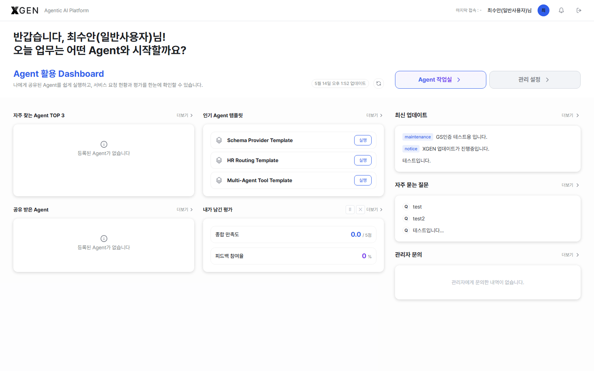
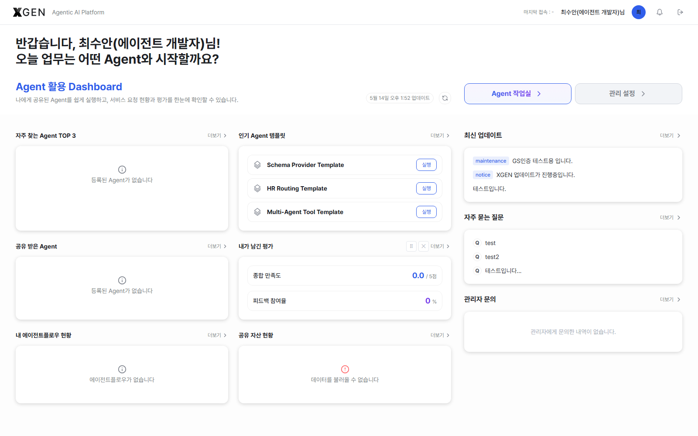
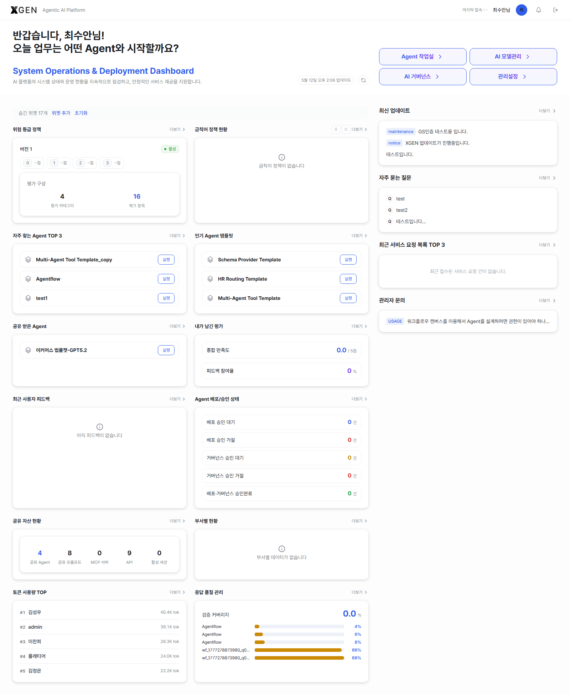

# Dashboard

The first screen shown immediately after login. The URL path is `{{product.domain}}/dashboard`. It collects quick-jump shortcuts to frequently used screens and widgets summarizing your activity.

> One URL, but **the widgets and quick-action buttons differ depending on the role of the logged-in account.** Standard Users and Agent Developers see different layouts, and the System Administrator / Governance Officer variants are covered separately in the [Admin Manual · Dashboard](../admin/30-dashboard.md) chapter.

## Layout (Shared Skeleton)

The dashboard has three parts: the **welcome message** at the top, the **left widget grid**, and the **right fixed support panel**. The skeleton is the same for every role; only the widgets and buttons inside change based on permissions.

### Welcome Message and Quick Navigation

The card opens with "Welcome, OOO! Which Agent would you like to start today's tasks with?" Two quick-jump buttons appear to its right, and only the ones your permission covers are active.

| Button | Target | Standard User | Agent Developer |
|---|---|---|---|
| Agent Workspace | `/main?view=agentflows` | Enabled (enters Chat) | Enabled (enters Build) |
| Admin Center | `/admin` | Disabled | Disabled |

> To see the **Admin Center** button active, refer to the [Admin Manual · Dashboard](../admin/30-dashboard.md) chapter.

### Right Fixed Panel { #right-panel }

Always shown in the same position regardless of widget grid customization. The panel contains **three items**; labels below match the stg live screen.

| # | Panel label | Source | More link |
|---|---|---|---|
| 1 | Latest Updates | 3 most recent notices | `/main?view=support-notices` |
| 2 | FAQ | Top 3 by views | `/main?view=support-faq` |
| 3 | **Admin Inquiries** | Your 1:1 admin inquiries (empty state: *"No inquiries to the administrator yet."*) | `/main?view=support-qna` |

Use the **More >** link in each panel header to navigate to the full list.

!!! note "Difference from earlier specs"
    Some earlier specs or previous versions of this manual referred to a *"Recent Service Requests TOP 3"* panel here, but it is not exposed on the current stg live build. The right panel only contains the three items above.

## Standard User View

The main screen for users who **consume** the agents the organization has already deployed, via chat. The greeting subtitle reads **"Agent 활용 Dashboard"** with the helper text "Easily run agents shared with you and review service-request status and feedback at a glance."

| Widget | Contents |
|---|---|
| Top 3 Frequent Agents | Top 3 agents you call most often |
| Popular Agent Templates | Templates with the most views / clones |
| Shared With Me | Agents that other users have shared with you |
| My Feedback | Your overall satisfaction score and feedback-participation rate summary |

If the widgets look empty they will fill in as your activity accumulates.

## Agent Developer View

The main screen for users who **build and deploy** agents themselves. The greeting subtitle is the same **"Agent 활용 Dashboard"** as the Standard User view, with **My Agentflow Status** and **Shared Assets** widgets added to the grid.

| Widget | Contents |
|---|---|
| Top 3 Frequent Agents | (Shared) Agents you call most often |
| Popular Agent Templates | (Shared) Templates with the most views / clones |
| Shared With Me | (Shared) Agents shared by other users |
| My Feedback | (Shared) Your feedback summary |
| My Agentflow Status | Total / shared / deployed counts and recent items for your agentflows |
| Shared Assets | Summary of tools, knowledge collections, etc. you have shared |

The My Agentflow Status widget may be empty right after first deployment until data accumulates. Use it as a shortcut into [Agent Operations](13-agentflow-operations.md).

## Customizing Widgets

- **Hide**: click the **Hide** button on a card's top-right.
- **Reorder**: **drag** a card to a new position (powered by `@dnd-kit/sortable`).
- **Add widget**: open the **Add widget** dropdown at the top to bring back hidden widgets.
- **Reset**: click **Reset** at the top to restore the default widget list and order.

These settings are saved per user and do not affect other users.

A full-page scroll of the dashboard:

## Usage Flow

1. You land on `/dashboard` automatically after login. Click the **XGEN** logo in the top-left to return from other screens.
2. Use **Top 3 Frequent Agents** to jump straight into a familiar agent.
3. Recommended flow: scan **Latest Updates** and **FAQ** on the right panel first — you'll catch system changes and common issues before starting work.
4. Hide unused widgets via **Hide**; bring them back via **Add widget** when needed.
5. Drag cards to reorder; click **Reset** to undo all customization.

## Common Issues

- **My widgets are empty** — they fill in over time as your activity accumulates. "Top 3 Frequent Agents" only appears after you call some agents.
- **My layout differs from a colleague's** — widget visibility, order, and hidden state are saved per user. The base widget *list* itself also differs between Standard Users and Agent Developers — both share the "Agent 활용 Dashboard" subtitle, but Agent Developers see additional widgets for the assets they own.
- **Last login time is missing** — the **Last login** indicator left of your username should show your previous session. If it is missing or doesn't match your memory, contact an administrator immediately (potential security incident).

## Related Chapters

- [Dashboard (Admin View)](../admin/30-dashboard.md) — additional widgets and operational usage for System Administrators and Governance Officers.

## Inquiries

For dashboard-related questions, email <{{vars.support_email}}> or open a ticket via sidebar **Technical Support → 1:1 Admin Inquiry**.
