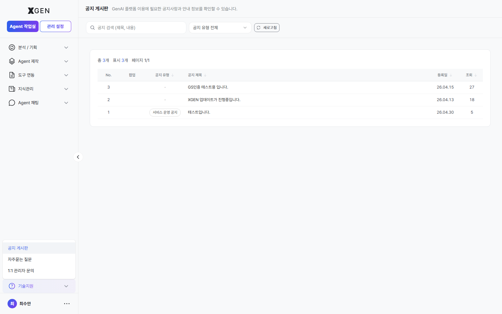
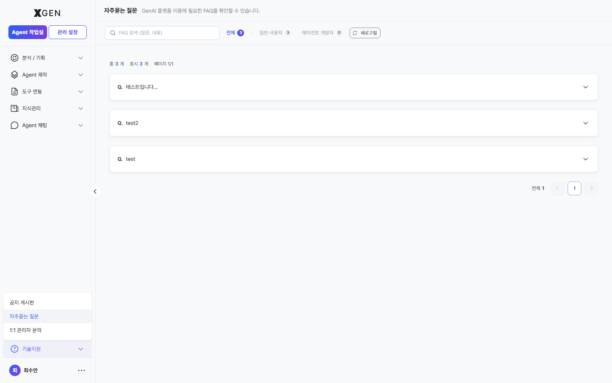
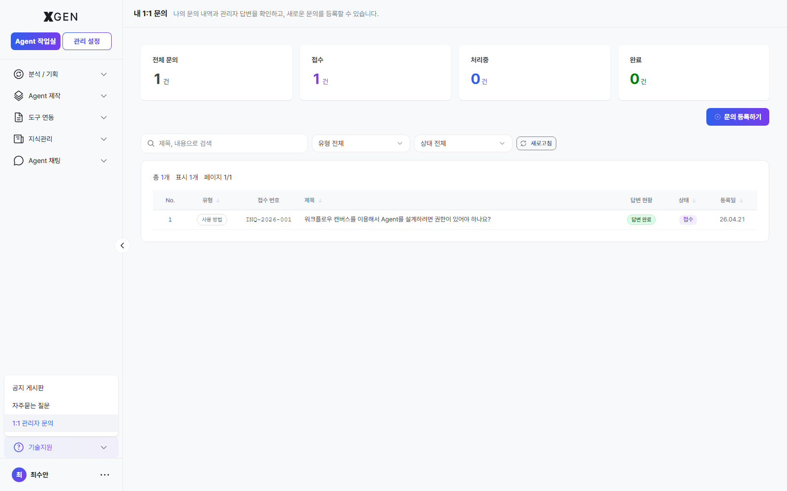

# 기술지원

좌측 사이드바 하단의 **? 기술지원** 버튼을 클릭하면 펼쳐지는 메뉴입니다. 다음 세 개의 하위 항목으로 구성됩니다.

- **공지 게시판** — 시스템 공지사항 조회
- **자주묻는 질문** — 카테고리·조회수 기준 FAQ
- **1:1 관리자 문의** — 관리자에게 직접 묻고 답변 수신

권한은 모두 `main.support:read` 이상이며, 일반 사용자에게 기본 부여됩니다.

## 공지 게시판 { #notices }

시스템 공지사항을 확인하는 페이지입니다. 화면 경로는 `/main?view=support-notices`. 페이지 헤더는 "공지 게시판 — GenAI 플랫폼 이용에 필요한 공지사항과 안내 정보를 확인할 수 있습니다." 형태로 표시됩니다.

- **목록 컬럼**: No / 팝업 / 공지 유형 / 공지 제목 / 등록일 / 조회
- **공지 유형 필터**: 우상단 드롭다운 "공지 유형 전체" — 서비스 운영 공지 등 유형별로 추림
- **검색**: 상단 검색창 "공지 검색 (제목, 내용)" — 제목과 본문 모두 부분 일치 검색
- **팝업 표시**: 팝업 컬럼에 표시가 있는 공지는 사용자에게 팝업으로 함께 노출되는 항목

### 조회 절차

1. 사이드바 **기술지원 → 공지 게시판** 클릭
2. 특정 유형만 보려면 우상단 **공지 유형 전체** 드롭다운에서 원하는 유형 선택 (예: `서비스 운영 공지`)
3. 검색창에 제목·본문 일부 키워드를 입력해 과거 공지를 찾을 수 있습니다
4. 행을 클릭하면 본문 상세로 이동
5. 대시보드의 **최신 업데이트** 패널에도 최근 3건이 노출되므로, 작업 시작 전 짧게 확인하는 습관을 권장

## 자주묻는 질문 (FAQ) { #faq }

자주 발생하는 질문과 답변을 모은 페이지입니다. 화면 경로는 `/main?view=support-faq`. 페이지 헤더는 "자주묻는 질문 — GenAI 플랫폼 이용에 필요한 FAQ를 확인할 수 있습니다." 형태로 표시됩니다.

- **대상별 탭**: 전체 / 일반 사용자 / 에이전트 개발자 — 본인 역할에 맞는 탭에 노출 건수가 함께 표시됩니다 (예: `전체 3`, `일반 사용자 3`, `에이전트 개발자 0`)
- **목록 형태**: 표가 아닌 **아코디언** — 각 질문을 클릭하면 아래로 펼쳐지며 답변 본문이 노출됩니다 (각 항목 좌측 `Q.` 표시)
- **검색**: 상단 검색창 "FAQ 검색 (질문, 내용)" — 질문과 답변 본문 모두 부분 일치 검색
- **페이지네이션**: 우하단 페이지 컨트롤로 이동

### 활용 절차

1. 사이드바 **기술지원 → 자주묻는 질문** 클릭
2. 1:1 문의 등록 전 먼저 FAQ에 동일 질문이 있는지 검색·확인하세요 — 답변이 즉시 노출되므로 문의 등록보다 빠릅니다
3. 본인 역할에 해당하는 탭(**일반 사용자** 또는 **에이전트 개발자**)으로 좁힌 뒤 위에서부터 훑어 흔한 이슈를 파악합니다
4. 질문 행을 클릭하면 답변이 펼쳐집니다. 답변에 해결 절차가 있다면 화면 경로 그대로 따라가며 동일 증상이 사라지는지 확인

## 1:1 관리자 문의 { #qna }

관리자에게 직접 묻고 답변을 받는 페이지입니다. 화면 경로는 `/main?view=support-qna`. 페이지 헤더는 "내 1:1 문의 — 나의 문의 내역과 관리자 답변을 확인하고, 새로운 문의를 등록할 수 있습니다." 형태입니다.

- **상단 통계 카드 4종**: 전체 문의 / 접수 / 처리중 / 완료 — 본인 문의의 상태별 건수를 한눈에 확인
- **필터**: 좌측 검색창 "제목, 내용으로 검색", 중앙 **유형 전체** 드롭다운, 우측 **상태 전체** 드롭다운
- **CTA**: 우상단 **+ 문의 등록하기** 버튼으로 새 문의 작성
- **목록 컬럼**: No / 유형 / 접수 번호 (예: `INQ-2026-001`) / 제목 / 답변 현황 / 상태 / 등록일
- **상태 흐름**: 접수 → 처리중 → 완료 (3단계). **답변 현황** 컬럼이 별도로 "답변 완료" 여부를 표시
- **유형 예시**: 사용 방법, BUG, FEATURE 등 — 등록 시 선택
- **비밀글**: 작성 시 체크하면 본인과 응대 관리자만 본문 조회 가능

### 등록 절차

1. 사이드바 **기술지원 → 1:1 관리자 문의** 클릭
2. 우상단 **+ 문의 등록하기** 버튼을 눌러 새 문의 작성 폼을 엽니다
3. **유형**을 가능한 한 정확히 선택. 답변 SLA와 담당자 라우팅에 영향을 줍니다.
    - **사용 방법(USAGE)**: 화면·기능을 어떻게 쓰는지 묻는 일반 사용 문의
    - **BUG**: 동작이 의도와 다른 경우 (재현 절차 필수)
    - **FEATURE**: 신규 기능 요청
    - **QUALITY**: 응답 품질·정확도 이슈
    - **DATA**: 지식·컬렉션·임베딩 등 데이터 문제
    - **POLICY**: 권한·정책·거버넌스 관련
4. 제목·내용을 입력하고, 민감 정보(사용자명, 토큰, 내부 URL 등)가 포함되면 **비밀글** 체크 후 등록
5. 등록 직후 상단 **접수** 카운트가 +1 되고, 목록에 **접수** 상태로 표시됩니다. 관리자가 처리 시작 시 **처리중**, 종료 시 **완료**로 상태가 바뀝니다
6. 답변이 도착하면 해당 행의 **답변 현황** 컬럼에 **답변 완료** 뱃지가 표시되고, 알림 아이콘에도 빨간 점이 추가됩니다. 행을 클릭해 답변 본문을 확인하세요

## 빠른 점검 (문의 전 확인)

문의 등록 전 다음 항목을 먼저 확인하면 단순 환경 이슈로 인한 지연을 줄일 수 있습니다.

- 브라우저 캐시 새로고침 (Windows: `Ctrl + Shift + R`, macOS: `Cmd + Shift + R`)
- 다른 브라우저 또는 시크릿 창에서도 동일 증상이 발생하는지
- 네트워크 또는 사내 보안 솔루션이 `{{product.domain}}` 도메인을 차단하지 않는지
- FAQ에 동일 증상이 있는지 (위 자주묻는 질문 페이지에서 검색)

## 문의

기술지원 메뉴 자체에 대한 문의는 **XGen 관리자**(<{{vars.support_email}}>) 로 직접 연락해 주세요.
